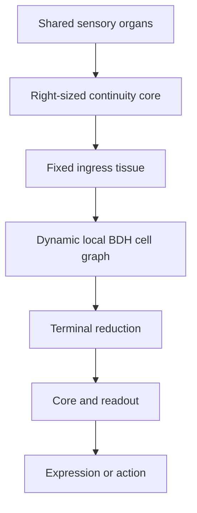

# Campaign 36C Checkpoint 04: BDH Execution Mapping, Persistence, and Validation

**Date:** 2026-08-30
**Status:** Design checkpoint and repository handoff; settled semantics are binding, numerical constants remain experimental
**Audience:** Future Codex sessions working inside the Ninereeds repository
**Purpose:** Translate the settled Campaign 36C design into an implementation sequence that can be tested on the real repository, hardware, checkpoints, optimizers, and campaign evidence without quietly turning the model into a dense cell bank or a semantic mixture-of-experts system.

## 0. Read this first

Campaign 36C is not a plan to cut Campaign 36A's 1.2B model into cells. It is a plan for one dynamically sized organism whose thought begins in a right-sized continuity core and then propagates locally through independently stored BDH-derived tissue.

The model has no fixed total parameter count. It has a base cost for shared organs and the continuity core, plus a changing population of cells and composites. Its current parameter count is inventory, not architecture.

The central implementation burden is therefore not merely to make a cell transform a latent state. It is to preserve all of the following simultaneously:

- truly local propagation without a global semantic router;
- real sparse execution rather than dense execution multiplied by small gates;
- persistent, independently addressable tissue;
- bounded inference compute despite growth and recurrence;
- typed delayed learning rather than indiscriminate activation-based plasticity;
- crash-safe identity, optimizer, topology, and structural transactions;
- physically practical paging and storage without one file per cell;
- reversible packing and early fusion/fission while refusing to promise impossible fission after mature healing;
- observability that exposes effort and uncertainty without pretending that activation count proves correctness.

Do not implement all of this at once. Build the smallest experiment that can falsify each architectural claim, in dependency order.

## 1. Authority and source precedence

When sources disagree, use this order:

1. `2026_08_30_campaign36c_checkpoint_01_cell_and_thought_lifecycle.md`
2. `2026_08_30_campaign36c_checkpoint_02_patch_algebra_and_delayed_credit.md`
3. `2026_08_30_campaign36c_checkpoint_03_structural_lifecycle.md`
4. `2026_08_30_campaign36c_local_propagation_contract.md`
5. This repository implementation design, which reconciles the above with current code and evidence
6. `2026_08_30_campaign36b_retrospective.md` and Campaign 36B code as experimental evidence
7. `2026_08_30_36c_checkpoint04_repository_evidence.md`, `bdh.py`, and current Cortex code as implementation evidence, not as an immutable final architecture
8. The older Mycelial, Amorphous Cell Architecture, and Sparse Wave-Propagation documents as rationale and hypothesis sources

The three checkpoints settle the cognitive and lifecycle semantics. Numerical thresholds, cell width, page size, core size, optimizer choice, kernel strategy, and persistence layout remain empirical unless the checkpoints explicitly freeze them.

## 2. Mission in one page

The intended organism is:



The sensory side contains the LFM Encoder/cochlea analogue, SigLIP2/visual-cortex analogue, and trainable projectors or resamplers. The continuity core maintains the user, context, goals, and latent ABI and emits the initial latent thought. In the dynamic graph, reached cells receive, transform or nudge, and propagate or terminate; unreached cells do not execute. The terminal reducer returns one resolution envelope to the core, which may speak through the LFM expression/Broca analogue, act, observe, ask for help, or begin another latent pass.

The continuity core may eventually be 25M, 150M, 604M, 1.2B, or another measured size. Campaign 36A's 1.2B configuration is a comparison point, not a Campaign 36C requirement. The correct rule is:

> Make the core as small as possible and as large as necessary for its bounded duties.

The tissue carries the capacity that may grow throughout the organism's life. Easy familiar work should traverse a narrow cheap route. Difficult, unfamiliar, or contradictory work may activate broad and plastic tissue, load more pages, and consume more cell-time. Total stored capacity may greatly exceed VRAM because only the active working set is resident.

## 3. Architectural invariants

These are non-negotiable.

### 3.1 Dynamic organism size

There is no configured cognitive population size and no preallocated tensor containing empty future cells.

```text
current organism capacity
  = shared organs and continuity core
  + live base cells
  + live fused composites
  + persistent local state and optimizer state
```

Birth allocates real parameters and a never-reused UID. Metabolism may eventually remove real storage. Inventory is derived from persistent records.

Physical allocator slack, deleted slots, segment fragmentation, and cache capacity are not unfilled cognitive parameters.

### 3.2 Local route discovery

Thought discovers its route through topology, incoming latent state, cell anatomy, and local route history.

There is no:

- global semantic router;
- full-population activation score;
- global top-k expert selection;
- learned catalogue saying which domain owns a prompt;
- central semantic birth, merge, or death authority.

Infrastructure may resolve UIDs, locate pages, prefetch graph halos, batch compatible work, evict caches, and repack storage. It may not decide what a thought means or which expert should answer it.

### 3.3 Real sparse execution

Only active UIDs execute their full transformation. Only their declared local neighbors may be considered for the next wave. Adding disconnected cold tissue must not materially change the result or the forward cost.

A gate that merely scales a contribution after every cell already ran is not sparse execution. Campaign 36B is the control demonstrating why that fails.

### 3.4 Independent logical identity

Cell identity is independent of:

- tensor offset;
- file name;
- storage segment;
- VRAM address;
- optimizer parameter-group index;
- current canonical successor after fusion.

UIDs are never reused. A fused successor receives a new canonical UID while every predecessor UID remains an inbound alias. Outgoing traffic identifies the successor by its new canonical UID.

### 3.5 Local transformations, explicit communication

One UID must be able to execute from its incoming RNA and its own persistent state. The runtime may batch independent cells for efficiency, but one cell's mathematical result may not change merely because unrelated cells were placed in the same hardware batch.

Cells influence one another through explicit transmissions and deterministic convergence, not through hidden head-wide reductions across unrelated active UIDs.

### 3.6 Separate epistemic quantities

Never collapse these into one confidence/amplitude scalar:

- route energy or compute allocation;
- claim/hypothesis support;
- novelty or unresolved residual;
- ownership/recognition;
- calibration;
- delayed usefulness.

Similarity is jurisdiction evidence, not truth. Novelty is a trigger, not a vote. Activation creates eligibility; resolution assigns plasticity.

### 3.7 Natural quiescence is not resource exhaustion

The mapper reports completion only when atomic frontier replacement produces an empty active UID table.

A separate metabolic governor enforces hard safety budgets. If it aborts a thought, the result is explicitly exhausted/aborted. Exhaustion must never masquerade as successful settlement.

## 4. Biological metaphors and their limits

Campaign 36C has converged from a mycelial metaphor toward a cellular body metaphor. Both are useful:

- Paul Stamets inspired local propagation, branching, consolidation, and the distinction between visible activity and persistent substrate.
- Michael Levin inspired local agency, morphogenesis, homeostasis, repair, and organism-level behavior emerging from bounded local interactions.
- Joscha Bach inspired thinking about cognition as an architecture of interacting processes rather than a single undifferentiated model.
- Pathway's BDH supplies the concrete sparse multiplicative transformation motif.
- Sakana AI supplies additional inspiration for distributed and iterative learned computation.

These are design metaphors, not claims that Campaign 36C simulates biology. The implementation must be justified by measured behavior, compute, storage, and learning—not by anatomical vocabulary.

## 5. What Campaign 36B established

Campaign 36B was an independent growing organism, not an extension of the 1.2B BDH core.

It proved that:

- a small deterministic cellular embryo can be trained end to end;
- real new parameter-owning cells can be allocated during learning;
- changing anatomy can survive atomic checkpointing and cold resume;
- stable cell IDs, birth seeds, optimizer groups, RNG state, and growth-controller state can be restored;
- shared LFM/SigLIP2 organs need exist only once;
- thousands of cells can participate in one latent workspace and one organism-level objective;
- internal residual, external failure, and capacity evidence can remain separate;
- storage remained manageable at the tested scale.

It also proved why dense execution is unacceptable:

- every non-dormant cell ran on every exposure;
- the gate changed contribution strength but did not save compute;
- the same 1,000-event session slowed from 4.6 minutes to 97.4 minutes;
- the committed population grew from the 256-cell embryo to 3,720 cells;
- the live population reached 3,948 cells;
- Python/cohort dispatch worsened the unavoidable dense compute cost.

### 5.1 Inherit versus replace

| 36B mechanism | 36C treatment |
| --- | --- |
| Shared sensory and expression organs | Retain the one-organ principle |
| Width-512 latent interface | Retain initially as the v0 latent ABI |
| Real UID-bearing cell allocation | Retain, but make UIDs storage-location independent and never reused |
| Birth seeds and lifecycle state | Retain and extend to Checkpoint 01 stages |
| Dynamic optimizer enrollment | Retain conceptually; replace index-fragile grouping with UID-bound state |
| Atomic checkpoints and RNG restore | Retain as minimum persistence behavior |
| Dense shared workspace | Replace with local wave propagation |
| Rank-16 low-rank residual cell | Replace with a standalone BDH-derived cell operator |
| Every-cell execution | Prohibit |
| Sigmoid gate used only as a contribution weight | Replace with cheap local admission before full execution |
| Automatic end-of-session promotion | Replace with evidence-gated development and ablation |
| One monolithic growing checkpoint | Useful for tiny experiments; replace at scale with manifests, packed segments, journals, and snapshots |
| Fixed `max_cells` schema ceiling | Replace as a cognitive dimension; retain only explicit physical/safety budgets |

## 6. Continuity core and shared organs

### 6.1 Core duties

The continuity core is always-resident or cheaply resident tissue responsible for:

- receiving projected sensory observations;
- maintaining the user relationship and identity continuity;
- maintaining current goals, conversational context, and task state;
- emitting the immutable root latent thought `C0` and root task signature;
- receiving the matured resolution envelope;
- deciding whether to speak, act, use an organ/tool, ask for help, or initiate another latent pass;
- maintaining the latent communication ABI.

The core must not become a semantic expert selector. A new thought enters through fixed, bounded ingress/continuity tissue. Local cell dynamics discover the route.

### 6.2 Core size is a separate experiment

Do not hard-code 1.2B because Campaign 36A used it. Do not hard-code 25M merely because it is cheap.

Evaluate candidate cores—potentially including 25M, 150M, 604M, and 1.2B—on the bounded duties above. Compare:

- stability of the width-512 latent ABI;
- continuity and user/context retention;
- ability to emit a useful initial thought without performing global expert selection;
- ability to consume a matured thought and choose an appropriate next action;
- latency and always-hot VRAM cost;
- tendency to swallow world knowledge that should live in tissue;
- amount and quality of tissue recruited at matched task quality;
- robustness after tissue growth and latent-interface drift.

The chosen core should leave comfortable functional margin, but every extra always-active parameter weakens the sparse-compute advantage. Core sizing does not block the small 36C wave experiments as long as the latent ABI is stable.

### 6.3 Shared organs

The following remain singleton edge organs rather than per-cell anatomy:

- LFM Encoder / language-input analogue;
- SigLIP2 and its visual resampler/projector;
- tokenizers and modality preprocessing;
- intention/readout head;
- LFM expression model and projection;
- later microphone/Whisper and TTS interfaces if commissioned.

Cells receive and emit Ninereeds latent states. They do not tokenize, decode language, or carry frozen sensory models.

## 7. Latent ABI and thought entry

The initial ABI is the current width-512 Cortex state:

```text
latent tensor: [batch, sequence, 512]
mask/shape metadata: versioned and explicit
dtype: declared per run and storage record
normalization contract: versioned
root signature: compact and immutable per thought
```

The ABI must also version:

- width and sequence conventions;
- normalization points;
- rotary/frequency conventions used by cells;
- dtype and quantization;
- patch/effect sketch version;
- RNA schema version;
- receptor/calibration version;
- core lineage or translator requirements.

Old cells may remain useful after the core changes only if ABI compatibility is tested. Translators are allowed as explicit local components when needed; silent reinterpretation is not.

## 8. Standalone BDH-derived cell

### 8.1 The cell is not a slice of Campaign 36A

`bdh.py` shows the transformation motif and current tensor geometry. It does not imply that the production 1.2B tensors should be cut into autonomous nodes.

In the current dense BDH, sparse-gate contributions interact through head-wide temporal attention and later normalization. A raw pair or cohort slice owns exact parameters but is not automatically behaviorally independent.

A 36C cell is therefore created and trained as an independent local operator from birth. Dense checkpoints may later act as teachers or initialization evidence, but substrate transfer is a separate experiment.

### 8.2 Mechanical atom

RoPE couples adjacent even/odd sparse coordinates. The smallest mechanically indivisible BDH parameter atom is therefore one layer-local, head-local aligned rotary pair.

The current 1.2B reference geometry is evidence, not a 36C prescription:

```text
layers                    12
latent width D            512
heads                     8
internal multiplier       128
gates per head N          8,192
rotary pairs per head     4,096
per-layer weights         true
```

The three sparse matrices own 100,663,296 parameters per layer and 1,207,959,552 across twelve layers, before the comparatively small embedding/output tensors.

At latent width `D = 512`, one pair owns:

```text
content encoder       [512, 2]
value encoder         [512, 2]
decoder               [2, 512]
```

That is `6D = 3,072` trainable parameters, plus its frequency/buffer metadata. A cell containing `P` aligned pairs owns `3,072P` transform parameters before receptor, ports, calibration, and optimizer state.

This is a lower bound, not a claim that a 3,072-parameter cell is useful or economical.

Illustrative unquantized ownership, excluding metadata and buffers:

| `P` | Transform parameters | BF16 weights | BF16 weights + two FP32 moments |
| ---: | ---: | ---: | ---: |
| 1 | 3,072 | 6 KiB | 30 KiB |
| 8 | 24,576 | 48 KiB | 240 KiB |
| 16 | 49,152 | 96 KiB | 480 KiB |
| 32 | 98,304 | 192 KiB | 960 KiB |

An FP32 master-weight copy, if required by the optimizer, adds another 12 KiB per pair. This is why logical cells need packed records even when each cell is small.

### 8.3 Candidate local operator

For a cell with even gate width `G = 2P`:

```text
q       = ReLU(norm(z) @ encoder)
scores  = causal_rotary_attention_score(q)
context = norm(scores @ z)
r       = ReLU(context @ encoder_v)
gates   = q * r
delta   = gates @ decoder
z_next  = norm(z + residual_scale * delta)
```

The exact normalization, score scaling, residual scale, temporal decay, and whether the cell returns `delta` or a normalized post-state are experiment parameters. They must be explicit in the latent/cell ABI and run manifest.

The cell's attention and normalization scope is local to that UID. Independent UIDs may be hardware-batched, but batch composition must not change an individual result.

For the literal one-head operator above with gate width `G = 2P`, a first-order forward estimate per batch item is:

```text
approximately 3*T*D*G + T^2*(G + D) multiply-accumulates
```

This ignores normalization, rotary work, nonlinearities, and dispatch. The `T^2*D` value-aggregation term does not shrink with `P`; at small `P` it can dominate. A rotary pair can therefore be the smallest parameter atom while still being an uneconomical execution cell. The cohort sweep must measure both useful learning and this temporal cost.

### 8.4 Complete persistent cell anatomy

The transform alone is not a Campaign 36C cell. A complete cell needs:

- canonical UID and lineage;
- cell/latent ABI version;
- BDH transform parameters and required buffers;
- cheap ingress receptor and calibration state;
- bounded directed port table;
- edge conductance and state-conditioned egress-affinity evidence;
- fixed `M`-thought route-history ring;
- private persistent state, if the selected cell variant has any;
- usage, refractory, lifecycle, and metabolic state;
- rigidity/plasticity and homeostatic statistics;
- evidence-influence sketch;
- optimizer state and local update step;
- fusion tree/partition metadata where applicable;
- integrity checksum and storage generation.

No semantic name or domain label is part of cell anatomy.

### 8.5 Receptor before transform

Every outgoing offer is two-stage:

1. A compact offer reaches a neighbor's cheap receptor.
2. Only acceptance authorizes loading/executing the full BDH transform.

The receptor must estimate separately:

- calibrated content familiarity;
- coverage;
- unresolved residual;
- route familiarity from the bounded recent sample;
- whether the writing threshold, only the routing threshold, or neither is met.

The receptor may reuse compact summaries derived from the cell's content encoder, but its cost must remain much smaller than full cell execution. Receptor metadata for reachable neighbors may be warm without loading full weights.

A receptor probe is not a full UID activation. An accepted destination enters the next active UID table and later performs its declared local operation; a rejected destination does not. Probe count, bytes touched, and energy cost remain visible in telemetry.

Route familiarity is never a multiplicative veto. The initial local regime is:

| Content familiarity | Route familiarity | Default local behavior |
| --- | --- | --- |
| Familiar | Familiar | Narrow, strong propagation |
| Unfamiliar | Familiar | Bounded broader exploration |
| Familiar | Unusual | Cautious propagation or exploration |
| Unfamiliar | Unusual | Strong tendency to terminate, with a small measured exploratory floor during learning |

The exploratory floor belongs to local tissue dynamics, not to the mapper, and must be too small to create organism-wide fan-out.

### 8.6 Cohort-size experiment

Sweep aligned rotary-pair counts rather than choosing by intuition. At minimum test:

```text
P = 1, 2, 4, 8, 16, 32
```

Add intermediate sizes if the curve warrants it. Compare each candidate against:

- no external cell;
- one additional continuity-core tick;
- the 16,912-parameter Campaign 36B cell as a scale reference;
- a parameter-matched low-rank residual cell;
- a larger mesoscale node.

Measure:

- masked-dense-cohort versus independent-cell output and gradient difference;
- held-out improvement in the matured latent/output;
- gradient health and learning speed;
- parameter bytes and optimizer bytes;
- FLOPs and full-sequence attention cost;
- kernel launch and dispatch overhead;
- batch efficiency;
- cold and warm load latency;
- useful delta rate and regression outside the addressed footprint;
- ability to route without indiscriminate fan-out;
- behavior after save/cold restore.

Select the smallest cohort that is useful, stable, and economical. Logical identity must not be chosen merely to match a filesystem page.

## 9. Persistent DNA and transient RNA

### 9.1 DNA

DNA is the persistent anatomy listed above. It changes only through committed learning or structural transactions.

### 9.2 RNA

RNA is bounded per-wave evidence. Its v0 shape should include:

- thought epoch and wave index;
- latent context/version handle or travelling contribution;
- route energy;
- root signature reference;
- direct predecessor UID set;
- up to `K` bounded provenance tails of at most `H` UID hops;
- entry alias/constituent identity when canonical alias resolution occurred;
- compact unresolved/novelty signal;
- optional patch/effect handle needed by the active thought.

RNA is not a persistent episode log. It disappears after propagation or termination.

### 9.3 Three provenance tiers

Do not conflate three different needs:

1. **RNA path tail:** bounded recent UID evidence used by cells during the live wave.
2. **Cell route ring:** the last `M` participating thought records used for learned route familiarity.
3. **Active learning/reduction trace:** only the dependency, patch, eligibility, and context-version records needed until terminal reduction and delayed credit finish.

Normal inference does not retain a complete route ancestry tree. Training may retain the executed autograd/eligibility graph. Verbose diagnostic mode may journal every transition for a bounded run.

### 9.4 Bounded route memory

Declare two independent constants:

- `H`: maximum recent UID hops in one RNA provenance tail;
- `M`: maximum thought-level route records in one cell's persistent ring.

The ring consumes at most one slot per participating thought epoch. If a cell reappears several times during one thought, it updates or deterministically merges that epoch's record rather than making the route look frequent by consuming several slots.

There is no wall-clock decay and no organism-wide background aging pass. A new participating thought overwrites the oldest record. Stale UIDs therefore disappear through bounded replacement, and cells that receive no traffic incur no route-history compute. Transmission history is behavioral evidence; it never replaces authoritative adjacency.

## 10. Frozen wave protocol implementation

For thought epoch `e`, the mapper owns only the canonical active UID table for wave `t`.

### 10.1 Wave step

1. Resolve inbound aliases to canonical UIDs while retaining entry-alias identity in RNA.
2. Group transmissions by canonical destination UID.
3. Reduce each group deterministically into one RNA value.
4. Insert each canonical UID exactly once into `A_t`.
5. Mark cold UIDs active before their pages begin loading.
6. Execute every UID in `A_t` exactly once.
7. Each cell returns exactly one ordinary action:
   - `PROPAGATE(destination_uids, contributions)`; or
   - `TERMINATE(contribution)`.
8. Exclude the cell's own UID and all immediate predecessor UIDs from that event's destinations.
9. Group and deterministically merge outgoing transmissions.
10. Atomically replace `A_t` with `A_(t+1)`.
11. Natural quiescence occurs only when the replacement set is empty.

There are no persistent branch IDs. A UID may reappear in a later wave through a longer changed route. Immediate reversal is forbidden; longer recurrence remains legal.

### 10.2 Determinism

Determinism requires more than sorting Python dictionaries. Freeze:

- canonical UID ordering for batched execution;
- sender ordering for reductions;
- accumulation dtype;
- reduction tree or compensated-sum policy;
- random key derivation from run seed, thought epoch, wave, UID, and local operation;
- provenance-tail truncation and tie-breaking;
- page content version visible to a thought;
- structural graph snapshot visible to a thought.

Identical checkpoint, input, topology version, and seed must reproduce the visited subgraph and result within the declared numeric tolerance.

### 10.3 Convergence merge

The final system must not destroy contradictory hypotheses by blindly averaging them. Implement convergence in stages:

- **36C-0 physical protocol:** deterministic order-invariant merge of contributions relative to a common context, with total route energy retained separately. This is sufficient to test wave mechanics.
- **Patch-aware protocol:** merge compatible addressed deltas, deduplicate shared ancestry/evidence, and preserve bounded contradictory modes or unresolved mass inside one RNA bundle.

The exact v0 formula is an experiment parameter, but it must:

- permit two weak inputs to jointly alter the target;
- be invariant to message arrival order;
- avoid manufacturing energy or evidence at forks;
- retain direct predecessors for reversal suppression;
- preserve bounded alternatives when writes conflict;
- remain stable under different hardware batch partitions.

### 10.4 Energy and stopping

Route energy is a conserved compute allocation, not confidence.

- Cheap offers and full executions have explicit costs.
- Forks partition remaining energy rather than clone it.
- Branches below the floor terminate or become bounded suspended candidates.
- Cells cannot replenish energy from self-confidence.
- Receptor probes, page waits, and full transforms are accounted separately.
- Gray-zone candidates may be resumed in one bounded second latent pass if unresolved mass remains.

Hard safety exhaustion belongs to the governor and produces an aborted result.

## 11. Patch reduction and delayed credit

Implement the Checkpoint 02 semantics rather than replacing them with one scalar reward.

### 11.1 Patch object

A patch is a base-dependent addressed transaction containing:

- base version;
- claim address;
- read and write footprints;
- operation/delta and effect signature;
- applicability conditions;
- dependencies;
- evidence lineage;
- route provenance;
- support and calibration metadata.

### 11.2 Reduction relationships

Support sequential, equivalent, subsuming, reinforcing, complementary, conditional, and contradictory relationships.

- Apply equivalent effects once.
- Increase support only for sufficiently independent evidence.
- Preserve contradictory writes to the same single-valued address as alternatives/unresolved.
- Never count forked copies as corroboration.
- Do not promote resemblance into identity or co-occurrence into causation.

### 11.3 Typed credit

At minimum keep separate credit for:

- retained content usefulness;
- dependency/rule validity;
- residual reduction or regression;
- calibration and appropriate abstention;
- route usefulness;
- inquiry/information gain;
- compute/tool cost and harm;
- evidence independence/correlation;
- structural eligibility.

Credit arrives in stages:

1. immediate receipt/use eligibility;
2. thought-level terminal reduction;
3. later external evidence or outcome.

Persistent updates must separately gate transform, receptor, route, calibration, and structure.

### 11.4 Initial learning path

The first sparse-wave experiment may backpropagate through the executed graph. This tests the physical architecture without simultaneously inventing a local learning rule.

Requirements:

- only executed cells and participating edges receive gradients/eligibility;
- inactive cells allocate no activation tensors and receive no updates;
- shared ancestry is deduplicated;
- delayed credit remains addressable after fusion through UID lineage;
- uncertain/no-outcome eligibility expires without factual learning;
- structural mutations occur only after the thought and its immediate update have committed.

Neighbor-local/Hebbian plasticity is a later controlled experiment. Do not call ordinary end-to-end backprop “Hebbian” merely because activations are sparse.

## 12. Optimizer ownership

Optimizer state is part of cell persistence.

The current large-tensor `FactoredAdamW` state is not automatically cell-separable: factored row/column statistics and means may span many neurons. Campaign 36C must not slice weights into independent records while leaving hidden shared optimizer statistics behind.

For the first independent cell implementation, choose one explicit policy:

- cell-local full moments for small tensors;
- cell-local factored moments whose factors do not cross UID boundaries;
- a tested cell-local SkewAdam/other optimizer variant;
- segment-batched storage with logically UID-owned moment slices and no cross-cell normalization.

Whatever optimizer is selected, persist:

- algorithm and schema version;
- per-cell update step;
- moments/factors;
- hyperparameter lineage;
- stochastic-rounding RNG requirements;
- pending gradient/update transaction state if updates can span commits.

Newborn cells receive fresh optimizer state. A fresh fusion retains both constituent optimizer partitions until healing explicitly changes the ownership boundary. Campaign 35's optimizer-discard policy is evidence about that particular whole-model merge, not the default for continual cellular fusion.

## 13. Structural lifecycle

Preserve the four distinct local pressures:

- **growth:** persistent coherent unresolved residual after bounded alternatives;
- **fusion:** stable repeated low-error use plus measured execution benefit;
- **fission:** implicated error reopens a still-separable fusion boundary;
- **metabolism:** prolonged absence of rooted participation makes inactive tissue removable.

Telemetry and journals must name the pressure authorizing every structural action. One category may not silently substitute for another.

Diagnose before selecting the pressure:

| Evidence | First structural response |
| --- | --- |
| Compatible correction fits without regression | Update existing tissue |
| Measurement or evidence source is faulty | Recalibrate or quarantine the source and mark dependants stale |
| Useful components fail only in combination | Unpack and repair the interaction |
| Supported regimes cause persistent negative transfer and a seam exists | Fission |
| Compatible knowledge lacks local capacity | Bud an adjunct |
| Coherent residual has no owner after bounded alternatives | Grow at the frontier |
| Repeated co-access without functional equivalence | Pack, do not semantically fuse |

### 13.1 Growth

Growth requires all of:

- recurring coherent residual;
- failure of existing bounded local alternatives;
- demonstrated inability to absorb the residual without regression;
- sufficient expected utility;
- a shadow child that improves the residual without duplicating a neighbor;
- resource-budget permission.

Birth attaches provisional tissue beside the unresolved frontier. One event may seed a dossier, not mature authority.

Retain Campaign 36B's evidence separation, checkpointed birth state, and cold-resume discipline. Do not retain its nearly automatic birth cadence or automatic promotion.

### 13.2 Development

Use the settled stages:

```text
embryonic -> shadow -> probationary -> admitted -> mature
```

Require distinct thought epochs, positive and negative controls, enabled-versus-ablated usefulness, bounded harm, held-out generalization, and enough route evidence. Newborn tissue cannot fuse before minimum development evidence.

### 13.3 Packing versus fusion

Use three explicit implementation states rather than letting the word “merge” hide different claims.

| State | Admission evidence | Identity and boundary |
| --- | --- | --- |
| Physical packing | Repeated useful co-access and measured I/O benefit | Every UID and seam remains; records merely share a load unit |
| Reversible execution fusion | Stable neighboring co-participation, strong conductance, rigidity, low error, little independent use, measured execution benefit, and a behavior audit | One new canonical UID with predecessor aliases; constituent transforms, optimizer partitions, and an extractable binary seam remain |
| Semantic consolidation/healing | Equivalent addressed effects or another explicitly audited redundant function, with no material independent residual | Cross-boundary learning may progressively replace redundancy and create causal rigidity |

Checkpoint 03 calls co-access packing and reserves semantic identity for functional equivalence. The frozen local-propagation contract also permits qualified stable neighboring tissue to enter a lossless reversible composite that removes a wave, dispatch, or paging boundary. Treat that middle state as execution compilation, not as proof that complementary cells “know the same thing.” Co-activation alone never advances beyond packing.

### 13.4 Fresh fusion representation

Do not naively concatenate two independently executing cell gate banks into one shared attention/normalization scope and call it lossless. In BDH, that can create immediate cross-coupling before healing.

The first reversible execution fusion should therefore be a composite container that:

- has one canonical active UID;
- retains constituent parameter and optimizer partitions;
- retains constituent internal normalization/attention boundaries initially;
- executes the former path in one packed dispatch or fused kernel where possible;
- preserves the pre-fusion function within declared tolerance;
- exposes explicit, initially closed or isolated coupling sites for later healing;
- retains a binary fusion tree and rollback evidence.

Healing may gradually permit cross-boundary dependence. Rigidity measures the resulting causal inseparability, not simply time since merge.

Semantic consolidation is optional and later. A complementary compiled path may remain reversibly composite indefinitely; it does not earn lossy semantic collapse merely by being fast and frequently used.

Campaign 35 mechanically combined two intact 1.2B Ninereeds models into one 2.4B model with source weights inherited, after which healing training created cross-boundary change. It therefore supports exact fresh inheritance and the possibility of later causal entanglement. It does not prove that arbitrary local cells can share an execution scope without a new behavior audit, or that mature healed tissue remains safely extractable.

### 13.5 UID aliases and trust continuity

For predecessors `A` and `B` and successor `M`:

```text
inbound A -> M
inbound B -> M
inbound M -> M
outbound source UID = M
```

The merge transaction must:

1. allocate `M` and write its validated state;
2. create aliases for all predecessor UIDs;
3. preserve entry alias in RNA and historical provenance;
4. union neighbors without flattening state-conditioned relationship profiles;
5. notify directly connected neighbors of the new canonical peer;
6. migrate positive and negative trust/calibration histories conditionally;
7. route pending receipts and delayed credit through lineage while retaining original target identity;
8. commit atomically before `M` becomes active;
9. retain predecessor records during rollback probation.

Use an alias-resolution forest or lineage DAG with path compression. Aliases never become authority multipliers and are never reused for unrelated tissue.

### 13.6 Fission and rigidity

Error first deoptimizes or diagnoses a composite.

Exact fission requires:

- repeated coherent negative transfer;
- continued usefulness of the proposed regimes;
- an extant extractable seam;
- counterfactual boundary masking that preserves each child;
- calibrated routing conditions;
- shadow specialists that beat the parent after cost.

A mature healed cell that fails the seam test is not safely fissionable. Repair it in place, bud a routed adjunct, replace it as a whole, or exceptionally clone it. Ancestral snapshots are not detachable current knowledge.

When an early fission is mechanically valid, restore independently active constituents under their predecessor UIDs and redirect their aliases transactionally. The fused successor UID cannot resolve ambiguously to several children. Keep it temporarily as a lightweight state-conditioned routing shim while neighbors migrate, or retire it only after route and pending-credit obligations close. Pending traffic and delayed credit continue through lineage with the original target identity retained.

### 13.7 Senescence, quarantine, revival, purge

Senescence is local evidence. Removal is deliberate hygiene.

```text
active -> senescent candidate -> quarantined -> purged
```

- Never remove a cell active in a current/pending wave or delayed-credit transaction.
- Hygiene uses bounded-degree mark-and-sweep to find unreachable islands.
- Quarantine removes routability but retains the same UID and recoverable record.
- A coherent residual checks a bounded number of quarantine candidates before birth.
- Revival returns the original UID in shadow mode and renegotiates relationships.
- Purge is true death; the UID remains retired.
- Stale neighbor references fail closed and disappear through bounded route-memory replacement; no global reverse-edge rewrite is required at ordinary local death.

## 14. Storage architecture

### 14.1 Never use one file per cell

Millions of tiny files would create metadata overhead, poor locality, difficult transactions, and pathological random I/O. Logical cell records must be packed into segment/page files from the beginning.

The cognitive graph and storage graph remain separate:

- cognitive edges determine possible latent propagation;
- storage co-location determines what is fetched together.

Repacking may follow measured co-access without changing UIDs or cognition.

### 14.2 Resident metadata

Keep only the compact infrastructure needed to find reachable tissue resident:

- UID -> canonical/alias resolution;
- UID -> segment/page location and record generation;
- bounded adjacency and edge status;
- lifecycle/quarantine status;
- page residency and outstanding-I/O state;
- compact receptor summary where needed for a reachable halo;
- structural transaction generation.

This is an allocator/index, not a cognitive census or semantic router. Do not score every resident receptor globally.

### 14.3 Cell record

A versioned record should contain a checksummed header and bounded sections such as:

```text
record header
  magic and schema
  canonical UID
  record generation
  latent/cell ABI
  lifecycle and rigidity flags
  section offsets and lengths
  commit epoch / journal sequence
  checksum

transform section
  BDH parameters and buffers
  optional private persistent state

learning section
  optimizer schema and state
  calibration and evidence influence

topology section
  bounded ports and conductance
  route-history ring

lineage section
  predecessor aliases
  fusion tree / constituent partitions
  rollback obligations
```

The final layout must permit partial loading when safe, but a cell cannot execute from a mixture of record generations.

### 14.4 Segments, manifests, and snapshots

At scale, do not rewrite one monolithic organism checkpoint after every bounded training session.

Use:

- immutable or copy-on-write packed segments;
- a small atomic superblock/manifest pointing to the committed segment set;
- a UID/location index rebuilt or validated from segment headers;
- an append-only structural/learning journal;
- periodic compacted snapshots;
- quarantine segments outside ordinary routing;
- checksums and schema versions at every recovery boundary.

The initial small smoke test may use a single checkpoint to prove correctness. The storage design must nevertheless avoid baking ModuleList indices or tensor offsets into identity.

## 15. Crash consistency

### 15.1 Thought and learning boundary

Ordinary in-flight thought state may be discarded and replayed after a process crash unless a future feature explicitly commissions resumable thoughts. Persistent weights, optimizer state, topology, UID allocation, and completed credit must remain consistent.

Use a commit boundary after terminal reduction and the corresponding immediate learning update. Do not expose partially updated cell state to another thought.

### 15.2 Structural transaction protocol

Growth, fusion, fission, quarantine, revival, purge, and repacking use staged transactions:

1. **PREPARE:** allocate UIDs/records and journal intent.
2. **WRITE:** write new records, aliases, neighbor deltas, and optimizer partitions to uncommitted storage.
3. **VALIDATE:** checksums, ABI, topology bounds, behavior audit, and required references pass.
4. **COMMIT:** atomically advance one manifest/journal commit point.
5. **PUBLISH:** new canonical routing view becomes visible to subsequent thoughts.
6. **CLEANUP:** reclaim obsolete physical slots only after rollback and pending-credit obligations expire.

A crash before commit reveals the old graph. A crash after commit replays or completes the new graph. No active view may expose half a fusion or a UID without its record.

An allocated UID that became durable in a failed transaction must never be reused; mark it aborted/retired.

### 15.3 Durability mechanics

Campaign 36B's temporary-write plus atomic rename is the minimum precedent. The scaled store additionally needs:

- file and directory durability appropriate to the filesystem;
- journal sequence numbers;
- record and segment checksums;
- parent/manifest digest lineage;
- replay idempotence;
- fault injection at every transaction boundary;
- recovery verification before deleting rollback state.

## 16. Residency and I/O

### 16.1 Tiers

- **Hot:** executing frontier in VRAM.
- **Warm:** immediate graph halo and recently active pages in VRAM or pinned host memory.
- **Cool:** reachable tissue in ordinary RAM/page cache.
- **Cold:** full records on SSD.
- **Dormant/quarantined:** excluded from ordinary propagation until explicit reactivation.

The graph is authoritative; placement is a cache.

### 16.2 Expected I/O behavior

SSD wear is primarily a write-amplification concern, not a reason to fear every read. The larger risks during inference are random-read latency, page-fault stalls, decompression, PCIe transfer, and fetching much more tissue than becomes useful.

VRAM and RAM traffic should be budgeted for capacity, bandwidth, transfer latency, heat, and power; they do not have the analogous NAND write-endurance problem. An HDD may be useful for archival snapshots, but its seek latency makes it a poor interactive cold tier unless access is highly sequential.

Inference should therefore be read-mostly:

- activation and route-history updates accumulate in RAM;
- dirty records are coalesced and written in batches;
- multiple updates to one cell before flush collapse into one new record generation;
- verbose logs are buffered and bounded;
- no synchronous SSD write occurs per activation or transmission;
- normal telemetry uses aggregate counters;
- checkpoint/snapshot cadence is measured against write amplification and recovery exposure.

### 16.3 Prefetch and locality

Prefetch by:

- graph distance from the active frontier;
- observed co-activation and transition traffic;
- current page residency;
- explicit pending transmissions.

Do not prefetch by semantic class. A cold destination becomes logically active before loading begins so quiescence cannot be declared during I/O.

### 16.4 Storage benchmarks

On the real target hardware, benchmark:

- 2, 20, 200, and larger sets of related cell records;
- separate records inside one segment versus co-packed pages;
- truly cold SSD, OS-page-cache warm, RAM, pinned RAM, and VRAM cases;
- sequential and adversarial graph walks;
- different page/segment sizes;
- decompression/quantization options;
- promotion/demotion bytes and wait time;
- repeated easy routes versus broad novelty routes;
- dirty-state batching and write amplification;
- two-GPU placement and the actual PCIe topology.

Choose page size from measured useful-byte ratio and latency, not convention.

## 17. Compute architecture

### 17.1 Do not repeat Campaign 36B's dispatch failure

One `nn.Module` call and Python loop iteration per cell will not scale even if the mathematical execution is sparse.

Store compatible base cells in packed tensors/segments and execute active UID gathers through:

- batched or grouped matrix operations;
- segmented reductions;
- stable UID-to-row indirection;
- kernel-friendly fixed base-cell shapes;
- bounded composite variants;
- asynchronous prefetch and transfer where measured safe.

Hardware batching is allowed. Hidden mathematical coupling between UIDs is not.

### 17.2 Principal compute risks

The bounded route histories themselves are unlikely to dominate if only active cells touch fixed-size rings. The early risks are:

1. repeated full-sequence attention work in microscopic cells;
2. kernel launch and gather/scatter overhead exceeding useful cell work;
3. Python dispatch per UID or cohort;
4. uncontrolled frontier fan-out;
5. repeated cold-page stalls;
6. convergence/patch reduction cost on broad waves;
7. optimizer overhead for thousands of tiny parameter owners;
8. composites becoming indivisibly large and recreating dense execution.

Measure these before enabling open-ended growth.

### 17.3 When modular execution wins

A modular organism is not automatically faster than a dense model. It wins only when:

```text
active useful work
+ admission/routing overhead
+ paging and reduction overhead
< dense always-on inference at matched quality
```

Compare against fixed BDH baselines at matched output quality, sequence length, and hardware. Report latency distributions, not only mean FLOPs.

If microscopic cells are inefficient, enlarge the logical execution cell or batch more aggressively before rejecting the dynamic architecture. Granularity is an experimental variable.

## 18. Telemetry and interpretability

### 18.1 Normal mode

Record bounded aggregates:

- unique logical UIDs activated;
- total activations including recurrence;
- constituent leaf-cell and parameter cell-time;
- peak/mean frontier width and wave depth;
- offers, acceptances, terminations, and fan-out;
- convergence and repeated-route rates;
- route energy consumed;
- unresolved/novelty mass;
- lifecycle/rigidity distribution of active tissue;
- bytes moved among tiers;
- compute, paging, and wait time;
- growth/fusion/fission/metabolism events;
- natural quiescence versus forced exhaustion.

### 18.2 Verbose mode

For bounded diagnostic runs, reconstruct every wave:

- canonical and entry-alias UIDs;
- incoming tails and predecessor masks;
- cell dispositions and transmitted contributions;
- deterministic convergence groups;
- recurrence and termination;
- page loads and waits;
- active constituent parameters inside composites;
- structural and credit events.

Buffer and batch the trace. Never synchronously persist one event per cell interaction during ordinary work.

### 18.3 Interpretation limits

Broad plastic activation may indicate uncertainty, novelty, or task complexity. A narrow rigid path may indicate familiarity. Neither proves truth.

Calibrate trace features against held-out outcomes, prompt length, and task family before using them as confidence evidence. A confident answer after a demonstrably difficult, unresolved trace is a calibration problem worth exposing—not a reason to suppress the trace.

## 19. Implementation sequence

### Stage 0 — Repository census and frozen baselines

- Read the repository's `AGENTS.md`, wiki contracts, and current campaign state.
- Locate the exact shared-organ, core, optimizer, checkpoint, and hardware paths.
- Run current tests without changing campaign artifacts.
- Freeze reproducible 36A, 36B, no-cell, and extra-core-tick baselines.
- Record hardware, dtype, sequence length, and storage topology.

### Stage 1 — Standalone cell laboratory

- Implement one standalone width-512 BDH cell operator.
- Compare it with the corresponding masked cohort in the dense BDH path to quantify hidden collective dependencies rather than assuming slice equivalence.
- Prove batch-composition invariance.
- Sweep rotary-pair cohort sizes.
- Compare with a parameter-matched 36B residual cell.
- Verify gradients, save/cold restore, optimizer ownership, and useful latent improvement.
- Do not implement graph growth yet.

**Exit gate:** at least one independently stored cell measurably improves a thought more economically than the declared controls.

### Stage 2 — In-memory sparse wave substrate

- Build a small fixed graph entirely in RAM/VRAM.
- Implement UID identity, directed adjacency, two-stage admission, atomic waves, convergence, no-immediate-reversal, recurrence, quiescence, and governor abort.
- Use a simple deterministic v0 merge before full patch algebra.
- Vectorize active execution; prohibit dense all-cell scoring.

**Exit gate:** adding disconnected inactive tissue changes neither visited graph nor material forward cost; branching, convergence, recurrence, and deterministic replay pass.

### Stage 3 — Executed-subgraph learning

- Backpropagate through only the executed graph.
- Add eligibility, immediate receipts, terminal reduction, and typed credit skeletons.
- Verify inactive tissue remains untouched.
- Add held-out retention and black-swan/cross-domain probes.

**Exit gate:** useful paths learn without global execution or indiscriminate neighboring-domain rewrite.

### Stage 4 — Development and controlled growth

- Port the proven 36B allocation/checkpoint concepts.
- Implement embryonic, shadow, probationary, admitted, and mature stages.
- Require bounded alternative exposure, ablation, harm checks, and cooldown.
- Birth only beside the unresolved frontier.

**Exit gate:** persistent coherent capacity failure produces useful admitted tissue; one-off novelty and unresolved noise do not cause runaway growth.

### Stage 5 — Packed persistence and residency

- Replace tiny per-module storage with packed records, UID index, manifest, journal, and snapshots.
- Implement hot/warm/cool/cold transitions and graph-halo prefetch.
- Fault-inject writes and structural transactions.
- Benchmark page sizes and I/O on the actual dual-GPU machine and SSD.

**Exit gate:** cold load/resume is equivalent, thought cost remains dependent on touched tissue, and inference performs no per-activation persistent writes.

### Stage 6 — Packing, fusion, rigidity, and fission

- Add co-access repacking first.
- Add pairwise reversible execution fusion as a behavior-preserving composite container.
- Keep semantic consolidation/healing as a separately gated later transition.
- Add canonical UID aliases, neighbor notification, and trust continuity.
- Add explicit healing boundaries and counterfactual rigidity tests.
- Add reversible early fission and rigid-cell repair/budding behavior.

**Exit gate:** fusion saves measured dispatch/paging cost, preserves behavior, remains bounded, and fissions only while the seam is valid.

### Stage 7 — Senescence, quarantine, revival, and purge

- Add rooted participation accounting.
- Add hygiene mark-and-sweep for unreachable islands.
- Add quarantine and bounded revival-before-birth.
- Add explicit storage-pressure purge.

**Exit gate:** useful routing/abstention cells survive, obsolete islands disappear deliberately, and a quarantined cell can revive under the same UID.

### Stage 8 — Bootstrap and lesson curriculum

- Run the 3,022-word / 30,220-image visual bootstrap only after sparse scaling and persistence gates pass.
- Continue with the evidence-governed DaF lesson curriculum.
- Compare fixed 36A and dynamic 36C on acquisition, retention, quality, active compute, growth, and I/O.
- Add reasoning distillation only after the knowledge curriculum and epistemic instrumentation are stable.

## 20. Validation matrix

### 20.1 Cell operator

- Smallest useful cohort sweep.
- Batch-composition invariance.
- Deterministic forward/backward under declared seed.
- Save/cold-restore equivalence including optimizer.
- Improvement versus no-cell, extra-core-tick, and parameter-matched residual controls.
- No regression outside addressed footprints beyond tolerance.

### 20.2 Sparse execution

- No dense population pass by code inspection and instrumentation.
- Size independence after adding disconnected cold tissue.
- Unreceptive neighbor stops descendants.
- Two receptive neighbors both influence result.
- Directed-edge reversal/removal affects only reachable paths.
- Same-target transmissions activate one UID once per wave.
- Immediate reversal suppressed; longer recurrence allowed.
- Repeated recurrence within one thought consumes only one `M`-ring slot.
- Route records disappear by bounded replacement, never a background timestamp scan.
- Atomic frontier replacement prevents false empty states.
- Governor exhaustion reported separately from natural settlement.

### 20.3 Epistemics and credit

- Forked evidence does not multiply support.
- Equivalent effects apply once.
- Complementary effects compose.
- Contradictory writes remain alternatives/unresolved.
- Correct answer through invalid dependency does not reinforce that dependency.
- A faulty measurement source is recalibrated or quarantined before dependent knowledge is rewritten or new capacity is grown.
- Low ownership resolved elsewhere changes route/receptor, not content.
- Black-swan evidence survives confident familiar paths.
- Abstention receives calibration credit without becoming a dominant strategy.

### 20.4 Persistence and recovery

- UID, topology, lifecycle, route ring, private state, optimizer, RNG, and aliases cold-resume.
- Recovery after crashes at every PREPARE/WRITE/VALIDATE/COMMIT/PUBLISH boundary.
- Old or new graph appears atomically; no hybrid.
- Corrupt records fail closed and preserve evidence for diagnosis.
- Inventory reconstructs from headers/manifests without a configured model dimension.
- Repacking changes physical placement without changing behavior or identity.

### 20.5 Residency and I/O

- Cold reachable tissue loads and later demotes.
- Warm repeated route avoids SSD access.
- Disconnected growth does not increase I/O.
- Page size selected by measured useful-byte ratio and latency.
- Dirty updates coalesce.
- Normal inference performs no synchronous persistent write per cell event.
- Verbose capture remains bounded and buffered.
- SSD write amplification and total bytes written remain reported.

### 20.6 Structural lifecycle

- One-off novelty does not birth mature tissue.
- Frontier growth and adjunct budding remain distinguishable.
- Newborn cannot fuse before development gates.
- Co-use produces packing without semantic collapse.
- Fusion is pairwise, behavior-preserving, alias-addressable, and bounded.
- Trust continuity does not inflate or launder reputation.
- Pending predecessor credit reaches the correct successor lineage.
- Repeated composite error tries valid fission before growth.
- Rigid inseparable fusion receives repair/budding rather than fake extraction.
- Senescent islands quarantine; useful routing-only cells remain rooted.
- Revival returns the same UID under shadow probation.
- Purge retires the UID permanently.

### 20.7 Performance comparisons

At matched quality, report:

- median and tail latency;
- active cell-time and constituent parameter-time;
- total stored versus active parameters;
- frontier width/depth and page loads;
- VRAM/RAM/SSD bytes;
- compute versus paging wait;
- optimizer and checkpoint bytes;
- energy/governor exhaustion rate;
- acquisition and retention per training event.

Compare at least:

- 36A fixed BDH;
- 36B dense growing control;
- continuity-core self-tick;
- 36C sparse wave;
- a mesoscale-node fallback if microscopic cells are uneconomical.

## 21. Early engineering judgments

### 21.1 Compute concern

The design's metadata is extensive, but bounded metadata accessed only for active cells is probably not the first bottleneck. The highest-risk compute path is many tiny cells each repeating expensive sequence operations and dispatch overhead.

Therefore:

- benchmark the standalone cell before graph growth;
- vectorize active cells before scaling population;
- measure full-sequence attention cost explicitly;
- keep degree, fan-out, frontier, recurrence, and gray-zone exploration mechanically bounded;
- enlarge the cell if microscopic execution is overhead-dominated.

### 21.2 I/O concern

The system should not “rev the SSD” on every thought if implemented correctly. Frequently used tissue will remain hot/warm, cold records will be read in packed pages, and activation history will be updated in memory and flushed in batches.

Nevertheless, I/O can still ruin latency through page faults and poor locality even when endurance is safe. That is why physical packing, graph-halo prefetch, dirty coalescing, and real cold/warm benchmarks precede a full bootstrap.

### 21.3 Honest performance expectation

Campaign 36C may outperform a larger always-on dense model when tasks recruit a small fraction of its stored capacity. It may lose on tiny prompts if routing and paging overhead dominate. It may lose on difficult prompts that activate most tissue.

Do not promise a speedup from sparsity alone. Demonstrate the crossover curve:

```text
task difficulty / active fraction
  -> active compute
  -> paging overhead
  -> latency and quality
```

The architecture succeeds if accumulated lifetime capacity can grow without making every ordinary thought pay for all accumulated capacity.

## 22. Explicit non-goals and forbidden shortcuts

- Do not implement a semantic MoE router.
- Do not score all cells to choose a frontier.
- Do not use RAG/document retrieval as a substitute for learned tissue.
- Do not put one cell in one filesystem file.
- Do not preallocate a maximum cognitive tensor and call masked slots growth.
- Do not require the continuity core to be 1.2B.
- Do not treat the current 1.2B checkpoint as tissue that must be sliced apart.
- Do not let storage pages define logical identity.
- Do not call dense execution sparse because contributions are gated.
- Do not equate activation with truth or learning authority.
- Do not average contradictory terminal patches.
- Do not infer causation from co-firing.
- Do not fuse merely co-used complementary cells; pack them first.
- Do not promise mature healed fission without a valid seam.
- Do not perform synchronous SSD writes for each activation.
- Do not let resource exhaustion look like natural quiescence.
- Do not implement every lifecycle mechanism before the wave substrate passes its smoke tests.

## 23. Pivot conditions that do not invalidate the vision

The architectural hypothesis is about dynamic local tissue, not worship of the smallest possible node.

If measurements show that:

- one rotary pair is useless, use larger microcohorts;
- microscopic cells are dispatch-bound, use larger logical cells and packed batch kernels;
- full-sequence attention per cell is prohibitive, test a cheaper BDH-derived local temporal operator while preserving the latent ABI and multiplicative sparse motif;
- SSD latency is excessive, enlarge warm RAM residency and physical packs;
- fusion is too fragile, rely more heavily on reversible packing;
- local learning is unstable, retain executed-subgraph backprop longer;
- a very small continuity core cannot maintain identity and action selection, increase it;
- a large core absorbs all knowledge and defeats sparse tissue, reduce or constrain it.

These are granularity and engineering results. They do not justify reintroducing a global semantic router or dense population execution.

## 24. Definition of Campaign 36C success

Campaign 36C succeeds when a growing organism can:

1. receive multimodal observations through shared organs;
2. emit an initial latent thought from a right-sized continuity core;
3. propagate that thought through only locally reached BDH-derived tissue;
4. preserve uncertainty, contradictory hypotheses, and epistemic custody;
5. learn through typed credit on the executed subgraph;
6. grow only after demonstrated local capacity failure;
7. make frequently useful cognition cheaper through stronger paths, packing, and qualified fusion;
8. reopen or supplement wrong rigid behavior without pretending mature tissue is always exactly separable;
9. move tissue safely among VRAM, RAM, and SSD;
10. checkpoint, crash, recover, quarantine, revive, and purge without losing identity;
11. keep ordinary thought cost tied principally to recruited tissue rather than total lifetime capacity;
12. expose enough structural evidence to distinguish narrow familiarity, broad struggle, unresolved novelty, and forced exhaustion without claiming that morphology proves truth.

The final organism may resemble a mycelium, a body, or neither when inspected internally. The metaphor is secondary. The invariant is a continuing mind whose learned structure is distributed, plastic, locally communicating, and physically persistent.

## 25. First repository action

Do not begin by implementing growth, paging, fusion, or a million-record store.

Begin with one bounded experiment:

> Can one independently stored width-512 BDH-derived cell receive a latent state emitted by the continuity core, produce a useful nudge, survive cold restore with its optimizer state, and outperform both no cell and an equal-cost extra core tick?

Implement that experiment with several rotary-pair cohort sizes, a parameter-matched Campaign 36B residual control, batch-composition invariance tests, and exact compute/storage telemetry.

If no candidate cell can improve a thought, stop and revise the cell operator. If one can, the substrate has a real unit from which the sparse organism can be built.
