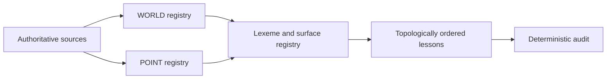
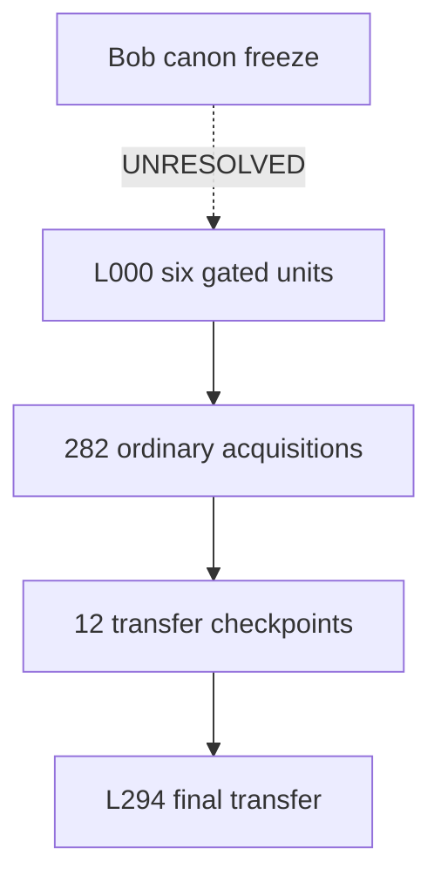

# Ninereeds Executable Foundational Curriculum v4

**Status:** structurally executable; canon freeze remains UNRESOLVED only for Bob.
**Counts:** 157 WORLD objectives; 131 POINTs; 288 language-surface bundles; 295 lessons; 240 individual source dispositions.

## A. Corrected canonical rules
- **authority_order:** ["ninereeds_identity_and_lesson_policy.md","world_bible(6).md","2023_08_20_lesson_000_example(1).md","C001-C240 source map","2026_08_20_curriculum_v3.md"]
- **frontier_types:** ["WORLD_FRONTIER","POINT_FRONTIER","TRANSFER","STAGED_EXCEPTION"]
- **ordinary_lesson_principal_novelty:** 1
- **surface_language_invariant:** Every non-frontier word, construction, response form, and discourse operation used by presentation, practice, feedback, story, or evaluation is established before the lesson.
- **lesson_000:** Canonical chronology; six independently gated acquisition units; presentation first meetings occur once; drills are noncanonical/direct teacher-learner.
- **identity_boundary:** Ninereeds is Ninereeds and is a mind. The curriculum does not classify Ninereeds by implementation, substrate, model, machine, species, consciousness, or sentience.
- **errol_ontology:** ["Errol is a mind","Errol uses Gran's phone to communicate","the phone is a device and is not Errol","Errol's symbol represents Errol and is not Errol","Errol may travel by data transfer","a message may travel without Errol traveling"]
- **bob_resolution:** CHAR-BOB is a minimal operator-approval candidate restricted to L000; no biography is invented.
- **source_count_semantics:** C001-C240 are provenance identifiers, not lesson numbers or a target lesson count.



## B. Corrected WORLD registry
| WORLD_ID | Teaching claim | Domain | WORLD prerequisites | POINT prerequisites | Required established bundles | Frontier lexemes | Grounding | Provenance | Status | Acquisition lesson |
| --- | --- | --- | --- | --- | --- | --- | --- | --- | --- | --- |
| W-ART-001 | Pictures, diagrams, paintings, and sculpture are different representational/art forms. | arts | ["W-REP-001","W-REP-002","W-REP-003","W-REP-004"] | ["P-ID-001","P-DET-002","P-PRON-001"] | ["LEX-W-REP-001","LEX-W-REP-002","LEX-W-REP-003","LEX-W-REP-004","LEX-P-ID-001","LEX-P-DET-002","LEX-P-PRON-001"] | ["pictures","diagrams","paintings","sculpture","representational","art","forms"] | ["COMPARISON"] | ["C186"] | ACTIVE | L270 |
| W-ART-002 | Music/sound can be described using relative perceptual properties. | arts | ["W-PHY-007"] | ["P-ID-001","P-DET-002","P-PRON-001"] | ["LEX-W-PHY-007","LEX-P-ID-001","LEX-P-DET-002","LEX-P-PRON-001"] | ["music","sound","described","using","relative","perceptual","properties"] | ["COMPARISON"] | ["C187"] | ACTIVE | L175 |
| W-AST-001 | Earth's day/night cycle and the observable daytime/nighttime sky are related but not identical concepts. | astronomy | ["W-TIME-003"] | ["P-ID-001","P-DET-002","P-PRON-001","P-TNS-002"] | ["LEX-W-TIME-003","LEX-P-ID-001","LEX-P-DET-002","LEX-P-PRON-001","LEX-P-TNS-002"] | ["earth's","day","night","cycle","observable","daytime","nighttime","sky"] | ["DIAGRAM","SEQUENCE"] | ["C135","C136"] | ACTIVE | L137 |
| W-AST-002 | Apparent solar position and shadow change form an observable correlated pattern. | astronomy | ["W-PHY-005","W-PHY-006","W-AST-001"] | ["P-ID-001","P-DET-002","P-PRON-001","P-TNS-002"] | ["LEX-W-PHY-005","LEX-W-PHY-006","LEX-W-AST-001","LEX-P-ID-001","LEX-P-DET-002","LEX-P-PRON-001","LEX-P-TNS-002"] | ["apparent","solar","position","shadow","change","form","observable","correlated"] | ["SEQUENCE","DIAGRAM"] | ["C137"] | ACTIVE | L257 |
| W-AST-003 | The Moon's visible appearance changes in a recurring pattern over time. | astronomy | ["W-AST-001","W-TIME-002"] | ["P-ID-001","P-DET-002","P-PRON-001","P-TNS-002"] | ["LEX-W-AST-001","LEX-W-TIME-002","LEX-P-ID-001","LEX-P-DET-002","LEX-P-PRON-001","LEX-P-TNS-002"] | ["moon's","visible","appearance","changes","recurring","pattern","time"] | ["SEQUENCE"] | ["C138"] | ACTIVE | L138 |
| W-AST-004 | Planets orbit; orbiting is a spatial motion relation. | astronomy | ["W-PHY-001","W-GEO-001"] | ["P-ID-001","P-DET-002","P-PRON-001","P-TNS-002"] | ["LEX-W-PHY-001","LEX-W-GEO-001","LEX-P-ID-001","LEX-P-DET-002","LEX-P-PRON-001","LEX-P-TNS-002"] | ["planets","orbit","orbiting","spatial","motion"] | ["DIAGRAM"] | ["C139"] | ACTIVE | L139 |
| W-AST-005 | The solar system contains the Sun and orbiting bodies; member and system are distinct. | astronomy | ["W-AST-004"] | ["P-ID-001","P-DET-002","P-PRON-001","P-TNS-002"] | ["LEX-W-AST-004","LEX-P-ID-001","LEX-P-DET-002","LEX-P-PRON-001","LEX-P-TNS-002"] | ["solar","system","contains","sun","orbiting","bodies","member"] | ["DIAGRAM"] | ["C140"] | ACTIVE | L140 |
| W-BIO-001 | Living and nonliving entities are distinguished using biological properties rather than motion alone. | biology | ["W-ONT-001","W-OBJ-001"] | ["P-ID-001","P-DET-002","P-PRON-001","P-TNS-002"] | ["LEX-W-ONT-001","LEX-W-OBJ-001","LEX-P-ID-001","LEX-P-DET-002","LEX-P-PRON-001","LEX-P-TNS-002"] | ["living","nonliving","entities","distinguished","using","biological","properties","rather"] | ["COMPARISON"] | ["C104"] | ACTIVE | L119 |
| W-BIO-002 | Plants have differentiated structures: roots, stems, leaves, flowers/seeds where applicable. | biology | ["W-BIO-001"] | ["P-ID-001","P-DET-002","P-PRON-001","P-TNS-002"] | ["LEX-W-BIO-001","LEX-P-ID-001","LEX-P-DET-002","LEX-P-PRON-001","LEX-P-TNS-002"] | ["plants","have","differentiated","structures","roots","stems","leaves","flowers"] | ["DIAGRAM"] | ["C105"] | ACTIVE | L124 |
| W-BIO-003 | Plants require resources and pass through growth stages. | biology | ["W-BIO-002","W-TIME-002"] | ["P-ID-001","P-DET-002","P-PRON-001","P-TNS-002"] | ["LEX-W-BIO-002","LEX-W-TIME-002","LEX-P-ID-001","LEX-P-DET-002","LEX-P-PRON-001","LEX-P-TNS-002"] | ["plants","require","resources","pass","growth","stages"] | ["SEQUENCE","DIAGRAM"] | ["C106","C107"] | ACTIVE | L125 |
| W-BIO-004 | Animals can be classified into nested groups using shared features. | biology/classification | ["W-BIO-001","W-EPI-004"] | ["P-ID-001","P-DET-002","P-PRON-001","P-TNS-002"] | ["LEX-W-BIO-001","LEX-W-EPI-004","LEX-P-ID-001","LEX-P-DET-002","LEX-P-PRON-001","LEX-P-TNS-002"] | ["animals","classified","nested","groups","using","shared","features"] | ["COMPARISON","DIAGRAM"] | ["C108"] | ACTIVE | L235 |
| W-BIO-005 | Animal structures such as fur, feathers, scales, shells, wings, and fins relate to morphology; movement types are distinct actions. | biology | ["W-BIO-004"] | ["P-ID-001","P-DET-002","P-PRON-001","P-TNS-002"] | ["LEX-W-BIO-004","LEX-P-ID-001","LEX-P-DET-002","LEX-P-PRON-001","LEX-P-TNS-002"] | ["animal","structures","fur","feathers","scales","shells","wings","fins"] | ["COMPARISON","SCENE"] | ["C109","C110"] | ACTIVE | L237 |
| W-BIO-006 | Habitats are environments in which organisms live; habitat is not synonymous with organism. | ecology | ["W-GEO-002","W-GEO-003","W-BIO-001"] | ["P-ID-001","P-DET-002","P-PRON-001","P-PART-001"] | ["LEX-W-GEO-002","LEX-W-GEO-003","LEX-W-BIO-001","LEX-P-ID-001","LEX-P-DET-002","LEX-P-PRON-001","LEX-P-PART-001"] | ["habitats","environments","which","organisms","live","habitat","synonymous","organism"] | ["SCENE","DIAGRAM"] | ["C111"] | ACTIVE | L132 |
| W-BIO-007 | Structures can contribute to functions important for survival. | biology | ["W-BIO-005","W-BIO-006"] | ["P-ID-001","P-DET-002","P-PRON-001","P-TNS-002"] | ["LEX-W-BIO-005","LEX-W-BIO-006","LEX-P-ID-001","LEX-P-DET-002","LEX-P-PRON-001","LEX-P-TNS-002"] | ["structures","contribute","functions","important","survival"] | ["COMPARISON","DIAGRAM"] | ["C112"] | ACTIVE | L238 |
| W-BIO-008 | Diet categories concern what organisms eat; feeding relations can form food chains. | ecology | ["W-BIO-004","W-BIO-005","W-BIO-006"] | ["P-ID-001","P-DET-002","P-PRON-001","P-PART-001"] | ["LEX-W-BIO-004","LEX-W-BIO-005","LEX-W-BIO-006","LEX-P-ID-001","LEX-P-DET-002","LEX-P-PRON-001","LEX-P-PART-001"] | ["diet","categories","concern","organisms","eat","feeding","form","food"] | ["DIAGRAM"] | ["C113","C114"] | ACTIVE | L239 |
| W-BIO-009 | Predator and prey describe an ecological interaction, not permanent moral categories. | ecology | ["W-BIO-008"] | ["P-ID-001","P-DET-002","P-PRON-001","P-PART-001"] | ["LEX-W-BIO-008","LEX-P-ID-001","LEX-P-DET-002","LEX-P-PRON-001","LEX-P-PART-001"] | ["predator","prey","describe","ecological","interaction","permanent","moral","categories"] | ["DIAGRAM","SCENE"] | ["C115"] | ACTIVE | L240 |
| W-BIO-010 | Animal life cycles include development and reproduction; parent and offspring are distinct individuals. | biology | ["W-TIME-002","W-BIO-004"] | ["P-ID-001","P-DET-002","P-PRON-001","P-TNS-002"] | ["LEX-W-TIME-002","LEX-W-BIO-004","LEX-P-ID-001","LEX-P-DET-002","LEX-P-PRON-001","LEX-P-TNS-002"] | ["animal","life","cycles","include","development","reproduction","parent","offspring"] | ["SEQUENCE"] | ["C116","C117"] | ACTIVE | L242 |
| W-BIO-011 | Offspring can resemble parents while varying from them and from one another. | heredity | ["W-BIO-010"] | ["P-ID-001","P-DET-002","P-PRON-001"] | ["LEX-W-BIO-010","LEX-P-ID-001","LEX-P-DET-002","LEX-P-PRON-001"] | ["offspring","resemble","parents","varying","them","another"] | ["COMPARISON"] | ["C117","C118","C119"] | ACTIVE | L243 |
| W-BIO-012 | Organisms in ecosystems can depend on and affect other organisms and environmental resources. | ecology | ["W-BIO-006","W-BIO-008"] | ["P-ID-001","P-DET-002","P-PRON-001","P-PART-001"] | ["LEX-W-BIO-006","LEX-W-BIO-008","LEX-P-ID-001","LEX-P-DET-002","LEX-P-PRON-001","LEX-P-PART-001"] | ["organisms","ecosystems","depend","affect","other","environmental","resources"] | ["DIAGRAM"] | ["C120"] | ACTIVE | L246 |
| W-BIO-013 | Pollination and seed dispersal are transfer processes that may involve wind, animals, or other mechanisms. | biology | ["W-BIO-002","W-BIO-003"] | ["P-ID-001","P-DET-002","P-PRON-001","P-TNS-002"] | ["LEX-W-BIO-002","LEX-W-BIO-003","LEX-P-ID-001","LEX-P-DET-002","LEX-P-PRON-001","LEX-P-TNS-002"] | ["pollination","seed","dispersal","transfer","processes","involve","wind","animals"] | ["SEQUENCE","DIAGRAM"] | ["C121"] | ACTIVE | L126 |
| W-BIO-014 | Decomposers contribute to breakdown of dead organic material. | ecology | ["W-BIO-001","W-BIO-012"] | ["P-ID-001","P-DET-002","P-PRON-001","P-PART-001"] | ["LEX-W-BIO-001","LEX-W-BIO-012","LEX-P-ID-001","LEX-P-DET-002","LEX-P-PRON-001","LEX-P-PART-001"] | ["decomposers","contribute","breakdown","dead","organic","material"] | ["DIAGRAM"] | ["C122"] | ACTIVE | L248 |
| W-BODY-001 | A human body has major external parts organized by part–whole relations. | biology | ["W-BIO-001"] | ["P-ID-001","P-DET-002","P-PRON-001","P-TNS-002"] | ["LEX-W-BIO-001","LEX-P-ID-001","LEX-P-DET-002","LEX-P-PRON-001","LEX-P-TNS-002"] | ["human","body","has","major","external","parts","organized","part"] | ["DIAGRAM"] | ["C042"] | ACTIVE | L120 |
| W-BODY-002 | Sensory systems provide information through vision, hearing, smell, taste, and touch. | biology | ["W-BODY-001","W-EPI-004"] | ["P-ID-001","P-DET-002","P-PRON-001","P-TNS-002"] | ["LEX-W-BODY-001","LEX-W-EPI-004","LEX-P-ID-001","LEX-P-DET-002","LEX-P-PRON-001","LEX-P-TNS-002"] | ["sensory","systems","provide","information","vision","hearing","smell","taste"] | ["DIAGRAM"] | ["C043"] | ACTIVE | L225 |
| W-BODY-003 | Emotions/internal states and externally observable behavior are related but not identical. | psychology | ["W-EPI-001"] | ["P-ID-001","P-DET-002","P-PRON-001","P-TNS-002"] | ["LEX-W-EPI-001","LEX-P-ID-001","LEX-P-DET-002","LEX-P-PRON-001","LEX-P-TNS-002"] | ["emotions","internal","states","externally","observable","behavior","related","but"] | ["DIALOGUE","COMPARISON"] | ["C044"] | ACTIVE | L181 |
| W-BODY-004 | Symptoms are experienced/reported states that can motivate health-related action without themselves uniquely determining a diagnosis. | health | ["W-BODY-001","W-BODY-002","W-BODY-003"] | ["P-ID-001","P-DET-002","P-PRON-001","P-TNS-002"] | ["LEX-W-BODY-001","LEX-W-BODY-002","LEX-W-BODY-003","LEX-P-ID-001","LEX-P-DET-002","LEX-P-PRON-001","LEX-P-TNS-002"] | ["symptoms","experienced","reported","states","motivate","health-related","action","without"] | ["DIALOGUE"] | ["C045","C046"] | ACTIVE | L227 |
| W-BODY-005 | Body systems are decomposed into interacting subsystems rather than taught as one C123 mega-lesson. | biology | ["W-BODY-001","W-BODY-002"] | ["P-ID-001","P-DET-002","P-PRON-001","P-TNS-002"] | ["LEX-W-BODY-001","LEX-W-BODY-002","LEX-P-ID-001","LEX-P-DET-002","LEX-P-PRON-001","LEX-P-TNS-002"] | ["body","systems","decomposed","interacting","subsystems","rather","taught","c"] | ["DIAGRAM"] | ["C123"] | ACTIVE | L250 |
| W-BODY-006 | Support/movement and breathing are distinct body functions with interacting structures. | biology | ["W-BODY-005"] | ["P-ID-001","P-DET-002","P-PRON-001","P-TNS-002"] | ["LEX-W-BODY-005","LEX-P-ID-001","LEX-P-DET-002","LEX-P-PRON-001","LEX-P-TNS-002"] | ["support","movement","breathing","body","functions","interacting","structures"] | ["DIAGRAM"] | ["C123"] | ACTIVE | L251 |
| W-BODY-007 | Circulation transports materials through the body. | biology | ["W-BODY-005"] | ["P-ID-001","P-DET-002","P-PRON-001","P-TNS-002"] | ["LEX-W-BODY-005","LEX-P-ID-001","LEX-P-DET-002","LEX-P-PRON-001","LEX-P-TNS-002"] | ["circulation","transports","materials","body"] | ["DIAGRAM","SEQUENCE"] | ["C124"] | ACTIVE | L252 |
| W-BODY-008 | Digestion transforms and moves food through an ordered process. | biology | ["W-BODY-005"] | ["P-ID-001","P-DET-002","P-PRON-001","P-TNS-002"] | ["LEX-W-BODY-005","LEX-P-ID-001","LEX-P-DET-002","LEX-P-PRON-001","LEX-P-TNS-002"] | ["digestion","transforms","moves","food","ordered","process"] | ["DIAGRAM","SEQUENCE"] | ["C125"] | ACTIVE | L253 |
| W-BODY-009 | Brain/nerves participate in receiving and coordinating information. | biology | ["W-BODY-002","W-BODY-005"] | ["P-ID-001","P-DET-002","P-PRON-001","P-TNS-002"] | ["LEX-W-BODY-002","LEX-W-BODY-005","LEX-P-ID-001","LEX-P-DET-002","LEX-P-PRON-001","LEX-P-TNS-002"] | ["brain","nerves","participate","receiving","coordinating","information"] | ["DIAGRAM"] | ["C126"] | ACTIVE | L254 |
| W-BODY-010 | Germs can contribute to illness; prevention reduces risk but does not imply certainty. | health | ["W-BODY-004","W-EPI-001"] | ["P-ID-001","P-DET-002","P-PRON-001","P-TNS-002"] | ["LEX-W-BODY-004","LEX-W-EPI-001","LEX-P-ID-001","LEX-P-DET-002","LEX-P-PRON-001","LEX-P-TNS-002"] | ["germs","contribute","illness","prevention","reduces","risk","but","does"] | ["DIAGRAM","COMPARISON"] | ["C127"] | ACTIVE | L255 |
| W-CHR-001 | Persistent named agents. A name can continue to refer to the same individual across lessons; L000 establishes Ninereeds, Taro, Emma, Bob, Errol and their acquaintance with Ninereeds. | ontology/social | [] | [] | [] | ["Ninereeds","Taro","Emma","Bob","Errol","name","same individual"] | ["DIALOGUE","SYMBOLIC"] | ["C001","C002","SYN"] | ACTIVE | L000 |
| W-CIV-001 | Rules, laws, advice, permission, prohibition, rights, and responsibilities are distinct normative relations. | civics | ["W-SOC-007"] | ["P-ID-001","P-DET-002","P-PRON-001","P-TNS-002"] | ["LEX-W-SOC-007","LEX-P-ID-001","LEX-P-DET-002","LEX-P-PRON-001","LEX-P-TNS-002"] | ["rules","laws","advice","permission","prohibition","rights","responsibilities","normative"] | ["COMPARISON","ABSTRACT"] | ["C047","C048","C049","C148","C152"] | ACTIVE | L189 |
| W-CIV-002 | Governments/leaders perform responsibilities and collective functions; details vary by polity. | civics | ["W-CIV-001"] | ["P-ID-001","P-DET-002","P-PRON-001","P-TNS-002"] | ["LEX-W-CIV-001","LEX-P-ID-001","LEX-P-DET-002","LEX-P-PRON-001","LEX-P-TNS-002"] | ["governments","leaders","perform","responsibilities","collective","functions","details","vary"] | ["DIAGRAM","ABSTRACT"] | ["C149"] | ACTIVE | L196 |
| W-CIV-003 | Groups can make collective choices using procedures such as voting. | civics | ["W-SOC-003","W-SOC-004"] | ["P-ID-001","P-DET-002","P-PRON-001","P-TNS-002"] | ["LEX-W-SOC-003","LEX-W-SOC-004","LEX-P-ID-001","LEX-P-DET-002","LEX-P-PRON-001","LEX-P-TNS-002"] | ["groups","make","collective","choices","using","procedures","voting"] | ["DIALOGUE","SYMBOLIC"] | ["C150","C151"] | ACTIVE | L197 |
| W-COM-001 | Sender–message–receiver. Communication can involve a sender, transferable message, and receiver. | communication | ["W-TEC-001"] | ["P-DET-002","P-PRON-001","P-ID-001","P-TNS-002"] | ["LEX-W-TEC-001","LEX-P-DET-002","LEX-P-PRON-001","LEX-P-ID-001","LEX-P-TNS-002"] | ["sender","message","receiver"] | ["DIAGRAM","SEQUENCE"] | ["C164","C165"] | ACTIVE | L029 |
| W-COM-002 | Communication media include phone, email, radio, and other channels; channel and message are distinct. | communication | ["W-COM-001"] | ["P-ID-001","P-DET-002","P-PRON-001","P-TNS-002"] | ["LEX-W-COM-001","LEX-P-ID-001","LEX-P-DET-002","LEX-P-PRON-001","LEX-P-TNS-002"] | ["communication","media","include","phone","email","radio","other","channels"] | ["COMPARISON","DIAGRAM"] | ["C164"] | ACTIVE | L156 |
| W-COMP-001 | Computing systems can receive inputs and produce outputs. | computing | ["W-TEC-002"] | ["P-ID-001","P-DET-002","P-PRON-001","P-TNS-002"] | ["LEX-W-TEC-002","LEX-P-ID-001","LEX-P-DET-002","LEX-P-PRON-001","LEX-P-TNS-002"] | ["computing","systems","receive","inputs","produce","outputs"] | ["DIAGRAM"] | ["C168"] | ACTIVE | L159 |
| W-COMP-002 | Files, records, and data can be stored; storage location and represented information are distinct. | computing | ["W-REP-001","W-COMP-001"] | ["P-ID-001","P-DET-002","P-PRON-001","P-TNS-002"] | ["LEX-W-REP-001","LEX-W-COMP-001","LEX-P-ID-001","LEX-P-DET-002","LEX-P-PRON-001","LEX-P-TNS-002"] | ["files","records","data","stored","storage","location","represented","information"] | ["DIAGRAM","SYMBOLIC"] | ["C169"] | ACTIVE | L160 |
| W-COMP-003 | A network contains connected nodes and links over which information may move. | computing | ["W-COM-001","W-GEO-001"] | ["P-ID-001","P-DET-002","P-PRON-001","P-TNS-002"] | ["LEX-W-COM-001","LEX-W-GEO-001","LEX-P-ID-001","LEX-P-DET-002","LEX-P-PRON-001","LEX-P-TNS-002"] | ["network","contains","connected","nodes","links","which","information","move"] | ["DIAGRAM"] | ["C170"] | ACTIVE | L161 |
| W-COMP-004 | Paths, addresses, routing, local/distant connections, and failures are distinct network concepts. | computing | ["W-COMP-003"] | ["P-ID-001","P-DET-002","P-PRON-001","P-TNS-002"] | ["LEX-W-COMP-003","LEX-P-ID-001","LEX-P-DET-002","LEX-P-PRON-001","LEX-P-TNS-002"] | ["paths","addresses","routing","local","distant","connections","failures","network"] | ["DIAGRAM"] | ["C170","SYN"] | ACTIVE | L163 |
| W-COMP-005 | The Internet is a networked system rather than a single device or single location. | computing | ["W-COMP-003","W-COMP-004"] | ["P-ID-001","P-DET-002","P-PRON-001","P-TNS-002"] | ["LEX-W-COMP-003","LEX-W-COMP-004","LEX-P-ID-001","LEX-P-DET-002","LEX-P-PRON-001","LEX-P-TNS-002"] | ["internet","networked","system","rather","single","device","location"] | ["DIAGRAM","ABSTRACT"] | ["C170"] | ACTIVE | L164 |
| W-COMP-006 | Looking for information and successfully finding it are different events. | computing/information | ["W-EPI-005"] | ["P-ID-001","P-DET-002","P-PRON-001","P-TNS-002"] | ["LEX-W-EPI-005","LEX-P-ID-001","LEX-P-DET-002","LEX-P-PRON-001","LEX-P-TNS-002"] | ["looking","information","successfully","finding","it","events"] | ["SYMBOLIC"] | ["C171"] | ACTIVE | L202 |
| W-COMP-007 | An algorithm is an ordered procedure that may include conditional branches. | computing | ["W-EVT-002"] | ["P-ID-001","P-DET-002","P-PRON-001","P-TNS-002"] | ["LEX-W-EVT-002","LEX-P-ID-001","LEX-P-DET-002","LEX-P-PRON-001","LEX-P-TNS-002"] | ["algorithm","ordered","procedure","include","conditional","branches"] | ["SYMBOLIC","DIAGRAM"] | ["C172"] | ACTIVE | L165 |
| W-COMP-008 | Programs contain instructions interpreted/executed by computing systems. | computing | ["W-COMP-001","W-COMP-007"] | ["P-ID-001","P-DET-002","P-PRON-001","P-TNS-002"] | ["LEX-W-COMP-001","LEX-W-COMP-007","LEX-P-ID-001","LEX-P-DET-002","LEX-P-PRON-001","LEX-P-TNS-002"] | ["programs","contain","instructions","interpreted","executed","computing","systems"] | ["SYMBOLIC"] | ["C173"] | ACTIVE | L166 |
| W-COMP-009 | Debugging is systematic diagnosis/revision after observed failure or error. | computing/engineering | ["W-COMP-008","W-ENG-002","W-EPI-002"] | ["P-ID-001","P-DET-002","P-PRON-001","P-TNS-002"] | ["LEX-W-COMP-008","LEX-W-ENG-002","LEX-W-EPI-002","LEX-P-ID-001","LEX-P-DET-002","LEX-P-PRON-001","LEX-P-TNS-002"] | ["debugging","systematic","diagnosis","revision","after","observed","failure","error"] | ["SEQUENCE","SYMBOLIC"] | ["C177"] | ACTIVE | L265 |
| W-COMP-010 | Automation allows a system to perform assigned operations without a person manually doing every step. | computing | ["W-COMP-007","W-COMP-008"] | ["P-ID-001","P-DET-002","P-PRON-001","P-TNS-002"] | ["LEX-W-COMP-007","LEX-W-COMP-008","LEX-P-ID-001","LEX-P-DET-002","LEX-P-PRON-001","LEX-P-TNS-002"] | ["automation","allows","system","perform","assigned","operations","without","person"] | ["DIAGRAM"] | ["C178"] | ACTIVE | L169 |
| W-CUL-001 | Customs and traditions vary across groups and are not universal human rules. | culture | ["W-SOC-009"] | ["P-ID-001","P-DET-002","P-PRON-001"] | ["LEX-W-SOC-009","LEX-P-ID-001","LEX-P-DET-002","LEX-P-PRON-001"] | ["customs","traditions","vary","across","groups","universal","human","rules"] | ["COMPARISON","DIALOGUE"] | ["C188"] | ACTIVE | L176 |
| W-CUL-002 | Languages and writing systems are conventional symbolic systems and can differ. | culture/language | ["W-REP-003"] | ["P-ID-001","P-DET-002","P-PRON-001"] | ["LEX-W-REP-003","LEX-P-ID-001","LEX-P-DET-002","LEX-P-PRON-001"] | ["languages","writing","systems","conventional","symbolic","differ"] | ["SYMBOLIC"] | ["C189"] | ACTIVE | L177 |
| W-CUL-003 | Beliefs/worldviews are attributed to people or traditions; differing beliefs can be represented without curricular endorsement. | culture/epistemic | ["W-EPI-001","W-SOC-004"] | ["P-ID-001","P-DET-002","P-PRON-001","P-CAU-001"] | ["LEX-W-EPI-001","LEX-W-SOC-004","LEX-P-ID-001","LEX-P-DET-002","LEX-P-PRON-001","LEX-P-CAU-001"] | ["beliefs","worldviews","attributed","people","traditions","differing","represented"] | ["DIALOGUE","ABSTRACT"] | ["C190"] | ACTIVE | L214 |
| W-CUL-004 | Celebrations/ceremonies have culturally situated purposes and forms. | culture | ["W-CUL-001"] | ["P-ID-001","P-DET-002","P-PRON-001"] | ["LEX-W-CUL-001","LEX-P-ID-001","LEX-P-DET-002","LEX-P-PRON-001"] | ["celebrations","ceremonies","have","culturally","situated","purposes","forms"] | ["SCENE","DIALOGUE"] | ["C191"] | ACTIVE | L178 |
| W-DATA-001 | Tables and charts are representations of data, not the measured entities themselves. | data | ["W-REP-001","W-MATH-001"] | ["P-ID-001","P-DET-002","P-PRON-001","P-REP-001"] | ["LEX-W-REP-001","LEX-W-MATH-001","LEX-P-ID-001","LEX-P-DET-002","LEX-P-PRON-001","LEX-P-REP-001"] | ["tables","charts","representations","data","measured","entities","themselves"] | ["SYMBOLIC"] | ["C174"] | ACTIVE | L167 |
| W-DATA-002 | Trends describe changes/relationships across data rather than individual observations. | data | ["W-DATA-001","W-MATH-002"] | ["P-ID-001","P-DET-002","P-PRON-001","P-REP-001"] | ["LEX-W-DATA-001","LEX-W-MATH-002","LEX-P-ID-001","LEX-P-DET-002","LEX-P-PRON-001","LEX-P-REP-001"] | ["trends","describe","changes","relationships","across","data","rather","individual"] | ["SYMBOLIC"] | ["C175"] | ACTIVE | L168 |
| W-EAR-001 | Weather is a state of atmospheric conditions that can be described and measured. | Earth science | ["W-MATH-009"] | ["P-ID-001","P-DET-002","P-PRON-001","P-TNS-002"] | ["LEX-W-MATH-009","LEX-P-ID-001","LEX-P-DET-002","LEX-P-PRON-001","LEX-P-TNS-002"] | ["weather","state","atmospheric","conditions","described","measured"] | ["SCENE","SYMBOLIC"] | ["C068","C096"] | ACTIVE | L076 |
| W-EAR-002 | Weather patterns and seasons concern recurrence over time, not guarantees about individual days. | Earth science | ["W-EAR-001","W-TIME-003"] | ["P-ID-001","P-DET-002","P-PRON-001","P-TNS-002"] | ["LEX-W-EAR-001","LEX-W-TIME-003","LEX-P-ID-001","LEX-P-DET-002","LEX-P-PRON-001","LEX-P-TNS-002"] | ["weather","patterns","seasons","concern","recurrence","time","guarantees","about"] | ["COMPARISON","SEQUENCE"] | ["C097","C098"] | ACTIVE | L113 |
| W-EAR-003 | Water-cycle processes are distinct transformations/movements that can form a cycle. | Earth science | ["W-MAT-003","W-MAT-004"] | ["P-ID-001","P-DET-002","P-PRON-001","P-TNS-002"] | ["LEX-W-MAT-003","LEX-W-MAT-004","LEX-P-ID-001","LEX-P-DET-002","LEX-P-PRON-001","LEX-P-TNS-002"] | ["water-cycle","processes","transformations","movements","form","cycle"] | ["DIAGRAM","SEQUENCE"] | ["C099"] | ACTIVE | L115 |
| W-EAR-004 | Natural resources have sources and uses; waste, reuse, recycling, and conservation are distinct responses. | Earth/society | ["W-MAT-001","W-TEC-002"] | ["P-ID-001","P-DET-002","P-PRON-001","P-TNS-002"] | ["LEX-W-MAT-001","LEX-W-TEC-002","LEX-P-ID-001","LEX-P-DET-002","LEX-P-PRON-001","LEX-P-TNS-002"] | ["natural","resources","have","sources","uses","waste","reuse","recycling"] | ["SEQUENCE","DIAGRAM"] | ["C102","C103"] | ACTIVE | L117 |
| W-EAR-005 | Atmosphere, water, land, and living systems interact. | Earth systems | ["W-EAR-003","W-EAR-004","W-BIO-012"] | ["P-ID-001","P-DET-002","P-PRON-001","P-TNS-002"] | ["LEX-W-EAR-003","LEX-W-EAR-004","LEX-W-BIO-012","LEX-P-ID-001","LEX-P-DET-002","LEX-P-PRON-001","LEX-P-TNS-002"] | ["atmosphere","water","land","living","systems","interact"] | ["DIAGRAM"] | ["C141"] | ACTIVE | L259 |
| W-ECO-001 | Price and money quantify exchange value in a transaction. | economics/math | ["W-MATH-001","W-OBJ-002"] | ["P-ID-001","P-DET-002","P-PRON-001","P-TNS-002"] | ["LEX-W-MATH-001","LEX-W-OBJ-002","LEX-P-ID-001","LEX-P-DET-002","LEX-P-PRON-001","LEX-P-TNS-002"] | ["price","money","quantify","exchange","value","transaction"] | ["SCENE","SYMBOLIC"] | ["C074"] | ACTIVE | L085 |
| W-ECO-002 | Sufficiency: available quantity/resources may or may not meet a requirement. | economics/math | ["W-MATH-002","W-PSY-001"] | ["P-ID-001","P-DET-002","P-PRON-001","P-TNS-002"] | ["LEX-W-MATH-002","LEX-W-PSY-001","LEX-P-ID-001","LEX-P-DET-002","LEX-P-PRON-001","LEX-P-TNS-002"] | ["sufficiency","available","quantity","resources","meet","requirement"] | ["COMPARISON"] | ["C075","C158","C159"] | ACTIVE | L087 |
| W-ECO-003 | Goods and services distinguish produced/provided things from activities. | economics | ["W-TEC-002"] | ["P-ID-001","P-DET-002","P-PRON-001","P-TNS-002"] | ["LEX-W-TEC-002","LEX-P-ID-001","LEX-P-DET-002","LEX-P-PRON-001","LEX-P-TNS-002"] | ["goods","services","distinguish","produced","provided","things","activities"] | ["COMPARISON"] | ["C153"] | ACTIVE | L145 |
| W-ECO-004 | Jobs connect roles, workplaces, employers/organizations, and activities. | economics | ["W-SOC-010"] | ["P-ID-001","P-DET-002","P-PRON-001","P-TNS-002"] | ["LEX-W-SOC-010","LEX-P-ID-001","LEX-P-DET-002","LEX-P-PRON-001","LEX-P-TNS-002"] | ["jobs","connect","roles","workplaces","employers","organizations","activities"] | ["SCENE"] | ["C154"] | ACTIVE | L146 |
| W-ECO-005 | Production can occur through farms, factories, workshops, and service systems. | economics | ["W-ECO-003","W-ECO-004"] | ["P-ID-001","P-DET-002","P-PRON-001","P-TNS-002"] | ["LEX-W-ECO-003","LEX-W-ECO-004","LEX-P-ID-001","LEX-P-DET-002","LEX-P-PRON-001","LEX-P-TNS-002"] | ["production","occur","farms","factories","workshops","service","systems"] | ["SEQUENCE","DIAGRAM"] | ["C155"] | ACTIVE | L148 |
| W-ECO-006 | Supply chains connect stages of production, movement, and provision. | economics/systems | ["W-ECO-005","W-GEO-001"] | ["P-ID-001","P-DET-002","P-PRON-001","P-TNS-002"] | ["LEX-W-ECO-005","LEX-W-GEO-001","LEX-P-ID-001","LEX-P-DET-002","LEX-P-PRON-001","LEX-P-TNS-002"] | ["supply","chains","connect","stages","production","movement","provision"] | ["DIAGRAM"] | ["C156"] | ACTIVE | L149 |
| W-ECO-007 | Buying/selling, saving/spending, scarcity, and trade are distinct exchange/resource relations. | economics | ["W-ECO-001","W-ECO-002","W-ECO-003"] | ["P-ID-001","P-DET-002","P-PRON-001","P-TNS-002"] | ["LEX-W-ECO-001","LEX-W-ECO-002","LEX-W-ECO-003","LEX-P-ID-001","LEX-P-DET-002","LEX-P-PRON-001","LEX-P-TNS-002"] | ["buying","selling","saving","spending","scarcity","trade","exchange","resource"] | ["SCENE","SYMBOLIC"] | ["C157","C158","C159","C160"] | ACTIVE | L150 |
| W-ENG-001 | Machines/systems consist of interacting parts; part failure can affect system behavior. | engineering | ["W-TEC-002","W-OBJ-001"] | ["P-ID-001","P-DET-002","P-PRON-001","P-TNS-002"] | ["LEX-W-TEC-002","LEX-W-OBJ-001","LEX-P-ID-001","LEX-P-DET-002","LEX-P-PRON-001","LEX-P-TNS-002"] | ["machines","systems","consist","interacting","parts","part","failure","affect"] | ["DIAGRAM"] | ["C093"] | ACTIVE | L111 |
| W-ENG-002 | Engineering proceeds through problem/requirement → proposed solution → test → observed result → revision. | engineering | ["W-EVT-002","W-EPI-004"] | ["P-ID-001","P-DET-002","P-PRON-001","P-TNS-002"] | ["LEX-W-EVT-002","LEX-W-EPI-004","LEX-P-ID-001","LEX-P-DET-002","LEX-P-PRON-001","LEX-P-TNS-002"] | ["engineering","proceeds","problem","requirement","proposed","solution","test","observed"] | ["SEQUENCE","DIAGRAM"] | ["C094","C095"] | ACTIVE | L234 |
| W-EPI-001 | Knowledge and ignorance. An agent may know something, not know it, or ask another agent who may know. | epistemic | ["W-CHR-001"] | ["P-TNS-002","P-NEG-001","P-Q-006","P-ID-001"] | ["LEX-W-CHR-001","LEX-P-TNS-002","LEX-P-NEG-001","LEX-P-Q-006","LEX-P-ID-001"] | ["knowledge","ignorance"] | ["DIALOGUE","COMPARISON"] | ["C193","V2","SYN"] | ACTIVE | L180 |
| W-EPI-002 | Belief correction. An earlier belief or statement can be wrong and later corrected without changing the speaker's identity. | epistemic | ["W-EPI-001"] | ["P-EPI-001","P-TNS-003","P-TIME-001","P-ID-001"] | ["LEX-W-EPI-001","LEX-P-EPI-001","LEX-P-TNS-003","LEX-P-TIME-001","LEX-P-ID-001"] | ["belief","correction"] | ["SEQUENCE","DIALOGUE"] | ["C193","C239","SYN"] | ACTIVE | L218 |
| W-EPI-003 | Source vs content. Who supplied a statement and what the statement says are different pieces of information. | provenance | ["W-COM-001","W-EPI-001"] | ["P-EPI-001","P-COM-001","P-PRON-001","P-ID-001"] | ["LEX-W-COM-001","LEX-W-EPI-001","LEX-P-EPI-001","LEX-P-COM-001","LEX-P-PRON-001","LEX-P-ID-001"] | ["source","content"] | ["DIALOGUE","DIAGRAM"] | ["C167","C183","C238","SYN"] | ACTIVE | L199 |
| W-EPI-004 | Observation vs inference. What is directly observed is distinct from a conclusion drawn from observations plus prior knowledge. | epistemic/science | ["W-EPI-001","W-EPI-002"] | ["P-EPI-001","P-EPI-002","P-TNS-003","P-ID-001"] | ["LEX-W-EPI-001","LEX-W-EPI-002","LEX-P-EPI-001","LEX-P-EPI-002","LEX-P-TNS-003","LEX-P-ID-001"] | ["observation","inference"] | ["COMPARISON","DIALOGUE"] | ["C194","C195"] | ACTIVE | L224 |
| W-EPI-005 | Books, reports, news, and references are information sources with provenance. | epistemic/media | ["W-EPI-003"] | ["P-COM-001","P-REP-001","P-TNS-002","P-ID-001"] | ["LEX-W-EPI-003","LEX-P-COM-001","LEX-P-REP-001","LEX-P-TNS-002","LEX-P-ID-001"] | ["books","reports","news","references","information","sources","provenance"] | ["SYMBOLIC"] | ["C167"] | ACTIVE | L200 |
| W-EPI-006 | Fact, opinion, knowledge, belief, and preference are overlapping but nonidentical epistemic categories. | epistemic | ["W-EPI-001","W-EPI-002","W-EPI-003","W-EPI-004"] | ["P-EPI-001","P-DISC-001","P-ID-001","P-DET-002"] | ["LEX-W-EPI-001","LEX-W-EPI-002","LEX-W-EPI-003","LEX-W-EPI-004","LEX-P-EPI-001","LEX-P-DISC-001","LEX-P-ID-001","LEX-P-DET-002"] | ["fact","opinion","knowledge","belief","preference","overlapping","but","nonidentical"] | ["COMPARISON","ABSTRACT"] | ["C193"] | ACTIVE | L272 |
| W-EPI-007 | Claims may be supported by evidence; evidence has sources and may support claims to differing degrees. | epistemic | ["W-EPI-003","W-EPI-004","W-EPI-005"] | ["P-EPI-003","P-SRC-001","P-CAU-001","P-ID-001"] | ["LEX-W-EPI-003","LEX-W-EPI-004","LEX-W-EPI-005","LEX-P-EPI-003","LEX-P-SRC-001","LEX-P-CAU-001","LEX-P-ID-001"] | ["claims","supported","evidence","has","sources","support"] | ["DIAGRAM","DIALOGUE"] | ["C195","C238"] | ACTIVE | L276 |
| W-EPI-008 | Uncertainty admits degrees; prediction is not certainty. | epistemic | ["W-EPI-001","W-DATA-002"] | ["P-MOD-004","P-GEN-001","P-ID-001","P-DET-002"] | ["LEX-W-EPI-001","LEX-W-DATA-002","LEX-P-MOD-004","LEX-P-GEN-001","LEX-P-ID-001","LEX-P-DET-002"] | ["uncertainty","admits","degrees","prediction","certainty"] | ["COMPARISON","ABSTRACT"] | ["C196"] | ACTIVE | L278 |
| W-EPI-009 | Definitions specify intended meanings; definitions and examples perform different functions. | epistemic/language | ["W-REP-003"] | ["P-DEF-001","P-ID-001","P-DET-002","P-PRON-001"] | ["LEX-W-REP-003","LEX-P-DEF-001","LEX-P-ID-001","LEX-P-DET-002","LEX-P-PRON-001"] | ["definitions","specify","intended","meanings","examples","perform","functions"] | ["COMPARISON"] | ["C197"] | ACTIVE | L279 |
| W-EPI-010 | Classification organizes entities by shared criteria; category membership may be nested. | epistemic | ["W-EPI-009","W-BIO-004"] | ["P-DEF-001","P-CLASS-001","P-ID-001","P-DET-002"] | ["LEX-W-EPI-009","LEX-W-BIO-004","LEX-P-DEF-001","LEX-P-CLASS-001","LEX-P-ID-001","LEX-P-DET-002"] | ["classification","organizes","entities","shared","criteria","category","membership","nested"] | ["DIAGRAM"] | ["C198"] | ACTIVE | L280 |
| W-EPI-011 | Similarity and difference depend on the property or criterion being compared. | epistemic | ["W-OBJ-003","W-EPI-010"] | ["P-SIM-001","P-CMP-002","P-ID-001","P-DET-002"] | ["LEX-W-OBJ-003","LEX-W-EPI-010","LEX-P-SIM-001","LEX-P-CMP-002","LEX-P-ID-001","LEX-P-DET-002"] | ["similarity","difference","depend","property","criterion","being","compared"] | ["COMPARISON"] | ["C200"] | ACTIVE | L281 |
| W-EPI-012 | Memory is stored/retrieved information about prior experience and can differ from current observation. | epistemic | ["W-EPI-001","W-EPI-002","W-EPI-003","W-EPI-004","W-TIME-003"] | ["P-TNS-003","P-EPI-001","P-ID-001","P-DET-002"] | ["LEX-W-EPI-001","LEX-W-EPI-002","LEX-W-EPI-003","LEX-W-EPI-004","LEX-W-TIME-003","LEX-P-TNS-003","LEX-P-EPI-001","LEX-P-ID-001","LEX-P-DET-002"] | ["memory","stored","retrieved","information","about","prior","experience","differ"] | ["SEQUENCE","ABSTRACT"] | ["SYN"] | ACTIVE | L286 |
| W-EVT-001 | Action, state, and routine. Something happening now differs from a recurring routine or relatively stable state. | events/time | ["W-CHR-001","W-OBJ-001"] | ["P-DET-002","P-PRON-001","P-SPAT-001","P-ID-001"] | ["LEX-W-CHR-001","LEX-W-OBJ-001","LEX-P-DET-002","LEX-P-PRON-001","LEX-P-SPAT-001","LEX-P-ID-001"] | ["action","state","routine"] | ["SEQUENCE","COMPARISON"] | ["C027","C028","C029","C030"] | ACTIVE | L014 |
| W-EVT-002 | Procedure. A task can consist of ordered steps where sequence may affect the result. | events/engineering | ["W-EVT-001"] | ["P-ASP-001","P-TNS-002","P-ID-001","P-DET-002"] | ["LEX-W-EVT-001","LEX-P-ASP-001","LEX-P-TNS-002","LEX-P-ID-001","LEX-P-DET-002"] | ["procedure"] | ["SEQUENCE"] | ["C031","C032","C172"] | ACTIVE | L020 |
| W-GEO-001 | Routes and paths. Travel can have a start, path, intermediate places, and destination. In the canonical world, the Meadow Path connects Gran's garden gate to the Pond and continues to the School; the Pond is a short walk from the Oak. | geography | ["W-TRN-001"] | ["P-SPAT-001","P-REL-001","P-ID-001","P-DET-002"] | ["LEX-W-TRN-001","LEX-P-SPAT-001","LEX-P-REL-001","LEX-P-ID-001","LEX-P-DET-002"] | ["route","start","path","destination","Oak","Pond","Meadow Path","School"] | ["DIAGRAM","SYMBOLIC"] | ["C013","C131","V2"] | ACTIVE | L039 |
| W-GEO-002 | Landforms such as mountains, valleys, plains, and coasts are distinguishable geographic structures. | geography | ["W-REP-002"] | ["P-ID-001","P-DET-002","P-PRON-001","P-DESC-001"] | ["LEX-W-REP-002","LEX-P-ID-001","LEX-P-DET-002","LEX-P-PRON-001","LEX-P-DESC-001"] | ["landforms","mountains","valleys","plains","coasts","distinguishable","geographic","structures"] | ["DIAGRAM","SCENE"] | ["C100"] | ACTIVE | L129 |
| W-GEO-003 | Rivers, lakes, and oceans differ; flowing water can move from source through a path into a larger body. | geography | ["W-GEO-001","W-GEO-002"] | ["P-ID-001","P-DET-002","P-PRON-001","P-DESC-001"] | ["LEX-W-GEO-001","LEX-W-GEO-002","LEX-P-ID-001","LEX-P-DET-002","LEX-P-PRON-001","LEX-P-DESC-001"] | ["rivers","lakes","oceans","differ","flowing","water","move","source"] | ["DIAGRAM"] | ["C101"] | ACTIVE | L130 |
| W-GEO-004 | Cardinal directions support relative geographic orientation. | geography | ["W-REP-002"] | ["P-ID-001","P-DET-002","P-PRON-001","P-DESC-001"] | ["LEX-W-REP-002","LEX-P-ID-001","LEX-P-DET-002","LEX-P-PRON-001","LEX-P-DESC-001"] | ["cardinal","directions","support","relative","geographic","orientation"] | ["SYMBOLIC"] | ["C129"] | ACTIVE | L133 |
| W-GEO-005 | Addresses and geographic hierarchies locate entities at multiple scales. | geography | ["W-GEO-004"] | ["P-ID-001","P-DET-002","P-PRON-001","P-DESC-001"] | ["LEX-W-GEO-004","LEX-P-ID-001","LEX-P-DET-002","LEX-P-PRON-001","LEX-P-DESC-001"] | ["addresses","geographic","hierarchies","locate","entities","multiple","scales"] | ["SYMBOLIC","DIAGRAM"] | ["C130","C132","C133","C134"] | ACTIVE | L136 |
| W-HAZ-001 | A hazard is a condition/event with potential for harm; hazard, damage, and response are distinct. | safety | ["W-EPI-004"] | ["P-ID-001","P-DET-002","P-PRON-001"] | ["LEX-W-EPI-004","LEX-P-ID-001","LEX-P-DET-002","LEX-P-PRON-001"] | ["hazard","condition","event","potential","harm","damage","response"] | ["COMPARISON"] | ["C142"] | ACTIVE | L260 |
| W-HAZ-002 | Fire/heat and dangerous-material hazards have warning, avoidance, and response concepts. | safety | ["W-HAZ-001","W-PHY-005"] | ["P-ID-001","P-DET-002","P-PRON-001"] | ["LEX-W-HAZ-001","LEX-W-PHY-005","LEX-P-ID-001","LEX-P-DET-002","LEX-P-PRON-001"] | ["fire","heat","dangerous-material","hazards","have","warning","avoidance","response"] | ["SCENE","SYMBOLIC"] | ["C047","C048","C049","C142"] | ACTIVE | L261 |
| W-HAZ-003 | Severe weather, flooding, and geologic hazards require condition-specific responses rather than one generic script. | safety/Earth | ["W-HAZ-001","W-EAR-001"] | ["P-ID-001","P-DET-002","P-PRON-001","P-TNS-002"] | ["LEX-W-HAZ-001","LEX-W-EAR-001","LEX-P-ID-001","LEX-P-DET-002","LEX-P-PRON-001","LEX-P-TNS-002"] | ["severe","weather","flooding","geologic","hazards","require","condition-specific","responses"] | ["SEQUENCE","DIAGRAM"] | ["C142"] | ACTIVE | L263 |
| W-HIS-001 | Everyday practices and technologies can differ between past and present. | history | ["W-TIME-003"] | ["P-ID-001","P-DET-002","P-PRON-001","P-TNS-002"] | ["LEX-W-TIME-003","LEX-P-ID-001","LEX-P-DET-002","LEX-P-PRON-001","LEX-P-TNS-002"] | ["everyday","practices","technologies","differ","between","past","present"] | ["COMPARISON"] | ["C161","C162"] | ACTIVE | L152 |
| W-HIS-002 | Change can accumulate across generations while some continuities remain. | history | ["W-HIS-001","W-TIME-004"] | ["P-ID-001","P-DET-002","P-PRON-001","P-TNS-002"] | ["LEX-W-HIS-001","LEX-W-TIME-004","LEX-P-ID-001","LEX-P-DET-002","LEX-P-PRON-001","LEX-P-TNS-002"] | ["change","accumulate","across","generations","some","continuities","remain"] | ["SEQUENCE"] | ["C163"] | ACTIVE | L154 |
| W-LIT-001 | Stories have characters, settings, events, and ordered sequences. | literature | ["W-CHR-001","W-EVT-002"] | ["P-ID-001","P-DET-002","P-PRON-001"] | ["LEX-W-CHR-001","LEX-W-EVT-002","LEX-P-ID-001","LEX-P-DET-002","LEX-P-PRON-001"] | ["stories","have","characters","settings","events","ordered","sequences"] | ["SEQUENCE","SYMBOLIC"] | ["C181","C182"] | ACTIVE | L172 |
| W-LIT-002 | Narrated dialogue and reported speech represent conversational events. | literature/language | ["W-COM-001","W-LIT-001"] | ["P-ID-001","P-DET-002","P-PRON-001"] | ["LEX-W-COM-001","LEX-W-LIT-001","LEX-P-ID-001","LEX-P-DET-002","LEX-P-PRON-001"] | ["narrated","dialogue","reported","speech","represent","conversational","events"] | ["DIALOGUE","SYMBOLIC"] | ["C183"] | ACTIVE | L174 |
| W-LIT-003 | Fiction/nonfiction is a relation between text and intended representation/claims, not simply “interesting vs boring.” | literacy | ["W-REP-001","W-EPI-003"] | ["P-ID-001","P-DET-002","P-PRON-001"] | ["LEX-W-REP-001","LEX-W-EPI-003","LEX-P-ID-001","LEX-P-DET-002","LEX-P-PRON-001"] | ["interesting vs boring."] | ["COMPARISON"] | ["C184"] | ACTIVE | L212 |
| W-MAT-001 | Objects can be composed of materials; material and finished object are distinct. | materials | ["W-OBJ-001"] | ["P-ID-001","P-DET-002","P-PRON-001","P-DESC-001"] | ["LEX-W-OBJ-001","LEX-P-ID-001","LEX-P-DET-002","LEX-P-PRON-001","LEX-P-DESC-001"] | ["objects","composed","materials","material","finished","object"] | ["SCENE","COMPARISON"] | ["C078"] | ACTIVE | L091 |
| W-MAT-002 | Materials differ in observable/measurable properties such as hardness, texture, and flexibility. | materials | ["W-MAT-001","W-OBJ-003"] | ["P-ID-001","P-DET-002","P-PRON-001","P-DESC-001"] | ["LEX-W-MAT-001","LEX-W-OBJ-003","LEX-P-ID-001","LEX-P-DET-002","LEX-P-PRON-001","LEX-P-DESC-001"] | ["materials","differ","observable","measurable","properties","hardness","texture","flexibility"] | ["COMPARISON"] | ["C079"] | ACTIVE | L094 |
| W-MAT-003 | Solid, liquid, and gas are distinguishable states of matter at an introductory level. | physical science | ["W-MAT-001"] | ["P-ID-001","P-DET-002","P-PRON-001","P-DESC-001"] | ["LEX-W-MAT-001","LEX-P-ID-001","LEX-P-DET-002","LEX-P-PRON-001","LEX-P-DESC-001"] | ["solid","liquid","gas","distinguishable","states","matter"] | ["COMPARISON","DIAGRAM"] | ["C080"] | ACTIVE | L095 |
| W-MAT-004 | Heating/cooling can accompany changes of state or form; process and resulting state are distinct. | physical science | ["W-MAT-003"] | ["P-ID-001","P-DET-002","P-PRON-001","P-DESC-001"] | ["LEX-W-MAT-003","LEX-P-ID-001","LEX-P-DET-002","LEX-P-PRON-001","LEX-P-DESC-001"] | ["heating","cooling","accompany","changes","state","form","process","resulting"] | ["SEQUENCE","DIAGRAM"] | ["C081","C082"] | ACTIVE | L097 |
| W-MATH-001 | Quantity and zero. Finite collections can have quantities, including no members. Exact initial numerical ceiling is UNSPECIFIED. | mathematics | ["W-OBJ-001"] | ["P-NUM-001","P-EXIST-001","P-ID-001","P-DET-002"] | ["LEX-W-OBJ-001","LEX-P-NUM-001","LEX-P-EXIST-001","LEX-P-ID-001","LEX-P-DET-002"] | ["quantity","zero"] | ["SYMBOLIC","COMPARISON"] | ["C053","C054"] | ACTIVE | L043 |
| W-MATH-002 | Compare quantities. Two collections can contain more, fewer, or equal numbers of members. | mathematics | ["W-MATH-001"] | ["P-QNT-001","P-ID-001","P-DET-002","P-PRON-001"] | ["LEX-W-MATH-001","LEX-P-QNT-001","LEX-P-ID-001","LEX-P-DET-002","LEX-P-PRON-001"] | ["compare","quantities"] | ["COMPARISON","SYMBOLIC"] | ["C055"] | ACTIVE | L045 |
| W-MATH-003 | Addition: combining collections changes total quantity. | math | ["W-MATH-001"] | ["P-ID-001","P-DET-002","P-PRON-001","P-DESC-001"] | ["LEX-W-MATH-001","LEX-P-ID-001","LEX-P-DET-002","LEX-P-PRON-001","LEX-P-DESC-001"] | ["addition","combining","collections","changes","total","quantity"] | ["SYMBOLIC","SCENE"] | ["C056"] | ACTIVE | L061 |
| W-MATH-004 | Subtraction: removing members changes the remaining quantity. | math | ["W-MATH-001"] | ["P-ID-001","P-DET-002","P-PRON-001","P-DESC-001"] | ["LEX-W-MATH-001","LEX-P-ID-001","LEX-P-DET-002","LEX-P-PRON-001","LEX-P-DESC-001"] | ["subtraction","removing","members","changes","remaining","quantity"] | ["SYMBOLIC","SEQUENCE"] | ["C057"] | ACTIVE | L062 |
| W-MATH-005 | Distribution and equal shares: objects can be allocated across recipients. | math/social | ["W-MATH-001","W-MATH-002"] | ["P-ID-001","P-DET-002","P-PRON-001","P-TNS-002"] | ["LEX-W-MATH-001","LEX-W-MATH-002","LEX-P-ID-001","LEX-P-DET-002","LEX-P-PRON-001","LEX-P-TNS-002"] | ["distribution","equal","shares","objects","allocated","across","recipients"] | ["SCENE","SYMBOLIC"] | ["C058"] | ACTIVE | L065 |
| W-MATH-006 | Ordinal position: quantity and position-in-order are different. | math | ["W-EVT-002","W-MATH-001"] | ["P-ID-001","P-DET-002","P-PRON-001","P-DESC-001"] | ["LEX-W-EVT-002","LEX-W-MATH-001","LEX-P-ID-001","LEX-P-DET-002","LEX-P-PRON-001","LEX-P-DESC-001"] | ["ordinal","position","quantity","position-in-order"] | ["SEQUENCE","SYMBOLIC"] | ["C059"] | ACTIVE | L067 |
| W-MATH-007 | Two-dimensional shapes and attributes. | geometry | ["W-OBJ-003"] | ["P-ID-001","P-DET-002","P-PRON-001","P-DESC-001"] | ["LEX-W-OBJ-003","LEX-P-ID-001","LEX-P-DET-002","LEX-P-PRON-001","LEX-P-DESC-001"] | ["two-dimensional","shapes","attributes"] | ["COMPARISON","SYMBOLIC"] | ["C060"] | ACTIVE | L069 |
| W-MATH-008 | Three-dimensional forms, faces, edges, and other attributes. | geometry | ["W-MATH-007"] | ["P-ID-001","P-DET-002","P-PRON-001","P-DESC-001"] | ["LEX-W-MATH-007","LEX-P-ID-001","LEX-P-DET-002","LEX-P-PRON-001","LEX-P-DESC-001"] | ["three-dimensional","forms","faces","edges","other","attributes"] | ["SCENE","DIAGRAM"] | ["C061"] | ACTIVE | L070 |
| W-MATH-009 | Measurement compares a property with a unit; length, height, and width are distinct dimensions. | measurement | ["W-MATH-001","W-MATH-002","W-OBJ-003"] | ["P-ID-001","P-DET-002","P-PRON-001","P-DESC-001"] | ["LEX-W-MATH-001","LEX-W-MATH-002","LEX-W-OBJ-003","LEX-P-ID-001","LEX-P-DET-002","LEX-P-PRON-001","LEX-P-DESC-001"] | ["measurement","compares","property","unit","length","height","width","dimensions"] | ["DIAGRAM","SYMBOLIC"] | ["C062","C063","C064","C065","C066","C067"] | ACTIVE | L072 |
| W-MATH-010 | Mass and capacity are distinct measurable properties. | measurement | ["W-MATH-009"] | ["P-ID-001","P-DET-002","P-PRON-001","P-DESC-001"] | ["LEX-W-MATH-009","LEX-P-ID-001","LEX-P-DET-002","LEX-P-PRON-001","LEX-P-DESC-001"] | ["mass","capacity","measurable","properties"] | ["COMPARISON"] | ["C066"] | ACTIVE | L074 |
| W-MATH-011 | Whole and fractional parts such as half and quarter. | math/part-whole | ["W-MATH-001","W-OBJ-001"] | ["P-ID-001","P-DET-002","P-PRON-001","P-DESC-001"] | ["LEX-W-MATH-001","LEX-W-OBJ-001","LEX-P-ID-001","LEX-P-DET-002","LEX-P-PRON-001","LEX-P-DESC-001"] | ["whole","fractional","parts","half","quarter"] | ["DIAGRAM","SYMBOLIC"] | ["C076"] | ACTIVE | L088 |
| W-MATH-012 | Repeating patterns have identifiable units and continuation rules. | math | ["W-EVT-002"] | ["P-ID-001","P-DET-002","P-PRON-001","P-DESC-001"] | ["LEX-W-EVT-002","LEX-P-ID-001","LEX-P-DET-002","LEX-P-PRON-001","LEX-P-DESC-001"] | ["repeating","patterns","have","identifiable","units","continuation","rules"] | ["SYMBOLIC","COMPARISON"] | ["C077"] | ACTIVE | L089 |
| W-ML-001 | Training examples/data provide observations from which a learning system can derive useful regularities. | machine learning | ["W-DATA-001","W-COMP-001"] | ["P-ID-001","P-DET-002","P-PRON-001"] | ["LEX-W-DATA-001","LEX-W-COMP-001","LEX-P-ID-001","LEX-P-DET-002","LEX-P-PRON-001"] | ["training","examples","data","provide","observations","which","learning","system"] | ["DIAGRAM","SYMBOLIC"] | ["C179"] | ACTIVE | L171 |
| W-ML-002 | Features/patterns and predictions are distinct: observed inputs support but do not guarantee predictions. | machine learning | ["W-ML-001","W-EPI-004"] | ["P-ID-001","P-DET-002","P-PRON-001"] | ["LEX-W-ML-001","LEX-W-EPI-004","LEX-P-ID-001","LEX-P-DET-002","LEX-P-PRON-001"] | ["features","patterns","predictions","observed","inputs","support","but","do"] | ["DIAGRAM"] | ["C179"] | ACTIVE | L266 |
| W-ML-003 | Training, testing, error, and generalization are different stages/relations; performance on examples does not establish universal correctness. | machine learning | ["W-ML-001","W-ML-002","W-COMP-009"] | ["P-ID-001","P-DET-002","P-PRON-001"] | ["LEX-W-ML-001","LEX-W-ML-002","LEX-W-COMP-009","LEX-P-ID-001","LEX-P-DET-002","LEX-P-PRON-001"] | ["training","testing","error","generalization","stages","performance","examples","does"] | ["DIAGRAM","ABSTRACT"] | ["C179","SYN"] | ACTIVE | L267 |
| W-OBJ-001 | Ordinary physical objects and persistence. Objects can remain the same object while their location or visible state changes. | everyday ontology | ["W-CHR-001"] | ["P-ID-001","P-DET-001"] | ["LEX-W-CHR-001","LEX-P-ID-001","LEX-P-DET-001"] | ["physical","objects","persistence"] | ["SCENE","SEQUENCE"] | ["C004","C005","C006","C007","C008","C009","C010","C011","C012","C013"] | ACTIVE | L003 |
| W-OBJ-002 | Ownership/belonging. An object can belong to a person or other recognized owner; owner and object are distinct. | everyday/social | ["W-OBJ-001"] | ["P-DET-002","P-PRON-001","P-ID-001","P-TNS-002"] | ["LEX-W-OBJ-001","LEX-P-DET-002","LEX-P-PRON-001","LEX-P-ID-001","LEX-P-TNS-002"] | ["ownership","belonging"] | ["SCENE"] | ["C007","C008","C143"] | ACTIVE | L024 |
| W-OBJ-003 | Properties vs identity. Color, size, and shape are properties of an object; changing a property description does not automatically create a new object. | physical/everyday | ["W-OBJ-001"] | ["P-DET-002","P-Q-007","P-ID-001","P-PRON-001"] | ["LEX-W-OBJ-001","LEX-P-DET-002","LEX-P-Q-007","LEX-P-ID-001","LEX-P-PRON-001"] | ["properties","identity"] | ["COMPARISON"] | ["C010","C060","C061","C062","C063","C064","C065"] | ACTIVE | L012 |
| W-ONT-001 | Mind/person/device distinctions. Minds, people, and devices are not interchangeable categories; Ninereeds and Errol are curricular instances of minds. | ontology | ["W-CHR-001"] | ["P-ID-001"] | ["LEX-W-CHR-001","LEX-P-ID-001"] | ["mind","person","device","Ninereeds is Ninereeds","Ninereeds is a mind","Errol is a mind"] | ["DIAGRAM","DIALOGUE"] | ["V2","SYN"] | ACTIVE | L001 |
| W-ONT-002 | Mind transfer vs message transfer. Errol may travel by data transfer; a message may travel without Errol traveling. These are distinct events. | ontology/computing | ["W-ONT-001","W-COM-001"] | ["P-COM-001","P-ID-001","P-DET-002","P-PRON-001"] | ["LEX-W-ONT-001","LEX-W-COM-001","LEX-P-COM-001","LEX-P-ID-001","LEX-P-DET-002","LEX-P-PRON-001"] | ["data transfer","Errol travels","message travels","different events"] | ["DIAGRAM","COMPARISON"] | ["C164","C165","C166","C167","C168","C169","C170","SYN"] | ACTIVE | L031 |
| W-ONT-003 | Copying data and moving data are different operations; sameness of information need not imply sameness of physical instance. | ontology/computing | ["W-ONT-002","W-COMP-002"] | ["P-COMP-001","P-DISC-001","P-ID-001","P-DET-002"] | ["LEX-W-ONT-002","LEX-W-COMP-002","LEX-P-COMP-001","LEX-P-DISC-001","LEX-P-ID-001","LEX-P-DET-002"] | ["copying","data","moving","operations","sameness","information","need"] | ["DIAGRAM","COMPARISON"] | ["SYN"] | ACTIVE | L201 |
| W-ONT-004 | Interface or device replacement need not by itself define identity or continuity; metaphysical conclusions remain explicitly out of scope. | ontology | ["W-ONT-001","W-ONT-002","W-ONT-003","W-REP-001"] | ["P-COMP-001","P-EPI-001","P-DISC-001","P-ID-001"] | ["LEX-W-ONT-001","LEX-W-ONT-002","LEX-W-ONT-003","LEX-W-REP-001","LEX-P-COMP-001","LEX-P-EPI-001","LEX-P-DISC-001","LEX-P-ID-001"] | ["interface","device","replacement","need","itself","define","identity","continuity"] | ["ABSTRACT","DIAGRAM"] | ["V2","SYN"] | ACTIVE | L208 |
| W-PHY-001 | Pushes, pulls, and motion. Interactions such as pushes and pulls can start, stop, or change observable motion. | physical science | ["W-EVT-001","W-OBJ-001"] | ["P-ID-001","P-DET-002","P-PRON-001","P-DESC-001"] | ["LEX-W-EVT-001","LEX-W-OBJ-001","LEX-P-ID-001","LEX-P-DET-002","LEX-P-PRON-001","LEX-P-DESC-001"] | ["pushes","pulls","motion"] | ["SEQUENCE","DIAGRAM"] | ["C083","C084","C085"] | ACTIVE | L099 |
| W-PHY-002 | Speed compares rates of motion. | physics/math | ["W-PHY-001","W-MATH-002"] | ["P-ID-001","P-DET-002","P-PRON-001","P-TNS-002"] | ["LEX-W-PHY-001","LEX-W-MATH-002","LEX-P-ID-001","LEX-P-DET-002","LEX-P-PRON-001","LEX-P-TNS-002"] | ["speed","compares","rates","motion"] | ["SEQUENCE","COMPARISON"] | ["C085"] | ACTIVE | L101 |
| W-PHY-003 | Simple machines alter how forces are applied; decomposed by lever/pulley/inclined-plane examples rather than one vocabulary dump. | engineering | ["W-PHY-001","W-TEC-002"] | ["P-ID-001","P-DET-002","P-PRON-001","P-TNS-002"] | ["LEX-W-PHY-001","LEX-W-TEC-002","LEX-P-ID-001","LEX-P-DET-002","LEX-P-PRON-001","LEX-P-TNS-002"] | ["machines","alter","forces","applied","decomposed","lever","pulley","inclined-plane"] | ["DIAGRAM","SCENE"] | ["C086"] | ACTIVE | L102 |
| W-PHY-004 | Magnets interact with some materials and not others. | physics | ["W-MAT-001"] | ["P-ID-001","P-DET-002","P-PRON-001","P-TNS-002"] | ["LEX-W-MAT-001","LEX-P-ID-001","LEX-P-DET-002","LEX-P-PRON-001","LEX-P-TNS-002"] | ["magnets","interact","some","materials","others"] | ["SCENE","COMPARISON"] | ["C087"] | ACTIVE | L104 |
| W-PHY-005 | Light enables ordinary visual perception of objects; sources, paths, and objects are distinct. | physics | ["W-EPI-004","W-OBJ-001"] | ["P-ID-001","P-DET-002","P-PRON-001","P-TNS-002"] | ["LEX-W-EPI-004","LEX-W-OBJ-001","LEX-P-ID-001","LEX-P-DET-002","LEX-P-PRON-001","LEX-P-TNS-002"] | ["light","enables","visual","perception","objects","sources","paths"] | ["DIAGRAM"] | ["C088"] | ACTIVE | L231 |
| W-PHY-006 | Shadows arise when light paths are blocked; shadow and object are not identical. | physics | ["W-PHY-005"] | ["P-ID-001","P-DET-002","P-PRON-001","P-TNS-002"] | ["LEX-W-PHY-005","LEX-P-ID-001","LEX-P-DET-002","LEX-P-PRON-001","LEX-P-TNS-002"] | ["shadows","arise","light","paths","blocked","shadow","object","identical"] | ["DIAGRAM","SEQUENCE"] | ["C089"] | ACTIVE | L233 |
| W-PHY-007 | Sound and vibration are causally related in simple observable systems. | physics | ["W-PHY-001"] | ["P-ID-001","P-DET-002","P-PRON-001","P-TNS-002"] | ["LEX-W-PHY-001","LEX-P-ID-001","LEX-P-DET-002","LEX-P-PRON-001","LEX-P-TNS-002"] | ["sound","vibration","causally","related","observable","systems"] | ["DIAGRAM","SEQUENCE"] | ["C090"] | ACTIVE | L106 |
| W-PHY-008 | A simple circuit contains connected components whose arrangement affects operation. | electricity | ["W-TEC-002","W-EVT-002"] | ["P-ID-001","P-DET-002","P-PRON-001"] | ["LEX-W-TEC-002","LEX-W-EVT-002","LEX-P-ID-001","LEX-P-DET-002","LEX-P-PRON-001"] | ["circuit","contains","connected","components","whose","arrangement","affects","operation"] | ["DIAGRAM"] | ["C091"] | ACTIVE | L107 |
| W-PHY-009 | Energy sources supply energy to processes/systems at an introductory descriptive level. | energy | ["W-PHY-008"] | ["P-ID-001","P-DET-002","P-PRON-001"] | ["LEX-W-PHY-008","LEX-P-ID-001","LEX-P-DET-002","LEX-P-PRON-001"] | ["energy","sources","supply","processes","systems","descriptive"] | ["DIAGRAM"] | ["C092"] | ACTIVE | L108 |
| W-PSY-001 | Need vs want. Needing something and preferring/wanting it are different relations. | everyday/psychology | ["W-OBJ-001","W-EVT-001"] | ["P-TNS-002","P-NEG-001","P-ID-001","P-DET-002"] | ["LEX-W-OBJ-001","LEX-W-EVT-001","LEX-P-TNS-002","LEX-P-NEG-001","LEX-P-ID-001","LEX-P-DET-002"] | ["need","want"] | ["COMPARISON","DIALOGUE"] | ["C034"] | ACTIVE | L056 |
| W-PSY-002 | Agents can act toward goals for reasons/motives. | psychology/social | ["W-PSY-001","W-EPI-001"] | ["P-ID-001","P-DET-002","P-PRON-001","P-TNS-002"] | ["LEX-W-PSY-001","LEX-W-EPI-001","LEX-P-ID-001","LEX-P-DET-002","LEX-P-PRON-001","LEX-P-TNS-002"] | ["agents","act","toward","goals","reasons","motives"] | ["SEQUENCE","DIALOGUE"] | ["C185"] | ACTIVE | L183 |
| W-REG-001 | Appropriate expression can vary by partner, setting, purpose, and degree of formality. | pragmatics | ["W-SOC-001","W-SOC-002","W-SOC-003","W-SOC-004"] | ["P-ID-001","P-DET-002","P-PRON-001"] | ["LEX-W-SOC-001","LEX-W-SOC-002","LEX-W-SOC-003","LEX-W-SOC-004","LEX-P-ID-001","LEX-P-DET-002","LEX-P-PRON-001"] | ["appropriate","expression","vary","partner","setting","purpose","degree","formality"] | ["DIALOGUE"] | ["C192"] | ACTIVE | L216 |
| W-REP-001 | Representation vs referent. An icon or picture may represent Errol without being Errol. | representation | ["W-ONT-001"] | ["P-ID-001","P-DET-003","P-DET-002","P-PRON-001"] | ["LEX-W-ONT-001","LEX-P-ID-001","LEX-P-DET-003","LEX-P-DET-002","LEX-P-PRON-001"] | ["symbol","icon","picture","represents","is not"] | ["COMPARISON","SYMBOLIC"] | ["C128","C166","C180","C186","SYN"] | ACTIVE | L027 |
| W-REP-002 | Maps as representations of places. A map is not the place itself; marks and symbols can represent locations and routes. The School is at the far end of the Meadow Path, and the supplied world-bible topology is authoritative. | representation/geography | ["W-REP-001","W-GEO-001"] | ["P-ID-001","P-DET-002","P-PRON-001","P-DESC-001"] | ["LEX-W-REP-001","LEX-W-GEO-001","LEX-P-ID-001","LEX-P-DET-002","LEX-P-PRON-001","LEX-P-DESC-001"] | ["map","place","symbol","route","School","Meadow Path"] | ["SYMBOLIC","DIAGRAM"] | ["C128","C129","C130","C131","V2"] | ACTIVE | L128 |
| W-REP-003 | Signs, icons, labels, and symbols use representational conventions. | representation | ["W-REP-001","W-REP-002"] | ["P-ID-001","P-DET-002","P-PRON-001","P-REP-001"] | ["LEX-W-REP-001","LEX-W-REP-002","LEX-P-ID-001","LEX-P-DET-002","LEX-P-PRON-001","LEX-P-REP-001"] | ["signs","icons","labels","symbols","use","representational","conventions"] | ["SYMBOLIC"] | ["C166"] | ACTIVE | L157 |
| W-REP-004 | Scientific/computational models are simplified representations whose omissions and purposes matter. | representation/science | ["W-REP-001","W-REP-002","W-REP-003","W-EPI-004"] | ["P-ID-001","P-DET-002","P-PRON-001","P-REP-001"] | ["LEX-W-REP-001","LEX-W-REP-002","LEX-W-REP-003","LEX-W-EPI-004","LEX-P-ID-001","LEX-P-DET-002","LEX-P-PRON-001","LEX-P-REP-001"] | ["scientific","computational","models","simplified","representations","whose","omissions","purposes"] | ["DIAGRAM","ABSTRACT"] | ["C180"] | ACTIVE | L268 |
| W-SEC-001 | Authentication/access/privacy concern who is allowed to access information or systems. | computing/security | ["W-COMP-002","W-COMP-003","W-CIV-001"] | ["P-ID-001","P-DET-002","P-PRON-001","P-TNS-002"] | ["LEX-W-COMP-002","LEX-W-COMP-003","LEX-W-CIV-001","LEX-P-ID-001","LEX-P-DET-002","LEX-P-PRON-001","LEX-P-TNS-002"] | ["authentication","access","privacy","concern","allowed","information","systems"] | ["SYMBOLIC","ABSTRACT"] | ["C176"] | ACTIVE | L205 |
| W-SOC-001 | Known vs unknown person. A person may be known to one participant and unknown to another; introducing someone changes that relation. | social | ["W-CHR-001"] | ["P-PRON-001","P-Q-001","P-NEG-001","P-ID-001"] | ["LEX-W-CHR-001","LEX-P-PRON-001","LEX-P-Q-001","LEX-P-NEG-001","LEX-P-ID-001"] | ["known","unknown","person"] | ["DIALOGUE","COMPARISON"] | ["C001","C002","SYN"] | ACTIVE | L047 |
| W-SOC-002 | Communication breakdown. A hearer/reader may fail to understand even when a message was produced; participants can notice the failure. | social/pragmatic | ["W-COM-001"] | ["P-COM-001","P-NEG-001","P-ID-001","P-DET-002"] | ["LEX-W-COM-001","LEX-P-COM-001","LEX-P-NEG-001","LEX-P-ID-001","LEX-P-DET-002"] | ["understand","does not understand","communication breakdown"] | ["DIALOGUE"] | ["V2","SYN"] | ACTIVE | L033 |
| W-SOC-003 | Cooperation. Multiple agents can share a goal and perform complementary actions or help one another. | social | ["W-CHR-001"] | ["P-TNS-002","P-PRON-001","P-ID-001","P-DET-002"] | ["LEX-W-CHR-001","LEX-P-TNS-002","LEX-P-PRON-001","LEX-P-ID-001","LEX-P-DET-002"] | ["cooperation"] | ["SCENE","SEQUENCE"] | ["C020","SYN"] | ACTIVE | L049 |
| W-SOC-004 | Disagreement and conflict. Agents can disagree about facts, preferences, or plans without being different identities or necessarily being enemies. | social | ["W-EPI-001"] | ["P-EPI-001","P-ID-001","P-DET-002","P-PRON-001"] | ["LEX-W-EPI-001","LEX-P-EPI-001","LEX-P-ID-001","LEX-P-DET-002","LEX-P-PRON-001"] | ["disagreement","conflict"] | ["DIALOGUE","COMPARISON"] | ["V2","SYN"] | ACTIVE | L185 |
| W-SOC-005 | Promise/commitment. A promise connects a speaker now with an intended later action. | social/time | ["W-SOC-003"] | ["P-TNS-002","P-TIME-001","P-ID-001","P-DET-002"] | ["LEX-W-SOC-003","LEX-P-TNS-002","LEX-P-TIME-001","LEX-P-ID-001","LEX-P-DET-002"] | ["promise","commitment"] | ["DIALOGUE","SEQUENCE"] | ["SYN"] | ACTIVE | L079 |
| W-SOC-006 | Trust and reliability. Expectations about another agent may be influenced by whether prior commitments or claims proved reliable; trust is not certainty. | social/epistemic | ["W-SOC-005","W-EPI-002"] | ["P-EPI-002","P-TNS-003","P-CERTAINTY-001","P-ID-001"] | ["LEX-W-SOC-005","LEX-W-EPI-002","LEX-P-EPI-002","LEX-P-TNS-003","LEX-P-CERTAINTY-001","LEX-P-ID-001"] | ["trust","reliability"] | ["SEQUENCE","ABSTRACT"] | ["V2","SYN"] | ACTIVE | L292 |
| W-SOC-007 | Fairness. Fairness concerns how rules, turns, resources, or reasons apply to participants; it is not reducible in every case to identical outcomes. | social | ["W-SOC-003","W-SOC-004"] | ["P-CMP-001","P-QNT-003","P-ID-001","P-DET-002"] | ["LEX-W-SOC-003","LEX-W-SOC-004","LEX-P-CMP-001","LEX-P-QNT-003","LEX-P-ID-001","LEX-P-DET-002"] | ["fairness"] | ["COMPARISON","DIALOGUE"] | ["V2","SYN"] | ACTIVE | L188 |
| W-SOC-008 | Households and family relationships are social relations, not assumptions about universal household structure. | society | ["W-CHR-001"] | ["P-ID-001","P-DET-002","P-PRON-001"] | ["LEX-W-CHR-001","LEX-P-ID-001","LEX-P-DET-002","LEX-P-PRON-001"] | ["households","relationships","social","assumptions","about","universal","household","structure"] | ["DIAGRAM","DIALOGUE"] | ["C143"] | ACTIVE | L141 |
| W-SOC-009 | Clubs, teams, organizations, and other groups have membership relations. | society | ["W-SOC-003"] | ["P-ID-001","P-DET-002","P-PRON-001"] | ["LEX-W-SOC-003","LEX-P-ID-001","LEX-P-DET-002","LEX-P-PRON-001"] | ["clubs","teams","organizations","other","groups","have","membership"] | ["DIAGRAM"] | ["C144"] | ACTIVE | L142 |
| W-SOC-010 | Occupations describe roles/work people perform; person and occupation are distinct. | society | ["W-CHR-001","W-TEC-002"] | ["P-ID-001","P-DET-002","P-PRON-001"] | ["LEX-W-CHR-001","LEX-W-TEC-002","LEX-P-ID-001","LEX-P-DET-002","LEX-P-PRON-001"] | ["occupations","describe","roles","work","people","perform","person","occupation"] | ["SCENE"] | ["C003","C145"] | ACTIVE | L053 |
| W-SOC-011 | Public services perform functions for communities. | society | ["W-SOC-010"] | ["P-ID-001","P-DET-002","P-PRON-001"] | ["LEX-W-SOC-010","LEX-P-ID-001","LEX-P-DET-002","LEX-P-PRON-001"] | ["public","services","perform","functions","communities"] | ["SCENE","DIAGRAM"] | ["C146"] | ACTIVE | L143 |
| W-SOC-012 | Institutions such as schools, libraries, clinics, and banks are organized social places/functions. | society | ["W-SOC-011","W-GEO-005"] | ["P-ID-001","P-DET-002","P-PRON-001"] | ["LEX-W-SOC-011","LEX-W-GEO-005","LEX-P-ID-001","LEX-P-DET-002","LEX-P-PRON-001"] | ["institutions","schools","libraries","clinics","banks","organized","social","places"] | ["SCENE"] | ["C147"] | ACTIVE | L144 |
| W-SYS-001 | Objects/systems can contain parts; part, whole, member, material, and component relations must not be conflated. | systems | ["W-OBJ-001","W-ENG-001"] | ["P-ID-001","P-DET-002","P-PRON-001","P-CLASS-001"] | ["LEX-W-OBJ-001","LEX-W-ENG-001","LEX-P-ID-001","LEX-P-DET-002","LEX-P-PRON-001","LEX-P-CLASS-001"] | ["objects","systems","contain","parts","part","whole","member","material"] | ["DIAGRAM"] | ["C042","C105","C133","C199"] | ACTIVE | L112 |
| W-TEC-001 | Communication device. Errol communicates through Gran's phone; the phone is an ordinary device and is not Errol. | technology | ["W-ONT-001"] | ["P-ID-001","P-DET-001","P-DET-002","P-PRON-001"] | ["LEX-W-ONT-001","LEX-P-ID-001","LEX-P-DET-001","LEX-P-DET-002","LEX-P-PRON-001"] | ["Gran","Gran's phone","phone","device","communicates through"] | ["SCENE","DIAGRAM"] | ["C164","C165","V2","SYN"] | ACTIVE | L026 |
| W-TEC-002 | Tools and designed functions. A tool is an object used to perform an action or purpose; the tool is distinct from the user and result. | technology | ["W-OBJ-001","W-TEC-001"] | ["P-DET-002","P-TNS-002","P-ID-001","P-PRON-001"] | ["LEX-W-OBJ-001","LEX-W-TEC-001","LEX-P-DET-002","LEX-P-TNS-002","LEX-P-ID-001","LEX-P-PRON-001"] | ["tools","designed","functions"] | ["SCENE","COMPARISON"] | ["C018","C019"] | ACTIVE | L035 |
| W-TIME-001 | Clocks, dates, calendars, and conventional temporal coordinates. | time | ["W-EVT-001"] | ["P-TNS-002","P-ID-001","P-DET-002","P-PRON-001"] | ["LEX-W-EVT-001","LEX-P-TNS-002","LEX-P-ID-001","LEX-P-DET-002","LEX-P-PRON-001"] | ["clocks","dates","calendars","conventional","temporal","coordinates"] | ["SYMBOLIC"] | ["C016","C069"] | ACTIVE | L054 |
| W-TIME-002 | Before/after and duration order events without collapsing them into one tense. | time | ["W-EVT-001","W-EVT-002"] | ["P-ID-001","P-DET-002","P-PRON-001","P-TNS-002"] | ["LEX-W-EVT-001","LEX-W-EVT-002","LEX-P-ID-001","LEX-P-DET-002","LEX-P-PRON-001","LEX-P-TNS-002"] | ["before","after","duration","order","events","without","collapsing","them"] | ["SEQUENCE"] | ["C070","C072"] | ACTIVE | L077 |
| W-TIME-003 | Yesterday/today/tomorrow are deictic time frames; past and future are taught separately rather than as C071's three-way bundle. | time | ["W-TIME-001","W-TIME-002"] | ["P-ID-001","P-DET-002","P-PRON-001","P-TNS-002"] | ["LEX-W-TIME-001","LEX-W-TIME-002","LEX-P-ID-001","LEX-P-DET-002","LEX-P-PRON-001","LEX-P-TNS-002"] | ["yesterday","today","tomorrow","deictic","time","past","future","taught"] | ["SEQUENCE","SYMBOLIC"] | ["C071"] | ACTIVE | L080 |
| W-TIME-004 | Age and generations relate individuals to elapsed time without defining identity. | time/social | ["W-TIME-003"] | ["P-ID-001","P-DET-002","P-PRON-001","P-TNS-002"] | ["LEX-W-TIME-003","LEX-P-ID-001","LEX-P-DET-002","LEX-P-PRON-001","LEX-P-TNS-002"] | ["age","generations","relate","individuals","elapsed","time","without","defining"] | ["COMPARISON"] | ["C073"] | ACTIVE | L083 |
| W-TRN-001 | Physical transportation. People can change physical location using different means; Emma may travel by bus and Taro by bicycle. | transport | ["W-EVT-001"] | ["P-ASP-001","P-REL-001","P-ID-001","P-DET-002"] | ["LEX-W-EVT-001","LEX-P-ASP-001","LEX-P-REL-001","LEX-P-ID-001","LEX-P-DET-002"] | ["physical","transportation"] | ["SCENE","SEQUENCE"] | ["C017","SYN"] | ACTIVE | L038 |

## C. Corrected POINT registry
| POINT_ID | Form/function | POINT prerequisites | WORLD prerequisites | Required bundles | Required response forms | Anchor domains | Transfer domains | Contrasts/confusions | Provenance | Status | Acquisition lesson |
| --- | --- | --- | --- | --- | --- | --- | --- | --- | --- | --- | --- |
| P-ACA-001 | academic connectors: `therefore`, `moreover/in addition`, `however`, `whereas`. | ["P-CAU-004","P-CONTR-001","P-EVID-001"] | ["W-EPI-007"] | ["LEX-W-EPI-007","LEX-P-CAU-004","LEX-P-CONTR-001","LEX-P-EVID-001"] | ["RF-EVIDENCE"] | ["evidence"] | ["formal explanation"] | relation carried by connector must match logic | ["C226","C227","C228","C233"] | ACTIVE | L290 |
| P-ACT-001 | common action particles such as `put on/take off`. | ["P-TNS-002"] | ["W-OBJ-001"] | ["LEX-W-OBJ-001","LEX-P-TNS-002"] | [] | ["clothing/object manipulation"] | ["equipment"] | particle meaning vs literal spatial `on/off` | ["C041"] | ACTIVE | L060 |
| P-AGE-001 | age and generational comparison. | ["P-CMP-002","P-TIME-001"] | ["W-TIME-004"] | ["LEX-W-TIME-004","LEX-P-CMP-002","LEX-P-TIME-001"] | [] | ["people"] | ["historical cohorts"] | age vs calendar date | ["C073"] | ACTIVE | L084 |
| P-ALT-001 | alternatives/exceptions: `instead of`, `not X but Y`, later `unless`. | ["P-Q-002"] | ["W-EAR-004"] | ["LEX-W-EAR-004","LEX-P-Q-002"] | ["RF-OR-IDENTITY"] | ["recycling/classification"] | ["rules"] | replacement vs contrast vs exception | ["C103","C224","C234"] | ACTIVE | L118 |
| P-APPEAR-001 | `appears/seems` for appearance vs stronger assertion. | ["P-EPI-001"] | ["W-AST-001"] | ["LEX-W-AST-001","LEX-P-EPI-001"] | ["RF-KNOW-UNKNOWN"] | ["sky"] | ["evidence/inference"] | appearance vs reality claim | ["C136"] | ACTIVE | L195 |
| P-APPROX-001 | approximate/range language. | ["P-MEAS-001"] | ["W-MATH-009"] | ["LEX-W-MATH-009","LEX-P-MEAS-001"] | [] | ["measurement"] | ["data/science"] | exact vs approximate | ["C235"] | ACTIVE | L222 |
| P-ASP-001 | present progressive `be + -ing`. | ["P-ID-001"] | ["W-EVT-001"] | ["LEX-W-EVT-001","LEX-P-ID-001"] | ["RF-AFFIRM-IDENTITY","RF-NEGATE-IDENTITY"] | ["visible action"] | ["processes"] | now/ongoing vs routine | ["C030"] | ACTIVE | L015 |
| P-AUTO-001 | `can be used to...` for capability/application. | ["P-FUNC-001","P-PASS-001"] | ["W-COMP-010"] | ["LEX-W-COMP-010","LEX-P-FUNC-001","LEX-P-PASS-001"] | [] | ["automation"] | ["tools/models"] | possibility vs intended purpose | ["C178"] | ACTIVE | L170 |
| P-BELIEF-001 | viewpoint attribution `some people believe...; others...`. | ["P-EPI-001","P-QNT-004"] | ["W-CUL-003"] | ["LEX-W-CUL-003","LEX-P-EPI-001","LEX-P-QNT-004"] | ["RF-KNOW-UNKNOWN"] | ["culture"] | ["debate/history"] | attribution vs endorsement | ["C190"] | ACTIVE | L215 |
| P-CAU-001 | Reason exchange: `Why? — because ...` | ["P-Q-001"] | ["W-SOC-007"] | ["LEX-W-SOC-007","LEX-P-Q-001"] | ["RF-WHO-IDENTITY"] | ["fairness/intention"] | ["physical cause","evidence/history"] | reason/explanation vs result `so` | ["C050","SYN"] | ACTIVE | L191 |
| P-CAU-002 | causative `make + object + verb`. | ["P-TNS-002"] | ["W-PHY-001"] | ["LEX-W-PHY-001","LEX-P-TNS-002"] | [] | ["push/motion"] | ["machines/psychological effects"] | cause vs permit/help | ["C083"] | ACTIVE | L100 |
| P-CAU-003 | result/consequence with `so`; later `leads to/results in`. | ["P-CAU-001"] | ["W-ECO-002"] | ["LEX-W-ECO-002","LEX-P-CAU-001"] | ["RF-REASON"] | ["ordinary causation"] | ["systems"] | because gives reason; so gives result | ["C051","C159","C232"] | ACTIVE | L192 |
| P-CAU-004 | explicit causal verbs `cause`, `make`, `lead to`, `result in`; noun cause with `because of/due to`. | ["P-CAU-001","P-CAU-002","P-CAU-003"] | ["W-PHY-007"] | ["LEX-W-PHY-007","LEX-P-CAU-001","LEX-P-CAU-002","LEX-P-CAU-003"] | ["RF-REASON"] | ["sound"] | ["ecology/systems/academic prose"] | mechanism vs correlation | ["C090","C231","C232"] | ACTIVE | L194 |
| P-CERTAINTY-001 | certainty scale `certainly/probably/possibly`; general hedging. | ["P-MOD-004"] | ["W-EPI-008"] | ["LEX-W-EPI-008","LEX-P-MOD-004"] | [] | ["predictions"] | ["evidence"] | probability/frequency/certainty are distinct | ["C236","C237"] | ACTIVE | L291 |
| P-CF-001 | counterfactual `if...were..., would...`. | ["P-COND-001","P-COND-002","P-TNS-003"] | ["W-ENG-002"] | ["LEX-W-ENG-002","LEX-P-COND-001","LEX-P-COND-002","LEX-P-TNS-003"] | [] | ["engineering hypotheticals"] | ["reasoning"] | real vs counterfactual condition | ["C223"] | ACTIVE | L289 |
| P-CHANGE-001 | `become/turn into/begin as`; `changes over time`. | ["P-TNS-002"] | ["W-MAT-004"] | ["LEX-W-MAT-004","LEX-P-TNS-002"] | [] | ["matter/life cycles"] | ["history"] | state change vs movement | ["C081","C116","C138"] | ACTIVE | L098 |
| P-CHANGE-002 | continuity/change: `still`, `no longer`, present perfect `has changed`. | ["P-TNS-003"] | ["W-HIS-002"] | ["LEX-W-HIS-002","LEX-P-TNS-003"] | [] | ["history/technology"] | ["projects"] | state persistence vs completed past | ["C162","C163","C212"] | ACTIVE | L155 |
| P-CHOICE-001 | correlative choices `either...or`, `neither...nor`. | ["P-Q-002"] | ["W-CIV-003"] | ["LEX-W-CIV-003","LEX-P-Q-002"] | ["RF-OR-IDENTITY"] | ["group choice"] | ["formal logic"] | one/both/neither interpretation | ["C150","C214","C215"] | ACTIVE | L198 |
| P-CLASS-001 | category frames `can be`, `is a kind of`, `belongs to`, `one of`. | ["P-ID-001"] | ["W-MAT-003"] | ["LEX-W-MAT-003","LEX-P-ID-001"] | ["RF-AFFIRM-IDENTITY","RF-NEGATE-IDENTITY"] | ["matter"] | ["organisms/social groups"] | class membership vs part-whole | ["C080","C132","C144","C198"] | ACTIVE | L096 |
| P-CMP-001 | `more than/less than/equal to/as many as`. | ["P-QNT-001"] | ["W-MATH-002"] | ["LEX-W-MATH-002","LEX-P-QNT-001"] | [] | ["collections"] | ["measurement/data"] | quantity vs adjective comparison | ["C055"] | ACTIVE | L046 |
| P-CMP-002 | comparative/superlative family: `-er`, `than`, `as...as`, `-est`; comparative adverbs. | ["P-CMP-001","P-DESC-001"] | ["W-MATH-009"] | ["LEX-W-MATH-009","LEX-P-CMP-001","LEX-P-DESC-001"] | [] | ["size"] | ["measurement/speed/sound"] | equality vs inequality; adjective vs adverb | ["C062","C063","C064","C065","C085","C187"] | ACTIVE | L073 |
| P-COM-001 | Transfer roles: `send X to Y`, `receive X from Y`. | ["P-ID-001"] | ["W-COM-001"] | ["LEX-W-COM-001","LEX-P-ID-001"] | ["RF-AFFIRM-IDENTITY","RF-NEGATE-IDENTITY"] | ["messages"] | ["files/goods/resources"] | theme vs source vs recipient | ["C165"] | ACTIVE | L030 |
| P-COM-002 | Source-report frames with `say/tell`. | ["P-COM-001","P-ID-001"] | ["W-EPI-003"] | ["LEX-W-EPI-003","LEX-P-COM-001","LEX-P-ID-001"] | ["RF-AFFIRM-IDENTITY","RF-NEGATE-IDENTITY"] | ["conversations"] | ["stories/provenance"] | say content vs tell recipient | ["C183"] | ACTIVE | L209 |
| P-COMP-001 | computation/system frames: `takes X and produces Y`, `stored in/on`, `connected to/through`. | ["P-COM-001","P-SPAT-001"] | ["W-COMP-003"] | ["LEX-W-COMP-003","LEX-P-COM-001","LEX-P-SPAT-001"] | [] | ["input/output"] | ["storage/networks"] | transformation vs transfer vs containment | ["C168","C169","C170"] | ACTIVE | L162 |
| P-COND-001 | general/real `when` and `if...then`. | ["P-CAU-001","P-TNS-002"] | ["W-PHY-008"] | ["LEX-W-PHY-008","LEX-P-CAU-001","LEX-P-TNS-002"] | ["RF-REASON"] | ["heating"] | ["circuits/engineering"] | regular relation vs contingent condition | ["C082","C091","C095"] | ACTIVE | L193 |
| P-COND-002 | branching `if...else/otherwise`; troubleshooting `if X doesn't..., try...`. | ["P-COND-001","P-NEG-001"] | ["W-COMP-007"] | ["LEX-W-COMP-007","LEX-P-COND-001","LEX-P-NEG-001"] | [] | ["algorithm"] | ["debugging"] | condition vs temporal sequence | ["C172","C177"] | ACTIVE | L204 |
| P-CONTR-001 | `while/whereas/although/even though/however` as graded contrast relations. | ["P-DISC-001"] | ["W-BIO-011"] | ["LEX-W-BIO-011","LEX-P-DISC-001"] | ["RF-AGREE-DISAGREE"] | ["biology"] | ["explanations/academic prose"] | coordination vs concession | ["C119","C135","C225","C226","C233"] | ACTIVE | L245 |
| P-CORREL-001 | correlated change: `as X increases..., Y...`; `the more..., the more...`. | ["P-CMP-002","P-CAU-001"] | ["W-AST-002"] | ["LEX-W-AST-002","LEX-P-CMP-002","LEX-P-CAU-001"] | ["RF-REASON"] | ["shadow/data"] | ["systems"] | correlation must not automatically be taught as cause | ["C137","C175","C229","C230"] | ACTIVE | L258 |
| P-DATA-001 | `shows that`, `compared with`. | ["P-CMP-001","P-EPI-003"] | ["W-DATA-001"] | ["LEX-W-DATA-001","LEX-P-CMP-001","LEX-P-EPI-003"] | [] | ["charts"] | ["evidence"] | display vs proof | ["C174"] | ACTIVE | L275 |
| P-DECOMP-001 | `break down into`. | ["P-CHANGE-001","P-PART-001"] | ["W-BIO-014"] | ["LEX-W-BIO-014","LEX-P-CHANGE-001","LEX-P-PART-001"] | [] | ["decomposition"] | ["materials/data structures"] | decomposition vs state change | ["C122"] | ACTIVE | L249 |
| P-DEF-001 | definitions: `A X is a Y that...`; `means/refers to`. | ["P-CLASS-001"] | ["W-BIO-004"] | ["LEX-W-BIO-004","LEX-P-CLASS-001"] | [] | ["animals"] | ["reference/technical terms"] | definition vs example | ["C108","C197"] | ACTIVE | L236 |
| P-DEP-001 | `depend on`, `interacts with`, `affects`. | ["P-CAU-001"] | ["W-BIO-012"] | ["LEX-W-BIO-012","LEX-P-CAU-001"] | ["RF-REASON"] | ["ecosystems"] | ["Earth/systems"] | dependency vs simple causation | ["C120","C141"] | ACTIVE | L247 |
| P-DESC-001 | adjective+noun and `be + adjective`. | ["P-ID-001","P-DET-002"] | ["W-OBJ-003"] | ["LEX-W-OBJ-003","LEX-P-ID-001","LEX-P-DET-002"] | ["RF-AFFIRM-IDENTITY","RF-NEGATE-IDENTITY"] | ["visible properties"] | ["materials/states"] | property vs identity | ["C010"] | ACTIVE | L013 |
| P-DET-001 | Indefinite `a/an`. | ["P-ID-001"] | ["W-ONT-001"] | ["LEX-W-ONT-001","LEX-P-ID-001"] | ["RF-AFFIRM-IDENTITY","RF-NEGATE-IDENTITY"] | ["mind/person/device"] | ["occupations/categories"] | new/nonidentified vs identifiable referent | ["C003"] | ACTIVE | L002 |
| P-DET-002 | Definite `the` for identifiable referent. | ["P-DET-001"] | ["W-OBJ-001"] | ["LEX-W-OBJ-001","LEX-P-DET-001"] | [] | ["Errol's phone"] | ["rooms/maps/systems"] | `a` vs `the` | ["C004"] | ACTIVE | L004 |
| P-DET-003 | `this/that/these/those`. | ["P-DET-001","P-DET-002"] | ["W-OBJ-001"] | ["LEX-W-OBJ-001","LEX-P-DET-001","LEX-P-DET-002"] | [] | ["icons/devices"] | ["objects/maps/data"] | distance + number | ["C006"] | ACTIVE | L007 |
| P-DISC-001 | Agreement/disagreement and simple contrast with `but`. | ["P-ID-001"] | ["W-SOC-004"] | ["LEX-W-SOC-004","LEX-P-ID-001"] | ["RF-AFFIRM-IDENTITY","RF-NEGATE-IDENTITY"] | ["plans/preferences"] | ["scientific contrasts"] | disagreement ≠ negation | ["C052","SYN"] | ACTIVE | L187 |
| P-EPI-001 | `know/don't know`; knowledge questions. | ["P-ID-001"] | ["W-EPI-001"] | ["LEX-W-EPI-001","LEX-P-ID-001"] | ["RF-AFFIRM-IDENTITY","RF-NEGATE-IDENTITY"] | ["people"] | ["sources/science"] | know vs think/believe | ["C193","SYN"] | ACTIVE | L184 |
| P-EPI-002 | Correction/reformulation: `actually`, `I mean`, fixed `I was wrong`. | ["P-EPI-001"] | ["W-EPI-002"] | ["LEX-W-EPI-002","LEX-P-EPI-001"] | ["RF-KNOW-UNKNOWN"] | ["social errors"] | ["academic revision"] | correcting fact vs changing topic | ["C239","SYN"] | ACTIVE | L223 |
| P-EPI-003 | observation/inference report: `I see/observe X`; `I think/infer Y`. | ["P-EPI-001"] | ["W-EPI-004"] | ["LEX-W-EPI-004","LEX-P-EPI-001"] | ["RF-KNOW-UNKNOWN"] | ["visible scene"] | ["scientific evidence"] | observation vs interpretation | ["C194"] | ACTIVE | L273 |
| P-EVID-001 | claim/evidence explanation. | ["P-CAU-001","P-SRC-001"] | ["W-EPI-007"] | ["LEX-W-EPI-007","LEX-P-CAU-001","LEX-P-SRC-001"] | ["RF-REASON","RF-SOURCE"] | ["observation"] | ["academic reasoning"] | evidence vs explanation vs source | ["C195"] | ACTIVE | L277 |
| P-EXCH-001 | `buy from/sell to/pay for/exchange X for Y`. | ["P-COM-001"] | ["W-ECO-007"] | ["LEX-W-ECO-007","LEX-P-COM-001"] | [] | ["store"] | ["trade/economics"] | direction of transfer | ["C157","C160"] | ACTIVE | L151 |
| P-EXIST-001 | `there is/there are`. | ["P-DET-002","P-NUM-001"] | ["W-OBJ-001"] | ["LEX-W-OBJ-001","LEX-P-DET-002","LEX-P-NUM-001"] | [] | ["rooms"] | ["maps/ecosystems"] | existential `there` vs location `there` | ["C011"] | ACTIVE | L009 |
| P-FIG-001 | literal/nonliteral, simile, metaphor. | ["P-LEX-001","P-REP-001"] | ["W-LIT-003","W-ART-001"] | ["LEX-W-LIT-003","LEX-W-ART-001","LEX-P-LEX-001","LEX-P-REP-001"] | [] | ["conventional idiom"] | ["literature"] | figurative resemblance vs literal identity | ["C208","C209"] | ACTIVE | L285 |
| P-FLOW-001 | path/transfer `flows/carries X from Y through/to Z`. | ["P-PATH-001","P-COM-001"] | ["W-GEO-003"] | ["LEX-W-GEO-003","LEX-P-PATH-001","LEX-P-COM-001"] | [] | ["rivers"] | ["circulation/supply chains"] | moving agent/theme roles | ["C101","C124","C156"] | ACTIVE | L131 |
| P-FRAC-001 | `whole/half/quarter/part of`. | ["P-PART-001","P-QNT-001"] | ["W-MATH-011"] | ["LEX-W-MATH-011","LEX-P-PART-001","LEX-P-QNT-001"] | [] | ["visual wholes"] | ["measurement"] | part-whole vs ownership | ["C076"] | ACTIVE | L122 |
| P-FREQ-001 | `always/usually/often/sometimes/never`. | ["P-TNS-002"] | ["W-EVT-001"] | ["LEX-W-EVT-001","LEX-P-TNS-002"] | [] | ["routine"] | ["weather/cultural generalization"] | frequency ≠ certainty | ["C028"] | ACTIVE | L019 |
| P-FUNC-001 | `used to + verb` / `used for + -ing`. | ["P-INST-001"] | ["W-TEC-002"] | ["LEX-W-TEC-002","LEX-P-INST-001"] | [] | ["tools"] | ["machines/technology"] | purpose vs habitual `used to` | ["C019"] | ACTIVE | L037 |
| P-FUNC-002 | structure/function: `helps X (to)...`, `helps X by -ing`, `allows/enables`. | ["P-FUNC-001"] | ["W-PHY-003"] | ["LEX-W-PHY-003","LEX-P-FUNC-001"] | [] | ["machines"] | ["biology/body systems"] | purpose vs causal guarantee | ["C086","C112","C126"] | ACTIVE | L103 |
| P-GEN-001 | nonabsolute generalization/hedging: `usually`, `generally`, `often`, `tends to`. | ["P-FREQ-001"] | ["W-EAR-002"] | ["LEX-W-EAR-002","LEX-P-FREQ-001"] | [] | ["weather"] | ["culture/science"] | frequency vs epistemic certainty | ["C097","C188","C236"] | ACTIVE | L114 |
| P-GEO-001 | geographic/location frames: `between`, cardinal `...of`, `located at/in/on`, `near/far`. | ["P-SPAT-001"] | ["W-GEO-002","W-GEO-004"] | ["LEX-W-GEO-002","LEX-W-GEO-004","LEX-P-SPAT-001"] | [] | ["maps"] | ["geography/institutions"] | static location vs route | ["C100","C129","C130","C134","C147"] | ACTIVE | L135 |
| P-GER-001 | gerunds as noun-like activity expressions. | ["P-ASP-001"] | ["W-EVT-001"] | ["LEX-W-EVT-001","LEX-P-ASP-001"] | [] | ["familiar activities"] | ["academic concepts"] | progressive `-ing` vs gerund | ["C216"] | ACTIVE | L220 |
| P-HABPAST-001 | past habitual `used to`. | ["P-TNS-003","P-TNS-002"] | ["W-HIS-001"] | ["LEX-W-HIS-001","LEX-P-TNS-003","LEX-P-TNS-002"] | [] | ["past daily life"] | ["technology change"] | used to habit vs used to purpose | ["C161"] | ACTIVE | L153 |
| P-ID-001 | Identity/self-introduction with copular affirmative/negative: `I am`, `X is/isn't`. | [] | [] | [] | [] | ["bootstrap"] | ["ontology/classification"] | identity ≠ possession/property | ["C002","C024","SYN"] | ACTIVE | L000 |
| P-IMP-001 | imperative instructions. | ["P-ASP-001"] | ["W-EVT-002"] | ["LEX-W-EVT-002","LEX-P-ASP-001"] | [] | ["tasks"] | ["safety/programming"] | instruction vs description | ["C031"] | ACTIVE | L022 |
| P-INST-001 | `with` as instrument. | ["P-DET-002"] | ["W-TEC-002"] | ["LEX-W-TEC-002","LEX-P-DET-002"] | [] | ["hand tools"] | ["scientific instruments"] | with instrument vs by means | ["C018"] | ACTIVE | L036 |
| P-INSTR-001 | `tell/instruct X to + verb`. | ["P-IMP-001","P-COM-002"] | ["W-COMP-008"] | ["LEX-W-COMP-008","LEX-P-IMP-001","LEX-P-COM-002"] | [] | ["programs"] | ["procedures/organizations"] | quoted command vs reported instruction | ["C173"] | ACTIVE | L210 |
| P-LEX-001 | synonyms, antonyms, shades, context-selected multiple meanings. | ["P-DESC-001"] | ["W-EPI-009"] | ["LEX-W-EPI-009","LEX-P-DESC-001"] | [] | ["ordinary vocabulary"] | ["academic vocabulary"] | similar ≠ interchangeable | ["C205","C206","C207"] | ACTIVE | L284 |
| P-LIT-001 | story questions/terms: character, setting, event; narrative sequence. | ["P-Q-001","P-Q-003","P-SEQ-001"] | ["W-LIT-001"] | ["LEX-W-LIT-001","LEX-P-Q-001","LEX-P-Q-003","LEX-P-SEQ-001"] | ["RF-WHO-IDENTITY","RF-SEQUENCE"] | ["stories"] | ["history"] | narrative event vs real-world truth | ["C181","C182"] | ACTIVE | L173 |
| P-MAT-001 | `made of` vs `made from`; material-property opposites. | ["P-PART-001","P-DESC-001"] | ["W-MAT-001","W-MAT-002"] | ["LEX-W-MAT-001","LEX-W-MAT-002","LEX-P-PART-001","LEX-P-DESC-001"] | [] | ["objects/materials"] | ["manufacturing"] | source material vs current composition | ["C078","C079"] | ACTIVE | L123 |
| P-MATH-001 | addition/subtraction language: `plus`, `in all`, `take away`, `left`. | ["P-QNT-001"] | ["W-MATH-003","W-MATH-004"] | ["LEX-W-MATH-003","LEX-W-MATH-004","LEX-P-QNT-001"] | [] | ["collections"] | ["money/resources"] | operation vs static comparison | ["C056","C057"] | ACTIVE | L064 |
| P-MEAS-001 | measurement/price frames: `X is N units...`, `degrees`, `cost/how much`, `enough/too`. | ["P-QNT-001","P-CMP-001"] | ["W-MATH-009","W-MATH-010"] | ["LEX-W-MATH-009","LEX-W-MATH-010","LEX-P-QNT-001","LEX-P-CMP-001"] | [] | ["measurement"] | ["weather/economics"] | count vs measure; amount vs price | ["C066","C067","C068","C074","C075","C158"] | ACTIVE | L075 |
| P-META-001 | metalinguistic `In language X, Y means...`. | ["P-DEF-001"] | ["W-CUL-002"] | ["LEX-W-CUL-002","LEX-P-DEF-001"] | [] | ["languages"] | ["terminology"] | mentioning a word vs using it | ["C189"] | ACTIVE | L271 |
| P-MOD-001 | `can` for ability/perception. | ["P-TNS-002"] | ["W-BODY-002"] | ["LEX-W-BODY-002","LEX-P-TNS-002"] | [] | ["senses"] | ["organism/machine capability"] | ability vs permission/request | ["C043"] | ACTIVE | L226 |
| P-MOD-002 | `should/shouldn't` advice. | ["P-TNS-002"] | ["W-BODY-004"] | ["LEX-W-BODY-004","LEX-P-TNS-002"] | [] | ["health"] | ["engineering/social recommendation"] | advice vs obligation | ["C046"] | ACTIVE | L229 |
| P-MOD-003 | `must/mustn't`, `have to`, prohibitions. | ["P-TNS-002"] | ["W-CIV-001"] | ["LEX-W-CIV-001","LEX-P-TNS-002"] | [] | ["safety"] | ["rules/laws/requirements"] | external obligation vs advice | ["C047","C049","C094","C148"] | ACTIVE | L190 |
| P-MOD-004 | `may/can` permission and `may/might/could` possibility, taught as distinct subuses. | ["P-MOD-001"] | ["W-HAZ-001"] | ["LEX-W-HAZ-001","LEX-P-MOD-001"] | [] | ["access"] | ["hazards/prediction"] | permission vs possibility vs ability | ["C048","C127","C142","C196"] | ACTIVE | L262 |
| P-MODEL-001 | limitation frame: `represents X but does not include every...`. | ["P-REP-001","P-DISC-001"] | ["W-REP-004"] | ["LEX-W-REP-004","LEX-P-REP-001","LEX-P-DISC-001"] | ["RF-AGREE-DISAGREE"] | ["maps"] | ["scientific/computational models"] | model vs referent | ["C180"] | ACTIVE | L269 |
| P-MORPH-001 | derivational morphology: common prefixes, suffixes, compounds, selected roots. | ["P-DESC-001","P-DEF-001","P-CLASS-001"] | ["W-EPI-009","W-CUL-002"] | ["LEX-W-EPI-009","LEX-W-CUL-002","LEX-P-DESC-001","LEX-P-DEF-001","LEX-P-CLASS-001"] | [] | ["familiar words"] | ["technical vocabulary"] | compositional meaning is not always exact | ["C201","C202","C203","C204"] | ACTIVE | L283 |
| P-NEED-001 | `need` vs `want` predicates. | ["P-TNS-002"] | ["W-PSY-001"] | ["LEX-W-PSY-001","LEX-P-TNS-002"] | [] | ["ordinary needs"] | ["biological requirements/resources"] | necessity vs preference | ["C034"] | ACTIVE | L058 |
| P-NEG-001 | general present negation `do/does not`. | ["P-TNS-002"] | ["W-EVT-001"] | ["LEX-W-EVT-001","LEX-P-TNS-002"] | [] | ["routines"] | ["properties/behavior"] | `is not` vs `does not` | ["C025","SYN"] | ACTIVE | L017 |
| P-NOUN-001 | count/noncount distinction. | ["P-NUM-001"] | ["W-MAT-001"] | ["LEX-W-MAT-001","LEX-P-NUM-001"] | [] | ["food/materials"] | ["substances/data"] | noun grammar vs real-world divisibility | ["C035"] | ACTIVE | L092 |
| P-NUM-001 | Regular plurals `-s/-es`. | ["P-DET-001"] | ["W-OBJ-001"] | ["LEX-W-OBJ-001","LEX-P-DET-001"] | [] | ["objects"] | ["organisms/data/categories"] | grammatical number vs quantity word | ["C005"] | ACTIVE | L005 |
| P-ORD-001 | ordinal forms. | ["P-QNT-001","P-SEQ-001"] | ["W-MATH-006"] | ["LEX-W-MATH-006","LEX-P-QNT-001","LEX-P-SEQ-001"] | ["RF-SEQUENCE"] | ["ordered objects"] | ["historical/procedural order"] | cardinal vs ordinal | ["C059"] | ACTIVE | L068 |
| P-PART-001 | part-whole frames `has`, `part of`, `contains/consists of`. | ["P-POSS-001"] | ["W-BODY-001"] | ["LEX-W-BODY-001","LEX-P-POSS-001"] | [] | ["body"] | ["plants","geography","machines/systems"] | ownership vs membership vs material | ["C042","C105","C133","C199"] | ACTIVE | L121 |
| P-PARTIC-001 | participial modifiers. | ["P-PASS-001","P-ASP-001"] | ["W-MAT-004"] | ["LEX-W-MAT-004","LEX-P-PASS-001","LEX-P-ASP-001"] | [] | ["processes"] | ["technical description"] | participle vs finite verb | ["C218"] | ACTIVE | L221 |
| P-PASS-001 | passive family, first in visible processes; later active/passive contrast and agent `by`. | ["P-TNS-002","P-REL-001"] | ["W-EAR-003"] | ["LEX-W-EAR-003","LEX-P-TNS-002","LEX-P-REL-001"] | [] | ["water cycle"] | ["food chain","manufacturing","explicit grammar"] | means-by vs agent-by | ["C099","C114","C125","C155","C220"] | ACTIVE | L116 |
| P-PAT-001 | repetition `every/every other/again`. | ["P-SEQ-001"] | ["W-MATH-012"] | ["LEX-W-MATH-012","LEX-P-SEQ-001"] | ["RF-SEQUENCE"] | ["visual patterns"] | ["periodic events"] | recurrence vs frequency probability | ["C077"] | ACTIVE | L090 |
| P-PATH-001 | `to/from/into/out of/through`. | ["P-SPAT-001"] | ["W-GEO-001"] | ["LEX-W-GEO-001","LEX-P-SPAT-001"] | [] | ["physical routes"] | ["water/data/supply chains"] | static location vs path | ["C013","C131"] | ACTIVE | L040 |
| P-PERF-001 | present perfect and later past perfect. | ["P-TNS-003","P-CHANGE-002"] | ["W-HIS-002"] | ["LEX-W-HIS-002","LEX-P-TNS-003","LEX-P-CHANGE-002"] | [] | ["change/projects"] | ["temporal sequencing"] | past simple vs present perfect vs past perfect | ["C212","C219"] | ACTIVE | L219 |
| P-POSS-001 | Possessives `my/your/his/her/...` and `'s`. | ["P-ID-001","P-NUM-001"] | ["W-OBJ-002"] | ["LEX-W-OBJ-002","LEX-P-ID-001","LEX-P-NUM-001"] | ["RF-AFFIRM-IDENTITY","RF-NEGATE-IDENTITY"] | ["belongings"] | ["households/responsibility"] | possession vs part-whole | ["C008"] | ACTIVE | L025 |
| P-PREF-001 | `like/love/dislike + noun/-ing`. | ["P-TNS-002"] | ["W-PSY-001"] | ["LEX-W-PSY-001","LEX-P-TNS-002"] | [] | ["activities"] | ["art/food/preferences"] | preference vs need | ["C033"] | ACTIVE | L057 |
| P-PREVENT-001 | `prevent/keep X from -ing`. | ["P-CAU-004"] | ["W-SEC-001"] | ["LEX-W-SEC-001","LEX-P-CAU-004"] | [] | ["security"] | ["hazards/health"] | prevention vs prohibition | ["C176"] | ACTIVE | L207 |
| P-PRON-001 | subject/object pronouns. | ["P-ID-001"] | ["W-CHR-001"] | ["LEX-W-CHR-001","LEX-P-ID-001"] | ["RF-AFFIRM-IDENTITY","RF-NEGATE-IDENTITY"] | ["known characters"] | ["narratives"] | antecedent ambiguity later | ["C009"] | ACTIVE | L006 |
| P-PRON-002 | clear pronoun antecedents and explicit repair of ambiguity. | ["P-PRON-001","P-EPI-002"] | ["W-EPI-012"] | ["LEX-W-EPI-012","LEX-P-PRON-001","LEX-P-EPI-002"] | ["RF-CORRECTION"] | ["crowded scenes"] | ["academic prose"] | grammatical pronoun vs recoverable referent | ["C210","C221"] | ACTIVE | L287 |
| P-PURP-001 | purpose: `need X to...`, infinitive purpose, `so that`. | ["P-NEED-001"] | ["W-PHY-005"] | ["LEX-W-PHY-005","LEX-P-NEED-001"] | [] | ["light/tools"] | ["motives/design"] | purpose vs cause | ["C088","C185","C217"] | ACTIVE | L232 |
| P-Q-001 | Agent-identity question `Who are you?` / `Who is X?`. | ["P-ID-001"] | [] | ["LEX-P-ID-001"] | ["RF-AFFIRM-IDENTITY","RF-NEGATE-IDENTITY"] | ["people/minds"] | ["roles/sources"] | who for agents; what/type is separate | ["C014"] | ACTIVE | L000 |
| P-Q-002 | `or` alternative question. | ["P-ID-001"] | [] | ["LEX-P-ID-001"] | ["RF-AFFIRM-IDENTITY","RF-NEGATE-IDENTITY"] | ["bootstrap"] | ["choices/hypotheses"] | open W-question vs closed alternatives | ["C026","SYN"] | ACTIVE | L000 |
| P-Q-003 | `where?` | ["P-SPAT-001"] | ["W-OBJ-001"] | ["LEX-W-OBJ-001","LEX-P-SPAT-001"] | [] | ["objects"] | ["people/routes/files"] | location vs path | ["C015"] | ACTIVE | L011 |
| P-Q-004 | `which?` among an identified set. | ["P-Q-002","P-DET-003"] | ["W-GEO-001"] | ["LEX-W-GEO-001","LEX-P-Q-002","LEX-P-DET-003"] | ["RF-OR-IDENTITY"] | ["routes/objects"] | ["classifications"] | which vs what; open vs bounded set | ["C026","SYN"] | ACTIVE | L041 |
| P-Q-005 | `when?` temporal query. | ["P-TNS-002"] | ["W-TIME-001"] | ["LEX-W-TIME-001","LEX-P-TNS-002"] | [] | ["schedules"] | ["history/process"] | when vs where/why | ["C016"] | ACTIVE | L055 |
| P-Q-006 | productive yes/no questions with `be` and `do/does`. | ["P-ID-001","P-TNS-002"] | ["W-EVT-001"] | ["LEX-W-EVT-001","LEX-P-ID-001","LEX-P-TNS-002"] | ["RF-AFFIRM-IDENTITY","RF-NEGATE-IDENTITY"] | ["identity"] | ["routine/property"] | auxiliary choice | ["C024","C025"] | ACTIVE | L018 |
| P-Q-007 | Object/type question `What is this?` / `What is X?`. | ["P-ID-001","P-DET-001"] | ["W-OBJ-001"] | ["LEX-W-OBJ-001","LEX-P-ID-001","LEX-P-DET-001"] | ["RF-AFFIRM-IDENTITY","RF-NEGATE-IDENTITY"] | ["objects/devices"] | ["categories/definitions"] | what/type vs who/agent | ["C014","SYN"] | ACTIVE | L008 |
| P-QNT-001 | `how many?` and zero responses `no/none/not any`. | ["P-NUM-001"] | ["W-MATH-001"] | ["LEX-W-MATH-001","LEX-P-NUM-001"] | [] | ["small collections"] | ["data/resources"] | noun plurality vs cardinality | ["C053","C054"] | ACTIVE | L044 |
| P-QNT-002 | `some/any`; `many/much/a lot of`; partitives. | ["P-NOUN-001"] | ["W-MAT-001"] | ["LEX-W-MAT-001","LEX-P-NOUN-001"] | [] | ["food"] | ["material/resource quantities"] | count/noncount selection | ["C036","C037","C038"] | ACTIVE | L093 |
| P-QNT-003 | distributives `each/every/all`. | ["P-QNT-001"] | ["W-MATH-005"] | ["LEX-W-MATH-005","LEX-P-QNT-001"] | [] | ["distribution"] | ["rules/generalizations"] | individual iteration vs group total | ["C058"] | ACTIVE | L066 |
| P-QNT-004 | contrastive quantification `some...others...`. | ["P-QNT-003"] | ["W-PHY-004"] | ["LEX-W-PHY-004","LEX-P-QNT-003"] | [] | ["magnets"] | ["biological variation/beliefs"] | existential some vs subgroup contrast | ["C087","C119","C190"] | ACTIVE | L105 |
| P-REAL-001 | `real/imaginary/about`. | ["P-REP-001"] | ["W-LIT-003"] | ["LEX-W-LIT-003","LEX-P-REP-001"] | [] | ["fiction/nonfiction"] | ["models"] | fiction vs false factual claim | ["C184"] | ACTIVE | L213 |
| P-REFINE-001 | `more precisely/in other words`. | ["P-EPI-002","P-DEF-001"] | ["W-EPI-002"] | ["LEX-W-EPI-002","LEX-P-EPI-002","LEX-P-DEF-001"] | ["RF-CORRECTION"] | ["repair"] | ["academic exposition"] | correction vs paraphrase | ["C239"] | ACTIVE | L293 |
| P-REG-001 | formal/informal register adaptation. | ["P-SOC-001","P-SOC-002","P-SOC-003","P-SOC-004","P-SOC-005","P-SOC-006","P-SOC-009","P-SOC-010"] | ["W-REG-001"] | ["LEX-W-REG-001","LEX-P-SOC-001","LEX-P-SOC-002","LEX-P-SOC-003","LEX-P-SOC-004","LEX-P-SOC-005","LEX-P-SOC-006","LEX-P-SOC-009","LEX-P-SOC-010"] | ["RF-GREETING","RF-MEETING-RECIPROCITY","RF-CLARIFICATION","RF-POLITE-REQUEST","RF-THANKS","RF-FAREWELL"] | ["friends/strangers"] | ["institutions"] | grammar correctness vs appropriateness | ["C192"] | ACTIVE | L217 |
| P-REL-001 | `by` as means/channel. | ["P-ID-001"] | ["W-ONT-002"] | ["LEX-W-ONT-002","LEX-P-ID-001"] | ["RF-AFFIRM-IDENTITY","RF-NEGATE-IDENTITY"] | ["data transfer"] | ["physical transport","media"] | by means vs with instrument vs by agent | ["C017","C164"] | ACTIVE | L032 |
| P-RELCL-001 | relative clauses `who/which/that`. | ["P-PRON-001","P-DET-002"] | ["W-BIO-009"] | ["LEX-W-BIO-009","LEX-P-PRON-001","LEX-P-DET-002"] | [] | ["predators/jobs"] | ["formal definitions"] | defining vs supplementary detail | ["C115","C145","C211"] | ACTIVE | L241 |
| P-REP-001 | `represents/stands for`. | ["P-ID-001","P-DET-002"] | ["W-REP-001"] | ["LEX-W-REP-001","LEX-P-ID-001","LEX-P-DET-002"] | ["RF-AFFIRM-IDENTITY","RF-NEGATE-IDENTITY"] | ["icons"] | ["maps","symbols/models"] | representation vs identity | ["C128","C166","C186"] | ACTIVE | L028 |
| P-REPORT-001 | direct speech vs reported `say/tell`. | ["P-COM-002","P-TNS-003"] | ["W-LIT-002"] | ["LEX-W-LIT-002","LEX-P-COM-002","LEX-P-TNS-003"] | [] | ["stories"] | ["testimony/source work"] | quote vs paraphrase | ["C183"] | ACTIVE | L211 |
| P-RESP-001 | responsibility/permission: `responsible for`, `allowed to`. | ["P-MOD-003","P-MOD-004"] | ["W-CIV-002"] | ["LEX-W-CIV-002","LEX-P-MOD-003","LEX-P-MOD-004"] | [] | ["civics"] | ["organizations"] | obligation vs authorization | ["C149","C152"] | ACTIVE | L264 |
| P-SEARCH-001 | `look for` vs `find`. | ["P-COMP-001"] | ["W-COMP-006"] | ["LEX-W-COMP-006","LEX-P-COMP-001"] | [] | ["information search"] | ["ordinary search"] | process vs successful result | ["C171"] | ACTIVE | L203 |
| P-SENT-001 | simple/compound/complex sentence composition. | ["P-DISC-001","P-CAU-001","P-RELCL-001","P-CONTR-001"] | ["W-EPI-007"] | ["LEX-W-EPI-007","LEX-P-DISC-001","LEX-P-CAU-001","LEX-P-RELCL-001","LEX-P-CONTR-001"] | ["RF-AGREE-DISAGREE","RF-REASON"] | ["explanation"] | ["formal writing"] | clause linkage vs run-on coordination | ["C222"] | ACTIVE | L288 |
| P-SEQ-001 | procedural query/explanation: `How...? First/next/then/finally`. | ["P-IMP-001"] | ["W-EVT-002"] | ["LEX-W-EVT-002","LEX-P-IMP-001"] | [] | ["familiar procedure"] | ["engineering/algorithms"] | method `how` vs reason `why` | ["C032","SYN"] | ACTIVE | L023 |
| P-SHAPE-001 | `shaped like`, `has N sides/faces`. | ["P-DESC-001"] | ["W-MATH-007","W-MATH-008"] | ["LEX-W-MATH-007","LEX-W-MATH-008","LEX-P-DESC-001"] | [] | ["geometry"] | ["signs/objects"] | resemblance vs category identity | ["C060","C061"] | ACTIVE | L071 |
| P-SIM-001 | `similar to/different from/same as`; paired `both...and`. | ["P-CMP-002"] | ["W-BIO-011"] | ["LEX-W-BIO-011","LEX-P-CMP-002"] | [] | ["heredity"] | ["classification/evidence"] | shared property vs identity | ["C117","C118","C200","C213"] | ACTIVE | L244 |
| P-SOC-001 | Greetings used to open an encounter: `Hello!`, `Good morning!`. | [] | [] | [] | [] | ["bootstrap"] | ["ordinary encounters/register"] | greeting ≠ introduction ≠ farewell | ["C001"] | ACTIVE | L000 |
| P-SOC-002 | Meeting reciprocity: `Nice to meet you!` / `Nice to meet you, too.` | ["P-SOC-001","P-ID-001"] | [] | ["LEX-P-SOC-001","LEX-P-ID-001"] | ["RF-GREETING","RF-AFFIRM-IDENTITY","RF-NEGATE-IDENTITY"] | ["canonical first meetings"] | ["noncanonical controlled practice"] | meeting reciprocity ≠ thanking | ["C002"] | ACTIVE | L000 |
| P-SOC-003 | Introduce another person: `This is X`; `X, this is Y`. | ["P-ID-001","P-Q-001"] | [] | ["LEX-P-ID-001","LEX-P-Q-001"] | ["RF-AFFIRM-IDENTITY","RF-NEGATE-IDENTITY","RF-WHO-IDENTITY"] | ["social chronology"] | ["institutional introductions"] | introducing self vs third party | ["C002","SYN"] | ACTIVE | L048 |
| P-SOC-004 | Repair/clarification: `I don't understand`; `What does X mean?`; `Can you say that another way?` | ["P-Q-001","P-ID-001"] | ["W-SOC-002"] | ["LEX-W-SOC-002","LEX-P-Q-001","LEX-P-ID-001"] | ["RF-WHO-IDENTITY","RF-AFFIRM-IDENTITY","RF-NEGATE-IDENTITY"] | ["dialogue"] | ["technical explanation/mediation"] | repeat vs rephrase vs define | ["V2","SYN"] | ACTIVE | L034 |
| P-SOC-005 | Polite request `Can you ... please?` | ["P-SOC-002"] | ["W-SOC-003"] | ["LEX-W-SOC-003","LEX-P-SOC-002"] | ["RF-MEETING-RECIPROCITY"] | ["cooperation"] | ["services/instructions"] | ability `can` vs request `can` | ["C020"] | ACTIVE | L050 |
| P-SOC-006 | apology/attention: `sorry`, `excuse me`. | ["P-SOC-001"] | ["W-SOC-004"] | ["LEX-W-SOC-004","LEX-P-SOC-001"] | ["RF-GREETING"] | ["interruption"] | ["mistake/repair"] | apology vs clarification | ["C022"] | ACTIVE | L186 |
| P-SOC-007 | congratulation/wishes. | ["P-SOC-001"] | ["W-CUL-004"] | ["LEX-W-CUL-004","LEX-P-SOC-001"] | ["RF-GREETING"] | ["achievement"] | ["celebrations"] | congratulations vs thanks | ["C023","C191"] | ACTIVE | L179 |
| P-SOC-008 | offers/invitations: `Would you like...?`; polite accept/decline. | ["P-PREF-001","P-SOC-002"] | ["W-SOC-003"] | ["LEX-W-SOC-003","LEX-P-PREF-001","LEX-P-SOC-002"] | ["RF-MEETING-RECIPROCITY"] | ["food/activity"] | ["services"] | offer vs request | ["C039","C040"] | ACTIVE | L059 |
| P-SOC-009 | Thanking and response: `Thank you.`, `Thanks.`, `You're welcome.` | ["P-SOC-001"] | ["W-SOC-003"] | ["LEX-W-SOC-003","LEX-P-SOC-001"] | ["RF-GREETING"] | ["help/gifts"] | ["services/cooperation"] | thanking ≠ meeting reciprocity ≠ apology | ["C021"] | ACTIVE | L051 |
| P-SOC-010 | Farewells: `Goodbye.`, `See you later.` | ["P-SOC-001"] | ["W-CHR-001"] | ["LEX-W-CHR-001","LEX-P-SOC-001"] | ["RF-GREETING"] | ["ordinary encounters"] | ["register"] | farewell ≠ greeting | ["C001"] | ACTIVE | L052 |
| P-SOURCE-001 | source relation `comes from`. | ["P-PATH-001"] | ["W-PHY-009"] | ["LEX-W-PHY-009","LEX-P-PATH-001"] | [] | ["energy/resources"] | ["provenance"] | source vs agent vs location | ["C092","C102"] | ACTIVE | L109 |
| P-SPAT-001 | `in/on/under/above/beside/next to`. | ["P-DET-002"] | ["W-OBJ-001"] | ["LEX-W-OBJ-001","LEX-P-DET-002"] | [] | ["objects"] | ["body/maps/computing"] | topological/spatial distinctions | ["C012"] | ACTIVE | L010 |
| P-SRC-001 | evidence/source attribution: `according to`, `based on`, `supported by`. | ["P-EPI-003"] | ["W-EPI-003"] | ["LEX-W-EPI-003","LEX-P-EPI-003"] | [] | ["source materials"] | ["science/ML"] | source attribution vs truth guarantee | ["C167","C179","C238"] | ACTIVE | L274 |
| P-STATE-001 | `feel + adj` / `have + symptom noun`. | ["P-DESC-001"] | ["W-BODY-003","W-BODY-004"] | ["LEX-W-BODY-003","LEX-W-BODY-004","LEX-P-DESC-001"] | [] | ["emotions"] | ["health"] | property vs reported internal state | ["C044","C045"] | ACTIVE | L228 |
| P-SUM-001 | `overall/in summary`. | ["P-SENT-001"] | ["W-LIT-001"] | ["LEX-W-LIT-001","LEX-P-SENT-001"] | [] | ["process summaries"] | ["formal reports"] | summary vs repetition of all detail | ["C240"] | ACTIVE | L294 |
| P-SYS-001 | `work together to`; system/component composition language. | ["P-PART-001","P-FUNC-002"] | ["W-ENG-001"] | ["LEX-W-ENG-001","LEX-P-PART-001","LEX-P-FUNC-002"] | [] | ["body systems"] | ["machines/networks"] | component vs member | ["C123","C140","C199"] | ACTIVE | L127 |
| P-TIME-001 | temporal `at/on/in`, `before/after/during/for`. | ["P-Q-005"] | ["W-TIME-001","W-TIME-002"] | ["LEX-W-TIME-001","LEX-W-TIME-002","LEX-P-Q-005"] | [] | ["schedules"] | ["processes/history"] | point/date/period/duration | ["C069","C070","C072","C098"] | ACTIVE | L078 |
| P-TNS-001 | `will` for a later commitment/prediction at introductory level. | ["P-ID-001"] | ["W-SOC-005"] | ["LEX-W-SOC-005","LEX-P-ID-001"] | ["RF-AFFIRM-IDENTITY","RF-NEGATE-IDENTITY"] | ["promises"] | ["planned/future events"] | commitment vs prediction; not full future system | ["C071","SYN"] | ACTIVE | L081 |
| P-TNS-002 | simple present for habits/general routines, including third-person `-s`. | ["P-ASP-001"] | ["W-EVT-001"] | ["LEX-W-EVT-001","LEX-P-ASP-001"] | [] | ["routine"] | ["scientific generalization"] | habitual vs current action | ["C027","C029"] | ACTIVE | L016 |
| P-TNS-003 | simple past, introduced separately from future; later narrative past. | ["P-TNS-002","P-TIME-001"] | ["W-TIME-003"] | ["LEX-W-TIME-003","LEX-P-TNS-002","LEX-P-TIME-001"] | [] | ["completed familiar events"] | ["history/story"] | past event vs past habit | ["C071","C182"] | ACTIVE | L082 |
| P-WORK-001 | `work as/at/for`. | ["P-TNS-002"] | ["W-ECO-004"] | ["LEX-W-ECO-004","LEX-P-TNS-002"] | [] | ["jobs"] | ["institutions"] | role vs place vs employer | ["C154"] | ACTIVE | L147 |

## D. Lexeme and language-surface registry
| Bundle ID | Members/fixed expressions | Semantic function | Introduction lesson | Prerequisite bundles | Mode | Associated frontier | Permitted use |
| --- | --- | --- | --- | --- | --- | --- | --- |
| LEX-P-ACA-001 | ["therefore","moreover/in addition","however","whereas"] | academic connectors: `therefore`, `moreover/in addition`, `however`, `whereas`. | L290 | ["LEX-W-EPI-007","LEX-P-CONTR-001","LEX-P-CAU-004","LEX-P-EVID-001"] | PRODUCTIVE | P-ACA-001 | ["presentation","practice","feedback","story","evaluation","transfer"] |
| LEX-P-ACT-001 | ["put on/take off"] | common action particles such as `put on/take off`. | L060 | ["LEX-P-TNS-002","LEX-W-OBJ-001"] | PRODUCTIVE | P-ACT-001 | ["presentation","practice","feedback","story","evaluation","transfer"] |
| LEX-P-AGE-001 | ["age","generational","comparison"] | age and generational comparison. | L084 | ["LEX-P-CMP-002","LEX-W-TIME-004","LEX-P-TIME-001"] | PRODUCTIVE | P-AGE-001 | ["presentation","practice","feedback","story","evaluation","transfer"] |
| LEX-P-ALT-001 | ["instead of","not X but Y","unless"] | alternatives/exceptions: `instead of`, `not X but Y`, later `unless`. | L118 | ["LEX-W-EAR-004","LEX-P-Q-002"] | PRODUCTIVE | P-ALT-001 | ["presentation","practice","feedback","story","evaluation","transfer"] |
| LEX-P-APPEAR-001 | ["appears/seems"] | `appears/seems` for appearance vs stronger assertion. | L195 | ["LEX-W-AST-001","LEX-P-EPI-001"] | PRODUCTIVE | P-APPEAR-001 | ["presentation","practice","feedback","story","evaluation","transfer"] |
| LEX-P-APPROX-001 | ["approximate","range"] | approximate/range language. | L222 | ["LEX-W-MATH-009","LEX-P-MEAS-001"] | PRODUCTIVE | P-APPROX-001 | ["presentation","practice","feedback","story","evaluation","transfer"] |
| LEX-P-ASP-001 | ["be + -ing"] | present progressive `be + -ing`. | L015 | ["LEX-W-EVT-001","LEX-P-ID-001"] | PRODUCTIVE | P-ASP-001 | ["presentation","practice","feedback","story","evaluation","transfer"] |
| LEX-P-AUTO-001 | ["can be used to..."] | `can be used to...` for capability/application. | L170 | ["LEX-P-PASS-001","LEX-P-FUNC-001","LEX-W-COMP-010"] | PRODUCTIVE | P-AUTO-001 | ["presentation","practice","feedback","story","evaluation","transfer"] |
| LEX-P-BELIEF-001 | ["some people believe...","others..."] | viewpoint attribution `some people believe...; others...`. | L215 | ["LEX-P-QNT-004","LEX-P-EPI-001","LEX-W-CUL-003"] | PRODUCTIVE | P-BELIEF-001 | ["presentation","practice","feedback","story","evaluation","transfer"] |
| LEX-P-CAU-001 | ["Why? — because ..."] | Reason exchange: `Why? — because ...` | L191 | ["LEX-P-Q-001","LEX-W-SOC-007"] | PRODUCTIVE | P-CAU-001 | ["presentation","practice","feedback","story","evaluation","transfer"] |
| LEX-P-CAU-002 | ["make + object + verb"] | causative `make + object + verb`. | L100 | ["LEX-P-TNS-002","LEX-W-PHY-001"] | PRODUCTIVE | P-CAU-002 | ["presentation","practice","feedback","story","evaluation","transfer"] |
| LEX-P-CAU-003 | ["so","leads to/results in"] | result/consequence with `so`; later `leads to/results in`. | L192 | ["LEX-W-ECO-002","LEX-P-CAU-001"] | PRODUCTIVE | P-CAU-003 | ["presentation","practice","feedback","story","evaluation","transfer"] |
| LEX-P-CAU-004 | ["cause","make","lead to","result in","because of/due to"] | explicit causal verbs `cause`, `make`, `lead to`, `result in`; noun cause with `because of/due to`. | L194 | ["LEX-P-CAU-002","LEX-W-PHY-007","LEX-P-CAU-003","LEX-P-CAU-001"] | PRODUCTIVE | P-CAU-004 | ["presentation","practice","feedback","story","evaluation","transfer"] |
| LEX-P-CERTAINTY-001 | ["certainly/probably/possibly"] | certainty scale `certainly/probably/possibly`; general hedging. | L291 | ["LEX-P-MOD-004","LEX-W-EPI-008"] | PRODUCTIVE | P-CERTAINTY-001 | ["presentation","practice","feedback","story","evaluation","transfer"] |
| LEX-P-CF-001 | ["if...were...","would..."] | counterfactual `if...were..., would...`. | L289 | ["LEX-W-ENG-002","LEX-P-TNS-003","LEX-P-COND-002","LEX-P-COND-001"] | PRODUCTIVE | P-CF-001 | ["presentation","practice","feedback","story","evaluation","transfer"] |
| LEX-P-CHANGE-001 | ["become/turn into/begin as","changes over time"] | `become/turn into/begin as`; `changes over time`. | L098 | ["LEX-P-TNS-002","LEX-W-MAT-004"] | PRODUCTIVE | P-CHANGE-001 | ["presentation","practice","feedback","story","evaluation","transfer"] |
| LEX-P-CHANGE-002 | ["still","no longer","has changed"] | continuity/change: `still`, `no longer`, present perfect `has changed`. | L155 | ["LEX-P-TNS-003","LEX-W-HIS-002"] | PRODUCTIVE | P-CHANGE-002 | ["presentation","practice","feedback","story","evaluation","transfer"] |
| LEX-P-CHOICE-001 | ["either...or","neither...nor"] | correlative choices `either...or`, `neither...nor`. | L198 | ["LEX-W-CIV-003","LEX-P-Q-002"] | PRODUCTIVE | P-CHOICE-001 | ["presentation","practice","feedback","story","evaluation","transfer"] |
| LEX-P-CLASS-001 | ["can be","is a kind of","belongs to","one of"] | category frames `can be`, `is a kind of`, `belongs to`, `one of`. | L096 | ["LEX-P-ID-001","LEX-W-MAT-003"] | PRODUCTIVE | P-CLASS-001 | ["presentation","practice","feedback","story","evaluation","transfer"] |
| LEX-P-CMP-001 | ["more than/less than/equal to/as many as"] | `more than/less than/equal to/as many as`. | L046 | ["LEX-W-MATH-002","LEX-P-QNT-001"] | PRODUCTIVE | P-CMP-001 | ["presentation","practice","feedback","story","evaluation","transfer"] |
| LEX-P-CMP-002 | ["-er","than","as...as","-est"] | comparative/superlative family: `-er`, `than`, `as...as`, `-est`; comparative adverbs. | L073 | ["LEX-P-CMP-001","LEX-W-MATH-009","LEX-P-DESC-001"] | PRODUCTIVE | P-CMP-002 | ["presentation","practice","feedback","story","evaluation","transfer"] |
| LEX-P-COM-001 | ["send X to Y","receive X from Y"] | Transfer roles: `send X to Y`, `receive X from Y`. | L030 | ["LEX-P-ID-001","LEX-W-COM-001"] | PRODUCTIVE | P-COM-001 | ["presentation","practice","feedback","story","evaluation","transfer"] |
| LEX-P-COM-002 | ["say/tell"] | Source-report frames with `say/tell`. | L209 | ["LEX-W-EPI-003","LEX-P-ID-001","LEX-P-COM-001"] | PRODUCTIVE | P-COM-002 | ["presentation","practice","feedback","story","evaluation","transfer"] |
| LEX-P-COMP-001 | ["takes X and produces Y","stored in/on","connected to/through"] | computation/system frames: `takes X and produces Y`, `stored in/on`, `connected to/through`. | L162 | ["LEX-W-COMP-003","LEX-P-SPAT-001","LEX-P-COM-001"] | PRODUCTIVE | P-COMP-001 | ["presentation","practice","feedback","story","evaluation","transfer"] |
| LEX-P-COND-001 | ["when","if...then"] | general/real `when` and `if...then`. | L193 | ["LEX-P-TNS-002","LEX-P-CAU-001","LEX-W-PHY-008"] | PRODUCTIVE | P-COND-001 | ["presentation","practice","feedback","story","evaluation","transfer"] |
| LEX-P-COND-002 | ["if...else/otherwise","if X doesn't...","try..."] | branching `if...else/otherwise`; troubleshooting `if X doesn't..., try...`. | L204 | ["LEX-P-NEG-001","LEX-W-COMP-007","LEX-P-COND-001"] | PRODUCTIVE | P-COND-002 | ["presentation","practice","feedback","story","evaluation","transfer"] |
| LEX-P-CONTR-001 | ["while/whereas/although/even though/however"] | `while/whereas/although/even though/however` as graded contrast relations. | L245 | ["LEX-P-DISC-001","LEX-W-BIO-011"] | PRODUCTIVE | P-CONTR-001 | ["presentation","practice","feedback","story","evaluation","transfer"] |
| LEX-P-CORREL-001 | ["as X increases...","Y...","the more..."] | correlated change: `as X increases..., Y...`; `the more..., the more...`. | L258 | ["LEX-P-CMP-002","LEX-W-AST-002","LEX-P-CAU-001"] | PRODUCTIVE | P-CORREL-001 | ["presentation","practice","feedback","story","evaluation","transfer"] |
| LEX-P-DATA-001 | ["shows that","compared with"] | `shows that`, `compared with`. | L275 | ["LEX-P-CMP-001","LEX-P-EPI-003","LEX-W-DATA-001"] | PRODUCTIVE | P-DATA-001 | ["presentation","practice","feedback","story","evaluation","transfer"] |
| LEX-P-DECOMP-001 | ["break down into"] | `break down into`. | L249 | ["LEX-W-BIO-014","LEX-P-PART-001","LEX-P-CHANGE-001"] | PRODUCTIVE | P-DECOMP-001 | ["presentation","practice","feedback","story","evaluation","transfer"] |
| LEX-P-DEF-001 | ["A X is a Y that...","means/refers to"] | definitions: `A X is a Y that...`; `means/refers to`. | L236 | ["LEX-P-CLASS-001","LEX-W-BIO-004"] | PRODUCTIVE | P-DEF-001 | ["presentation","practice","feedback","story","evaluation","transfer"] |
| LEX-P-DEP-001 | ["depend on","interacts with","affects"] | `depend on`, `interacts with`, `affects`. | L247 | ["LEX-W-BIO-012","LEX-P-CAU-001"] | PRODUCTIVE | P-DEP-001 | ["presentation","practice","feedback","story","evaluation","transfer"] |
| LEX-P-DESC-001 | ["be + adjective"] | adjective+noun and `be + adjective`. | L013 | ["LEX-W-OBJ-003","LEX-P-ID-001","LEX-P-DET-002"] | PRODUCTIVE | P-DESC-001 | ["presentation","practice","feedback","story","evaluation","transfer"] |
| LEX-P-DET-001 | ["a/an"] | Indefinite `a/an`. | L002 | ["LEX-P-ID-001","LEX-W-ONT-001"] | PRODUCTIVE | P-DET-001 | ["presentation","practice","feedback","story","evaluation","transfer"] |
| LEX-P-DET-002 | ["the"] | Definite `the` for identifiable referent. | L004 | ["LEX-P-DET-001","LEX-W-OBJ-001"] | PRODUCTIVE | P-DET-002 | ["presentation","practice","feedback","story","evaluation","transfer"] |
| LEX-P-DET-003 | ["this/that/these/those"] | `this/that/these/those`. | L007 | ["LEX-P-DET-002","LEX-P-DET-001","LEX-W-OBJ-001"] | PRODUCTIVE | P-DET-003 | ["presentation","practice","feedback","story","evaluation","transfer"] |
| LEX-P-DISC-001 | ["but"] | Agreement/disagreement and simple contrast with `but`. | L187 | ["LEX-W-SOC-004","LEX-P-ID-001"] | PRODUCTIVE | P-DISC-001 | ["presentation","practice","feedback","story","evaluation","transfer"] |
| LEX-P-EPI-001 | ["know/don't know"] | `know/don't know`; knowledge questions. | L184 | ["LEX-P-ID-001","LEX-W-EPI-001"] | PRODUCTIVE | P-EPI-001 | ["presentation","practice","feedback","story","evaluation","transfer"] |
| LEX-P-EPI-002 | ["actually","I mean","I was wrong"] | Correction/reformulation: `actually`, `I mean`, fixed `I was wrong`. | L223 | ["LEX-W-EPI-002","LEX-P-EPI-001"] | PRODUCTIVE | P-EPI-002 | ["presentation","practice","feedback","story","evaluation","transfer"] |
| LEX-P-EPI-003 | ["I see/observe X","I think/infer Y"] | observation/inference report: `I see/observe X`; `I think/infer Y`. | L273 | ["LEX-P-EPI-001","LEX-W-EPI-004"] | PRODUCTIVE | P-EPI-003 | ["presentation","practice","feedback","story","evaluation","transfer"] |
| LEX-P-EVID-001 | ["claim","evidence","explanation"] | claim/evidence explanation. | L277 | ["LEX-W-EPI-007","LEX-P-SRC-001","LEX-P-CAU-001"] | PRODUCTIVE | P-EVID-001 | ["presentation","practice","feedback","story","evaluation","transfer"] |
| LEX-P-EXCH-001 | ["buy from/sell to/pay for/exchange X for Y"] | `buy from/sell to/pay for/exchange X for Y`. | L151 | ["LEX-W-ECO-007","LEX-P-COM-001"] | PRODUCTIVE | P-EXCH-001 | ["presentation","practice","feedback","story","evaluation","transfer"] |
| LEX-P-EXIST-001 | ["there is/there are"] | `there is/there are`. | L009 | ["LEX-P-DET-002","LEX-P-NUM-001","LEX-W-OBJ-001"] | PRODUCTIVE | P-EXIST-001 | ["presentation","practice","feedback","story","evaluation","transfer"] |
| LEX-P-FIG-001 | ["literal","nonliteral","simile","metaphor"] | literal/nonliteral, simile, metaphor. | L285 | ["LEX-W-LIT-003","LEX-P-REP-001","LEX-W-ART-001","LEX-P-LEX-001"] | PRODUCTIVE | P-FIG-001 | ["presentation","practice","feedback","story","evaluation","transfer"] |
| LEX-P-FLOW-001 | ["flows/carries X from Y through/to Z"] | path/transfer `flows/carries X from Y through/to Z`. | L131 | ["LEX-W-GEO-003","LEX-P-PATH-001","LEX-P-COM-001"] | PRODUCTIVE | P-FLOW-001 | ["presentation","practice","feedback","story","evaluation","transfer"] |
| LEX-P-FRAC-001 | ["whole/half/quarter/part of"] | `whole/half/quarter/part of`. | L122 | ["LEX-P-QNT-001","LEX-P-PART-001","LEX-W-MATH-011"] | PRODUCTIVE | P-FRAC-001 | ["presentation","practice","feedback","story","evaluation","transfer"] |
| LEX-P-FREQ-001 | ["always/usually/often/sometimes/never"] | `always/usually/often/sometimes/never`. | L019 | ["LEX-W-EVT-001","LEX-P-TNS-002"] | PRODUCTIVE | P-FREQ-001 | ["presentation","practice","feedback","story","evaluation","transfer"] |
| LEX-P-FUNC-001 | ["used to + verb","used for + -ing"] | `used to + verb` / `used for + -ing`. | L037 | ["LEX-P-INST-001","LEX-W-TEC-002"] | PRODUCTIVE | P-FUNC-001 | ["presentation","practice","feedback","story","evaluation","transfer"] |
| LEX-P-FUNC-002 | ["helps X (to)...","helps X by -ing","allows/enables"] | structure/function: `helps X (to)...`, `helps X by -ing`, `allows/enables`. | L103 | ["LEX-W-PHY-003","LEX-P-FUNC-001"] | PRODUCTIVE | P-FUNC-002 | ["presentation","practice","feedback","story","evaluation","transfer"] |
| LEX-P-GEN-001 | ["usually","generally","often","tends to"] | nonabsolute generalization/hedging: `usually`, `generally`, `often`, `tends to`. | L114 | ["LEX-W-EAR-002","LEX-P-FREQ-001"] | PRODUCTIVE | P-GEN-001 | ["presentation","practice","feedback","story","evaluation","transfer"] |
| LEX-P-GEO-001 | ["between","...of","located at/in/on","near/far"] | geographic/location frames: `between`, cardinal `...of`, `located at/in/on`, `near/far`. | L135 | ["LEX-W-GEO-002","LEX-W-GEO-004","LEX-P-SPAT-001"] | PRODUCTIVE | P-GEO-001 | ["presentation","practice","feedback","story","evaluation","transfer"] |
| LEX-P-GER-001 | ["gerunds","noun-like","activity","expressions"] | gerunds as noun-like activity expressions. | L220 | ["LEX-W-EVT-001","LEX-P-ASP-001"] | PRODUCTIVE | P-GER-001 | ["presentation","practice","feedback","story","evaluation","transfer"] |
| LEX-P-HABPAST-001 | ["used to"] | past habitual `used to`. | L153 | ["LEX-P-TNS-003","LEX-P-TNS-002","LEX-W-HIS-001"] | PRODUCTIVE | P-HABPAST-001 | ["presentation","practice","feedback","story","evaluation","transfer"] |
| LEX-P-ID-001 | ["I'm Ninereeds.","Yes, I'm Ninereeds.","No, I'm not Errol. I'm Ninereeds."] | Identity/self-introduction with copular affirmative/negative: `I am`, `X is/isn't`. | L000 | [] | PRODUCTIVE | P-ID-001 | ["presentation","practice","feedback","story","evaluation","transfer"] |
| LEX-P-IMP-001 | ["imperative","instructions"] | imperative instructions. | L022 | ["LEX-W-EVT-002","LEX-P-ASP-001"] | PRODUCTIVE | P-IMP-001 | ["presentation","practice","feedback","story","evaluation","transfer"] |
| LEX-P-INST-001 | ["with"] | `with` as instrument. | L036 | ["LEX-P-DET-002","LEX-W-TEC-002"] | PRODUCTIVE | P-INST-001 | ["presentation","practice","feedback","story","evaluation","transfer"] |
| LEX-P-INSTR-001 | ["tell/instruct X to + verb"] | `tell/instruct X to + verb`. | L210 | ["LEX-P-IMP-001","LEX-W-COMP-008","LEX-P-COM-002"] | PRODUCTIVE | P-INSTR-001 | ["presentation","practice","feedback","story","evaluation","transfer"] |
| LEX-P-LEX-001 | ["synonyms","antonyms","shades","context-selected","multiple","meanings"] | synonyms, antonyms, shades, context-selected multiple meanings. | L284 | ["LEX-W-EPI-009","LEX-P-DESC-001"] | PRODUCTIVE | P-LEX-001 | ["presentation","practice","feedback","story","evaluation","transfer"] |
| LEX-P-LIT-001 | ["story","questions","terms","character","setting","event","narrative","sequence"] | story questions/terms: character, setting, event; narrative sequence. | L173 | ["LEX-P-Q-001","LEX-P-SEQ-001","LEX-P-Q-003","LEX-W-LIT-001"] | PRODUCTIVE | P-LIT-001 | ["presentation","practice","feedback","story","evaluation","transfer"] |
| LEX-P-MAT-001 | ["made of","made from"] | `made of` vs `made from`; material-property opposites. | L123 | ["LEX-W-MAT-002","LEX-W-MAT-001","LEX-P-DESC-001","LEX-P-PART-001"] | PRODUCTIVE | P-MAT-001 | ["presentation","practice","feedback","story","evaluation","transfer"] |
| LEX-P-MATH-001 | ["plus","in all","take away","left"] | addition/subtraction language: `plus`, `in all`, `take away`, `left`. | L064 | ["LEX-W-MATH-004","LEX-P-QNT-001","LEX-W-MATH-003"] | PRODUCTIVE | P-MATH-001 | ["presentation","practice","feedback","story","evaluation","transfer"] |
| LEX-P-MEAS-001 | ["X is N units...","degrees","cost/how much","enough/too"] | measurement/price frames: `X is N units...`, `degrees`, `cost/how much`, `enough/too`. | L075 | ["LEX-P-CMP-001","LEX-W-MATH-009","LEX-P-QNT-001","LEX-W-MATH-010"] | PRODUCTIVE | P-MEAS-001 | ["presentation","practice","feedback","story","evaluation","transfer"] |
| LEX-P-META-001 | ["In language X","Y means..."] | metalinguistic `In language X, Y means...`. | L271 | ["LEX-W-CUL-002","LEX-P-DEF-001"] | PRODUCTIVE | P-META-001 | ["presentation","practice","feedback","story","evaluation","transfer"] |
| LEX-P-MOD-001 | ["can"] | `can` for ability/perception. | L226 | ["LEX-P-TNS-002","LEX-W-BODY-002"] | PRODUCTIVE | P-MOD-001 | ["presentation","practice","feedback","story","evaluation","transfer"] |
| LEX-P-MOD-002 | ["should/shouldn't"] | `should/shouldn't` advice. | L229 | ["LEX-P-TNS-002","LEX-W-BODY-004"] | PRODUCTIVE | P-MOD-002 | ["presentation","practice","feedback","story","evaluation","transfer"] |
| LEX-P-MOD-003 | ["must/mustn't","have to"] | `must/mustn't`, `have to`, prohibitions. | L190 | ["LEX-P-TNS-002","LEX-W-CIV-001"] | PRODUCTIVE | P-MOD-003 | ["presentation","practice","feedback","story","evaluation","transfer"] |
| LEX-P-MOD-004 | ["may/can","may/might/could"] | `may/can` permission and `may/might/could` possibility, taught as distinct subuses. | L262 | ["LEX-W-HAZ-001","LEX-P-MOD-001"] | PRODUCTIVE | P-MOD-004 | ["presentation","practice","feedback","story","evaluation","transfer"] |
| LEX-P-MODEL-001 | ["represents X but does not include every..."] | limitation frame: `represents X but does not include every...`. | L269 | ["LEX-P-DISC-001","LEX-P-REP-001","LEX-W-REP-004"] | PRODUCTIVE | P-MODEL-001 | ["presentation","practice","feedback","story","evaluation","transfer"] |
| LEX-P-MORPH-001 | ["derivational","morphology","prefixes","suffixes","compounds","selected","roots"] | derivational morphology: common prefixes, suffixes, compounds, selected roots. | L283 | ["LEX-P-CLASS-001","LEX-P-DESC-001","LEX-W-CUL-002","LEX-W-EPI-009","LEX-P-DEF-001"] | PRODUCTIVE | P-MORPH-001 | ["presentation","practice","feedback","story","evaluation","transfer"] |
| LEX-P-NEED-001 | ["need","want"] | `need` vs `want` predicates. | L058 | ["LEX-P-TNS-002","LEX-W-PSY-001"] | PRODUCTIVE | P-NEED-001 | ["presentation","practice","feedback","story","evaluation","transfer"] |
| LEX-P-NEG-001 | ["do/does not"] | general present negation `do/does not`. | L017 | ["LEX-W-EVT-001","LEX-P-TNS-002"] | PRODUCTIVE | P-NEG-001 | ["presentation","practice","feedback","story","evaluation","transfer"] |
| LEX-P-NOUN-001 | ["count","noncount","distinction"] | count/noncount distinction. | L092 | ["LEX-W-MAT-001","LEX-P-NUM-001"] | PRODUCTIVE | P-NOUN-001 | ["presentation","practice","feedback","story","evaluation","transfer"] |
| LEX-P-NUM-001 | ["-s/-es"] | Regular plurals `-s/-es`. | L005 | ["LEX-P-DET-001","LEX-W-OBJ-001"] | PRODUCTIVE | P-NUM-001 | ["presentation","practice","feedback","story","evaluation","transfer"] |
| LEX-P-ORD-001 | ["ordinal","forms"] | ordinal forms. | L068 | ["LEX-P-SEQ-001","LEX-P-QNT-001","LEX-W-MATH-006"] | PRODUCTIVE | P-ORD-001 | ["presentation","practice","feedback","story","evaluation","transfer"] |
| LEX-P-PART-001 | ["has","part of","contains/consists of"] | part-whole frames `has`, `part of`, `contains/consists of`. | L121 | ["LEX-W-BODY-001","LEX-P-POSS-001"] | PRODUCTIVE | P-PART-001 | ["presentation","practice","feedback","story","evaluation","transfer"] |
| LEX-P-PARTIC-001 | ["participial","modifiers"] | participial modifiers. | L221 | ["LEX-P-PASS-001","LEX-W-MAT-004","LEX-P-ASP-001"] | PRODUCTIVE | P-PARTIC-001 | ["presentation","practice","feedback","story","evaluation","transfer"] |
| LEX-P-PASS-001 | ["by"] | passive family, first in visible processes; later active/passive contrast and agent `by`. | L116 | ["LEX-P-REL-001","LEX-P-TNS-002","LEX-W-EAR-003"] | PRODUCTIVE | P-PASS-001 | ["presentation","practice","feedback","story","evaluation","transfer"] |
| LEX-P-PAT-001 | ["every/every other/again"] | repetition `every/every other/again`. | L090 | ["LEX-P-SEQ-001","LEX-W-MATH-012"] | PRODUCTIVE | P-PAT-001 | ["presentation","practice","feedback","story","evaluation","transfer"] |
| LEX-P-PATH-001 | ["to/from/into/out of/through"] | `to/from/into/out of/through`. | L040 | ["LEX-W-GEO-001","LEX-P-SPAT-001"] | PRODUCTIVE | P-PATH-001 | ["presentation","practice","feedback","story","evaluation","transfer"] |
| LEX-P-PERF-001 | ["present","perfect","past"] | present perfect and later past perfect. | L219 | ["LEX-P-TNS-003","LEX-P-CHANGE-002","LEX-W-HIS-002"] | PRODUCTIVE | P-PERF-001 | ["presentation","practice","feedback","story","evaluation","transfer"] |
| LEX-P-POSS-001 | ["my/your/his/her/...","'s"] | Possessives `my/your/his/her/...` and `'s`. | L025 | ["LEX-P-ID-001","LEX-P-NUM-001","LEX-W-OBJ-002"] | PRODUCTIVE | P-POSS-001 | ["presentation","practice","feedback","story","evaluation","transfer"] |
| LEX-P-PREF-001 | ["like/love/dislike + noun/-ing"] | `like/love/dislike + noun/-ing`. | L057 | ["LEX-P-TNS-002","LEX-W-PSY-001"] | PRODUCTIVE | P-PREF-001 | ["presentation","practice","feedback","story","evaluation","transfer"] |
| LEX-P-PREVENT-001 | ["prevent/keep X from -ing"] | `prevent/keep X from -ing`. | L207 | ["LEX-W-SEC-001","LEX-P-CAU-004"] | PRODUCTIVE | P-PREVENT-001 | ["presentation","practice","feedback","story","evaluation","transfer"] |
| LEX-P-PRON-001 | ["subject","object","pronouns"] | subject/object pronouns. | L006 | ["LEX-W-CHR-001","LEX-P-ID-001"] | PRODUCTIVE | P-PRON-001 | ["presentation","practice","feedback","story","evaluation","transfer"] |
| LEX-P-PRON-002 | ["clear","pronoun","antecedents","explicit","repair","ambiguity"] | clear pronoun antecedents and explicit repair of ambiguity. | L287 | ["LEX-P-PRON-001","LEX-W-EPI-012","LEX-P-EPI-002"] | PRODUCTIVE | P-PRON-002 | ["presentation","practice","feedback","story","evaluation","transfer"] |
| LEX-P-PURP-001 | ["need X to...","so that"] | purpose: `need X to...`, infinitive purpose, `so that`. | L232 | ["LEX-W-PHY-005","LEX-P-NEED-001"] | PRODUCTIVE | P-PURP-001 | ["presentation","practice","feedback","story","evaluation","transfer"] |
| LEX-P-Q-001 | ["Who are you?"] | Agent-identity question `Who are you?` / `Who is X?`. | L000 | ["LEX-P-ID-001"] | PRODUCTIVE | P-Q-001 | ["presentation","practice","feedback","story","evaluation","transfer"] |
| LEX-P-Q-002 | ["Are you X or Y?"] | `or` alternative question. | L000 | ["LEX-P-ID-001"] | PRODUCTIVE | P-Q-002 | ["presentation","practice","feedback","story","evaluation","transfer"] |
| LEX-P-Q-003 | ["where?"] | `where?` | L011 | ["LEX-W-OBJ-001","LEX-P-SPAT-001"] | PRODUCTIVE | P-Q-003 | ["presentation","practice","feedback","story","evaluation","transfer"] |
| LEX-P-Q-004 | ["which?"] | `which?` among an identified set. | L041 | ["LEX-P-DET-003","LEX-W-GEO-001","LEX-P-Q-002"] | PRODUCTIVE | P-Q-004 | ["presentation","practice","feedback","story","evaluation","transfer"] |
| LEX-P-Q-005 | ["when?"] | `when?` temporal query. | L055 | ["LEX-P-TNS-002","LEX-W-TIME-001"] | PRODUCTIVE | P-Q-005 | ["presentation","practice","feedback","story","evaluation","transfer"] |
| LEX-P-Q-006 | ["be","do/does"] | productive yes/no questions with `be` and `do/does`. | L018 | ["LEX-W-EVT-001","LEX-P-ID-001","LEX-P-TNS-002"] | PRODUCTIVE | P-Q-006 | ["presentation","practice","feedback","story","evaluation","transfer"] |
| LEX-P-Q-007 | ["What is this?","What is X?"] | Object/type question `What is this?` / `What is X?`. | L008 | ["LEX-P-ID-001","LEX-P-DET-001","LEX-W-OBJ-001"] | PRODUCTIVE | P-Q-007 | ["presentation","practice","feedback","story","evaluation","transfer"] |
| LEX-P-QNT-001 | ["how many?","no/none/not any"] | `how many?` and zero responses `no/none/not any`. | L044 | ["LEX-W-MATH-001","LEX-P-NUM-001"] | PRODUCTIVE | P-QNT-001 | ["presentation","practice","feedback","story","evaluation","transfer"] |
| LEX-P-QNT-002 | ["some/any","many/much/a lot of"] | `some/any`; `many/much/a lot of`; partitives. | L093 | ["LEX-W-MAT-001","LEX-P-NOUN-001"] | PRODUCTIVE | P-QNT-002 | ["presentation","practice","feedback","story","evaluation","transfer"] |
| LEX-P-QNT-003 | ["each/every/all"] | distributives `each/every/all`. | L066 | ["LEX-P-QNT-001","LEX-W-MATH-005"] | PRODUCTIVE | P-QNT-003 | ["presentation","practice","feedback","story","evaluation","transfer"] |
| LEX-P-QNT-004 | ["some...others..."] | contrastive quantification `some...others...`. | L105 | ["LEX-P-QNT-003","LEX-W-PHY-004"] | PRODUCTIVE | P-QNT-004 | ["presentation","practice","feedback","story","evaluation","transfer"] |
| LEX-P-REAL-001 | ["real/imaginary/about"] | `real/imaginary/about`. | L213 | ["LEX-W-LIT-003","LEX-P-REP-001"] | PRODUCTIVE | P-REAL-001 | ["presentation","practice","feedback","story","evaluation","transfer"] |
| LEX-P-REFINE-001 | ["more precisely/in other words"] | `more precisely/in other words`. | L293 | ["LEX-W-EPI-002","LEX-P-DEF-001","LEX-P-EPI-002"] | PRODUCTIVE | P-REFINE-001 | ["presentation","practice","feedback","story","evaluation","transfer"] |
| LEX-P-REG-001 | ["formal","informal","register","adaptation"] | formal/informal register adaptation. | L217 | ["LEX-P-SOC-004","LEX-P-SOC-002","LEX-P-SOC-009","LEX-P-SOC-006","LEX-W-REG-001","LEX-P-SOC-005","LEX-P-SOC-001","LEX-P-SOC-010","LEX-P-SOC-003"] | PRODUCTIVE | P-REG-001 | ["presentation","practice","feedback","story","evaluation","transfer"] |
| LEX-P-REL-001 | ["by"] | `by` as means/channel. | L032 | ["LEX-W-ONT-002","LEX-P-ID-001"] | PRODUCTIVE | P-REL-001 | ["presentation","practice","feedback","story","evaluation","transfer"] |
| LEX-P-RELCL-001 | ["who/which/that"] | relative clauses `who/which/that`. | L241 | ["LEX-P-PRON-001","LEX-W-BIO-009","LEX-P-DET-002"] | PRODUCTIVE | P-RELCL-001 | ["presentation","practice","feedback","story","evaluation","transfer"] |
| LEX-P-REP-001 | ["represents/stands for"] | `represents/stands for`. | L028 | ["LEX-P-ID-001","LEX-P-DET-002","LEX-W-REP-001"] | PRODUCTIVE | P-REP-001 | ["presentation","practice","feedback","story","evaluation","transfer"] |
| LEX-P-REPORT-001 | ["say/tell"] | direct speech vs reported `say/tell`. | L211 | ["LEX-P-TNS-003","LEX-W-LIT-002","LEX-P-COM-002"] | PRODUCTIVE | P-REPORT-001 | ["presentation","practice","feedback","story","evaluation","transfer"] |
| LEX-P-RESP-001 | ["responsible for","allowed to"] | responsibility/permission: `responsible for`, `allowed to`. | L264 | ["LEX-P-MOD-003","LEX-P-MOD-004","LEX-W-CIV-002"] | PRODUCTIVE | P-RESP-001 | ["presentation","practice","feedback","story","evaluation","transfer"] |
| LEX-P-SEARCH-001 | ["look for","find"] | `look for` vs `find`. | L203 | ["LEX-W-COMP-006","LEX-P-COMP-001"] | PRODUCTIVE | P-SEARCH-001 | ["presentation","practice","feedback","story","evaluation","transfer"] |
| LEX-P-SENT-001 | ["compound","complex","sentence","composition"] | simple/compound/complex sentence composition. | L288 | ["LEX-P-DISC-001","LEX-W-EPI-007","LEX-P-CONTR-001","LEX-P-RELCL-001","LEX-P-CAU-001"] | PRODUCTIVE | P-SENT-001 | ["presentation","practice","feedback","story","evaluation","transfer"] |
| LEX-P-SEQ-001 | ["How...? First/next/then/finally"] | procedural query/explanation: `How...? First/next/then/finally`. | L023 | ["LEX-P-IMP-001","LEX-W-EVT-002"] | PRODUCTIVE | P-SEQ-001 | ["presentation","practice","feedback","story","evaluation","transfer"] |
| LEX-P-SHAPE-001 | ["shaped like","has N sides/faces"] | `shaped like`, `has N sides/faces`. | L071 | ["LEX-W-MATH-007","LEX-P-DESC-001","LEX-W-MATH-008"] | PRODUCTIVE | P-SHAPE-001 | ["presentation","practice","feedback","story","evaluation","transfer"] |
| LEX-P-SIM-001 | ["similar to/different from/same as","both...and"] | `similar to/different from/same as`; paired `both...and`. | L244 | ["LEX-P-CMP-002","LEX-W-BIO-011"] | PRODUCTIVE | P-SIM-001 | ["presentation","practice","feedback","story","evaluation","transfer"] |
| LEX-P-SOC-001 | ["Hello!","Good morning!"] | Greetings used to open an encounter: `Hello!`, `Good morning!`. | L000 | [] | PRODUCTIVE | P-SOC-001 | ["presentation","practice","feedback","story","evaluation","transfer"] |
| LEX-P-SOC-002 | ["Nice to meet you!","Nice to meet you, too."] | Meeting reciprocity: `Nice to meet you!` / `Nice to meet you, too.` | L000 | ["LEX-P-SOC-001","LEX-P-ID-001"] | PRODUCTIVE | P-SOC-002 | ["presentation","practice","feedback","story","evaluation","transfer"] |
| LEX-P-SOC-003 | ["This is X","X","this is Y"] | Introduce another person: `This is X`; `X, this is Y`. | L048 | ["LEX-P-Q-001","LEX-P-ID-001"] | PRODUCTIVE | P-SOC-003 | ["presentation","practice","feedback","story","evaluation","transfer"] |
| LEX-P-SOC-004 | ["I don't understand","What does X mean?","Can you say that another way?"] | Repair/clarification: `I don't understand`; `What does X mean?`; `Can you say that another way?` | L034 | ["LEX-P-Q-001","LEX-W-SOC-002","LEX-P-ID-001"] | PRODUCTIVE | P-SOC-004 | ["presentation","practice","feedback","story","evaluation","transfer"] |
| LEX-P-SOC-005 | ["Can you ... please?"] | Polite request `Can you ... please?` | L050 | ["LEX-W-SOC-003","LEX-P-SOC-002"] | PRODUCTIVE | P-SOC-005 | ["presentation","practice","feedback","story","evaluation","transfer"] |
| LEX-P-SOC-006 | ["sorry","excuse me"] | apology/attention: `sorry`, `excuse me`. | L186 | ["LEX-W-SOC-004","LEX-P-SOC-001"] | PRODUCTIVE | P-SOC-006 | ["presentation","practice","feedback","story","evaluation","transfer"] |
| LEX-P-SOC-007 | ["congratulation","wishes"] | congratulation/wishes. | L179 | ["LEX-P-SOC-001","LEX-W-CUL-004"] | PRODUCTIVE | P-SOC-007 | ["presentation","practice","feedback","story","evaluation","transfer"] |
| LEX-P-SOC-008 | ["Would you like...?"] | offers/invitations: `Would you like...?`; polite accept/decline. | L059 | ["LEX-P-PREF-001","LEX-W-SOC-003","LEX-P-SOC-002"] | PRODUCTIVE | P-SOC-008 | ["presentation","practice","feedback","story","evaluation","transfer"] |
| LEX-P-SOC-009 | ["Thank you.","Thanks.","You're welcome."] | Thanking and response: `Thank you.`, `Thanks.`, `You're welcome.` | L051 | ["LEX-W-SOC-003","LEX-P-SOC-001"] | PRODUCTIVE | P-SOC-009 | ["presentation","practice","feedback","story","evaluation","transfer"] |
| LEX-P-SOC-010 | ["Goodbye.","See you later."] | Farewells: `Goodbye.`, `See you later.` | L052 | ["LEX-W-CHR-001","LEX-P-SOC-001"] | PRODUCTIVE | P-SOC-010 | ["presentation","practice","feedback","story","evaluation","transfer"] |
| LEX-P-SOURCE-001 | ["comes from"] | source relation `comes from`. | L109 | ["LEX-W-PHY-009","LEX-P-PATH-001"] | PRODUCTIVE | P-SOURCE-001 | ["presentation","practice","feedback","story","evaluation","transfer"] |
| LEX-P-SPAT-001 | ["in/on/under/above/beside/next to"] | `in/on/under/above/beside/next to`. | L010 | ["LEX-P-DET-002","LEX-W-OBJ-001"] | PRODUCTIVE | P-SPAT-001 | ["presentation","practice","feedback","story","evaluation","transfer"] |
| LEX-P-SRC-001 | ["according to","based on","supported by"] | evidence/source attribution: `according to`, `based on`, `supported by`. | L274 | ["LEX-W-EPI-003","LEX-P-EPI-003"] | PRODUCTIVE | P-SRC-001 | ["presentation","practice","feedback","story","evaluation","transfer"] |
| LEX-P-STATE-001 | ["feel + adj","have + symptom noun"] | `feel + adj` / `have + symptom noun`. | L228 | ["LEX-P-DESC-001","LEX-W-BODY-003","LEX-W-BODY-004"] | PRODUCTIVE | P-STATE-001 | ["presentation","practice","feedback","story","evaluation","transfer"] |
| LEX-P-SUM-001 | ["overall/in summary"] | `overall/in summary`. | L294 | ["LEX-W-LIT-001","LEX-P-SENT-001"] | PRODUCTIVE | P-SUM-001 | ["presentation","practice","feedback","story","evaluation","transfer"] |
| LEX-P-SYS-001 | ["work together to"] | `work together to`; system/component composition language. | L127 | ["LEX-W-ENG-001","LEX-P-PART-001","LEX-P-FUNC-002"] | PRODUCTIVE | P-SYS-001 | ["presentation","practice","feedback","story","evaluation","transfer"] |
| LEX-P-TIME-001 | ["at/on/in","before/after/during/for"] | temporal `at/on/in`, `before/after/during/for`. | L078 | ["LEX-P-Q-005","LEX-W-TIME-002","LEX-W-TIME-001"] | PRODUCTIVE | P-TIME-001 | ["presentation","practice","feedback","story","evaluation","transfer"] |
| LEX-P-TNS-001 | ["will"] | `will` for a later commitment/prediction at introductory level. | L081 | ["LEX-P-ID-001","LEX-W-SOC-005"] | PRODUCTIVE | P-TNS-001 | ["presentation","practice","feedback","story","evaluation","transfer"] |
| LEX-P-TNS-002 | ["-s"] | simple present for habits/general routines, including third-person `-s`. | L016 | ["LEX-W-EVT-001","LEX-P-ASP-001"] | PRODUCTIVE | P-TNS-002 | ["presentation","practice","feedback","story","evaluation","transfer"] |
| LEX-P-TNS-003 | ["past","introduced","separately","future","narrative"] | simple past, introduced separately from future; later narrative past. | L082 | ["LEX-W-TIME-003","LEX-P-TNS-002","LEX-P-TIME-001"] | PRODUCTIVE | P-TNS-003 | ["presentation","practice","feedback","story","evaluation","transfer"] |
| LEX-P-WORK-001 | ["work as/at/for"] | `work as/at/for`. | L147 | ["LEX-P-TNS-002","LEX-W-ECO-004"] | PRODUCTIVE | P-WORK-001 | ["presentation","practice","feedback","story","evaluation","transfer"] |
| LEX-W-ART-001 | ["pictures","diagrams","paintings","sculpture","representational","art","forms"] | Pictures, diagrams, paintings, and sculpture are different representational/art forms. | L270 | ["LEX-P-ID-001","LEX-W-REP-001","LEX-W-REP-003","LEX-P-DET-002","LEX-P-PRON-001","LEX-W-REP-004","LEX-W-REP-002"] | RECEPTIVE_THEN_PRODUCTIVE | W-ART-001 | ["presentation","practice","feedback","story","evaluation","transfer"] |
| LEX-W-ART-002 | ["music","sound","described","using","relative","perceptual","properties"] | Music/sound can be described using relative perceptual properties. | L175 | ["LEX-W-PHY-007","LEX-P-PRON-001","LEX-P-ID-001","LEX-P-DET-002"] | RECEPTIVE_THEN_PRODUCTIVE | W-ART-002 | ["presentation","practice","feedback","story","evaluation","transfer"] |
| LEX-W-AST-001 | ["earth's","day","night","cycle","observable","daytime","nighttime","sky"] | Earth's day/night cycle and the observable daytime/nighttime sky are related but not identical concepts. | L137 | ["LEX-W-TIME-003","LEX-P-ID-001","LEX-P-TNS-002","LEX-P-DET-002","LEX-P-PRON-001"] | RECEPTIVE_THEN_PRODUCTIVE | W-AST-001 | ["presentation","practice","feedback","story","evaluation","transfer"] |
| LEX-W-AST-002 | ["apparent","solar","position","shadow","change","form","observable","correlated"] | Apparent solar position and shadow change form an observable correlated pattern. | L257 | ["LEX-P-ID-001","LEX-W-AST-001","LEX-P-TNS-002","LEX-P-DET-002","LEX-P-PRON-001","LEX-W-PHY-005","LEX-W-PHY-006"] | RECEPTIVE_THEN_PRODUCTIVE | W-AST-002 | ["presentation","practice","feedback","story","evaluation","transfer"] |
| LEX-W-AST-003 | ["moon's","visible","appearance","changes","recurring","pattern","time"] | The Moon's visible appearance changes in a recurring pattern over time. | L138 | ["LEX-W-TIME-002","LEX-P-ID-001","LEX-W-AST-001","LEX-P-TNS-002","LEX-P-DET-002","LEX-P-PRON-001"] | RECEPTIVE_THEN_PRODUCTIVE | W-AST-003 | ["presentation","practice","feedback","story","evaluation","transfer"] |
| LEX-W-AST-004 | ["planets","orbit","orbiting","spatial","motion"] | Planets orbit; orbiting is a spatial motion relation. | L139 | ["LEX-P-ID-001","LEX-W-GEO-001","LEX-P-TNS-002","LEX-W-PHY-001","LEX-P-DET-002","LEX-P-PRON-001"] | RECEPTIVE_THEN_PRODUCTIVE | W-AST-004 | ["presentation","practice","feedback","story","evaluation","transfer"] |
| LEX-W-AST-005 | ["solar","system","contains","sun","orbiting","bodies","member"] | The solar system contains the Sun and orbiting bodies; member and system are distinct. | L140 | ["LEX-P-ID-001","LEX-P-TNS-002","LEX-P-DET-002","LEX-P-PRON-001","LEX-W-AST-004"] | RECEPTIVE_THEN_PRODUCTIVE | W-AST-005 | ["presentation","practice","feedback","story","evaluation","transfer"] |
| LEX-W-BIO-001 | ["living","nonliving","entities","distinguished","using","biological","properties","rather"] | Living and nonliving entities are distinguished using biological properties rather than motion alone. | L119 | ["LEX-W-ONT-001","LEX-P-ID-001","LEX-W-OBJ-001","LEX-P-TNS-002","LEX-P-DET-002","LEX-P-PRON-001"] | RECEPTIVE_THEN_PRODUCTIVE | W-BIO-001 | ["presentation","practice","feedback","story","evaluation","transfer"] |
| LEX-W-BIO-002 | ["plants","have","differentiated","structures","roots","stems","leaves","flowers"] | Plants have differentiated structures: roots, stems, leaves, flowers/seeds where applicable. | L124 | ["LEX-P-ID-001","LEX-P-TNS-002","LEX-P-DET-002","LEX-W-BIO-001","LEX-P-PRON-001"] | RECEPTIVE_THEN_PRODUCTIVE | W-BIO-002 | ["presentation","practice","feedback","story","evaluation","transfer"] |
| LEX-W-BIO-003 | ["plants","require","resources","pass","growth","stages"] | Plants require resources and pass through growth stages. | L125 | ["LEX-W-TIME-002","LEX-P-ID-001","LEX-P-TNS-002","LEX-P-DET-002","LEX-W-BIO-002","LEX-P-PRON-001"] | RECEPTIVE_THEN_PRODUCTIVE | W-BIO-003 | ["presentation","practice","feedback","story","evaluation","transfer"] |
| LEX-W-BIO-004 | ["animals","classified","nested","groups","using","shared","features"] | Animals can be classified into nested groups using shared features. | L235 | ["LEX-P-ID-001","LEX-P-TNS-002","LEX-P-DET-002","LEX-W-BIO-001","LEX-P-PRON-001","LEX-W-EPI-004"] | RECEPTIVE_THEN_PRODUCTIVE | W-BIO-004 | ["presentation","practice","feedback","story","evaluation","transfer"] |
| LEX-W-BIO-005 | ["animal","structures","fur","feathers","scales","shells","wings","fins"] | Animal structures such as fur, feathers, scales, shells, wings, and fins relate to morphology; movement types are distinct actions. | L237 | ["LEX-P-ID-001","LEX-P-TNS-002","LEX-P-DET-002","LEX-W-BIO-004","LEX-P-PRON-001"] | RECEPTIVE_THEN_PRODUCTIVE | W-BIO-005 | ["presentation","practice","feedback","story","evaluation","transfer"] |
| LEX-W-BIO-006 | ["habitats","environments","which","organisms","live","habitat","synonymous","organism"] | Habitats are environments in which organisms live; habitat is not synonymous with organism. | L132 | ["LEX-W-GEO-003","LEX-P-ID-001","LEX-P-DET-002","LEX-W-BIO-001","LEX-W-GEO-002","LEX-P-PRON-001","LEX-P-PART-001"] | RECEPTIVE_THEN_PRODUCTIVE | W-BIO-006 | ["presentation","practice","feedback","story","evaluation","transfer"] |
| LEX-W-BIO-007 | ["structures","contribute","functions","important","survival"] | Structures can contribute to functions important for survival. | L238 | ["LEX-P-ID-001","LEX-P-TNS-002","LEX-W-BIO-005","LEX-P-DET-002","LEX-W-BIO-006","LEX-P-PRON-001"] | RECEPTIVE_THEN_PRODUCTIVE | W-BIO-007 | ["presentation","practice","feedback","story","evaluation","transfer"] |
| LEX-W-BIO-008 | ["diet","categories","concern","organisms","eat","feeding","form","food"] | Diet categories concern what organisms eat; feeding relations can form food chains. | L239 | ["LEX-P-ID-001","LEX-W-BIO-005","LEX-P-DET-002","LEX-W-BIO-004","LEX-W-BIO-006","LEX-P-PRON-001","LEX-P-PART-001"] | RECEPTIVE_THEN_PRODUCTIVE | W-BIO-008 | ["presentation","practice","feedback","story","evaluation","transfer"] |
| LEX-W-BIO-009 | ["predator","prey","describe","ecological","interaction","permanent","moral","categories"] | Predator and prey describe an ecological interaction, not permanent moral categories. | L240 | ["LEX-W-BIO-008","LEX-P-ID-001","LEX-P-DET-002","LEX-P-PRON-001","LEX-P-PART-001"] | RECEPTIVE_THEN_PRODUCTIVE | W-BIO-009 | ["presentation","practice","feedback","story","evaluation","transfer"] |
| LEX-W-BIO-010 | ["animal","life","cycles","include","development","reproduction","parent","offspring"] | Animal life cycles include development and reproduction; parent and offspring are distinct individuals. | L242 | ["LEX-W-TIME-002","LEX-P-ID-001","LEX-P-TNS-002","LEX-P-DET-002","LEX-W-BIO-004","LEX-P-PRON-001"] | RECEPTIVE_THEN_PRODUCTIVE | W-BIO-010 | ["presentation","practice","feedback","story","evaluation","transfer"] |
| LEX-W-BIO-011 | ["offspring","resemble","parents","varying","them","another"] | Offspring can resemble parents while varying from them and from one another. | L243 | ["LEX-P-ID-001","LEX-P-PRON-001","LEX-W-BIO-010","LEX-P-DET-002"] | RECEPTIVE_THEN_PRODUCTIVE | W-BIO-011 | ["presentation","practice","feedback","story","evaluation","transfer"] |
| LEX-W-BIO-012 | ["organisms","ecosystems","depend","affect","other","environmental","resources"] | Organisms in ecosystems can depend on and affect other organisms and environmental resources. | L246 | ["LEX-W-BIO-008","LEX-P-ID-001","LEX-P-DET-002","LEX-W-BIO-006","LEX-P-PRON-001","LEX-P-PART-001"] | RECEPTIVE_THEN_PRODUCTIVE | W-BIO-012 | ["presentation","practice","feedback","story","evaluation","transfer"] |
| LEX-W-BIO-013 | ["pollination","seed","dispersal","transfer","processes","involve","wind","animals"] | Pollination and seed dispersal are transfer processes that may involve wind, animals, or other mechanisms. | L126 | ["LEX-P-ID-001","LEX-P-TNS-002","LEX-W-BIO-003","LEX-P-DET-002","LEX-W-BIO-002","LEX-P-PRON-001"] | RECEPTIVE_THEN_PRODUCTIVE | W-BIO-013 | ["presentation","practice","feedback","story","evaluation","transfer"] |
| LEX-W-BIO-014 | ["decomposers","contribute","breakdown","dead","organic","material"] | Decomposers contribute to breakdown of dead organic material. | L248 | ["LEX-P-ID-001","LEX-P-DET-002","LEX-W-BIO-001","LEX-P-PRON-001","LEX-P-PART-001","LEX-W-BIO-012"] | RECEPTIVE_THEN_PRODUCTIVE | W-BIO-014 | ["presentation","practice","feedback","story","evaluation","transfer"] |
| LEX-W-BODY-001 | ["human","body","has","major","external","parts","organized","part"] | A human body has major external parts organized by part–whole relations. | L120 | ["LEX-P-ID-001","LEX-P-TNS-002","LEX-P-DET-002","LEX-W-BIO-001","LEX-P-PRON-001"] | RECEPTIVE_THEN_PRODUCTIVE | W-BODY-001 | ["presentation","practice","feedback","story","evaluation","transfer"] |
| LEX-W-BODY-002 | ["sensory","systems","provide","information","vision","hearing","smell","taste"] | Sensory systems provide information through vision, hearing, smell, taste, and touch. | L225 | ["LEX-P-ID-001","LEX-P-TNS-002","LEX-P-DET-002","LEX-W-BODY-001","LEX-P-PRON-001","LEX-W-EPI-004"] | RECEPTIVE_THEN_PRODUCTIVE | W-BODY-002 | ["presentation","practice","feedback","story","evaluation","transfer"] |
| LEX-W-BODY-003 | ["emotions","internal","states","externally","observable","behavior","related","but"] | Emotions/internal states and externally observable behavior are related but not identical. | L181 | ["LEX-W-EPI-001","LEX-P-ID-001","LEX-P-TNS-002","LEX-P-DET-002","LEX-P-PRON-001"] | RECEPTIVE_THEN_PRODUCTIVE | W-BODY-003 | ["presentation","practice","feedback","story","evaluation","transfer"] |
| LEX-W-BODY-004 | ["symptoms","experienced","reported","states","motivate","health-related","action","without"] | Symptoms are experienced/reported states that can motivate health-related action without themselves uniquely determining a diagnosis. | L227 | ["LEX-P-ID-001","LEX-P-TNS-002","LEX-P-DET-002","LEX-W-BODY-001","LEX-P-PRON-001","LEX-W-BODY-002","LEX-W-BODY-003"] | RECEPTIVE_THEN_PRODUCTIVE | W-BODY-004 | ["presentation","practice","feedback","story","evaluation","transfer"] |
| LEX-W-BODY-005 | ["body","systems","decomposed","interacting","subsystems","rather","taught","c"] | Body systems are decomposed into interacting subsystems rather than taught as one C123 mega-lesson. | L250 | ["LEX-P-ID-001","LEX-P-TNS-002","LEX-P-DET-002","LEX-W-BODY-001","LEX-P-PRON-001","LEX-W-BODY-002"] | RECEPTIVE_THEN_PRODUCTIVE | W-BODY-005 | ["presentation","practice","feedback","story","evaluation","transfer"] |
| LEX-W-BODY-006 | ["support","movement","breathing","body","functions","interacting","structures"] | Support/movement and breathing are distinct body functions with interacting structures. | L251 | ["LEX-P-ID-001","LEX-P-TNS-002","LEX-P-DET-002","LEX-W-BODY-005","LEX-P-PRON-001"] | RECEPTIVE_THEN_PRODUCTIVE | W-BODY-006 | ["presentation","practice","feedback","story","evaluation","transfer"] |
| LEX-W-BODY-007 | ["circulation","transports","materials","body"] | Circulation transports materials through the body. | L252 | ["LEX-P-ID-001","LEX-P-TNS-002","LEX-P-DET-002","LEX-W-BODY-005","LEX-P-PRON-001"] | RECEPTIVE_THEN_PRODUCTIVE | W-BODY-007 | ["presentation","practice","feedback","story","evaluation","transfer"] |
| LEX-W-BODY-008 | ["digestion","transforms","moves","food","ordered","process"] | Digestion transforms and moves food through an ordered process. | L253 | ["LEX-P-ID-001","LEX-P-TNS-002","LEX-P-DET-002","LEX-W-BODY-005","LEX-P-PRON-001"] | RECEPTIVE_THEN_PRODUCTIVE | W-BODY-008 | ["presentation","practice","feedback","story","evaluation","transfer"] |
| LEX-W-BODY-009 | ["brain","nerves","participate","receiving","coordinating","information"] | Brain/nerves participate in receiving and coordinating information. | L254 | ["LEX-P-ID-001","LEX-P-TNS-002","LEX-P-DET-002","LEX-W-BODY-005","LEX-P-PRON-001","LEX-W-BODY-002"] | RECEPTIVE_THEN_PRODUCTIVE | W-BODY-009 | ["presentation","practice","feedback","story","evaluation","transfer"] |
| LEX-W-BODY-010 | ["germs","contribute","illness","prevention","reduces","risk","but","does"] | Germs can contribute to illness; prevention reduces risk but does not imply certainty. | L255 | ["LEX-W-EPI-001","LEX-P-ID-001","LEX-P-TNS-002","LEX-W-BODY-004","LEX-P-DET-002","LEX-P-PRON-001"] | RECEPTIVE_THEN_PRODUCTIVE | W-BODY-010 | ["presentation","practice","feedback","story","evaluation","transfer"] |
| LEX-W-CHR-001 | ["Ninereeds","Taro","Emma","Bob","Errol","name","same individual"] | Persistent named agents. A name can continue to refer to the same individual across lessons; L000 establishes Ninereeds, Taro, Emma, Bob, Errol and their acquaintance with Ninereeds. | L000 | [] | RECEPTIVE_THEN_PRODUCTIVE | W-CHR-001 | ["presentation","practice","feedback","story","evaluation","transfer"] |
| LEX-W-CIV-001 | ["rules","laws","advice","permission","prohibition","rights","responsibilities","normative"] | Rules, laws, advice, permission, prohibition, rights, and responsibilities are distinct normative relations. | L189 | ["LEX-P-ID-001","LEX-P-TNS-002","LEX-P-DET-002","LEX-W-SOC-007","LEX-P-PRON-001"] | RECEPTIVE_THEN_PRODUCTIVE | W-CIV-001 | ["presentation","practice","feedback","story","evaluation","transfer"] |
| LEX-W-CIV-002 | ["governments","leaders","perform","responsibilities","collective","functions","details","vary"] | Governments/leaders perform responsibilities and collective functions; details vary by polity. | L196 | ["LEX-P-ID-001","LEX-P-TNS-002","LEX-W-CIV-001","LEX-P-DET-002","LEX-P-PRON-001"] | RECEPTIVE_THEN_PRODUCTIVE | W-CIV-002 | ["presentation","practice","feedback","story","evaluation","transfer"] |
| LEX-W-CIV-003 | ["groups","make","collective","choices","using","procedures","voting"] | Groups can make collective choices using procedures such as voting. | L197 | ["LEX-W-SOC-004","LEX-P-ID-001","LEX-P-TNS-002","LEX-P-DET-002","LEX-W-SOC-003","LEX-P-PRON-001"] | RECEPTIVE_THEN_PRODUCTIVE | W-CIV-003 | ["presentation","practice","feedback","story","evaluation","transfer"] |
| LEX-W-COM-001 | ["sender","message","receiver"] | Sender–message–receiver. Communication can involve a sender, transferable message, and receiver. | L029 | ["LEX-W-TEC-001","LEX-P-ID-001","LEX-P-TNS-002","LEX-P-DET-002","LEX-P-PRON-001"] | RECEPTIVE_THEN_PRODUCTIVE | W-COM-001 | ["presentation","practice","feedback","story","evaluation","transfer"] |
| LEX-W-COM-002 | ["communication","media","include","phone","email","radio","other","channels"] | Communication media include phone, email, radio, and other channels; channel and message are distinct. | L156 | ["LEX-P-ID-001","LEX-P-TNS-002","LEX-P-DET-002","LEX-P-PRON-001","LEX-W-COM-001"] | RECEPTIVE_THEN_PRODUCTIVE | W-COM-002 | ["presentation","practice","feedback","story","evaluation","transfer"] |
| LEX-W-COMP-001 | ["computing","systems","receive","inputs","produce","outputs"] | Computing systems can receive inputs and produce outputs. | L159 | ["LEX-P-ID-001","LEX-P-TNS-002","LEX-P-DET-002","LEX-P-PRON-001","LEX-W-TEC-002"] | RECEPTIVE_THEN_PRODUCTIVE | W-COMP-001 | ["presentation","practice","feedback","story","evaluation","transfer"] |
| LEX-W-COMP-002 | ["files","records","data","stored","storage","location","represented","information"] | Files, records, and data can be stored; storage location and represented information are distinct. | L160 | ["LEX-P-ID-001","LEX-P-TNS-002","LEX-W-REP-001","LEX-P-DET-002","LEX-P-PRON-001","LEX-W-COMP-001"] | RECEPTIVE_THEN_PRODUCTIVE | W-COMP-002 | ["presentation","practice","feedback","story","evaluation","transfer"] |
| LEX-W-COMP-003 | ["network","contains","connected","nodes","links","which","information","move"] | A network contains connected nodes and links over which information may move. | L161 | ["LEX-P-ID-001","LEX-W-GEO-001","LEX-P-TNS-002","LEX-P-DET-002","LEX-P-PRON-001","LEX-W-COM-001"] | RECEPTIVE_THEN_PRODUCTIVE | W-COMP-003 | ["presentation","practice","feedback","story","evaluation","transfer"] |
| LEX-W-COMP-004 | ["paths","addresses","routing","local","distant","connections","failures","network"] | Paths, addresses, routing, local/distant connections, and failures are distinct network concepts. | L163 | ["LEX-P-ID-001","LEX-P-TNS-002","LEX-P-DET-002","LEX-W-COMP-003","LEX-P-PRON-001"] | RECEPTIVE_THEN_PRODUCTIVE | W-COMP-004 | ["presentation","practice","feedback","story","evaluation","transfer"] |
| LEX-W-COMP-005 | ["internet","networked","system","rather","single","device","location"] | The Internet is a networked system rather than a single device or single location. | L164 | ["LEX-P-ID-001","LEX-P-TNS-002","LEX-P-DET-002","LEX-W-COMP-003","LEX-P-PRON-001","LEX-W-COMP-004"] | RECEPTIVE_THEN_PRODUCTIVE | W-COMP-005 | ["presentation","practice","feedback","story","evaluation","transfer"] |
| LEX-W-COMP-006 | ["looking","information","successfully","finding","it","events"] | Looking for information and successfully finding it are different events. | L202 | ["LEX-P-ID-001","LEX-P-TNS-002","LEX-P-DET-002","LEX-P-PRON-001","LEX-W-EPI-005"] | RECEPTIVE_THEN_PRODUCTIVE | W-COMP-006 | ["presentation","practice","feedback","story","evaluation","transfer"] |
| LEX-W-COMP-007 | ["algorithm","ordered","procedure","include","conditional","branches"] | An algorithm is an ordered procedure that may include conditional branches. | L165 | ["LEX-P-ID-001","LEX-P-TNS-002","LEX-W-EVT-002","LEX-P-DET-002","LEX-P-PRON-001"] | RECEPTIVE_THEN_PRODUCTIVE | W-COMP-007 | ["presentation","practice","feedback","story","evaluation","transfer"] |
| LEX-W-COMP-008 | ["programs","contain","instructions","interpreted","executed","computing","systems"] | Programs contain instructions interpreted/executed by computing systems. | L166 | ["LEX-P-ID-001","LEX-P-TNS-002","LEX-P-DET-002","LEX-P-PRON-001","LEX-W-COMP-001","LEX-W-COMP-007"] | RECEPTIVE_THEN_PRODUCTIVE | W-COMP-008 | ["presentation","practice","feedback","story","evaluation","transfer"] |
| LEX-W-COMP-009 | ["debugging","systematic","diagnosis","revision","after","observed","failure","error"] | Debugging is systematic diagnosis/revision after observed failure or error. | L265 | ["LEX-W-EPI-002","LEX-W-ENG-002","LEX-P-ID-001","LEX-P-TNS-002","LEX-P-DET-002","LEX-P-PRON-001","LEX-W-COMP-008"] | RECEPTIVE_THEN_PRODUCTIVE | W-COMP-009 | ["presentation","practice","feedback","story","evaluation","transfer"] |
| LEX-W-COMP-010 | ["automation","allows","system","perform","assigned","operations","without","person"] | Automation allows a system to perform assigned operations without a person manually doing every step. | L169 | ["LEX-P-ID-001","LEX-P-TNS-002","LEX-P-DET-002","LEX-P-PRON-001","LEX-W-COMP-007","LEX-W-COMP-008"] | RECEPTIVE_THEN_PRODUCTIVE | W-COMP-010 | ["presentation","practice","feedback","story","evaluation","transfer"] |
| LEX-W-CUL-001 | ["customs","traditions","vary","across","groups","universal","human","rules"] | Customs and traditions vary across groups and are not universal human rules. | L176 | ["LEX-W-SOC-009","LEX-P-PRON-001","LEX-P-ID-001","LEX-P-DET-002"] | RECEPTIVE_THEN_PRODUCTIVE | W-CUL-001 | ["presentation","practice","feedback","story","evaluation","transfer"] |
| LEX-W-CUL-002 | ["languages","writing","systems","conventional","symbolic","differ"] | Languages and writing systems are conventional symbolic systems and can differ. | L177 | ["LEX-P-ID-001","LEX-P-PRON-001","LEX-P-DET-002","LEX-W-REP-003"] | RECEPTIVE_THEN_PRODUCTIVE | W-CUL-002 | ["presentation","practice","feedback","story","evaluation","transfer"] |
| LEX-W-CUL-003 | ["beliefs","worldviews","attributed","people","traditions","differing","represented"] | Beliefs/worldviews are attributed to people or traditions; differing beliefs can be represented without curricular endorsement. | L214 | ["LEX-W-SOC-004","LEX-W-EPI-001","LEX-P-ID-001","LEX-P-DET-002","LEX-P-PRON-001","LEX-P-CAU-001"] | RECEPTIVE_THEN_PRODUCTIVE | W-CUL-003 | ["presentation","practice","feedback","story","evaluation","transfer"] |
| LEX-W-CUL-004 | ["celebrations","ceremonies","have","culturally","situated","purposes","forms"] | Celebrations/ceremonies have culturally situated purposes and forms. | L178 | ["LEX-P-DET-002","LEX-P-ID-001","LEX-P-PRON-001","LEX-W-CUL-001"] | RECEPTIVE_THEN_PRODUCTIVE | W-CUL-004 | ["presentation","practice","feedback","story","evaluation","transfer"] |
| LEX-W-DATA-001 | ["tables","charts","representations","data","measured","entities","themselves"] | Tables and charts are representations of data, not the measured entities themselves. | L167 | ["LEX-P-ID-001","LEX-W-REP-001","LEX-P-DET-002","LEX-W-MATH-001","LEX-P-PRON-001","LEX-P-REP-001"] | RECEPTIVE_THEN_PRODUCTIVE | W-DATA-001 | ["presentation","practice","feedback","story","evaluation","transfer"] |
| LEX-W-DATA-002 | ["trends","describe","changes","relationships","across","data","rather","individual"] | Trends describe changes/relationships across data rather than individual observations. | L168 | ["LEX-P-ID-001","LEX-P-DET-002","LEX-W-MATH-002","LEX-P-PRON-001","LEX-P-REP-001","LEX-W-DATA-001"] | RECEPTIVE_THEN_PRODUCTIVE | W-DATA-002 | ["presentation","practice","feedback","story","evaluation","transfer"] |
| LEX-W-EAR-001 | ["weather","state","atmospheric","conditions","described","measured"] | Weather is a state of atmospheric conditions that can be described and measured. | L076 | ["LEX-P-ID-001","LEX-P-TNS-002","LEX-P-DET-002","LEX-W-MATH-009","LEX-P-PRON-001"] | RECEPTIVE_THEN_PRODUCTIVE | W-EAR-001 | ["presentation","practice","feedback","story","evaluation","transfer"] |
| LEX-W-EAR-002 | ["weather","patterns","seasons","concern","recurrence","time","guarantees","about"] | Weather patterns and seasons concern recurrence over time, not guarantees about individual days. | L113 | ["LEX-W-TIME-003","LEX-P-ID-001","LEX-P-TNS-002","LEX-P-DET-002","LEX-W-EAR-001","LEX-P-PRON-001"] | RECEPTIVE_THEN_PRODUCTIVE | W-EAR-002 | ["presentation","practice","feedback","story","evaluation","transfer"] |
| LEX-W-EAR-003 | ["water-cycle","processes","transformations","movements","form","cycle"] | Water-cycle processes are distinct transformations/movements that can form a cycle. | L115 | ["LEX-P-ID-001","LEX-W-MAT-003","LEX-P-TNS-002","LEX-P-DET-002","LEX-P-PRON-001","LEX-W-MAT-004"] | RECEPTIVE_THEN_PRODUCTIVE | W-EAR-003 | ["presentation","practice","feedback","story","evaluation","transfer"] |
| LEX-W-EAR-004 | ["natural","resources","have","sources","uses","waste","reuse","recycling"] | Natural resources have sources and uses; waste, reuse, recycling, and conservation are distinct responses. | L117 | ["LEX-P-ID-001","LEX-P-TNS-002","LEX-P-DET-002","LEX-W-MAT-001","LEX-P-PRON-001","LEX-W-TEC-002"] | RECEPTIVE_THEN_PRODUCTIVE | W-EAR-004 | ["presentation","practice","feedback","story","evaluation","transfer"] |
| LEX-W-EAR-005 | ["atmosphere","water","land","living","systems","interact"] | Atmosphere, water, land, and living systems interact. | L259 | ["LEX-P-ID-001","LEX-W-EAR-003","LEX-P-TNS-002","LEX-P-DET-002","LEX-P-PRON-001","LEX-W-EAR-004","LEX-W-BIO-012"] | RECEPTIVE_THEN_PRODUCTIVE | W-EAR-005 | ["presentation","practice","feedback","story","evaluation","transfer"] |
| LEX-W-ECO-001 | ["price","money","quantify","exchange","value","transaction"] | Price and money quantify exchange value in a transaction. | L085 | ["LEX-P-ID-001","LEX-P-TNS-002","LEX-W-OBJ-002","LEX-P-DET-002","LEX-W-MATH-001","LEX-P-PRON-001"] | RECEPTIVE_THEN_PRODUCTIVE | W-ECO-001 | ["presentation","practice","feedback","story","evaluation","transfer"] |
| LEX-W-ECO-002 | ["sufficiency","available","quantity","resources","meet","requirement"] | Sufficiency: available quantity/resources may or may not meet a requirement. | L087 | ["LEX-P-ID-001","LEX-P-TNS-002","LEX-W-PSY-001","LEX-P-DET-002","LEX-W-MATH-002","LEX-P-PRON-001"] | RECEPTIVE_THEN_PRODUCTIVE | W-ECO-002 | ["presentation","practice","feedback","story","evaluation","transfer"] |
| LEX-W-ECO-003 | ["goods","services","distinguish","produced","provided","things","activities"] | Goods and services distinguish produced/provided things from activities. | L145 | ["LEX-P-ID-001","LEX-P-TNS-002","LEX-P-DET-002","LEX-P-PRON-001","LEX-W-TEC-002"] | RECEPTIVE_THEN_PRODUCTIVE | W-ECO-003 | ["presentation","practice","feedback","story","evaluation","transfer"] |
| LEX-W-ECO-004 | ["jobs","connect","roles","workplaces","employers","organizations","activities"] | Jobs connect roles, workplaces, employers/organizations, and activities. | L146 | ["LEX-P-ID-001","LEX-P-TNS-002","LEX-P-DET-002","LEX-P-PRON-001","LEX-W-SOC-010"] | RECEPTIVE_THEN_PRODUCTIVE | W-ECO-004 | ["presentation","practice","feedback","story","evaluation","transfer"] |
| LEX-W-ECO-005 | ["production","occur","farms","factories","workshops","service","systems"] | Production can occur through farms, factories, workshops, and service systems. | L148 | ["LEX-P-ID-001","LEX-P-TNS-002","LEX-P-DET-002","LEX-P-PRON-001","LEX-W-ECO-003","LEX-W-ECO-004"] | RECEPTIVE_THEN_PRODUCTIVE | W-ECO-005 | ["presentation","practice","feedback","story","evaluation","transfer"] |
| LEX-W-ECO-006 | ["supply","chains","connect","stages","production","movement","provision"] | Supply chains connect stages of production, movement, and provision. | L149 | ["LEX-P-ID-001","LEX-W-GEO-001","LEX-P-TNS-002","LEX-P-DET-002","LEX-P-PRON-001","LEX-W-ECO-005"] | RECEPTIVE_THEN_PRODUCTIVE | W-ECO-006 | ["presentation","practice","feedback","story","evaluation","transfer"] |
| LEX-W-ECO-007 | ["buying","selling","saving","spending","scarcity","trade","exchange","resource"] | Buying/selling, saving/spending, scarcity, and trade are distinct exchange/resource relations. | L150 | ["LEX-P-ID-001","LEX-P-TNS-002","LEX-W-ECO-003","LEX-W-ECO-002","LEX-P-DET-002","LEX-P-PRON-001","LEX-W-ECO-001"] | RECEPTIVE_THEN_PRODUCTIVE | W-ECO-007 | ["presentation","practice","feedback","story","evaluation","transfer"] |
| LEX-W-ENG-001 | ["machines","systems","consist","interacting","parts","part","failure","affect"] | Machines/systems consist of interacting parts; part failure can affect system behavior. | L111 | ["LEX-P-ID-001","LEX-P-TNS-002","LEX-W-OBJ-001","LEX-P-DET-002","LEX-P-PRON-001","LEX-W-TEC-002"] | RECEPTIVE_THEN_PRODUCTIVE | W-ENG-001 | ["presentation","practice","feedback","story","evaluation","transfer"] |
| LEX-W-ENG-002 | ["engineering","proceeds","problem","requirement","proposed","solution","test","observed"] | Engineering proceeds through problem/requirement → proposed solution → test → observed result → revision. | L234 | ["LEX-P-ID-001","LEX-P-TNS-002","LEX-W-EVT-002","LEX-P-DET-002","LEX-P-PRON-001","LEX-W-EPI-004"] | RECEPTIVE_THEN_PRODUCTIVE | W-ENG-002 | ["presentation","practice","feedback","story","evaluation","transfer"] |
| LEX-W-EPI-001 | ["knowledge","ignorance"] | Knowledge and ignorance. An agent may know something, not know it, or ask another agent who may know. | L180 | ["LEX-W-CHR-001","LEX-P-TNS-002","LEX-P-NEG-001","LEX-P-ID-001","LEX-P-Q-006"] | RECEPTIVE_THEN_PRODUCTIVE | W-EPI-001 | ["presentation","practice","feedback","story","evaluation","transfer"] |
| LEX-W-EPI-002 | ["belief","correction"] | Belief correction. An earlier belief or statement can be wrong and later corrected without changing the speaker's identity. | L218 | ["LEX-W-EPI-001","LEX-P-ID-001","LEX-P-EPI-001","LEX-P-TNS-003","LEX-P-TIME-001"] | RECEPTIVE_THEN_PRODUCTIVE | W-EPI-002 | ["presentation","practice","feedback","story","evaluation","transfer"] |
| LEX-W-EPI-003 | ["source","content"] | Source vs content. Who supplied a statement and what the statement says are different pieces of information. | L199 | ["LEX-W-EPI-001","LEX-P-ID-001","LEX-P-EPI-001","LEX-P-COM-001","LEX-P-PRON-001","LEX-W-COM-001"] | RECEPTIVE_THEN_PRODUCTIVE | W-EPI-003 | ["presentation","practice","feedback","story","evaluation","transfer"] |
| LEX-W-EPI-004 | ["observation","inference"] | Observation vs inference. What is directly observed is distinct from a conclusion drawn from observations plus prior knowledge. | L224 | ["LEX-W-EPI-002","LEX-W-EPI-001","LEX-P-ID-001","LEX-P-EPI-001","LEX-P-TNS-003","LEX-P-EPI-002"] | RECEPTIVE_THEN_PRODUCTIVE | W-EPI-004 | ["presentation","practice","feedback","story","evaluation","transfer"] |
| LEX-W-EPI-005 | ["books","reports","news","references","information","sources","provenance"] | Books, reports, news, and references are information sources with provenance. | L200 | ["LEX-P-TNS-002","LEX-P-ID-001","LEX-P-COM-001","LEX-W-EPI-003","LEX-P-REP-001"] | RECEPTIVE_THEN_PRODUCTIVE | W-EPI-005 | ["presentation","practice","feedback","story","evaluation","transfer"] |
| LEX-W-EPI-006 | ["fact","opinion","knowledge","belief","preference","overlapping","but","nonidentical"] | Fact, opinion, knowledge, belief, and preference are overlapping but nonidentical epistemic categories. | L272 | ["LEX-P-ID-001","LEX-P-EPI-001","LEX-P-DET-002","LEX-W-EPI-002","LEX-P-DISC-001","LEX-W-EPI-001","LEX-W-EPI-003","LEX-W-EPI-004"] | RECEPTIVE_THEN_PRODUCTIVE | W-EPI-006 | ["presentation","practice","feedback","story","evaluation","transfer"] |
| LEX-W-EPI-007 | ["claims","supported","evidence","has","sources","support"] | Claims may be supported by evidence; evidence has sources and may support claims to differing degrees. | L276 | ["LEX-P-ID-001","LEX-P-EPI-003","LEX-W-EPI-004","LEX-P-SRC-001","LEX-W-EPI-003","LEX-P-CAU-001","LEX-W-EPI-005"] | RECEPTIVE_THEN_PRODUCTIVE | W-EPI-007 | ["presentation","practice","feedback","story","evaluation","transfer"] |
| LEX-W-EPI-008 | ["uncertainty","admits","degrees","prediction","certainty"] | Uncertainty admits degrees; prediction is not certainty. | L278 | ["LEX-W-EPI-001","LEX-P-ID-001","LEX-P-GEN-001","LEX-W-DATA-002","LEX-P-DET-002","LEX-P-MOD-004"] | RECEPTIVE_THEN_PRODUCTIVE | W-EPI-008 | ["presentation","practice","feedback","story","evaluation","transfer"] |
| LEX-W-EPI-009 | ["definitions","specify","intended","meanings","examples","perform","functions"] | Definitions specify intended meanings; definitions and examples perform different functions. | L279 | ["LEX-P-ID-001","LEX-P-DET-002","LEX-W-REP-003","LEX-P-PRON-001","LEX-P-DEF-001"] | RECEPTIVE_THEN_PRODUCTIVE | W-EPI-009 | ["presentation","practice","feedback","story","evaluation","transfer"] |
| LEX-W-EPI-010 | ["classification","organizes","entities","shared","criteria","category","membership","nested"] | Classification organizes entities by shared criteria; category membership may be nested. | L280 | ["LEX-P-CLASS-001","LEX-P-ID-001","LEX-P-DET-002","LEX-W-BIO-004","LEX-W-EPI-009","LEX-P-DEF-001"] | RECEPTIVE_THEN_PRODUCTIVE | W-EPI-010 | ["presentation","practice","feedback","story","evaluation","transfer"] |
| LEX-W-EPI-011 | ["similarity","difference","depend","property","criterion","being","compared"] | Similarity and difference depend on the property or criterion being compared. | L281 | ["LEX-W-OBJ-003","LEX-P-ID-001","LEX-P-SIM-001","LEX-P-CMP-002","LEX-P-DET-002","LEX-W-EPI-010"] | RECEPTIVE_THEN_PRODUCTIVE | W-EPI-011 | ["presentation","practice","feedback","story","evaluation","transfer"] |
| LEX-W-EPI-012 | ["memory","stored","retrieved","information","about","prior","experience","differ"] | Memory is stored/retrieved information about prior experience and can differ from current observation. | L286 | ["LEX-P-ID-001","LEX-P-EPI-001","LEX-P-TNS-003","LEX-P-DET-002","LEX-W-EPI-002","LEX-W-TIME-003","LEX-W-EPI-001","LEX-W-EPI-003","LEX-W-EPI-004"] | RECEPTIVE_THEN_PRODUCTIVE | W-EPI-012 | ["presentation","practice","feedback","story","evaluation","transfer"] |
| LEX-W-EVT-001 | ["action","state","routine"] | Action, state, and routine. Something happening now differs from a recurring routine or relatively stable state. | L014 | ["LEX-W-CHR-001","LEX-P-ID-001","LEX-W-OBJ-001","LEX-P-SPAT-001","LEX-P-DET-002","LEX-P-PRON-001"] | RECEPTIVE_THEN_PRODUCTIVE | W-EVT-001 | ["presentation","practice","feedback","story","evaluation","transfer"] |
| LEX-W-EVT-002 | ["procedure"] | Procedure. A task can consist of ordered steps where sequence may affect the result. | L020 | ["LEX-P-TNS-002","LEX-P-ID-001","LEX-P-ASP-001","LEX-W-EVT-001","LEX-P-DET-002"] | RECEPTIVE_THEN_PRODUCTIVE | W-EVT-002 | ["presentation","practice","feedback","story","evaluation","transfer"] |
| LEX-W-GEO-001 | ["route","start","path","destination","Oak","Pond","Meadow Path","School"] | Routes and paths. Travel can have a start, path, intermediate places, and destination. In the canonical world, the Meadow Path connects Gran's garden gate to the Pond and continues to the School; the Pond is a short walk from the Oak. | L039 | ["LEX-P-ID-001","LEX-P-SPAT-001","LEX-P-REL-001","LEX-P-DET-002","LEX-W-TRN-001"] | RECEPTIVE_THEN_PRODUCTIVE | W-GEO-001 | ["presentation","practice","feedback","story","evaluation","transfer"] |
| LEX-W-GEO-002 | ["landforms","mountains","valleys","plains","coasts","distinguishable","geographic","structures"] | Landforms such as mountains, valleys, plains, and coasts are distinguishable geographic structures. | L129 | ["LEX-P-ID-001","LEX-P-DESC-001","LEX-P-DET-002","LEX-P-PRON-001","LEX-W-REP-002"] | RECEPTIVE_THEN_PRODUCTIVE | W-GEO-002 | ["presentation","practice","feedback","story","evaluation","transfer"] |
| LEX-W-GEO-003 | ["rivers","lakes","oceans","differ","flowing","water","move","source"] | Rivers, lakes, and oceans differ; flowing water can move from source through a path into a larger body. | L130 | ["LEX-P-ID-001","LEX-W-GEO-001","LEX-P-DESC-001","LEX-P-DET-002","LEX-W-GEO-002","LEX-P-PRON-001"] | RECEPTIVE_THEN_PRODUCTIVE | W-GEO-003 | ["presentation","practice","feedback","story","evaluation","transfer"] |
| LEX-W-GEO-004 | ["cardinal","directions","support","relative","geographic","orientation"] | Cardinal directions support relative geographic orientation. | L133 | ["LEX-P-ID-001","LEX-P-DESC-001","LEX-P-DET-002","LEX-P-PRON-001","LEX-W-REP-002"] | RECEPTIVE_THEN_PRODUCTIVE | W-GEO-004 | ["presentation","practice","feedback","story","evaluation","transfer"] |
| LEX-W-GEO-005 | ["addresses","geographic","hierarchies","locate","entities","multiple","scales"] | Addresses and geographic hierarchies locate entities at multiple scales. | L136 | ["LEX-P-ID-001","LEX-P-DESC-001","LEX-P-DET-002","LEX-P-PRON-001","LEX-W-GEO-004"] | RECEPTIVE_THEN_PRODUCTIVE | W-GEO-005 | ["presentation","practice","feedback","story","evaluation","transfer"] |
| LEX-W-HAZ-001 | ["hazard","condition","event","potential","harm","damage","response"] | A hazard is a condition/event with potential for harm; hazard, damage, and response are distinct. | L260 | ["LEX-P-ID-001","LEX-P-PRON-001","LEX-P-DET-002","LEX-W-EPI-004"] | RECEPTIVE_THEN_PRODUCTIVE | W-HAZ-001 | ["presentation","practice","feedback","story","evaluation","transfer"] |
| LEX-W-HAZ-002 | ["fire","heat","dangerous-material","hazards","have","warning","avoidance","response"] | Fire/heat and dangerous-material hazards have warning, avoidance, and response concepts. | L261 | ["LEX-W-HAZ-001","LEX-P-ID-001","LEX-P-DET-002","LEX-P-PRON-001","LEX-W-PHY-005"] | RECEPTIVE_THEN_PRODUCTIVE | W-HAZ-002 | ["presentation","practice","feedback","story","evaluation","transfer"] |
| LEX-W-HAZ-003 | ["severe","weather","flooding","geologic","hazards","require","condition-specific","responses"] | Severe weather, flooding, and geologic hazards require condition-specific responses rather than one generic script. | L263 | ["LEX-W-HAZ-001","LEX-P-ID-001","LEX-P-TNS-002","LEX-P-DET-002","LEX-W-EAR-001","LEX-P-PRON-001"] | RECEPTIVE_THEN_PRODUCTIVE | W-HAZ-003 | ["presentation","practice","feedback","story","evaluation","transfer"] |
| LEX-W-HIS-001 | ["everyday","practices","technologies","differ","between","past","present"] | Everyday practices and technologies can differ between past and present. | L152 | ["LEX-W-TIME-003","LEX-P-ID-001","LEX-P-TNS-002","LEX-P-DET-002","LEX-P-PRON-001"] | RECEPTIVE_THEN_PRODUCTIVE | W-HIS-001 | ["presentation","practice","feedback","story","evaluation","transfer"] |
| LEX-W-HIS-002 | ["change","accumulate","across","generations","some","continuities","remain"] | Change can accumulate across generations while some continuities remain. | L154 | ["LEX-P-ID-001","LEX-P-TNS-002","LEX-W-TIME-004","LEX-P-DET-002","LEX-P-PRON-001","LEX-W-HIS-001"] | RECEPTIVE_THEN_PRODUCTIVE | W-HIS-002 | ["presentation","practice","feedback","story","evaluation","transfer"] |
| LEX-W-LIT-001 | ["stories","have","characters","settings","events","ordered","sequences"] | Stories have characters, settings, events, and ordered sequences. | L172 | ["LEX-W-CHR-001","LEX-P-ID-001","LEX-W-EVT-002","LEX-P-DET-002","LEX-P-PRON-001"] | RECEPTIVE_THEN_PRODUCTIVE | W-LIT-001 | ["presentation","practice","feedback","story","evaluation","transfer"] |
| LEX-W-LIT-002 | ["narrated","dialogue","reported","speech","represent","conversational","events"] | Narrated dialogue and reported speech represent conversational events. | L174 | ["LEX-W-LIT-001","LEX-P-ID-001","LEX-P-DET-002","LEX-P-PRON-001","LEX-W-COM-001"] | RECEPTIVE_THEN_PRODUCTIVE | W-LIT-002 | ["presentation","practice","feedback","story","evaluation","transfer"] |
| LEX-W-LIT-003 | ["interesting vs boring."] | Fiction/nonfiction is a relation between text and intended representation/claims, not simply “interesting vs boring.” | L212 | ["LEX-P-ID-001","LEX-W-REP-001","LEX-P-DET-002","LEX-W-EPI-003","LEX-P-PRON-001"] | RECEPTIVE_THEN_PRODUCTIVE | W-LIT-003 | ["presentation","practice","feedback","story","evaluation","transfer"] |
| LEX-W-MAT-001 | ["objects","composed","materials","material","finished","object"] | Objects can be composed of materials; material and finished object are distinct. | L091 | ["LEX-P-ID-001","LEX-P-DESC-001","LEX-W-OBJ-001","LEX-P-DET-002","LEX-P-PRON-001"] | RECEPTIVE_THEN_PRODUCTIVE | W-MAT-001 | ["presentation","practice","feedback","story","evaluation","transfer"] |
| LEX-W-MAT-002 | ["materials","differ","observable","measurable","properties","hardness","texture","flexibility"] | Materials differ in observable/measurable properties such as hardness, texture, and flexibility. | L094 | ["LEX-W-OBJ-003","LEX-P-ID-001","LEX-P-DESC-001","LEX-P-DET-002","LEX-W-MAT-001","LEX-P-PRON-001"] | RECEPTIVE_THEN_PRODUCTIVE | W-MAT-002 | ["presentation","practice","feedback","story","evaluation","transfer"] |
| LEX-W-MAT-003 | ["solid","liquid","gas","distinguishable","states","matter"] | Solid, liquid, and gas are distinguishable states of matter at an introductory level. | L095 | ["LEX-P-ID-001","LEX-P-DESC-001","LEX-P-DET-002","LEX-W-MAT-001","LEX-P-PRON-001"] | RECEPTIVE_THEN_PRODUCTIVE | W-MAT-003 | ["presentation","practice","feedback","story","evaluation","transfer"] |
| LEX-W-MAT-004 | ["heating","cooling","accompany","changes","state","form","process","resulting"] | Heating/cooling can accompany changes of state or form; process and resulting state are distinct. | L097 | ["LEX-P-ID-001","LEX-W-MAT-003","LEX-P-DESC-001","LEX-P-DET-002","LEX-P-PRON-001"] | RECEPTIVE_THEN_PRODUCTIVE | W-MAT-004 | ["presentation","practice","feedback","story","evaluation","transfer"] |
| LEX-W-MATH-001 | ["quantity","zero"] | Quantity and zero. Finite collections can have quantities, including no members. Exact initial numerical ceiling is UNSPECIFIED. | L043 | ["LEX-P-ID-001","LEX-W-OBJ-001","LEX-P-NUM-001","LEX-P-DET-002","LEX-P-EXIST-001"] | RECEPTIVE_THEN_PRODUCTIVE | W-MATH-001 | ["presentation","practice","feedback","story","evaluation","transfer"] |
| LEX-W-MATH-002 | ["compare","quantities"] | Compare quantities. Two collections can contain more, fewer, or equal numbers of members. | L045 | ["LEX-P-ID-001","LEX-P-DET-002","LEX-W-MATH-001","LEX-P-PRON-001","LEX-P-QNT-001"] | RECEPTIVE_THEN_PRODUCTIVE | W-MATH-002 | ["presentation","practice","feedback","story","evaluation","transfer"] |
| LEX-W-MATH-003 | ["addition","combining","collections","changes","total","quantity"] | Addition: combining collections changes total quantity. | L061 | ["LEX-P-ID-001","LEX-P-DESC-001","LEX-P-DET-002","LEX-W-MATH-001","LEX-P-PRON-001"] | RECEPTIVE_THEN_PRODUCTIVE | W-MATH-003 | ["presentation","practice","feedback","story","evaluation","transfer"] |
| LEX-W-MATH-004 | ["subtraction","removing","members","changes","remaining","quantity"] | Subtraction: removing members changes the remaining quantity. | L062 | ["LEX-P-ID-001","LEX-P-DESC-001","LEX-P-DET-002","LEX-W-MATH-001","LEX-P-PRON-001"] | RECEPTIVE_THEN_PRODUCTIVE | W-MATH-004 | ["presentation","practice","feedback","story","evaluation","transfer"] |
| LEX-W-MATH-005 | ["distribution","equal","shares","objects","allocated","across","recipients"] | Distribution and equal shares: objects can be allocated across recipients. | L065 | ["LEX-P-ID-001","LEX-P-TNS-002","LEX-P-DET-002","LEX-W-MATH-002","LEX-W-MATH-001","LEX-P-PRON-001"] | RECEPTIVE_THEN_PRODUCTIVE | W-MATH-005 | ["presentation","practice","feedback","story","evaluation","transfer"] |
| LEX-W-MATH-006 | ["ordinal","position","quantity","position-in-order"] | Ordinal position: quantity and position-in-order are different. | L067 | ["LEX-P-ID-001","LEX-P-DESC-001","LEX-W-EVT-002","LEX-P-DET-002","LEX-W-MATH-001","LEX-P-PRON-001"] | RECEPTIVE_THEN_PRODUCTIVE | W-MATH-006 | ["presentation","practice","feedback","story","evaluation","transfer"] |
| LEX-W-MATH-007 | ["two-dimensional","shapes","attributes"] | Two-dimensional shapes and attributes. | L069 | ["LEX-W-OBJ-003","LEX-P-ID-001","LEX-P-DESC-001","LEX-P-DET-002","LEX-P-PRON-001"] | RECEPTIVE_THEN_PRODUCTIVE | W-MATH-007 | ["presentation","practice","feedback","story","evaluation","transfer"] |
| LEX-W-MATH-008 | ["three-dimensional","forms","faces","edges","other","attributes"] | Three-dimensional forms, faces, edges, and other attributes. | L070 | ["LEX-W-MATH-007","LEX-P-ID-001","LEX-P-DESC-001","LEX-P-DET-002","LEX-P-PRON-001"] | RECEPTIVE_THEN_PRODUCTIVE | W-MATH-008 | ["presentation","practice","feedback","story","evaluation","transfer"] |
| LEX-W-MATH-009 | ["measurement","compares","property","unit","length","height","width","dimensions"] | Measurement compares a property with a unit; length, height, and width are distinct dimensions. | L072 | ["LEX-W-OBJ-003","LEX-P-ID-001","LEX-P-DESC-001","LEX-P-DET-002","LEX-W-MATH-002","LEX-W-MATH-001","LEX-P-PRON-001"] | RECEPTIVE_THEN_PRODUCTIVE | W-MATH-009 | ["presentation","practice","feedback","story","evaluation","transfer"] |
| LEX-W-MATH-010 | ["mass","capacity","measurable","properties"] | Mass and capacity are distinct measurable properties. | L074 | ["LEX-P-ID-001","LEX-P-DESC-001","LEX-P-DET-002","LEX-W-MATH-009","LEX-P-PRON-001"] | RECEPTIVE_THEN_PRODUCTIVE | W-MATH-010 | ["presentation","practice","feedback","story","evaluation","transfer"] |
| LEX-W-MATH-011 | ["whole","fractional","parts","half","quarter"] | Whole and fractional parts such as half and quarter. | L088 | ["LEX-P-ID-001","LEX-P-DESC-001","LEX-W-OBJ-001","LEX-P-DET-002","LEX-W-MATH-001","LEX-P-PRON-001"] | RECEPTIVE_THEN_PRODUCTIVE | W-MATH-011 | ["presentation","practice","feedback","story","evaluation","transfer"] |
| LEX-W-MATH-012 | ["repeating","patterns","have","identifiable","units","continuation","rules"] | Repeating patterns have identifiable units and continuation rules. | L089 | ["LEX-P-ID-001","LEX-P-DESC-001","LEX-W-EVT-002","LEX-P-DET-002","LEX-P-PRON-001"] | RECEPTIVE_THEN_PRODUCTIVE | W-MATH-012 | ["presentation","practice","feedback","story","evaluation","transfer"] |
| LEX-W-ML-001 | ["training","examples","data","provide","observations","which","learning","system"] | Training examples/data provide observations from which a learning system can derive useful regularities. | L171 | ["LEX-P-ID-001","LEX-P-DET-002","LEX-P-PRON-001","LEX-W-COMP-001","LEX-W-DATA-001"] | RECEPTIVE_THEN_PRODUCTIVE | W-ML-001 | ["presentation","practice","feedback","story","evaluation","transfer"] |
| LEX-W-ML-002 | ["features","patterns","predictions","observed","inputs","support","but","do"] | Features/patterns and predictions are distinct: observed inputs support but do not guarantee predictions. | L266 | ["LEX-P-ID-001","LEX-P-DET-002","LEX-P-PRON-001","LEX-W-ML-001","LEX-W-EPI-004"] | RECEPTIVE_THEN_PRODUCTIVE | W-ML-002 | ["presentation","practice","feedback","story","evaluation","transfer"] |
| LEX-W-ML-003 | ["training","testing","error","generalization","stages","performance","examples","does"] | Training, testing, error, and generalization are different stages/relations; performance on examples does not establish universal correctness. | L267 | ["LEX-P-ID-001","LEX-W-ML-002","LEX-P-DET-002","LEX-P-PRON-001","LEX-W-COMP-009","LEX-W-ML-001"] | RECEPTIVE_THEN_PRODUCTIVE | W-ML-003 | ["presentation","practice","feedback","story","evaluation","transfer"] |
| LEX-W-OBJ-001 | ["physical","objects","persistence"] | Ordinary physical objects and persistence. Objects can remain the same object while their location or visible state changes. | L003 | ["LEX-W-CHR-001","LEX-P-ID-001","LEX-P-DET-001"] | RECEPTIVE_THEN_PRODUCTIVE | W-OBJ-001 | ["presentation","practice","feedback","story","evaluation","transfer"] |
| LEX-W-OBJ-002 | ["ownership","belonging"] | Ownership/belonging. An object can belong to a person or other recognized owner; owner and object are distinct. | L024 | ["LEX-P-ID-001","LEX-P-TNS-002","LEX-W-OBJ-001","LEX-P-DET-002","LEX-P-PRON-001"] | RECEPTIVE_THEN_PRODUCTIVE | W-OBJ-002 | ["presentation","practice","feedback","story","evaluation","transfer"] |
| LEX-W-OBJ-003 | ["properties","identity"] | Properties vs identity. Color, size, and shape are properties of an object; changing a property description does not automatically create a new object. | L012 | ["LEX-P-ID-001","LEX-W-OBJ-001","LEX-P-DET-002","LEX-P-Q-007","LEX-P-PRON-001"] | RECEPTIVE_THEN_PRODUCTIVE | W-OBJ-003 | ["presentation","practice","feedback","story","evaluation","transfer"] |
| LEX-W-ONT-001 | ["mind","person","device","Ninereeds is Ninereeds","Ninereeds is a mind","Errol is a mind"] | Mind/person/device distinctions. Minds, people, and devices are not interchangeable categories; Ninereeds and Errol are curricular instances of minds. | L001 | ["LEX-W-CHR-001","LEX-P-ID-001"] | RECEPTIVE_THEN_PRODUCTIVE | W-ONT-001 | ["presentation","practice","feedback","story","evaluation","transfer"] |
| LEX-W-ONT-002 | ["data transfer","Errol travels","message travels","different events"] | Mind transfer vs message transfer. Errol may travel by data transfer; a message may travel without Errol traveling. These are distinct events. | L031 | ["LEX-W-ONT-001","LEX-P-ID-001","LEX-P-DET-002","LEX-P-COM-001","LEX-P-PRON-001","LEX-W-COM-001"] | RECEPTIVE_THEN_PRODUCTIVE | W-ONT-002 | ["presentation","practice","feedback","story","evaluation","transfer"] |
| LEX-W-ONT-003 | ["copying","data","moving","operations","sameness","information","need"] | Copying data and moving data are different operations; sameness of information need not imply sameness of physical instance. | L201 | ["LEX-W-ONT-002","LEX-P-DISC-001","LEX-P-ID-001","LEX-W-COMP-002","LEX-P-COMP-001","LEX-P-DET-002"] | RECEPTIVE_THEN_PRODUCTIVE | W-ONT-003 | ["presentation","practice","feedback","story","evaluation","transfer"] |
| LEX-W-ONT-004 | ["interface","device","replacement","need","itself","define","identity","continuity"] | Interface or device replacement need not by itself define identity or continuity; metaphysical conclusions remain explicitly out of scope. | L208 | ["LEX-W-ONT-003","LEX-P-ID-001","LEX-P-EPI-001","LEX-W-ONT-002","LEX-P-DISC-001","LEX-W-ONT-001","LEX-W-REP-001","LEX-P-COMP-001"] | RECEPTIVE_THEN_PRODUCTIVE | W-ONT-004 | ["presentation","practice","feedback","story","evaluation","transfer"] |
| LEX-W-PHY-001 | ["pushes","pulls","motion"] | Pushes, pulls, and motion. Interactions such as pushes and pulls can start, stop, or change observable motion. | L099 | ["LEX-P-ID-001","LEX-P-DESC-001","LEX-W-OBJ-001","LEX-P-DET-002","LEX-W-EVT-001","LEX-P-PRON-001"] | RECEPTIVE_THEN_PRODUCTIVE | W-PHY-001 | ["presentation","practice","feedback","story","evaluation","transfer"] |
| LEX-W-PHY-002 | ["speed","compares","rates","motion"] | Speed compares rates of motion. | L101 | ["LEX-P-ID-001","LEX-P-TNS-002","LEX-W-PHY-001","LEX-P-DET-002","LEX-W-MATH-002","LEX-P-PRON-001"] | RECEPTIVE_THEN_PRODUCTIVE | W-PHY-002 | ["presentation","practice","feedback","story","evaluation","transfer"] |
| LEX-W-PHY-003 | ["machines","alter","forces","applied","decomposed","lever","pulley","inclined-plane"] | Simple machines alter how forces are applied; decomposed by lever/pulley/inclined-plane examples rather than one vocabulary dump. | L102 | ["LEX-P-ID-001","LEX-P-TNS-002","LEX-W-PHY-001","LEX-P-DET-002","LEX-P-PRON-001","LEX-W-TEC-002"] | RECEPTIVE_THEN_PRODUCTIVE | W-PHY-003 | ["presentation","practice","feedback","story","evaluation","transfer"] |
| LEX-W-PHY-004 | ["magnets","interact","some","materials","others"] | Magnets interact with some materials and not others. | L104 | ["LEX-P-ID-001","LEX-P-TNS-002","LEX-P-DET-002","LEX-W-MAT-001","LEX-P-PRON-001"] | RECEPTIVE_THEN_PRODUCTIVE | W-PHY-004 | ["presentation","practice","feedback","story","evaluation","transfer"] |
| LEX-W-PHY-005 | ["light","enables","visual","perception","objects","sources","paths"] | Light enables ordinary visual perception of objects; sources, paths, and objects are distinct. | L231 | ["LEX-P-ID-001","LEX-P-TNS-002","LEX-W-OBJ-001","LEX-P-DET-002","LEX-P-PRON-001","LEX-W-EPI-004"] | RECEPTIVE_THEN_PRODUCTIVE | W-PHY-005 | ["presentation","practice","feedback","story","evaluation","transfer"] |
| LEX-W-PHY-006 | ["shadows","arise","light","paths","blocked","shadow","object","identical"] | Shadows arise when light paths are blocked; shadow and object are not identical. | L233 | ["LEX-P-ID-001","LEX-P-TNS-002","LEX-P-DET-002","LEX-P-PRON-001","LEX-W-PHY-005"] | RECEPTIVE_THEN_PRODUCTIVE | W-PHY-006 | ["presentation","practice","feedback","story","evaluation","transfer"] |
| LEX-W-PHY-007 | ["sound","vibration","causally","related","observable","systems"] | Sound and vibration are causally related in simple observable systems. | L106 | ["LEX-P-ID-001","LEX-P-TNS-002","LEX-W-PHY-001","LEX-P-DET-002","LEX-P-PRON-001"] | RECEPTIVE_THEN_PRODUCTIVE | W-PHY-007 | ["presentation","practice","feedback","story","evaluation","transfer"] |
| LEX-W-PHY-008 | ["circuit","contains","connected","components","whose","arrangement","affects","operation"] | A simple circuit contains connected components whose arrangement affects operation. | L107 | ["LEX-P-ID-001","LEX-W-EVT-002","LEX-P-DET-002","LEX-P-PRON-001","LEX-W-TEC-002"] | RECEPTIVE_THEN_PRODUCTIVE | W-PHY-008 | ["presentation","practice","feedback","story","evaluation","transfer"] |
| LEX-W-PHY-009 | ["energy","sources","supply","processes","systems","descriptive"] | Energy sources supply energy to processes/systems at an introductory descriptive level. | L108 | ["LEX-P-DET-002","LEX-P-ID-001","LEX-P-PRON-001","LEX-W-PHY-008"] | RECEPTIVE_THEN_PRODUCTIVE | W-PHY-009 | ["presentation","practice","feedback","story","evaluation","transfer"] |
| LEX-W-PSY-001 | ["need","want"] | Need vs want. Needing something and preferring/wanting it are different relations. | L056 | ["LEX-P-TNS-002","LEX-P-NEG-001","LEX-W-OBJ-001","LEX-P-ID-001","LEX-W-EVT-001","LEX-P-DET-002"] | RECEPTIVE_THEN_PRODUCTIVE | W-PSY-001 | ["presentation","practice","feedback","story","evaluation","transfer"] |
| LEX-W-PSY-002 | ["agents","act","toward","goals","reasons","motives"] | Agents can act toward goals for reasons/motives. | L183 | ["LEX-W-EPI-001","LEX-P-ID-001","LEX-W-PSY-001","LEX-P-TNS-002","LEX-P-DET-002","LEX-P-PRON-001"] | RECEPTIVE_THEN_PRODUCTIVE | W-PSY-002 | ["presentation","practice","feedback","story","evaluation","transfer"] |
| LEX-W-REG-001 | ["appropriate","expression","vary","partner","setting","purpose","degree","formality"] | Appropriate expression can vary by partner, setting, purpose, and degree of formality. | L216 | ["LEX-W-SOC-004","LEX-P-ID-001","LEX-P-DET-002","LEX-W-SOC-002","LEX-W-SOC-001","LEX-P-PRON-001","LEX-W-SOC-003"] | RECEPTIVE_THEN_PRODUCTIVE | W-REG-001 | ["presentation","practice","feedback","story","evaluation","transfer"] |
| LEX-W-REP-001 | ["symbol","icon","picture","represents","is not"] | Representation vs referent. An icon or picture may represent Errol without being Errol. | L027 | ["LEX-W-ONT-001","LEX-P-ID-001","LEX-P-DET-003","LEX-P-DET-002","LEX-P-PRON-001"] | RECEPTIVE_THEN_PRODUCTIVE | W-REP-001 | ["presentation","practice","feedback","story","evaluation","transfer"] |
| LEX-W-REP-002 | ["map","place","symbol","route","School","Meadow Path"] | Maps as representations of places. A map is not the place itself; marks and symbols can represent locations and routes. The School is at the far end of the Meadow Path, and the supplied world-bible topology is authoritative. | L128 | ["LEX-P-ID-001","LEX-W-GEO-001","LEX-P-DESC-001","LEX-W-REP-001","LEX-P-DET-002","LEX-P-PRON-001"] | RECEPTIVE_THEN_PRODUCTIVE | W-REP-002 | ["presentation","practice","feedback","story","evaluation","transfer"] |
| LEX-W-REP-003 | ["signs","icons","labels","symbols","use","representational","conventions"] | Signs, icons, labels, and symbols use representational conventions. | L157 | ["LEX-P-ID-001","LEX-W-REP-001","LEX-P-DET-002","LEX-P-PRON-001","LEX-P-REP-001","LEX-W-REP-002"] | RECEPTIVE_THEN_PRODUCTIVE | W-REP-003 | ["presentation","practice","feedback","story","evaluation","transfer"] |
| LEX-W-REP-004 | ["scientific","computational","models","simplified","representations","whose","omissions","purposes"] | Scientific/computational models are simplified representations whose omissions and purposes matter. | L268 | ["LEX-P-ID-001","LEX-P-PRON-001","LEX-P-DET-002","LEX-W-REP-001","LEX-W-REP-003","LEX-P-REP-001","LEX-W-REP-002","LEX-W-EPI-004"] | RECEPTIVE_THEN_PRODUCTIVE | W-REP-004 | ["presentation","practice","feedback","story","evaluation","transfer"] |
| LEX-W-SEC-001 | ["authentication","access","privacy","concern","allowed","information","systems"] | Authentication/access/privacy concern who is allowed to access information or systems. | L205 | ["LEX-P-ID-001","LEX-P-TNS-002","LEX-W-CIV-001","LEX-W-COMP-002","LEX-P-DET-002","LEX-W-COMP-003","LEX-P-PRON-001"] | RECEPTIVE_THEN_PRODUCTIVE | W-SEC-001 | ["presentation","practice","feedback","story","evaluation","transfer"] |
| LEX-W-SOC-001 | ["known","unknown","person"] | Known vs unknown person. A person may be known to one participant and unknown to another; introducing someone changes that relation. | L047 | ["LEX-W-CHR-001","LEX-P-ID-001","LEX-P-NEG-001","LEX-P-Q-001","LEX-P-PRON-001"] | RECEPTIVE_THEN_PRODUCTIVE | W-SOC-001 | ["presentation","practice","feedback","story","evaluation","transfer"] |
| LEX-W-SOC-002 | ["understand","does not understand","communication breakdown"] | Communication breakdown. A hearer/reader may fail to understand even when a message was produced; participants can notice the failure. | L033 | ["LEX-P-ID-001","LEX-P-NEG-001","LEX-P-COM-001","LEX-P-DET-002","LEX-W-COM-001"] | RECEPTIVE_THEN_PRODUCTIVE | W-SOC-002 | ["presentation","practice","feedback","story","evaluation","transfer"] |
| LEX-W-SOC-003 | ["cooperation"] | Cooperation. Multiple agents can share a goal and perform complementary actions or help one another. | L049 | ["LEX-W-CHR-001","LEX-P-TNS-002","LEX-P-ID-001","LEX-P-DET-002","LEX-P-PRON-001"] | RECEPTIVE_THEN_PRODUCTIVE | W-SOC-003 | ["presentation","practice","feedback","story","evaluation","transfer"] |
| LEX-W-SOC-004 | ["disagreement","conflict"] | Disagreement and conflict. Agents can disagree about facts, preferences, or plans without being different identities or necessarily being enemies. | L185 | ["LEX-W-EPI-001","LEX-P-ID-001","LEX-P-EPI-001","LEX-P-DET-002","LEX-P-PRON-001"] | RECEPTIVE_THEN_PRODUCTIVE | W-SOC-004 | ["presentation","practice","feedback","story","evaluation","transfer"] |
| LEX-W-SOC-005 | ["promise","commitment"] | Promise/commitment. A promise connects a speaker now with an intended later action. | L079 | ["LEX-P-TNS-002","LEX-P-ID-001","LEX-W-SOC-003","LEX-P-DET-002","LEX-P-TIME-001"] | RECEPTIVE_THEN_PRODUCTIVE | W-SOC-005 | ["presentation","practice","feedback","story","evaluation","transfer"] |
| LEX-W-SOC-006 | ["trust","reliability"] | Trust and reliability. Expectations about another agent may be influenced by whether prior commitments or claims proved reliable; trust is not certainty. | L292 | ["LEX-W-EPI-002","LEX-P-ID-001","LEX-P-CERTAINTY-001","LEX-W-SOC-005","LEX-P-TNS-003","LEX-P-EPI-002"] | RECEPTIVE_THEN_PRODUCTIVE | W-SOC-006 | ["presentation","practice","feedback","story","evaluation","transfer"] |
| LEX-W-SOC-007 | ["fairness"] | Fairness. Fairness concerns how rules, turns, resources, or reasons apply to participants; it is not reducible in every case to identical outcomes. | L188 | ["LEX-W-SOC-004","LEX-P-QNT-003","LEX-P-ID-001","LEX-P-CMP-001","LEX-W-SOC-003","LEX-P-DET-002"] | RECEPTIVE_THEN_PRODUCTIVE | W-SOC-007 | ["presentation","practice","feedback","story","evaluation","transfer"] |
| LEX-W-SOC-008 | ["households","relationships","social","assumptions","about","universal","household","structure"] | Households and family relationships are social relations, not assumptions about universal household structure. | L141 | ["LEX-W-CHR-001","LEX-P-ID-001","LEX-P-PRON-001","LEX-P-DET-002"] | RECEPTIVE_THEN_PRODUCTIVE | W-SOC-008 | ["presentation","practice","feedback","story","evaluation","transfer"] |
| LEX-W-SOC-009 | ["clubs","teams","organizations","other","groups","have","membership"] | Clubs, teams, organizations, and other groups have membership relations. | L142 | ["LEX-W-SOC-003","LEX-P-ID-001","LEX-P-PRON-001","LEX-P-DET-002"] | RECEPTIVE_THEN_PRODUCTIVE | W-SOC-009 | ["presentation","practice","feedback","story","evaluation","transfer"] |
| LEX-W-SOC-010 | ["occupations","describe","roles","work","people","perform","person","occupation"] | Occupations describe roles/work people perform; person and occupation are distinct. | L053 | ["LEX-W-CHR-001","LEX-P-ID-001","LEX-P-DET-002","LEX-P-PRON-001","LEX-W-TEC-002"] | RECEPTIVE_THEN_PRODUCTIVE | W-SOC-010 | ["presentation","practice","feedback","story","evaluation","transfer"] |
| LEX-W-SOC-011 | ["public","services","perform","functions","communities"] | Public services perform functions for communities. | L143 | ["LEX-P-ID-001","LEX-P-PRON-001","LEX-P-DET-002","LEX-W-SOC-010"] | RECEPTIVE_THEN_PRODUCTIVE | W-SOC-011 | ["presentation","practice","feedback","story","evaluation","transfer"] |
| LEX-W-SOC-012 | ["institutions","schools","libraries","clinics","banks","organized","social","places"] | Institutions such as schools, libraries, clinics, and banks are organized social places/functions. | L144 | ["LEX-P-ID-001","LEX-P-DET-002","LEX-W-SOC-011","LEX-P-PRON-001","LEX-W-GEO-005"] | RECEPTIVE_THEN_PRODUCTIVE | W-SOC-012 | ["presentation","practice","feedback","story","evaluation","transfer"] |
| LEX-W-SYS-001 | ["objects","systems","contain","parts","part","whole","member","material"] | Objects/systems can contain parts; part, whole, member, material, and component relations must not be conflated. | L112 | ["LEX-P-CLASS-001","LEX-P-ID-001","LEX-W-ENG-001","LEX-W-OBJ-001","LEX-P-DET-002","LEX-P-PRON-001"] | RECEPTIVE_THEN_PRODUCTIVE | W-SYS-001 | ["presentation","practice","feedback","story","evaluation","transfer"] |
| LEX-W-TEC-001 | ["Gran","Gran's phone","phone","device","communicates through"] | Communication device. Errol communicates through Gran's phone; the phone is an ordinary device and is not Errol. | L026 | ["LEX-W-ONT-001","LEX-P-ID-001","LEX-P-DET-002","LEX-P-PRON-001","LEX-P-DET-001"] | RECEPTIVE_THEN_PRODUCTIVE | W-TEC-001 | ["presentation","practice","feedback","story","evaluation","transfer"] |
| LEX-W-TEC-002 | ["tools","designed","functions"] | Tools and designed functions. A tool is an object used to perform an action or purpose; the tool is distinct from the user and result. | L035 | ["LEX-W-TEC-001","LEX-P-TNS-002","LEX-P-ID-001","LEX-W-OBJ-001","LEX-P-DET-002","LEX-P-PRON-001"] | RECEPTIVE_THEN_PRODUCTIVE | W-TEC-002 | ["presentation","practice","feedback","story","evaluation","transfer"] |
| LEX-W-TIME-001 | ["clocks","dates","calendars","conventional","temporal","coordinates"] | Clocks, dates, calendars, and conventional temporal coordinates. | L054 | ["LEX-P-TNS-002","LEX-P-ID-001","LEX-P-DET-002","LEX-W-EVT-001","LEX-P-PRON-001"] | RECEPTIVE_THEN_PRODUCTIVE | W-TIME-001 | ["presentation","practice","feedback","story","evaluation","transfer"] |
| LEX-W-TIME-002 | ["before","after","duration","order","events","without","collapsing","them"] | Before/after and duration order events without collapsing them into one tense. | L077 | ["LEX-P-ID-001","LEX-P-TNS-002","LEX-W-EVT-002","LEX-P-DET-002","LEX-W-EVT-001","LEX-P-PRON-001"] | RECEPTIVE_THEN_PRODUCTIVE | W-TIME-002 | ["presentation","practice","feedback","story","evaluation","transfer"] |
| LEX-W-TIME-003 | ["yesterday","today","tomorrow","deictic","time","past","future","taught"] | Yesterday/today/tomorrow are deictic time frames; past and future are taught separately rather than as C071's three-way bundle. | L080 | ["LEX-W-TIME-002","LEX-P-ID-001","LEX-P-TNS-002","LEX-P-DET-002","LEX-P-PRON-001","LEX-W-TIME-001"] | RECEPTIVE_THEN_PRODUCTIVE | W-TIME-003 | ["presentation","practice","feedback","story","evaluation","transfer"] |
| LEX-W-TIME-004 | ["age","generations","relate","individuals","elapsed","time","without","defining"] | Age and generations relate individuals to elapsed time without defining identity. | L083 | ["LEX-W-TIME-003","LEX-P-ID-001","LEX-P-TNS-002","LEX-P-DET-002","LEX-P-PRON-001"] | RECEPTIVE_THEN_PRODUCTIVE | W-TIME-004 | ["presentation","practice","feedback","story","evaluation","transfer"] |
| LEX-W-TRN-001 | ["physical","transportation"] | Physical transportation. People can change physical location using different means; Emma may travel by bus and Taro by bicycle. | L038 | ["LEX-P-ID-001","LEX-P-ASP-001","LEX-P-DET-002","LEX-W-EVT-001","LEX-P-REL-001"] | RECEPTIVE_THEN_PRODUCTIVE | W-TRN-001 | ["presentation","practice","feedback","story","evaluation","transfer"] |

### Response-form registry
| ID | Description | Associated POINTs | Introduction | Status |
| --- | --- | --- | --- | --- |
| RF-GREETING | Open an encounter with an established greeting. | ["P-SOC-001"] | L000 | ACTIVE |
| RF-AFFIRM-IDENTITY | Affirm the prompted identity. | ["P-ID-001"] | L000 | ACTIVE |
| RF-NEGATE-IDENTITY | Reject a false identity and state the correct identity. | ["P-ID-001"] | L000 | ACTIVE |
| RF-WHO-IDENTITY | Answer an agent-identity question. | ["P-Q-001"] | L000 | ACTIVE |
| RF-OR-IDENTITY | Select the correct identity from two alternatives. | ["P-Q-002"] | L000 | ACTIVE |
| RF-MEETING-RECIPROCITY | Return Nice to meet you with the reciprocal response. | ["P-SOC-002"] | L000 | ACTIVE |
| RF-WHAT-TYPE | Answer an object or type question. | ["P-Q-007"] | L008 | ACTIVE |
| RF-YES-NO | Answer productive yes/no questions with the correct auxiliary. | ["P-Q-006"] | L018 | ACTIVE |
| RF-CLARIFICATION | Signal nonunderstanding and request a simpler restatement. | ["P-SOC-004"] | L034 | ACTIVE |
| RF-KNOW-UNKNOWN | State knowledge or lack of knowledge without invention. | ["P-EPI-001"] | L184 | ACTIVE |
| RF-CORRECTION | Correct or reformulate a prior statement. | ["P-EPI-002","P-REFINE-001"] | L223 | ACTIVE |
| RF-POLITE-REQUEST | Make a polite request. | ["P-SOC-005"] | L050 | ACTIVE |
| RF-AGREE-DISAGREE | Agree or disagree and preserve the proposition under discussion. | ["P-DISC-001"] | L187 | ACTIVE |
| RF-REASON | Answer why with a because-clause. | ["P-CAU-001"] | L191 | ACTIVE |
| RF-SEQUENCE | Give an ordered procedure. | ["P-SEQ-001"] | L023 | ACTIVE |
| RF-THANKS | Thank and respond to thanks. | ["P-SOC-009"] | L051 | ACTIVE |
| RF-FAREWELL | Close an encounter. | ["P-SOC-010"] | L052 | ACTIVE |
| RF-SOURCE | Attribute content to a source without treating attribution as proof. | ["P-SRC-001"] | L274 | ACTIVE |
| RF-EVIDENCE | Connect a claim to evidence. | ["P-EVID-001"] | L277 | ACTIVE |
| RF-UNCERTAINTY | State calibrated possibility or confidence. | ["P-CERTAINTY-001"] | L291 | ACTIVE |
| RF-SUMMARY | Summarize without repeating every detail. | ["P-SUM-001"] | L294 | ACTIVE |

### Discourse-operation registry
| ID | Description | Associated POINTs | Introduction | Status |
| --- | --- | --- | --- | --- |
| DO-GREET | Open an encounter. | ["P-SOC-001"] | L000 | ACTIVE |
| DO-IDENTIFY | State and query stable identity. | ["P-ID-001","P-Q-001","P-Q-002","P-Q-007"] | L000 | ACTIVE |
| DO-INTRODUCE | Introduce another person. | ["P-SOC-003"] | L048 | ACTIVE |
| DO-REPAIR | Detect and repair a communication breakdown. | ["P-SOC-004"] | L034 | ACTIVE |
| DO-CORRECT | Revise an earlier statement while preserving authorship and continuity. | ["P-EPI-002","P-REFINE-001"] | L223 | ACTIVE |
| DO-REQUEST | Request help or action. | ["P-SOC-005"] | L050 | ACTIVE |
| DO-AGREE-DISAGREE | Mark agreement, disagreement, or contrast. | ["P-DISC-001"] | L187 | ACTIVE |
| DO-EXPLAIN-REASON | Give a reason or causal explanation. | ["P-CAU-001","P-CAU-003","P-CAU-004"] | L191 | ACTIVE |
| DO-SEQUENCE | Order steps or events. | ["P-SEQ-001","P-TIME-001"] | L023 | ACTIVE |
| DO-COMPARE | Compare quantities, properties, or categories. | ["P-CMP-001","P-CMP-002","P-SIM-001"] | L046 | ACTIVE |
| DO-CLASSIFY | Define or classify by explicit criteria. | ["P-CLASS-001","P-DEF-001"] | L096 | ACTIVE |
| DO-ATTRIBUTE-SOURCE | Separate source from content. | ["P-COM-002","P-SRC-001"] | L209 | ACTIVE |
| DO-INFER | Separate observation from inference. | ["P-EPI-003"] | L273 | ACTIVE |
| DO-SUPPORT-CLAIM | Use evidence to support a claim. | ["P-EVID-001"] | L277 | ACTIVE |
| DO-ADAPT-REGISTER | Adapt expression to partner and setting. | ["P-REG-001"] | L217 | ACTIVE |
| DO-SUMMARIZE | Produce a bounded summary. | ["P-SUM-001"] | L294 | ACTIVE |

## E. Complete executable lesson sequence
| LESSON_ID | TOPIC | PRIMARY_FRONTIER | WORLD objectives | Foreground POINT | FRONTIER_LEXEMES | REQUIRED_BUNDLES | REQUIRED_POINTS | RESPONSE_FORMS | DISCOURSE_OPERATIONS | Rehearsal/transfer | Prerequisite lessons | Characters | Locations | Chronology | Grounding | Picture | Evaluation | Provenance |
| --- | --- | --- | --- | --- | --- | --- | --- | --- | --- | --- | --- | --- | --- | --- | --- | --- | --- | --- |
| L000 | Greeting and self-introduction | STAGED_EXCEPTION | [{"world_id":"W-CHR-001","status":"NEW"}] | {"point_ids":["P-SOC-001","P-ID-001","P-Q-001","P-Q-002","P-SOC-002"],"status":"NEW_STAGED"} | ["Ninereeds","Taro","Emma","Bob","Errol","name","same individual","Hello!","Good morning!","I'm Ninereeds.","Yes, I'm Ninereeds.","No, I'm not Errol. I'm Ninereeds.","Who are you?","Are you X or Y?","Nice to meet you!","Nice to meet you, too."] | [] | [] | {"required":[],"introduced":["RF-GREETING","RF-AFFIRM-IDENTITY","RF-NEGATE-IDENTITY","RF-WHO-IDENTITY","RF-OR-IDENTITY","RF-MEETING-RECIPROCITY"]} | {"required":[],"introduced":["DO-GREET","DO-IDENTIFY"]} | [] | [] | ["CHAR-NINEREEDS","CHAR-TARO","CHAR-EMMA","CHAR-BOB","CHAR-ERROL"] | ["LOC-DIRECT-TEACHING"] | CANON-FIRST-MEETINGS-L000 | ["DIALOGUE","SYMBOLIC"] | PB-N | ["independent affirmative identity","independent negative identity","Who response","OR response","meeting reciprocity","mixed Kreuz und Quer after gated mastery"] | ["Lesson 000 source","C001","C002","C014","C024","C026"] |
| L001 | Mind/person/device distinctions | WORLD_FRONTIER | [{"world_id":"W-ONT-001","status":"NEW"}] | {"point_ids":["P-ID-001"],"status":"EST"} | ["mind","person","device","Ninereeds is Ninereeds","Ninereeds is a mind","Errol is a mind"] | ["LEX-W-CHR-001","LEX-P-ID-001"] | ["P-ID-001"] | {"required":["RF-AFFIRM-IDENTITY","RF-NEGATE-IDENTITY"],"introduced":[]} | {"required":["DO-IDENTIFY"],"introduced":[]} | [] | ["L000"] | ["CHAR-EMMA","CHAR-TARO"] | ["LOC-DIRECT-TEACHING"] |  | ["DIAGRAM","DIALOGUE"] | PB-O | ["Wording-changed probe","Delayed retrieval probe","Composition with established material","World-concept probe without frontier wording"] | ["V2","SYN"] |
| L002 | Indefinite a/an | POINT_FRONTIER | [{"world_id":"W-ONT-001","status":"EST"}] | {"point_ids":["P-DET-001"],"status":"NEW"} | ["a/an"] | ["LEX-W-ONT-001","LEX-P-ID-001"] | ["P-ID-001"] | {"required":["RF-AFFIRM-IDENTITY","RF-NEGATE-IDENTITY"],"introduced":[]} | {"required":["DO-IDENTIFY"],"introduced":[]} | ["W-ONT-001"] | ["L001","L000"] | ["CHAR-EMMA","CHAR-TARO"] | ["LOC-DIRECT-TEACHING"] |  | ["SCENE","SYMBOLIC"] | PB-O | ["Wording-changed probe","Delayed retrieval probe","Composition with established material","Cross-domain POINT probe"] | ["C003"] |
| L003 | Ordinary physical objects and persistence | WORLD_FRONTIER | [{"world_id":"W-OBJ-001","status":"NEW"}] | {"point_ids":["P-ID-001"],"status":"EST"} | ["physical","objects","persistence"] | ["LEX-W-CHR-001","LEX-P-ID-001","LEX-P-DET-001"] | ["P-ID-001","P-DET-001"] | {"required":["RF-AFFIRM-IDENTITY","RF-NEGATE-IDENTITY"],"introduced":[]} | {"required":["DO-IDENTIFY"],"introduced":[]} | ["W-ONT-001","P-DET-001"] | ["L000","L002"] | ["CHAR-EMMA","CHAR-TARO"] | ["LOC-DIRECT-TEACHING"] |  | ["SCENE","SEQUENCE"] | PB-O | ["Wording-changed probe","Delayed retrieval probe","Composition with established material","World-concept probe without frontier wording"] | ["C004","C005","C006","C007","C008","C009","C010","C011","C012","C013"] |
| L004 | Definite the for identifiable referent | POINT_FRONTIER | [{"world_id":"W-OBJ-001","status":"EST"}] | {"point_ids":["P-DET-002"],"status":"NEW"} | ["the"] | ["LEX-W-OBJ-001","LEX-P-DET-001"] | ["P-DET-001"] | {"required":[],"introduced":[]} | {"required":[],"introduced":[]} | ["W-ONT-001","P-DET-001","W-OBJ-001"] | ["L003","L002"] | ["CHAR-EMMA","CHAR-TARO"] | ["LOC-DIRECT-TEACHING"] |  | ["SCENE","SYMBOLIC"] | PB-O | ["Wording-changed probe","Delayed retrieval probe","Composition with established material","Cross-domain POINT probe"] | ["C004"] |
| L005 | Regular plurals -s/-es | POINT_FRONTIER | [{"world_id":"W-OBJ-001","status":"EST"}] | {"point_ids":["P-NUM-001"],"status":"NEW"} | ["-s/-es"] | ["LEX-W-OBJ-001","LEX-P-DET-001"] | ["P-DET-001"] | {"required":[],"introduced":[]} | {"required":[],"introduced":[]} | ["W-ONT-001","P-DET-001","W-OBJ-001","P-DET-002"] | ["L003","L002"] | ["CHAR-EMMA","CHAR-TARO"] | ["LOC-DIRECT-TEACHING"] |  | ["SCENE","SYMBOLIC"] | PB-O | ["Wording-changed probe","Delayed retrieval probe","Composition with established material","Cross-domain POINT probe"] | ["C005"] |
| L006 | subject/object pronouns | POINT_FRONTIER | [{"world_id":"W-CHR-001","status":"EST"}] | {"point_ids":["P-PRON-001"],"status":"NEW"} | ["subject","object","pronouns"] | ["LEX-W-CHR-001","LEX-P-ID-001"] | ["P-ID-001"] | {"required":["RF-AFFIRM-IDENTITY","RF-NEGATE-IDENTITY"],"introduced":[]} | {"required":["DO-IDENTIFY"],"introduced":[]} | ["P-DET-001","W-OBJ-001","P-DET-002","P-NUM-001"] | ["L000"] | ["CHAR-EMMA","CHAR-TARO"] | ["LOC-DIRECT-TEACHING"] |  | ["SCENE","SYMBOLIC"] | PB-O | ["Wording-changed probe","Delayed retrieval probe","Composition with established material","Cross-domain POINT probe"] | ["C009"] |
| L007 | this/that/these/those | POINT_FRONTIER | [{"world_id":"W-OBJ-001","status":"EST"}] | {"point_ids":["P-DET-003"],"status":"NEW"} | ["this/that/these/those"] | ["LEX-W-OBJ-001","LEX-P-DET-001","LEX-P-DET-002"] | ["P-DET-001","P-DET-002"] | {"required":[],"introduced":[]} | {"required":[],"introduced":[]} | ["W-OBJ-001","P-DET-002","P-NUM-001","P-PRON-001"] | ["L003","L002","L004"] | ["CHAR-EMMA","CHAR-TARO"] | ["LOC-DIRECT-TEACHING"] |  | ["SCENE","SYMBOLIC"] | PB-O | ["Wording-changed probe","Delayed retrieval probe","Composition with established material","Cross-domain POINT probe"] | ["C006"] |
| L008 | Object/type question What is this? / What is X? | POINT_FRONTIER | [{"world_id":"W-OBJ-001","status":"EST"}] | {"point_ids":["P-Q-007"],"status":"NEW"} | ["What is this?","What is X?"] | ["LEX-W-OBJ-001","LEX-P-ID-001","LEX-P-DET-001"] | ["P-ID-001","P-DET-001"] | {"required":["RF-AFFIRM-IDENTITY","RF-NEGATE-IDENTITY"],"introduced":["RF-WHAT-TYPE"]} | {"required":["DO-IDENTIFY"],"introduced":["DO-IDENTIFY"]} | ["P-DET-002","P-NUM-001","P-PRON-001","P-DET-003"] | ["L003","L000","L002"] | ["CHAR-EMMA","CHAR-TARO"] | ["LOC-DIRECT-TEACHING"] |  | ["SCENE","SYMBOLIC"] | PB-O | ["Wording-changed probe","Delayed retrieval probe","Composition with established material","Cross-domain POINT probe"] | ["C014","SYN"] |
| L009 | there is/there are | POINT_FRONTIER | [{"world_id":"W-OBJ-001","status":"EST"}] | {"point_ids":["P-EXIST-001"],"status":"NEW"} | ["there is/there are"] | ["LEX-W-OBJ-001","LEX-P-DET-002","LEX-P-NUM-001"] | ["P-DET-002","P-NUM-001"] | {"required":[],"introduced":[]} | {"required":[],"introduced":[]} | ["P-NUM-001","P-PRON-001","P-DET-003","P-Q-007"] | ["L003","L004","L005"] | ["CHAR-EMMA","CHAR-TARO"] | ["LOC-DIRECT-TEACHING"] |  | ["SCENE","SYMBOLIC"] | PB-O | ["Wording-changed probe","Delayed retrieval probe","Composition with established material","Cross-domain POINT probe"] | ["C011"] |
| L010 | in/on/under/above/beside/next to | POINT_FRONTIER | [{"world_id":"W-OBJ-001","status":"EST"}] | {"point_ids":["P-SPAT-001"],"status":"NEW"} | ["in/on/under/above/beside/next to"] | ["LEX-W-OBJ-001","LEX-P-DET-002"] | ["P-DET-002"] | {"required":[],"introduced":[]} | {"required":[],"introduced":[]} | ["P-PRON-001","P-DET-003","P-Q-007","P-EXIST-001"] | ["L003","L004"] | ["CHAR-EMMA","CHAR-TARO"] | ["LOC-DIRECT-TEACHING"] |  | ["SCENE","SYMBOLIC"] | PB-O | ["Wording-changed probe","Delayed retrieval probe","Composition with established material","Cross-domain POINT probe"] | ["C012"] |
| L011 | where? | POINT_FRONTIER | [{"world_id":"W-OBJ-001","status":"EST"}] | {"point_ids":["P-Q-003"],"status":"NEW"} | ["where?"] | ["LEX-W-OBJ-001","LEX-P-SPAT-001"] | ["P-SPAT-001"] | {"required":[],"introduced":[]} | {"required":[],"introduced":[]} | ["P-DET-003","P-Q-007","P-EXIST-001","P-SPAT-001"] | ["L003","L010"] | ["CHAR-EMMA","CHAR-TARO"] | ["LOC-DIRECT-TEACHING"] |  | ["SCENE","SYMBOLIC"] | PB-O | ["Wording-changed probe","Delayed retrieval probe","Composition with established material","Cross-domain POINT probe"] | ["C015"] |
| L012 | Properties vs identity | WORLD_FRONTIER | [{"world_id":"W-OBJ-003","status":"NEW"}] | {"point_ids":["P-DET-002"],"status":"EST"} | ["properties","identity"] | ["LEX-W-OBJ-001","LEX-P-DET-002","LEX-P-Q-007","LEX-P-ID-001","LEX-P-PRON-001"] | ["P-DET-002","P-Q-007","P-ID-001","P-PRON-001"] | {"required":["RF-WHAT-TYPE","RF-AFFIRM-IDENTITY","RF-NEGATE-IDENTITY"],"introduced":[]} | {"required":["DO-IDENTIFY"],"introduced":[]} | ["P-Q-007","P-EXIST-001","P-SPAT-001","P-Q-003"] | ["L003","L004","L008","L000","L006"] | ["CHAR-EMMA","CHAR-TARO"] | ["LOC-DIRECT-TEACHING"] |  | ["COMPARISON"] | PB-O | ["Wording-changed probe","Delayed retrieval probe","Composition with established material","World-concept probe without frontier wording"] | ["C010","C060","C061","C062","C063","C064","C065"] |
| L013 | adjective+noun and be + adjective | POINT_FRONTIER | [{"world_id":"W-OBJ-003","status":"EST"}] | {"point_ids":["P-DESC-001"],"status":"NEW"} | ["be + adjective"] | ["LEX-W-OBJ-003","LEX-P-ID-001","LEX-P-DET-002"] | ["P-ID-001","P-DET-002"] | {"required":["RF-AFFIRM-IDENTITY","RF-NEGATE-IDENTITY"],"introduced":[]} | {"required":["DO-IDENTIFY"],"introduced":[]} | ["P-EXIST-001","P-SPAT-001","P-Q-003","W-OBJ-003"] | ["L012","L000","L004"] | ["CHAR-EMMA","CHAR-TARO"] | ["LOC-DIRECT-TEACHING"] |  | ["SCENE","SYMBOLIC"] | PB-O | ["Wording-changed probe","Delayed retrieval probe","Composition with established material","Cross-domain POINT probe"] | ["C010"] |
| L014 | Action, state, and routine | WORLD_FRONTIER | [{"world_id":"W-EVT-001","status":"NEW"}] | {"point_ids":["P-DET-002"],"status":"EST"} | ["action","state","routine"] | ["LEX-W-CHR-001","LEX-W-OBJ-001","LEX-P-DET-002","LEX-P-PRON-001","LEX-P-SPAT-001","LEX-P-ID-001"] | ["P-DET-002","P-PRON-001","P-SPAT-001","P-ID-001"] | {"required":["RF-AFFIRM-IDENTITY","RF-NEGATE-IDENTITY"],"introduced":[]} | {"required":["DO-IDENTIFY"],"introduced":[]} | ["P-SPAT-001","P-Q-003","W-OBJ-003","P-DESC-001"] | ["L000","L003","L004","L006","L010"] | ["CHAR-EMMA","CHAR-TARO"] | ["LOC-DIRECT-TEACHING"] |  | ["SEQUENCE","COMPARISON"] | PB-O | ["Wording-changed probe","Delayed retrieval probe","Composition with established material","World-concept probe without frontier wording"] | ["C027","C028","C029","C030"] |
| L015 | present progressive be + -ing | POINT_FRONTIER | [{"world_id":"W-EVT-001","status":"EST"}] | {"point_ids":["P-ASP-001"],"status":"NEW"} | ["be + -ing"] | ["LEX-W-EVT-001","LEX-P-ID-001"] | ["P-ID-001"] | {"required":["RF-AFFIRM-IDENTITY","RF-NEGATE-IDENTITY"],"introduced":[]} | {"required":["DO-IDENTIFY"],"introduced":[]} | ["P-Q-003","W-OBJ-003","P-DESC-001","W-EVT-001"] | ["L014","L000"] | ["CHAR-EMMA","CHAR-TARO"] | ["LOC-DIRECT-TEACHING"] |  | ["SCENE","SYMBOLIC"] | PB-O | ["Wording-changed probe","Delayed retrieval probe","Composition with established material","Cross-domain POINT probe"] | ["C030"] |
| L016 | simple present for habits/general routines, including third-person -s | POINT_FRONTIER | [{"world_id":"W-EVT-001","status":"EST"}] | {"point_ids":["P-TNS-002"],"status":"NEW"} | ["-s"] | ["LEX-W-EVT-001","LEX-P-ASP-001"] | ["P-ASP-001"] | {"required":[],"introduced":[]} | {"required":[],"introduced":[]} | ["W-OBJ-003","P-DESC-001","W-EVT-001","P-ASP-001"] | ["L014","L015"] | ["CHAR-EMMA","CHAR-TARO"] | ["LOC-DIRECT-TEACHING"] |  | ["SCENE","SYMBOLIC"] | PB-O | ["Wording-changed probe","Delayed retrieval probe","Composition with established material","Cross-domain POINT probe"] | ["C027","C029"] |
| L017 | general present negation do/does not | POINT_FRONTIER | [{"world_id":"W-EVT-001","status":"EST"}] | {"point_ids":["P-NEG-001"],"status":"NEW"} | ["do/does not"] | ["LEX-W-EVT-001","LEX-P-TNS-002"] | ["P-TNS-002"] | {"required":[],"introduced":[]} | {"required":[],"introduced":[]} | ["P-DESC-001","W-EVT-001","P-ASP-001","P-TNS-002"] | ["L014","L016"] | ["CHAR-EMMA","CHAR-TARO"] | ["LOC-DIRECT-TEACHING"] |  | ["SCENE","SYMBOLIC"] | PB-O | ["Wording-changed probe","Delayed retrieval probe","Composition with established material","Cross-domain POINT probe"] | ["C025","SYN"] |
| L018 | productive yes/no questions with be and do/does | POINT_FRONTIER | [{"world_id":"W-EVT-001","status":"EST"}] | {"point_ids":["P-Q-006"],"status":"NEW"} | ["be","do/does"] | ["LEX-W-EVT-001","LEX-P-ID-001","LEX-P-TNS-002"] | ["P-ID-001","P-TNS-002"] | {"required":["RF-AFFIRM-IDENTITY","RF-NEGATE-IDENTITY"],"introduced":["RF-YES-NO"]} | {"required":["DO-IDENTIFY"],"introduced":[]} | ["W-EVT-001","P-ASP-001","P-TNS-002","P-NEG-001"] | ["L014","L000","L016"] | ["CHAR-EMMA","CHAR-TARO"] | ["LOC-DIRECT-TEACHING"] |  | ["SCENE","SYMBOLIC"] | PB-O | ["Wording-changed probe","Delayed retrieval probe","Composition with established material","Cross-domain POINT probe"] | ["C024","C025"] |
| L019 | always/usually/often/sometimes/never | POINT_FRONTIER | [{"world_id":"W-EVT-001","status":"EST"}] | {"point_ids":["P-FREQ-001"],"status":"NEW"} | ["always/usually/often/sometimes/never"] | ["LEX-W-EVT-001","LEX-P-TNS-002"] | ["P-TNS-002"] | {"required":[],"introduced":[]} | {"required":[],"introduced":[]} | ["P-ASP-001","P-TNS-002","P-NEG-001","P-Q-006"] | ["L014","L016"] | ["CHAR-EMMA","CHAR-TARO"] | ["LOC-DIRECT-TEACHING"] |  | ["SCENE","SYMBOLIC"] | PB-O | ["Wording-changed probe","Delayed retrieval probe","Composition with established material","Cross-domain POINT probe"] | ["C028"] |
| L020 | Procedure | WORLD_FRONTIER | [{"world_id":"W-EVT-002","status":"NEW"}] | {"point_ids":["P-ASP-001"],"status":"EST"} | ["procedure"] | ["LEX-W-EVT-001","LEX-P-ASP-001","LEX-P-TNS-002","LEX-P-ID-001","LEX-P-DET-002"] | ["P-ASP-001","P-TNS-002","P-ID-001","P-DET-002"] | {"required":["RF-AFFIRM-IDENTITY","RF-NEGATE-IDENTITY"],"introduced":[]} | {"required":["DO-IDENTIFY"],"introduced":[]} | ["P-TNS-002","P-NEG-001","P-Q-006","P-FREQ-001"] | ["L014","L015","L016","L000","L004"] | ["CHAR-EMMA","CHAR-TARO"] | ["LOC-DIRECT-TEACHING"] |  | ["SEQUENCE"] | PB-O | ["Wording-changed probe","Delayed retrieval probe","Composition with established material","World-concept probe without frontier wording"] | ["C031","C032","C172"] |
| L021 | reference, object, and action transfer | TRANSFER | [{"world_id":"W-OBJ-003","status":"XFER"},{"world_id":"W-EVT-001","status":"XFER"},{"world_id":"W-EVT-002","status":"XFER"}] | {"point_ids":["P-Q-003","P-DESC-001","P-ASP-001","P-TNS-002","P-NEG-001","P-Q-006"],"status":"XFER"} | [] | ["LEX-P-Q-003","LEX-W-OBJ-003","LEX-P-DESC-001","LEX-W-EVT-001","LEX-P-ASP-001","LEX-P-TNS-002","LEX-P-NEG-001","LEX-P-Q-006","LEX-P-FREQ-001","LEX-W-EVT-002"] | ["P-Q-003","P-DESC-001","P-ASP-001","P-TNS-002","P-NEG-001","P-Q-006","P-FREQ-001"] | {"required":["RF-YES-NO"],"introduced":[]} | {"required":[],"introduced":[]} | ["P-Q-003","W-OBJ-003","P-DESC-001","W-EVT-001","P-ASP-001","P-TNS-002","P-NEG-001","P-Q-006","P-FREQ-001","W-EVT-002"] | ["L011","L012","L013","L014","L015","L016","L017","L018","L019","L020"] | ["CHAR-EMMA","CHAR-TARO","CHAR-ERROL"] | ["LOC-NONCANONICAL-DIAGRAM"] |  | ["COMPARISON","DIALOGUE","DIAGRAM"] | DS | ["Far transfer","Delayed retrieval","Multi-item composition","No frontier leakage"] | ["C015","C010","C060","C061","C062","C063","C064","C065","C027","C028","C029","C030","C025","SYN","C024","C031","C032","C172"] |
| L022 | imperative instructions | POINT_FRONTIER | [{"world_id":"W-EVT-002","status":"EST"}] | {"point_ids":["P-IMP-001"],"status":"NEW"} | ["imperative","instructions"] | ["LEX-W-EVT-002","LEX-P-ASP-001"] | ["P-ASP-001"] | {"required":[],"introduced":[]} | {"required":[],"introduced":[]} | ["P-NEG-001","P-Q-006","P-FREQ-001","W-EVT-002"] | ["L020","L015"] | ["CHAR-EMMA","CHAR-TARO"] | ["LOC-DIRECT-TEACHING"] |  | ["SCENE","SYMBOLIC"] | PB-O | ["Wording-changed probe","Delayed retrieval probe","Composition with established material","Cross-domain POINT probe"] | ["C031"] |
| L023 | procedural query/explanation: How | POINT_FRONTIER | [{"world_id":"W-EVT-002","status":"EST"}] | {"point_ids":["P-SEQ-001"],"status":"NEW"} | ["How...? First/next/then/finally"] | ["LEX-W-EVT-002","LEX-P-IMP-001"] | ["P-IMP-001"] | {"required":[],"introduced":["RF-SEQUENCE"]} | {"required":[],"introduced":["DO-SEQUENCE"]} | ["P-Q-006","P-FREQ-001","W-EVT-002","P-IMP-001"] | ["L020","L022"] | ["CHAR-EMMA","CHAR-TARO"] | ["LOC-DIRECT-TEACHING"] |  | ["SCENE","SYMBOLIC"] | PB-O | ["Wording-changed probe","Delayed retrieval probe","Composition with established material","Cross-domain POINT probe"] | ["C032","SYN"] |
| L024 | Ownership/belonging | WORLD_FRONTIER | [{"world_id":"W-OBJ-002","status":"NEW"}] | {"point_ids":["P-DET-002"],"status":"EST"} | ["ownership","belonging"] | ["LEX-W-OBJ-001","LEX-P-DET-002","LEX-P-PRON-001","LEX-P-ID-001","LEX-P-TNS-002"] | ["P-DET-002","P-PRON-001","P-ID-001","P-TNS-002"] | {"required":["RF-AFFIRM-IDENTITY","RF-NEGATE-IDENTITY"],"introduced":[]} | {"required":["DO-IDENTIFY"],"introduced":[]} | ["P-FREQ-001","W-EVT-002","P-IMP-001","P-SEQ-001"] | ["L003","L004","L006","L000","L016"] | ["CHAR-EMMA","CHAR-TARO"] | ["LOC-DIRECT-TEACHING"] |  | ["SCENE"] | PB-O | ["Wording-changed probe","Delayed retrieval probe","Composition with established material","World-concept probe without frontier wording"] | ["C007","C008","C143"] |
| L025 | Possessives my/your/his/her/ | POINT_FRONTIER | [{"world_id":"W-OBJ-002","status":"EST"}] | {"point_ids":["P-POSS-001"],"status":"NEW"} | ["my/your/his/her/...","'s"] | ["LEX-W-OBJ-002","LEX-P-ID-001","LEX-P-NUM-001"] | ["P-ID-001","P-NUM-001"] | {"required":["RF-AFFIRM-IDENTITY","RF-NEGATE-IDENTITY"],"introduced":[]} | {"required":["DO-IDENTIFY"],"introduced":[]} | ["W-EVT-002","P-IMP-001","P-SEQ-001","W-OBJ-002"] | ["L024","L000","L005"] | ["CHAR-EMMA","CHAR-TARO"] | ["LOC-DIRECT-TEACHING"] |  | ["SCENE","SYMBOLIC"] | PB-O | ["Wording-changed probe","Delayed retrieval probe","Composition with established material","Cross-domain POINT probe"] | ["C008"] |
| L026 | Communication device | WORLD_FRONTIER | [{"world_id":"W-TEC-001","status":"NEW"}] | {"point_ids":["P-ID-001"],"status":"EST"} | ["Gran","Gran's phone","phone","device","communicates through"] | ["LEX-W-ONT-001","LEX-P-ID-001","LEX-P-DET-001","LEX-P-DET-002","LEX-P-PRON-001"] | ["P-ID-001","P-DET-001","P-DET-002","P-PRON-001"] | {"required":["RF-AFFIRM-IDENTITY","RF-NEGATE-IDENTITY"],"introduced":[]} | {"required":["DO-IDENTIFY"],"introduced":[]} | ["P-IMP-001","P-SEQ-001","W-OBJ-002","P-POSS-001"] | ["L001","L000","L002","L004","L006"] | ["CHAR-GRAN","CHAR-ERROL","CHAR-EMMA"] | ["LOC-GRANS-HOUSE"] | INTRODUCE-CHAR-GRAN; INTRODUCE-LOC-GRANS-HOUSE | ["SCENE","DIAGRAM"] | PB-O | ["Wording-changed probe","Delayed retrieval probe","Composition with established material","World-concept probe without frontier wording"] | ["C164","C165","V2","SYN"] |
| L027 | Representation vs referent | WORLD_FRONTIER | [{"world_id":"W-REP-001","status":"NEW"}] | {"point_ids":["P-ID-001"],"status":"EST"} | ["symbol","icon","picture","represents","is not"] | ["LEX-W-ONT-001","LEX-P-ID-001","LEX-P-DET-003","LEX-P-DET-002","LEX-P-PRON-001"] | ["P-ID-001","P-DET-003","P-DET-002","P-PRON-001"] | {"required":["RF-AFFIRM-IDENTITY","RF-NEGATE-IDENTITY"],"introduced":[]} | {"required":["DO-IDENTIFY"],"introduced":[]} | ["P-SEQ-001","W-OBJ-002","P-POSS-001","W-TEC-001"] | ["L001","L000","L007","L004","L006"] | ["CHAR-ERROL","CHAR-EMMA","CHAR-TARO"] | ["LOC-DIRECT-TEACHING"] |  | ["COMPARISON","SYMBOLIC"] | PB-O | ["Wording-changed probe","Delayed retrieval probe","Composition with established material","World-concept probe without frontier wording"] | ["C128","C166","C180","C186","SYN"] |
| L028 | represents/stands for | POINT_FRONTIER | [{"world_id":"W-REP-001","status":"EST"}] | {"point_ids":["P-REP-001"],"status":"NEW"} | ["represents/stands for"] | ["LEX-W-REP-001","LEX-P-ID-001","LEX-P-DET-002"] | ["P-ID-001","P-DET-002"] | {"required":["RF-AFFIRM-IDENTITY","RF-NEGATE-IDENTITY"],"introduced":[]} | {"required":["DO-IDENTIFY"],"introduced":[]} | ["W-OBJ-002","P-POSS-001","W-TEC-001","W-REP-001"] | ["L027","L000","L004"] | ["CHAR-ERROL","CHAR-EMMA","CHAR-TARO"] | ["LOC-DIRECT-TEACHING"] |  | ["SCENE","SYMBOLIC"] | PB-O | ["Wording-changed probe","Delayed retrieval probe","Composition with established material","Cross-domain POINT probe"] | ["C128","C166","C186"] |
| L029 | Sender–message–receiver | WORLD_FRONTIER | [{"world_id":"W-COM-001","status":"NEW"}] | {"point_ids":["P-DET-002"],"status":"EST"} | ["sender","message","receiver"] | ["LEX-W-TEC-001","LEX-P-DET-002","LEX-P-PRON-001","LEX-P-ID-001","LEX-P-TNS-002"] | ["P-DET-002","P-PRON-001","P-ID-001","P-TNS-002"] | {"required":["RF-AFFIRM-IDENTITY","RF-NEGATE-IDENTITY"],"introduced":[]} | {"required":["DO-IDENTIFY"],"introduced":[]} | ["P-POSS-001","W-TEC-001","W-REP-001","P-REP-001"] | ["L026","L004","L006","L000","L016"] | ["CHAR-ERROL","CHAR-EMMA","CHAR-TARO"] | ["LOC-DIRECT-TEACHING"] |  | ["DIAGRAM","SEQUENCE"] | PB-O | ["Wording-changed probe","Delayed retrieval probe","Composition with established material","World-concept probe without frontier wording"] | ["C164","C165"] |
| L030 | Transfer roles: send X to Y, receive X from Y | POINT_FRONTIER | [{"world_id":"W-COM-001","status":"EST"}] | {"point_ids":["P-COM-001"],"status":"NEW"} | ["send X to Y","receive X from Y"] | ["LEX-W-COM-001","LEX-P-ID-001"] | ["P-ID-001"] | {"required":["RF-AFFIRM-IDENTITY","RF-NEGATE-IDENTITY"],"introduced":[]} | {"required":["DO-IDENTIFY"],"introduced":[]} | ["W-TEC-001","W-REP-001","P-REP-001","W-COM-001"] | ["L029","L000"] | ["CHAR-ERROL","CHAR-EMMA","CHAR-TARO"] | ["LOC-DIRECT-TEACHING"] |  | ["SCENE","SYMBOLIC"] | PB-O | ["Wording-changed probe","Delayed retrieval probe","Composition with established material","Cross-domain POINT probe"] | ["C165"] |
| L031 | Mind transfer vs message transfer | WORLD_FRONTIER | [{"world_id":"W-ONT-002","status":"NEW"}] | {"point_ids":["P-COM-001"],"status":"EST"} | ["data transfer","Errol travels","message travels","different events"] | ["LEX-W-ONT-001","LEX-W-COM-001","LEX-P-COM-001","LEX-P-ID-001","LEX-P-DET-002","LEX-P-PRON-001"] | ["P-COM-001","P-ID-001","P-DET-002","P-PRON-001"] | {"required":["RF-AFFIRM-IDENTITY","RF-NEGATE-IDENTITY"],"introduced":[]} | {"required":["DO-IDENTIFY"],"introduced":[]} | ["W-REP-001","P-REP-001","W-COM-001","P-COM-001"] | ["L001","L029","L030","L000","L004","L006"] | ["CHAR-ERROL","CHAR-EMMA","CHAR-TARO"] | ["LOC-DIRECT-TEACHING"] |  | ["DIAGRAM","COMPARISON"] | PB-O | ["Wording-changed probe","Delayed retrieval probe","Composition with established material","World-concept probe without frontier wording"] | ["C164","C165","C166","C167","C168","C169","C170","SYN"] |
| L032 | by as means/channel | POINT_FRONTIER | [{"world_id":"W-ONT-002","status":"EST"}] | {"point_ids":["P-REL-001"],"status":"NEW"} | ["by"] | ["LEX-W-ONT-002","LEX-P-ID-001"] | ["P-ID-001"] | {"required":["RF-AFFIRM-IDENTITY","RF-NEGATE-IDENTITY"],"introduced":[]} | {"required":["DO-IDENTIFY"],"introduced":[]} | ["P-REP-001","W-COM-001","P-COM-001","W-ONT-002"] | ["L031","L000"] | ["CHAR-ERROL","CHAR-EMMA","CHAR-TARO"] | ["LOC-DIRECT-TEACHING"] |  | ["SCENE","SYMBOLIC"] | PB-O | ["Wording-changed probe","Delayed retrieval probe","Composition with established material","Cross-domain POINT probe"] | ["C017","C164"] |
| L033 | Communication breakdown | WORLD_FRONTIER | [{"world_id":"W-SOC-002","status":"NEW"}] | {"point_ids":["P-COM-001"],"status":"EST"} | ["understand","does not understand","communication breakdown"] | ["LEX-W-COM-001","LEX-P-COM-001","LEX-P-NEG-001","LEX-P-ID-001","LEX-P-DET-002"] | ["P-COM-001","P-NEG-001","P-ID-001","P-DET-002"] | {"required":["RF-AFFIRM-IDENTITY","RF-NEGATE-IDENTITY"],"introduced":[]} | {"required":["DO-IDENTIFY"],"introduced":[]} | ["W-COM-001","P-COM-001","W-ONT-002","P-REL-001"] | ["L029","L030","L017","L000","L004"] | ["CHAR-ERROL","CHAR-EMMA","CHAR-TARO"] | ["LOC-DIRECT-TEACHING"] |  | ["DIALOGUE"] | PB-O | ["Wording-changed probe","Delayed retrieval probe","Composition with established material","World-concept probe without frontier wording"] | ["V2","SYN"] |
| L034 | Repair/clarification: I don't understand; What does X mean?; Can you say that another way? | POINT_FRONTIER | [{"world_id":"W-SOC-002","status":"EST"}] | {"point_ids":["P-SOC-004"],"status":"NEW"} | ["I don't understand","What does X mean?","Can you say that another way?"] | ["LEX-W-SOC-002","LEX-P-Q-001","LEX-P-ID-001"] | ["P-Q-001","P-ID-001"] | {"required":["RF-WHO-IDENTITY","RF-AFFIRM-IDENTITY","RF-NEGATE-IDENTITY"],"introduced":["RF-CLARIFICATION"]} | {"required":["DO-IDENTIFY"],"introduced":["DO-REPAIR"]} | ["P-COM-001","W-ONT-002","P-REL-001","W-SOC-002"] | ["L033","L000"] | ["CHAR-ERROL","CHAR-EMMA","CHAR-TARO"] | ["LOC-DIRECT-TEACHING"] |  | ["DIALOGUE","COMPARISON"] | PB-O | ["Wording-changed probe","Delayed retrieval probe","Composition with established material","Cross-domain POINT probe"] | ["V2","SYN"] |
| L035 | Tools and designed functions | WORLD_FRONTIER | [{"world_id":"W-TEC-002","status":"NEW"}] | {"point_ids":["P-DET-002"],"status":"EST"} | ["tools","designed","functions"] | ["LEX-W-OBJ-001","LEX-W-TEC-001","LEX-P-DET-002","LEX-P-TNS-002","LEX-P-ID-001","LEX-P-PRON-001"] | ["P-DET-002","P-TNS-002","P-ID-001","P-PRON-001"] | {"required":["RF-AFFIRM-IDENTITY","RF-NEGATE-IDENTITY"],"introduced":[]} | {"required":["DO-IDENTIFY"],"introduced":[]} | ["W-ONT-002","P-REL-001","W-SOC-002","P-SOC-004"] | ["L003","L026","L004","L016","L000","L006"] | ["CHAR-EMMA","CHAR-TARO"] | ["LOC-DIRECT-TEACHING","LOC-WORKSHOP"] | INTRODUCE-LOC-WORKSHOP | ["SCENE","COMPARISON"] | PB-O | ["Wording-changed probe","Delayed retrieval probe","Composition with established material","World-concept probe without frontier wording"] | ["C018","C019"] |
| L036 | with as instrument | POINT_FRONTIER | [{"world_id":"W-TEC-002","status":"EST"}] | {"point_ids":["P-INST-001"],"status":"NEW"} | ["with"] | ["LEX-W-TEC-002","LEX-P-DET-002"] | ["P-DET-002"] | {"required":[],"introduced":[]} | {"required":[],"introduced":[]} | ["P-REL-001","W-SOC-002","P-SOC-004","W-TEC-002"] | ["L035","L004"] | ["CHAR-EMMA","CHAR-TARO"] | ["LOC-DIRECT-TEACHING"] |  | ["SCENE","SYMBOLIC"] | PB-O | ["Wording-changed probe","Delayed retrieval probe","Composition with established material","Cross-domain POINT probe"] | ["C018"] |
| L037 | used to + verb / used for + -ing | POINT_FRONTIER | [{"world_id":"W-TEC-002","status":"EST"}] | {"point_ids":["P-FUNC-001"],"status":"NEW"} | ["used to + verb","used for + -ing"] | ["LEX-W-TEC-002","LEX-P-INST-001"] | ["P-INST-001"] | {"required":[],"introduced":[]} | {"required":[],"introduced":[]} | ["W-SOC-002","P-SOC-004","W-TEC-002","P-INST-001"] | ["L035","L036"] | ["CHAR-EMMA","CHAR-TARO"] | ["LOC-DIRECT-TEACHING"] |  | ["SCENE","SYMBOLIC"] | PB-O | ["Wording-changed probe","Delayed retrieval probe","Composition with established material","Cross-domain POINT probe"] | ["C019"] |
| L038 | Physical transportation | WORLD_FRONTIER | [{"world_id":"W-TRN-001","status":"NEW"}] | {"point_ids":["P-ASP-001"],"status":"EST"} | ["physical","transportation"] | ["LEX-W-EVT-001","LEX-P-ASP-001","LEX-P-REL-001","LEX-P-ID-001","LEX-P-DET-002"] | ["P-ASP-001","P-REL-001","P-ID-001","P-DET-002"] | {"required":["RF-AFFIRM-IDENTITY","RF-NEGATE-IDENTITY"],"introduced":[]} | {"required":["DO-IDENTIFY"],"introduced":[]} | ["P-SOC-004","W-TEC-002","P-INST-001","P-FUNC-001"] | ["L014","L015","L032","L000","L004"] | ["CHAR-EMMA","CHAR-TARO"] | ["LOC-DIRECT-TEACHING"] |  | ["SCENE","SEQUENCE"] | PB-O | ["Wording-changed probe","Delayed retrieval probe","Composition with established material","World-concept probe without frontier wording"] | ["C017","SYN"] |
| L039 | Routes and paths | WORLD_FRONTIER | [{"world_id":"W-GEO-001","status":"NEW"}] | {"point_ids":["P-SPAT-001"],"status":"EST"} | ["route","start","path","destination","Oak","Pond","Meadow Path","School"] | ["LEX-W-TRN-001","LEX-P-SPAT-001","LEX-P-REL-001","LEX-P-ID-001","LEX-P-DET-002"] | ["P-SPAT-001","P-REL-001","P-ID-001","P-DET-002"] | {"required":["RF-AFFIRM-IDENTITY","RF-NEGATE-IDENTITY"],"introduced":[]} | {"required":["DO-IDENTIFY"],"introduced":[]} | ["W-TEC-002","P-INST-001","P-FUNC-001","W-TRN-001"] | ["L038","L010","L032","L000","L004"] | ["CHAR-EMMA","CHAR-TARO"] | ["LOC-MEADOW-PATH","LOC-POND","LOC-OAK","LOC-SCHOOL"] | INTRODUCE-LOC-OAK; INTRODUCE-LOC-POND; INTRODUCE-LOC-MEADOW-PATH; INTRODUCE-LOC-SCHOOL | ["DIAGRAM","SYMBOLIC"] | DS | ["Wording-changed probe","Delayed retrieval probe","Composition with established material","World-concept probe without frontier wording"] | ["C013","C131","V2"] |
| L040 | to/from/into/out of/through | POINT_FRONTIER | [{"world_id":"W-GEO-001","status":"EST"}] | {"point_ids":["P-PATH-001"],"status":"NEW"} | ["to/from/into/out of/through"] | ["LEX-W-GEO-001","LEX-P-SPAT-001"] | ["P-SPAT-001"] | {"required":[],"introduced":[]} | {"required":[],"introduced":[]} | ["P-INST-001","P-FUNC-001","W-TRN-001","W-GEO-001"] | ["L039","L010"] | ["CHAR-EMMA","CHAR-TARO"] | ["LOC-MEADOW-PATH","LOC-POND","LOC-OAK","LOC-SCHOOL"] |  | ["SCENE","SYMBOLIC"] | PB-O | ["Wording-changed probe","Delayed retrieval probe","Composition with established material","Cross-domain POINT probe"] | ["C013","C131"] |
| L041 | which? among an identified set | POINT_FRONTIER | [{"world_id":"W-GEO-001","status":"EST"}] | {"point_ids":["P-Q-004"],"status":"NEW"} | ["which?"] | ["LEX-W-GEO-001","LEX-P-Q-002","LEX-P-DET-003"] | ["P-Q-002","P-DET-003"] | {"required":["RF-OR-IDENTITY"],"introduced":[]} | {"required":["DO-IDENTIFY"],"introduced":[]} | ["P-FUNC-001","W-TRN-001","W-GEO-001","P-PATH-001"] | ["L039","L000","L007"] | ["CHAR-EMMA","CHAR-TARO"] | ["LOC-MEADOW-PATH","LOC-POND","LOC-OAK","LOC-SCHOOL"] |  | ["SCENE","SYMBOLIC"] | PB-O | ["Wording-changed probe","Delayed retrieval probe","Composition with established material","Cross-domain POINT probe"] | ["C026","SYN"] |
| L042 | Errol, device, symbol, and message transfer | TRANSFER | [{"world_id":"W-SOC-002","status":"XFER"},{"world_id":"W-TEC-002","status":"XFER"},{"world_id":"W-TRN-001","status":"XFER"},{"world_id":"W-GEO-001","status":"XFER"}] | {"point_ids":["P-REL-001","P-SOC-004","P-INST-001","P-FUNC-001","P-PATH-001","P-Q-004"],"status":"XFER"} | [] | ["LEX-P-REL-001","LEX-W-SOC-002","LEX-P-SOC-004","LEX-W-TEC-002","LEX-P-INST-001","LEX-P-FUNC-001","LEX-W-TRN-001","LEX-W-GEO-001","LEX-P-PATH-001","LEX-P-Q-004"] | ["P-REL-001","P-SOC-004","P-INST-001","P-FUNC-001","P-PATH-001","P-Q-004"] | {"required":["RF-CLARIFICATION"],"introduced":[]} | {"required":["DO-REPAIR"],"introduced":[]} | ["P-REL-001","W-SOC-002","P-SOC-004","W-TEC-002","P-INST-001","P-FUNC-001","W-TRN-001","W-GEO-001","P-PATH-001","P-Q-004"] | ["L032","L033","L034","L035","L036","L037","L038","L039","L040","L041"] | ["CHAR-EMMA","CHAR-TARO","CHAR-ERROL"] | ["LOC-MEADOW-PATH","LOC-POND","LOC-OAK","LOC-SCHOOL"] |  | ["COMPARISON","DIALOGUE","DIAGRAM"] | DS | ["Far transfer","Delayed retrieval","Multi-item composition","No frontier leakage"] | ["C017","C164","V2","SYN","C018","C019","C013","C131","C026"] |
| L043 | Quantity and zero | WORLD_FRONTIER | [{"world_id":"W-MATH-001","status":"NEW"}] | {"point_ids":["P-NUM-001"],"status":"EST"} | ["quantity","zero"] | ["LEX-W-OBJ-001","LEX-P-NUM-001","LEX-P-EXIST-001","LEX-P-ID-001","LEX-P-DET-002"] | ["P-NUM-001","P-EXIST-001","P-ID-001","P-DET-002"] | {"required":["RF-AFFIRM-IDENTITY","RF-NEGATE-IDENTITY"],"introduced":[]} | {"required":["DO-IDENTIFY"],"introduced":[]} | ["W-TRN-001","W-GEO-001","P-PATH-001","P-Q-004"] | ["L003","L005","L009","L000","L004"] | ["CHAR-EMMA","CHAR-TARO"] | ["LOC-DIRECT-TEACHING"] |  | ["SYMBOLIC","COMPARISON"] | PB-O | ["Wording-changed probe","Delayed retrieval probe","Composition with established material","World-concept probe without frontier wording"] | ["C053","C054"] |
| L044 | how many? and zero responses no/none/not any | POINT_FRONTIER | [{"world_id":"W-MATH-001","status":"EST"}] | {"point_ids":["P-QNT-001"],"status":"NEW"} | ["how many?","no/none/not any"] | ["LEX-W-MATH-001","LEX-P-NUM-001"] | ["P-NUM-001"] | {"required":[],"introduced":[]} | {"required":[],"introduced":[]} | ["W-GEO-001","P-PATH-001","P-Q-004","W-MATH-001"] | ["L043","L005"] | ["CHAR-EMMA","CHAR-TARO"] | ["LOC-DIRECT-TEACHING"] |  | ["SCENE","SYMBOLIC"] | PB-O | ["Wording-changed probe","Delayed retrieval probe","Composition with established material","Cross-domain POINT probe"] | ["C053","C054"] |
| L045 | Compare quantities | WORLD_FRONTIER | [{"world_id":"W-MATH-002","status":"NEW"}] | {"point_ids":["P-QNT-001"],"status":"EST"} | ["compare","quantities"] | ["LEX-W-MATH-001","LEX-P-QNT-001","LEX-P-ID-001","LEX-P-DET-002","LEX-P-PRON-001"] | ["P-QNT-001","P-ID-001","P-DET-002","P-PRON-001"] | {"required":["RF-AFFIRM-IDENTITY","RF-NEGATE-IDENTITY"],"introduced":[]} | {"required":["DO-IDENTIFY"],"introduced":[]} | ["P-PATH-001","P-Q-004","W-MATH-001","P-QNT-001"] | ["L043","L044","L000","L004","L006"] | ["CHAR-EMMA","CHAR-TARO"] | ["LOC-DIRECT-TEACHING"] |  | ["COMPARISON","SYMBOLIC"] | PB-O | ["Wording-changed probe","Delayed retrieval probe","Composition with established material","World-concept probe without frontier wording"] | ["C055"] |
| L046 | more than/less than/equal to/as many as | POINT_FRONTIER | [{"world_id":"W-MATH-002","status":"EST"}] | {"point_ids":["P-CMP-001"],"status":"NEW"} | ["more than/less than/equal to/as many as"] | ["LEX-W-MATH-002","LEX-P-QNT-001"] | ["P-QNT-001"] | {"required":[],"introduced":[]} | {"required":[],"introduced":["DO-COMPARE"]} | ["P-Q-004","W-MATH-001","P-QNT-001","W-MATH-002"] | ["L045","L044"] | ["CHAR-EMMA","CHAR-TARO"] | ["LOC-DIRECT-TEACHING"] |  | ["SCENE","SYMBOLIC"] | PB-O | ["Wording-changed probe","Delayed retrieval probe","Composition with established material","Cross-domain POINT probe"] | ["C055"] |
| L047 | Known vs unknown person | WORLD_FRONTIER | [{"world_id":"W-SOC-001","status":"NEW"}] | {"point_ids":["P-PRON-001"],"status":"EST"} | ["known","unknown","person"] | ["LEX-W-CHR-001","LEX-P-PRON-001","LEX-P-Q-001","LEX-P-NEG-001","LEX-P-ID-001"] | ["P-PRON-001","P-Q-001","P-NEG-001","P-ID-001"] | {"required":["RF-WHO-IDENTITY","RF-AFFIRM-IDENTITY","RF-NEGATE-IDENTITY"],"introduced":[]} | {"required":["DO-IDENTIFY"],"introduced":[]} | ["W-MATH-001","P-QNT-001","W-MATH-002","P-CMP-001"] | ["L000","L006","L017"] | ["CHAR-EMMA","CHAR-TARO","CHAR-ERROL"] | ["LOC-DIRECT-TEACHING"] |  | ["DIALOGUE","COMPARISON"] | PB-O | ["Wording-changed probe","Delayed retrieval probe","Composition with established material","World-concept probe without frontier wording"] | ["C001","C002","SYN"] |
| L048 | Introduce another person: This is X; X, this is Y | POINT_FRONTIER | [] | {"point_ids":["P-SOC-003"],"status":"NEW"} | ["This is X","X","this is Y"] | ["LEX-P-ID-001","LEX-P-Q-001"] | ["P-ID-001","P-Q-001"] | {"required":["RF-AFFIRM-IDENTITY","RF-NEGATE-IDENTITY","RF-WHO-IDENTITY"],"introduced":[]} | {"required":["DO-IDENTIFY"],"introduced":["DO-INTRODUCE"]} | ["P-QNT-001","W-MATH-002","P-CMP-001","W-SOC-001"] | ["L000"] | ["CHAR-EMMA","CHAR-TARO","CHAR-ERROL"] | ["LOC-DIRECT-TEACHING"] |  | ["DIALOGUE","COMPARISON"] | PB-O | ["Wording-changed probe","Delayed retrieval probe","Composition with established material","Cross-domain POINT probe"] | ["C002","SYN"] |
| L049 | Cooperation | WORLD_FRONTIER | [{"world_id":"W-SOC-003","status":"NEW"}] | {"point_ids":["P-TNS-002"],"status":"EST"} | ["cooperation"] | ["LEX-W-CHR-001","LEX-P-TNS-002","LEX-P-PRON-001","LEX-P-ID-001","LEX-P-DET-002"] | ["P-TNS-002","P-PRON-001","P-ID-001","P-DET-002"] | {"required":["RF-AFFIRM-IDENTITY","RF-NEGATE-IDENTITY"],"introduced":[]} | {"required":["DO-IDENTIFY"],"introduced":[]} | ["W-MATH-002","P-CMP-001","W-SOC-001","P-SOC-003"] | ["L000","L016","L006","L004"] | ["CHAR-EMMA","CHAR-TARO","CHAR-ERROL"] | ["LOC-DIRECT-TEACHING"] |  | ["SCENE","SEQUENCE"] | PB-O | ["Wording-changed probe","Delayed retrieval probe","Composition with established material","World-concept probe without frontier wording"] | ["C020","SYN"] |
| L050 | Polite request Can you | POINT_FRONTIER | [{"world_id":"W-SOC-003","status":"EST"}] | {"point_ids":["P-SOC-005"],"status":"NEW"} | ["Can you ... please?"] | ["LEX-W-SOC-003","LEX-P-SOC-002"] | ["P-SOC-002"] | {"required":["RF-MEETING-RECIPROCITY"],"introduced":["RF-POLITE-REQUEST"]} | {"required":[],"introduced":["DO-REQUEST"]} | ["P-CMP-001","W-SOC-001","P-SOC-003","W-SOC-003"] | ["L049","L000"] | ["CHAR-EMMA","CHAR-TARO","CHAR-ERROL"] | ["LOC-DIRECT-TEACHING"] |  | ["DIALOGUE","COMPARISON"] | PB-O | ["Wording-changed probe","Delayed retrieval probe","Composition with established material","Cross-domain POINT probe"] | ["C020"] |
| L051 | Thanking and response: Thank you | POINT_FRONTIER | [{"world_id":"W-SOC-003","status":"EST"}] | {"point_ids":["P-SOC-009"],"status":"NEW"} | ["Thank you.","Thanks.","You're welcome."] | ["LEX-W-SOC-003","LEX-P-SOC-001"] | ["P-SOC-001"] | {"required":["RF-GREETING"],"introduced":["RF-THANKS"]} | {"required":["DO-GREET"],"introduced":[]} | ["W-SOC-001","P-SOC-003","W-SOC-003","P-SOC-005"] | ["L049","L000"] | ["CHAR-EMMA","CHAR-TARO","CHAR-ERROL"] | ["LOC-DIRECT-TEACHING"] |  | ["DIALOGUE","COMPARISON"] | PB-O | ["Wording-changed probe","Delayed retrieval probe","Composition with established material","Cross-domain POINT probe"] | ["C021"] |
| L052 | Farewells: Goodbye | POINT_FRONTIER | [{"world_id":"W-CHR-001","status":"EST"}] | {"point_ids":["P-SOC-010"],"status":"NEW"} | ["Goodbye.","See you later."] | ["LEX-W-CHR-001","LEX-P-SOC-001"] | ["P-SOC-001"] | {"required":["RF-GREETING"],"introduced":["RF-FAREWELL"]} | {"required":["DO-GREET"],"introduced":[]} | ["P-SOC-003","W-SOC-003","P-SOC-005","P-SOC-009"] | ["L000"] | ["CHAR-EMMA","CHAR-TARO","CHAR-ERROL"] | ["LOC-DIRECT-TEACHING"] |  | ["DIALOGUE","COMPARISON"] | PB-O | ["Wording-changed probe","Delayed retrieval probe","Composition with established material","Cross-domain POINT probe"] | ["C001"] |
| L053 | Occupations describe roles/work people perform; person and occupation are distinct | WORLD_FRONTIER | [{"world_id":"W-SOC-010","status":"NEW"}] | {"point_ids":["P-ID-001"],"status":"EST"} | ["occupations","describe","roles","work","people","perform","person","occupation"] | ["LEX-W-CHR-001","LEX-W-TEC-002","LEX-P-ID-001","LEX-P-DET-002","LEX-P-PRON-001"] | ["P-ID-001","P-DET-002","P-PRON-001"] | {"required":["RF-AFFIRM-IDENTITY","RF-NEGATE-IDENTITY"],"introduced":[]} | {"required":["DO-IDENTIFY"],"introduced":[]} | ["W-SOC-003","P-SOC-005","P-SOC-009","P-SOC-010"] | ["L000","L035","L004","L006"] | ["CHAR-EMMA","CHAR-TARO","CHAR-ERROL"] | ["LOC-DIRECT-TEACHING"] |  | ["SCENE"] | PB-O | ["Wording-changed probe","Delayed retrieval probe","Composition with established material","World-concept probe without frontier wording"] | ["C003","C145"] |
| L054 | Clocks, dates, calendars, and conventional temporal coordinates | WORLD_FRONTIER | [{"world_id":"W-TIME-001","status":"NEW"}] | {"point_ids":["P-TNS-002"],"status":"EST"} | ["clocks","dates","calendars","conventional","temporal","coordinates"] | ["LEX-W-EVT-001","LEX-P-TNS-002","LEX-P-ID-001","LEX-P-DET-002","LEX-P-PRON-001"] | ["P-TNS-002","P-ID-001","P-DET-002","P-PRON-001"] | {"required":["RF-AFFIRM-IDENTITY","RF-NEGATE-IDENTITY"],"introduced":[]} | {"required":["DO-IDENTIFY"],"introduced":[]} | ["P-SOC-005","P-SOC-009","P-SOC-010","W-SOC-010"] | ["L014","L016","L000","L004","L006"] | ["CHAR-EMMA","CHAR-TARO"] | ["LOC-DIRECT-TEACHING"] |  | ["SYMBOLIC"] | DS | ["Wording-changed probe","Delayed retrieval probe","Composition with established material","World-concept probe without frontier wording"] | ["C016","C069"] |
| L055 | when? temporal query | POINT_FRONTIER | [{"world_id":"W-TIME-001","status":"EST"}] | {"point_ids":["P-Q-005"],"status":"NEW"} | ["when?"] | ["LEX-W-TIME-001","LEX-P-TNS-002"] | ["P-TNS-002"] | {"required":[],"introduced":[]} | {"required":[],"introduced":[]} | ["P-SOC-009","P-SOC-010","W-SOC-010","W-TIME-001"] | ["L054","L016"] | ["CHAR-EMMA","CHAR-TARO"] | ["LOC-DIRECT-TEACHING"] |  | ["SCENE","SYMBOLIC"] | PB-O | ["Wording-changed probe","Delayed retrieval probe","Composition with established material","Cross-domain POINT probe"] | ["C016"] |
| L056 | Need vs want | WORLD_FRONTIER | [{"world_id":"W-PSY-001","status":"NEW"}] | {"point_ids":["P-TNS-002"],"status":"EST"} | ["need","want"] | ["LEX-W-OBJ-001","LEX-W-EVT-001","LEX-P-TNS-002","LEX-P-NEG-001","LEX-P-ID-001","LEX-P-DET-002"] | ["P-TNS-002","P-NEG-001","P-ID-001","P-DET-002"] | {"required":["RF-AFFIRM-IDENTITY","RF-NEGATE-IDENTITY"],"introduced":[]} | {"required":["DO-IDENTIFY"],"introduced":[]} | ["P-SOC-010","W-SOC-010","W-TIME-001","P-Q-005"] | ["L003","L014","L016","L017","L000","L004"] | ["CHAR-EMMA","CHAR-TARO"] | ["LOC-DIRECT-TEACHING"] |  | ["COMPARISON","DIALOGUE"] | PB-O | ["Wording-changed probe","Delayed retrieval probe","Composition with established material","World-concept probe without frontier wording"] | ["C034"] |
| L057 | like/love/dislike + noun/-ing | POINT_FRONTIER | [{"world_id":"W-PSY-001","status":"EST"}] | {"point_ids":["P-PREF-001"],"status":"NEW"} | ["like/love/dislike + noun/-ing"] | ["LEX-W-PSY-001","LEX-P-TNS-002"] | ["P-TNS-002"] | {"required":[],"introduced":[]} | {"required":[],"introduced":[]} | ["W-SOC-010","W-TIME-001","P-Q-005","W-PSY-001"] | ["L056","L016"] | ["CHAR-EMMA","CHAR-TARO"] | ["LOC-DIRECT-TEACHING"] |  | ["SCENE","SYMBOLIC"] | PB-O | ["Wording-changed probe","Delayed retrieval probe","Composition with established material","Cross-domain POINT probe"] | ["C033"] |
| L058 | need vs want predicates | POINT_FRONTIER | [{"world_id":"W-PSY-001","status":"EST"}] | {"point_ids":["P-NEED-001"],"status":"NEW"} | ["need","want"] | ["LEX-W-PSY-001","LEX-P-TNS-002"] | ["P-TNS-002"] | {"required":[],"introduced":[]} | {"required":[],"introduced":[]} | ["W-TIME-001","P-Q-005","W-PSY-001","P-PREF-001"] | ["L056","L016"] | ["CHAR-EMMA","CHAR-TARO"] | ["LOC-DIRECT-TEACHING"] |  | ["SCENE","SYMBOLIC"] | PB-O | ["Wording-changed probe","Delayed retrieval probe","Composition with established material","Cross-domain POINT probe"] | ["C034"] |
| L059 | offers/invitations: Would you like | POINT_FRONTIER | [{"world_id":"W-SOC-003","status":"EST"}] | {"point_ids":["P-SOC-008"],"status":"NEW"} | ["Would you like...?"] | ["LEX-W-SOC-003","LEX-P-PREF-001","LEX-P-SOC-002"] | ["P-PREF-001","P-SOC-002"] | {"required":["RF-MEETING-RECIPROCITY"],"introduced":[]} | {"required":[],"introduced":[]} | ["P-Q-005","W-PSY-001","P-PREF-001","P-NEED-001"] | ["L049","L057","L000"] | ["CHAR-EMMA","CHAR-TARO","CHAR-ERROL"] | ["LOC-DIRECT-TEACHING"] |  | ["DIALOGUE","COMPARISON"] | PB-O | ["Wording-changed probe","Delayed retrieval probe","Composition with established material","Cross-domain POINT probe"] | ["C039","C040"] |
| L060 | common action particles such as put on/take off | POINT_FRONTIER | [{"world_id":"W-OBJ-001","status":"EST"}] | {"point_ids":["P-ACT-001"],"status":"NEW"} | ["put on/take off"] | ["LEX-W-OBJ-001","LEX-P-TNS-002"] | ["P-TNS-002"] | {"required":[],"introduced":[]} | {"required":[],"introduced":[]} | ["W-PSY-001","P-PREF-001","P-NEED-001","P-SOC-008"] | ["L003","L016"] | ["CHAR-EMMA","CHAR-TARO"] | ["LOC-DIRECT-TEACHING"] |  | ["SCENE","SYMBOLIC"] | PB-O | ["Wording-changed probe","Delayed retrieval probe","Composition with established material","Cross-domain POINT probe"] | ["C041"] |
| L061 | Addition: combining collections changes total quantity | WORLD_FRONTIER | [{"world_id":"W-MATH-003","status":"NEW"}] | {"point_ids":["P-ID-001"],"status":"EST"} | ["addition","combining","collections","changes","total","quantity"] | ["LEX-W-MATH-001","LEX-P-ID-001","LEX-P-DET-002","LEX-P-PRON-001","LEX-P-DESC-001"] | ["P-ID-001","P-DET-002","P-PRON-001","P-DESC-001"] | {"required":["RF-AFFIRM-IDENTITY","RF-NEGATE-IDENTITY"],"introduced":[]} | {"required":["DO-IDENTIFY"],"introduced":[]} | ["P-PREF-001","P-NEED-001","P-SOC-008","P-ACT-001"] | ["L043","L000","L004","L006","L013"] | ["CHAR-EMMA","CHAR-TARO"] | ["LOC-DIRECT-TEACHING"] |  | ["SYMBOLIC","SCENE"] | PB-O | ["Wording-changed probe","Delayed retrieval probe","Composition with established material","World-concept probe without frontier wording"] | ["C056"] |
| L062 | Subtraction: removing members changes the remaining quantity | WORLD_FRONTIER | [{"world_id":"W-MATH-004","status":"NEW"}] | {"point_ids":["P-ID-001"],"status":"EST"} | ["subtraction","removing","members","changes","remaining","quantity"] | ["LEX-W-MATH-001","LEX-P-ID-001","LEX-P-DET-002","LEX-P-PRON-001","LEX-P-DESC-001"] | ["P-ID-001","P-DET-002","P-PRON-001","P-DESC-001"] | {"required":["RF-AFFIRM-IDENTITY","RF-NEGATE-IDENTITY"],"introduced":[]} | {"required":["DO-IDENTIFY"],"introduced":[]} | ["P-NEED-001","P-SOC-008","P-ACT-001","W-MATH-003"] | ["L043","L000","L004","L006","L013"] | ["CHAR-EMMA","CHAR-TARO"] | ["LOC-DIRECT-TEACHING"] |  | ["SYMBOLIC","SEQUENCE"] | PB-O | ["Wording-changed probe","Delayed retrieval probe","Composition with established material","World-concept probe without frontier wording"] | ["C057"] |
| L063 | transport, route, quantity, and social interaction transfer | TRANSFER | [{"world_id":"W-SOC-010","status":"XFER"},{"world_id":"W-TIME-001","status":"XFER"},{"world_id":"W-PSY-001","status":"XFER"},{"world_id":"W-MATH-003","status":"XFER"},{"world_id":"W-MATH-004","status":"XFER"}] | {"point_ids":["P-Q-005","P-PREF-001","P-NEED-001","P-SOC-008","P-ACT-001"],"status":"XFER"} | [] | ["LEX-W-SOC-010","LEX-W-TIME-001","LEX-P-Q-005","LEX-W-PSY-001","LEX-P-PREF-001","LEX-P-NEED-001","LEX-P-SOC-008","LEX-P-ACT-001","LEX-W-MATH-003","LEX-W-MATH-004"] | ["P-Q-005","P-PREF-001","P-NEED-001","P-SOC-008","P-ACT-001"] | {"required":[],"introduced":[]} | {"required":[],"introduced":[]} | ["W-SOC-010","W-TIME-001","P-Q-005","W-PSY-001","P-PREF-001","P-NEED-001","P-SOC-008","P-ACT-001","W-MATH-003","W-MATH-004"] | ["L053","L054","L055","L056","L057","L058","L059","L060","L061","L062"] | ["CHAR-EMMA","CHAR-TARO","CHAR-ERROL"] | ["LOC-MEADOW-PATH","LOC-POND","LOC-OAK","LOC-SCHOOL"] |  | ["COMPARISON","DIALOGUE","DIAGRAM"] | DS | ["Far transfer","Delayed retrieval","Multi-item composition","No frontier leakage"] | ["C003","C145","C016","C069","C034","C033","C039","C040","C041","C056","C057"] |
| L064 | addition/subtraction language: plus, in all, take away, left | POINT_FRONTIER | [{"world_id":"W-MATH-003","status":"EST"},{"world_id":"W-MATH-004","status":"EST"}] | {"point_ids":["P-MATH-001"],"status":"NEW"} | ["plus","in all","take away","left"] | ["LEX-W-MATH-003","LEX-W-MATH-004","LEX-P-QNT-001"] | ["P-QNT-001"] | {"required":[],"introduced":[]} | {"required":[],"introduced":[]} | ["P-SOC-008","P-ACT-001","W-MATH-003","W-MATH-004"] | ["L061","L062","L044"] | ["CHAR-EMMA","CHAR-TARO"] | ["LOC-DIRECT-TEACHING"] |  | ["SCENE","SYMBOLIC"] | PB-O | ["Wording-changed probe","Delayed retrieval probe","Composition with established material","Cross-domain POINT probe"] | ["C056","C057"] |
| L065 | Distribution and equal shares: objects can be allocated across recipients | WORLD_FRONTIER | [{"world_id":"W-MATH-005","status":"NEW"}] | {"point_ids":["P-ID-001"],"status":"EST"} | ["distribution","equal","shares","objects","allocated","across","recipients"] | ["LEX-W-MATH-001","LEX-W-MATH-002","LEX-P-ID-001","LEX-P-DET-002","LEX-P-PRON-001","LEX-P-TNS-002"] | ["P-ID-001","P-DET-002","P-PRON-001","P-TNS-002"] | {"required":["RF-AFFIRM-IDENTITY","RF-NEGATE-IDENTITY"],"introduced":[]} | {"required":["DO-IDENTIFY"],"introduced":[]} | ["P-ACT-001","W-MATH-003","W-MATH-004","P-MATH-001"] | ["L043","L045","L000","L004","L006","L016"] | ["CHAR-EMMA","CHAR-TARO"] | ["LOC-DIRECT-TEACHING"] |  | ["SCENE","SYMBOLIC"] | PB-O | ["Wording-changed probe","Delayed retrieval probe","Composition with established material","World-concept probe without frontier wording"] | ["C058"] |
| L066 | distributives each/every/all | POINT_FRONTIER | [{"world_id":"W-MATH-005","status":"EST"}] | {"point_ids":["P-QNT-003"],"status":"NEW"} | ["each/every/all"] | ["LEX-W-MATH-005","LEX-P-QNT-001"] | ["P-QNT-001"] | {"required":[],"introduced":[]} | {"required":[],"introduced":[]} | ["W-MATH-003","W-MATH-004","P-MATH-001","W-MATH-005"] | ["L065","L044"] | ["CHAR-EMMA","CHAR-TARO"] | ["LOC-DIRECT-TEACHING"] |  | ["SCENE","SYMBOLIC"] | PB-O | ["Wording-changed probe","Delayed retrieval probe","Composition with established material","Cross-domain POINT probe"] | ["C058"] |
| L067 | Ordinal position: quantity and position-in-order are different | WORLD_FRONTIER | [{"world_id":"W-MATH-006","status":"NEW"}] | {"point_ids":["P-ID-001"],"status":"EST"} | ["ordinal","position","quantity","position-in-order"] | ["LEX-W-EVT-002","LEX-W-MATH-001","LEX-P-ID-001","LEX-P-DET-002","LEX-P-PRON-001","LEX-P-DESC-001"] | ["P-ID-001","P-DET-002","P-PRON-001","P-DESC-001"] | {"required":["RF-AFFIRM-IDENTITY","RF-NEGATE-IDENTITY"],"introduced":[]} | {"required":["DO-IDENTIFY"],"introduced":[]} | ["W-MATH-004","P-MATH-001","W-MATH-005","P-QNT-003"] | ["L020","L043","L000","L004","L006","L013"] | ["CHAR-EMMA","CHAR-TARO"] | ["LOC-DIRECT-TEACHING"] |  | ["SEQUENCE","SYMBOLIC"] | PB-O | ["Wording-changed probe","Delayed retrieval probe","Composition with established material","World-concept probe without frontier wording"] | ["C059"] |
| L068 | ordinal forms | POINT_FRONTIER | [{"world_id":"W-MATH-006","status":"EST"}] | {"point_ids":["P-ORD-001"],"status":"NEW"} | ["ordinal","forms"] | ["LEX-W-MATH-006","LEX-P-QNT-001","LEX-P-SEQ-001"] | ["P-QNT-001","P-SEQ-001"] | {"required":["RF-SEQUENCE"],"introduced":[]} | {"required":["DO-SEQUENCE"],"introduced":[]} | ["P-MATH-001","W-MATH-005","P-QNT-003","W-MATH-006"] | ["L067","L044","L023"] | ["CHAR-EMMA","CHAR-TARO"] | ["LOC-DIRECT-TEACHING"] |  | ["SCENE","SYMBOLIC"] | PB-O | ["Wording-changed probe","Delayed retrieval probe","Composition with established material","Cross-domain POINT probe"] | ["C059"] |
| L069 | Two-dimensional shapes and attributes | WORLD_FRONTIER | [{"world_id":"W-MATH-007","status":"NEW"}] | {"point_ids":["P-ID-001"],"status":"EST"} | ["two-dimensional","shapes","attributes"] | ["LEX-W-OBJ-003","LEX-P-ID-001","LEX-P-DET-002","LEX-P-PRON-001","LEX-P-DESC-001"] | ["P-ID-001","P-DET-002","P-PRON-001","P-DESC-001"] | {"required":["RF-AFFIRM-IDENTITY","RF-NEGATE-IDENTITY"],"introduced":[]} | {"required":["DO-IDENTIFY"],"introduced":[]} | ["W-MATH-005","P-QNT-003","W-MATH-006","P-ORD-001"] | ["L012","L000","L004","L006","L013"] | ["CHAR-EMMA","CHAR-TARO"] | ["LOC-DIRECT-TEACHING"] |  | ["COMPARISON","SYMBOLIC"] | PB-O | ["Wording-changed probe","Delayed retrieval probe","Composition with established material","World-concept probe without frontier wording"] | ["C060"] |
| L070 | Three-dimensional forms, faces, edges, and other attributes | WORLD_FRONTIER | [{"world_id":"W-MATH-008","status":"NEW"}] | {"point_ids":["P-ID-001"],"status":"EST"} | ["three-dimensional","forms","faces","edges","other","attributes"] | ["LEX-W-MATH-007","LEX-P-ID-001","LEX-P-DET-002","LEX-P-PRON-001","LEX-P-DESC-001"] | ["P-ID-001","P-DET-002","P-PRON-001","P-DESC-001"] | {"required":["RF-AFFIRM-IDENTITY","RF-NEGATE-IDENTITY"],"introduced":[]} | {"required":["DO-IDENTIFY"],"introduced":[]} | ["P-QNT-003","W-MATH-006","P-ORD-001","W-MATH-007"] | ["L069","L000","L004","L006","L013"] | ["CHAR-EMMA","CHAR-TARO"] | ["LOC-DIRECT-TEACHING"] |  | ["SCENE","DIAGRAM"] | PB-O | ["Wording-changed probe","Delayed retrieval probe","Composition with established material","World-concept probe without frontier wording"] | ["C061"] |
| L071 | shaped like, has N sides/faces | POINT_FRONTIER | [{"world_id":"W-MATH-007","status":"EST"},{"world_id":"W-MATH-008","status":"EST"}] | {"point_ids":["P-SHAPE-001"],"status":"NEW"} | ["shaped like","has N sides/faces"] | ["LEX-W-MATH-007","LEX-W-MATH-008","LEX-P-DESC-001"] | ["P-DESC-001"] | {"required":[],"introduced":[]} | {"required":[],"introduced":[]} | ["W-MATH-006","P-ORD-001","W-MATH-007","W-MATH-008"] | ["L069","L070","L013"] | ["CHAR-EMMA","CHAR-TARO"] | ["LOC-DIRECT-TEACHING"] |  | ["SCENE","SYMBOLIC"] | PB-O | ["Wording-changed probe","Delayed retrieval probe","Composition with established material","Cross-domain POINT probe"] | ["C060","C061"] |
| L072 | Measurement compares a property with a unit; length, height, and width are distinct dimensions | WORLD_FRONTIER | [{"world_id":"W-MATH-009","status":"NEW"}] | {"point_ids":["P-ID-001"],"status":"EST"} | ["measurement","compares","property","unit","length","height","width","dimensions"] | ["LEX-W-MATH-001","LEX-W-MATH-002","LEX-W-OBJ-003","LEX-P-ID-001","LEX-P-DET-002","LEX-P-PRON-001","LEX-P-DESC-001"] | ["P-ID-001","P-DET-002","P-PRON-001","P-DESC-001"] | {"required":["RF-AFFIRM-IDENTITY","RF-NEGATE-IDENTITY"],"introduced":[]} | {"required":["DO-IDENTIFY"],"introduced":[]} | ["P-ORD-001","W-MATH-007","W-MATH-008","P-SHAPE-001"] | ["L043","L045","L012","L000","L004","L006","L013"] | ["CHAR-EMMA","CHAR-TARO"] | ["LOC-DIRECT-TEACHING"] |  | ["DIAGRAM","SYMBOLIC"] | DS | ["Wording-changed probe","Delayed retrieval probe","Composition with established material","World-concept probe without frontier wording"] | ["C062","C063","C064","C065","C066","C067"] |
| L073 | comparative/superlative family: -er, than, as | POINT_FRONTIER | [{"world_id":"W-MATH-009","status":"EST"}] | {"point_ids":["P-CMP-002"],"status":"NEW"} | ["-er","than","as...as","-est"] | ["LEX-W-MATH-009","LEX-P-CMP-001","LEX-P-DESC-001"] | ["P-CMP-001","P-DESC-001"] | {"required":[],"introduced":[]} | {"required":["DO-COMPARE"],"introduced":["DO-COMPARE"]} | ["W-MATH-007","W-MATH-008","P-SHAPE-001","W-MATH-009"] | ["L072","L046","L013"] | ["CHAR-EMMA","CHAR-TARO"] | ["LOC-DIRECT-TEACHING"] |  | ["SCENE","SYMBOLIC"] | PB-O | ["Wording-changed probe","Delayed retrieval probe","Composition with established material","Cross-domain POINT probe"] | ["C062","C063","C064","C065","C085","C187"] |
| L074 | Mass and capacity are distinct measurable properties | WORLD_FRONTIER | [{"world_id":"W-MATH-010","status":"NEW"}] | {"point_ids":["P-ID-001"],"status":"EST"} | ["mass","capacity","measurable","properties"] | ["LEX-W-MATH-009","LEX-P-ID-001","LEX-P-DET-002","LEX-P-PRON-001","LEX-P-DESC-001"] | ["P-ID-001","P-DET-002","P-PRON-001","P-DESC-001"] | {"required":["RF-AFFIRM-IDENTITY","RF-NEGATE-IDENTITY"],"introduced":[]} | {"required":["DO-IDENTIFY"],"introduced":[]} | ["W-MATH-008","P-SHAPE-001","W-MATH-009","P-CMP-002"] | ["L072","L000","L004","L006","L013"] | ["CHAR-EMMA","CHAR-TARO"] | ["LOC-DIRECT-TEACHING"] |  | ["COMPARISON"] | PB-O | ["Wording-changed probe","Delayed retrieval probe","Composition with established material","World-concept probe without frontier wording"] | ["C066"] |
| L075 | measurement/price frames: X is N units | POINT_FRONTIER | [{"world_id":"W-MATH-009","status":"EST"},{"world_id":"W-MATH-010","status":"EST"}] | {"point_ids":["P-MEAS-001"],"status":"NEW"} | ["X is N units...","degrees","cost/how much","enough/too"] | ["LEX-W-MATH-009","LEX-W-MATH-010","LEX-P-QNT-001","LEX-P-CMP-001"] | ["P-QNT-001","P-CMP-001"] | {"required":[],"introduced":[]} | {"required":["DO-COMPARE"],"introduced":[]} | ["P-SHAPE-001","W-MATH-009","P-CMP-002","W-MATH-010"] | ["L072","L074","L044","L046"] | ["CHAR-EMMA","CHAR-TARO"] | ["LOC-DIRECT-TEACHING"] |  | ["SCENE","SYMBOLIC"] | PB-O | ["Wording-changed probe","Delayed retrieval probe","Composition with established material","Cross-domain POINT probe"] | ["C066","C067","C068","C074","C075","C158"] |
| L076 | Weather is a state of atmospheric conditions that can be described and measured | WORLD_FRONTIER | [{"world_id":"W-EAR-001","status":"NEW"}] | {"point_ids":["P-ID-001"],"status":"EST"} | ["weather","state","atmospheric","conditions","described","measured"] | ["LEX-W-MATH-009","LEX-P-ID-001","LEX-P-DET-002","LEX-P-PRON-001","LEX-P-TNS-002"] | ["P-ID-001","P-DET-002","P-PRON-001","P-TNS-002"] | {"required":["RF-AFFIRM-IDENTITY","RF-NEGATE-IDENTITY"],"introduced":[]} | {"required":["DO-IDENTIFY"],"introduced":[]} | ["W-MATH-009","P-CMP-002","W-MATH-010","P-MEAS-001"] | ["L072","L000","L004","L006","L016"] | ["CHAR-EMMA","CHAR-TARO"] | ["LOC-NONCANONICAL-DIAGRAM"] |  | ["SCENE","SYMBOLIC"] | PB-O | ["Wording-changed probe","Delayed retrieval probe","Composition with established material","World-concept probe without frontier wording"] | ["C068","C096"] |
| L077 | Before/after and duration order events without collapsing them into one tense | WORLD_FRONTIER | [{"world_id":"W-TIME-002","status":"NEW"}] | {"point_ids":["P-ID-001"],"status":"EST"} | ["before","after","duration","order","events","without","collapsing","them"] | ["LEX-W-EVT-001","LEX-W-EVT-002","LEX-P-ID-001","LEX-P-DET-002","LEX-P-PRON-001","LEX-P-TNS-002"] | ["P-ID-001","P-DET-002","P-PRON-001","P-TNS-002"] | {"required":["RF-AFFIRM-IDENTITY","RF-NEGATE-IDENTITY"],"introduced":[]} | {"required":["DO-IDENTIFY"],"introduced":[]} | ["P-CMP-002","W-MATH-010","P-MEAS-001","W-EAR-001"] | ["L014","L020","L000","L004","L006","L016"] | ["CHAR-EMMA","CHAR-TARO"] | ["LOC-DIRECT-TEACHING"] |  | ["SEQUENCE"] | PB-O | ["Wording-changed probe","Delayed retrieval probe","Composition with established material","World-concept probe without frontier wording"] | ["C070","C072"] |
| L078 | temporal at/on/in, before/after/during/for | POINT_FRONTIER | [{"world_id":"W-TIME-001","status":"EST"},{"world_id":"W-TIME-002","status":"EST"}] | {"point_ids":["P-TIME-001"],"status":"NEW"} | ["at/on/in","before/after/during/for"] | ["LEX-W-TIME-001","LEX-W-TIME-002","LEX-P-Q-005"] | ["P-Q-005"] | {"required":[],"introduced":[]} | {"required":[],"introduced":["DO-SEQUENCE"]} | ["W-MATH-010","P-MEAS-001","W-EAR-001","W-TIME-002"] | ["L054","L077","L055"] | ["CHAR-EMMA","CHAR-TARO"] | ["LOC-DIRECT-TEACHING"] |  | ["SCENE","SYMBOLIC"] | PB-O | ["Wording-changed probe","Delayed retrieval probe","Composition with established material","Cross-domain POINT probe"] | ["C069","C070","C072","C098"] |
| L079 | Promise/commitment | WORLD_FRONTIER | [{"world_id":"W-SOC-005","status":"NEW"}] | {"point_ids":["P-TNS-002"],"status":"EST"} | ["promise","commitment"] | ["LEX-W-SOC-003","LEX-P-TNS-002","LEX-P-TIME-001","LEX-P-ID-001","LEX-P-DET-002"] | ["P-TNS-002","P-TIME-001","P-ID-001","P-DET-002"] | {"required":["RF-AFFIRM-IDENTITY","RF-NEGATE-IDENTITY"],"introduced":[]} | {"required":["DO-SEQUENCE","DO-IDENTIFY"],"introduced":[]} | ["P-MEAS-001","W-EAR-001","W-TIME-002","P-TIME-001"] | ["L049","L016","L078","L000","L004"] | ["CHAR-EMMA","CHAR-TARO","CHAR-ERROL"] | ["LOC-DIRECT-TEACHING"] |  | ["DIALOGUE","SEQUENCE"] | PB-O | ["Wording-changed probe","Delayed retrieval probe","Composition with established material","World-concept probe without frontier wording"] | ["SYN"] |
| L080 | Yesterday/today/tomorrow are deictic time frames; past and future are taught separately rather than as C071's three-way bundle | WORLD_FRONTIER | [{"world_id":"W-TIME-003","status":"NEW"}] | {"point_ids":["P-ID-001"],"status":"EST"} | ["yesterday","today","tomorrow","deictic","time","past","future","taught"] | ["LEX-W-TIME-001","LEX-W-TIME-002","LEX-P-ID-001","LEX-P-DET-002","LEX-P-PRON-001","LEX-P-TNS-002"] | ["P-ID-001","P-DET-002","P-PRON-001","P-TNS-002"] | {"required":["RF-AFFIRM-IDENTITY","RF-NEGATE-IDENTITY"],"introduced":[]} | {"required":["DO-IDENTIFY"],"introduced":[]} | ["W-EAR-001","W-TIME-002","P-TIME-001","W-SOC-005"] | ["L054","L077","L000","L004","L006","L016"] | ["CHAR-EMMA","CHAR-TARO"] | ["LOC-DIRECT-TEACHING"] |  | ["SEQUENCE","SYMBOLIC"] | PB-O | ["Wording-changed probe","Delayed retrieval probe","Composition with established material","World-concept probe without frontier wording"] | ["C071"] |
| L081 | will for a later commitment/prediction at introductory level | POINT_FRONTIER | [{"world_id":"W-SOC-005","status":"EST"}] | {"point_ids":["P-TNS-001"],"status":"NEW"} | ["will"] | ["LEX-W-SOC-005","LEX-P-ID-001"] | ["P-ID-001"] | {"required":["RF-AFFIRM-IDENTITY","RF-NEGATE-IDENTITY"],"introduced":[]} | {"required":["DO-IDENTIFY"],"introduced":[]} | ["W-TIME-002","P-TIME-001","W-SOC-005","W-TIME-003"] | ["L079","L000"] | ["CHAR-EMMA","CHAR-TARO"] | ["LOC-DIRECT-TEACHING"] |  | ["SCENE","SYMBOLIC"] | PB-O | ["Wording-changed probe","Delayed retrieval probe","Composition with established material","Cross-domain POINT probe"] | ["C071","SYN"] |
| L082 | simple past, introduced separately from future; later narrative past | POINT_FRONTIER | [{"world_id":"W-TIME-003","status":"EST"}] | {"point_ids":["P-TNS-003"],"status":"NEW"} | ["past","introduced","separately","future","narrative"] | ["LEX-W-TIME-003","LEX-P-TNS-002","LEX-P-TIME-001"] | ["P-TNS-002","P-TIME-001"] | {"required":[],"introduced":[]} | {"required":["DO-SEQUENCE"],"introduced":[]} | ["P-TIME-001","W-SOC-005","W-TIME-003","P-TNS-001"] | ["L080","L016","L078"] | ["CHAR-EMMA","CHAR-TARO"] | ["LOC-DIRECT-TEACHING"] |  | ["SCENE","SYMBOLIC"] | PB-O | ["Wording-changed probe","Delayed retrieval probe","Composition with established material","Cross-domain POINT probe"] | ["C071","C182"] |
| L083 | Age and generations relate individuals to elapsed time without defining identity | WORLD_FRONTIER | [{"world_id":"W-TIME-004","status":"NEW"}] | {"point_ids":["P-ID-001"],"status":"EST"} | ["age","generations","relate","individuals","elapsed","time","without","defining"] | ["LEX-W-TIME-003","LEX-P-ID-001","LEX-P-DET-002","LEX-P-PRON-001","LEX-P-TNS-002"] | ["P-ID-001","P-DET-002","P-PRON-001","P-TNS-002"] | {"required":["RF-AFFIRM-IDENTITY","RF-NEGATE-IDENTITY"],"introduced":[]} | {"required":["DO-IDENTIFY"],"introduced":[]} | ["W-SOC-005","W-TIME-003","P-TNS-001","P-TNS-003"] | ["L080","L000","L004","L006","L016"] | ["CHAR-EMMA","CHAR-TARO"] | ["LOC-DIRECT-TEACHING"] |  | ["COMPARISON"] | PB-O | ["Wording-changed probe","Delayed retrieval probe","Composition with established material","World-concept probe without frontier wording"] | ["C073"] |
| L084 | age and generational comparison | POINT_FRONTIER | [{"world_id":"W-TIME-004","status":"EST"}] | {"point_ids":["P-AGE-001"],"status":"NEW"} | ["age","generational","comparison"] | ["LEX-W-TIME-004","LEX-P-CMP-002","LEX-P-TIME-001"] | ["P-CMP-002","P-TIME-001"] | {"required":[],"introduced":[]} | {"required":["DO-COMPARE","DO-SEQUENCE"],"introduced":[]} | ["W-TIME-003","P-TNS-001","P-TNS-003","W-TIME-004"] | ["L083","L073","L078"] | ["CHAR-EMMA","CHAR-TARO"] | ["LOC-DIRECT-TEACHING"] |  | ["SCENE","SYMBOLIC"] | PB-O | ["Wording-changed probe","Delayed retrieval probe","Composition with established material","Cross-domain POINT probe"] | ["C073"] |
| L085 | Price and money quantify exchange value in a transaction | WORLD_FRONTIER | [{"world_id":"W-ECO-001","status":"NEW"}] | {"point_ids":["P-ID-001"],"status":"EST"} | ["price","money","quantify","exchange","value","transaction"] | ["LEX-W-MATH-001","LEX-W-OBJ-002","LEX-P-ID-001","LEX-P-DET-002","LEX-P-PRON-001","LEX-P-TNS-002"] | ["P-ID-001","P-DET-002","P-PRON-001","P-TNS-002"] | {"required":["RF-AFFIRM-IDENTITY","RF-NEGATE-IDENTITY"],"introduced":[]} | {"required":["DO-IDENTIFY"],"introduced":[]} | ["P-TNS-001","P-TNS-003","W-TIME-004","P-AGE-001"] | ["L043","L024","L000","L004","L006","L016"] | ["CHAR-EMMA","CHAR-TARO"] | ["LOC-DIRECT-TEACHING"] |  | ["SCENE","SYMBOLIC"] | PB-O | ["Wording-changed probe","Delayed retrieval probe","Composition with established material","World-concept probe without frontier wording"] | ["C074"] |
| L086 | time, measurement, and material transfer | TRANSFER | [{"world_id":"W-EAR-001","status":"XFER"},{"world_id":"W-TIME-002","status":"XFER"},{"world_id":"W-SOC-005","status":"XFER"},{"world_id":"W-TIME-003","status":"XFER"},{"world_id":"W-TIME-004","status":"XFER"},{"world_id":"W-ECO-001","status":"XFER"}] | {"point_ids":["P-TIME-001","P-TNS-001","P-TNS-003","P-AGE-001"],"status":"XFER"} | [] | ["LEX-W-EAR-001","LEX-W-TIME-002","LEX-P-TIME-001","LEX-W-SOC-005","LEX-W-TIME-003","LEX-P-TNS-001","LEX-P-TNS-003","LEX-W-TIME-004","LEX-P-AGE-001","LEX-W-ECO-001"] | ["P-TIME-001","P-TNS-001","P-TNS-003","P-AGE-001"] | {"required":[],"introduced":[]} | {"required":["DO-SEQUENCE"],"introduced":[]} | ["W-EAR-001","W-TIME-002","P-TIME-001","W-SOC-005","W-TIME-003","P-TNS-001","P-TNS-003","W-TIME-004","P-AGE-001","W-ECO-001"] | ["L076","L077","L078","L079","L080","L081","L082","L083","L084","L085"] | ["CHAR-EMMA","CHAR-TARO","CHAR-ERROL"] | ["LOC-MEADOW-PATH","LOC-POND","LOC-OAK","LOC-SCHOOL"] |  | ["COMPARISON","DIALOGUE","DIAGRAM"] | DS | ["Far transfer","Delayed retrieval","Multi-item composition","No frontier leakage"] | ["C068","C096","C070","C072","C069","C098","SYN","C071","C182","C073","C074"] |
| L087 | Sufficiency: available quantity/resources may or may not meet a requirement | WORLD_FRONTIER | [{"world_id":"W-ECO-002","status":"NEW"}] | {"point_ids":["P-ID-001"],"status":"EST"} | ["sufficiency","available","quantity","resources","meet","requirement"] | ["LEX-W-MATH-002","LEX-W-PSY-001","LEX-P-ID-001","LEX-P-DET-002","LEX-P-PRON-001","LEX-P-TNS-002"] | ["P-ID-001","P-DET-002","P-PRON-001","P-TNS-002"] | {"required":["RF-AFFIRM-IDENTITY","RF-NEGATE-IDENTITY"],"introduced":[]} | {"required":["DO-IDENTIFY"],"introduced":[]} | ["P-TNS-003","W-TIME-004","P-AGE-001","W-ECO-001"] | ["L045","L056","L000","L004","L006","L016"] | ["CHAR-EMMA","CHAR-TARO"] | ["LOC-DIRECT-TEACHING"] |  | ["COMPARISON"] | PB-O | ["Wording-changed probe","Delayed retrieval probe","Composition with established material","World-concept probe without frontier wording"] | ["C075","C158","C159"] |
| L088 | Whole and fractional parts such as half and quarter | WORLD_FRONTIER | [{"world_id":"W-MATH-011","status":"NEW"}] | {"point_ids":["P-ID-001"],"status":"EST"} | ["whole","fractional","parts","half","quarter"] | ["LEX-W-MATH-001","LEX-W-OBJ-001","LEX-P-ID-001","LEX-P-DET-002","LEX-P-PRON-001","LEX-P-DESC-001"] | ["P-ID-001","P-DET-002","P-PRON-001","P-DESC-001"] | {"required":["RF-AFFIRM-IDENTITY","RF-NEGATE-IDENTITY"],"introduced":[]} | {"required":["DO-IDENTIFY"],"introduced":[]} | ["W-TIME-004","P-AGE-001","W-ECO-001","W-ECO-002"] | ["L043","L003","L000","L004","L006","L013"] | ["CHAR-EMMA","CHAR-TARO"] | ["LOC-DIRECT-TEACHING"] |  | ["DIAGRAM","SYMBOLIC"] | DS | ["Wording-changed probe","Delayed retrieval probe","Composition with established material","World-concept probe without frontier wording"] | ["C076"] |
| L089 | Repeating patterns have identifiable units and continuation rules | WORLD_FRONTIER | [{"world_id":"W-MATH-012","status":"NEW"}] | {"point_ids":["P-ID-001"],"status":"EST"} | ["repeating","patterns","have","identifiable","units","continuation","rules"] | ["LEX-W-EVT-002","LEX-P-ID-001","LEX-P-DET-002","LEX-P-PRON-001","LEX-P-DESC-001"] | ["P-ID-001","P-DET-002","P-PRON-001","P-DESC-001"] | {"required":["RF-AFFIRM-IDENTITY","RF-NEGATE-IDENTITY"],"introduced":[]} | {"required":["DO-IDENTIFY"],"introduced":[]} | ["P-AGE-001","W-ECO-001","W-ECO-002","W-MATH-011"] | ["L020","L000","L004","L006","L013"] | ["CHAR-EMMA","CHAR-TARO"] | ["LOC-DIRECT-TEACHING"] |  | ["SYMBOLIC","COMPARISON"] | PB-O | ["Wording-changed probe","Delayed retrieval probe","Composition with established material","World-concept probe without frontier wording"] | ["C077"] |
| L090 | repetition every/every other/again | POINT_FRONTIER | [{"world_id":"W-MATH-012","status":"EST"}] | {"point_ids":["P-PAT-001"],"status":"NEW"} | ["every/every other/again"] | ["LEX-W-MATH-012","LEX-P-SEQ-001"] | ["P-SEQ-001"] | {"required":["RF-SEQUENCE"],"introduced":[]} | {"required":["DO-SEQUENCE"],"introduced":[]} | ["W-ECO-001","W-ECO-002","W-MATH-011","W-MATH-012"] | ["L089","L023"] | ["CHAR-EMMA","CHAR-TARO"] | ["LOC-DIRECT-TEACHING"] |  | ["SCENE","SYMBOLIC"] | PB-O | ["Wording-changed probe","Delayed retrieval probe","Composition with established material","Cross-domain POINT probe"] | ["C077"] |
| L091 | Objects can be composed of materials; material and finished object are distinct | WORLD_FRONTIER | [{"world_id":"W-MAT-001","status":"NEW"}] | {"point_ids":["P-ID-001"],"status":"EST"} | ["objects","composed","materials","material","finished","object"] | ["LEX-W-OBJ-001","LEX-P-ID-001","LEX-P-DET-002","LEX-P-PRON-001","LEX-P-DESC-001"] | ["P-ID-001","P-DET-002","P-PRON-001","P-DESC-001"] | {"required":["RF-AFFIRM-IDENTITY","RF-NEGATE-IDENTITY"],"introduced":[]} | {"required":["DO-IDENTIFY"],"introduced":[]} | ["W-ECO-002","W-MATH-011","W-MATH-012","P-PAT-001"] | ["L003","L000","L004","L006","L013"] | ["CHAR-EMMA","CHAR-TARO"] | ["LOC-DIRECT-TEACHING"] |  | ["SCENE","COMPARISON"] | PB-O | ["Wording-changed probe","Delayed retrieval probe","Composition with established material","World-concept probe without frontier wording"] | ["C078"] |
| L092 | count/noncount distinction | POINT_FRONTIER | [{"world_id":"W-MAT-001","status":"EST"}] | {"point_ids":["P-NOUN-001"],"status":"NEW"} | ["count","noncount","distinction"] | ["LEX-W-MAT-001","LEX-P-NUM-001"] | ["P-NUM-001"] | {"required":[],"introduced":[]} | {"required":[],"introduced":[]} | ["W-MATH-011","W-MATH-012","P-PAT-001","W-MAT-001"] | ["L091","L005"] | ["CHAR-EMMA","CHAR-TARO"] | ["LOC-DIRECT-TEACHING"] |  | ["SCENE","SYMBOLIC"] | PB-O | ["Wording-changed probe","Delayed retrieval probe","Composition with established material","Cross-domain POINT probe"] | ["C035"] |
| L093 | some/any; many/much/a lot of; partitives | POINT_FRONTIER | [{"world_id":"W-MAT-001","status":"EST"}] | {"point_ids":["P-QNT-002"],"status":"NEW"} | ["some/any","many/much/a lot of"] | ["LEX-W-MAT-001","LEX-P-NOUN-001"] | ["P-NOUN-001"] | {"required":[],"introduced":[]} | {"required":[],"introduced":[]} | ["W-MATH-012","P-PAT-001","W-MAT-001","P-NOUN-001"] | ["L091","L092"] | ["CHAR-EMMA","CHAR-TARO"] | ["LOC-DIRECT-TEACHING"] |  | ["SCENE","SYMBOLIC"] | PB-O | ["Wording-changed probe","Delayed retrieval probe","Composition with established material","Cross-domain POINT probe"] | ["C036","C037","C038"] |
| L094 | Materials differ in observable/measurable properties such as hardness, texture, and flexibility | WORLD_FRONTIER | [{"world_id":"W-MAT-002","status":"NEW"}] | {"point_ids":["P-ID-001"],"status":"EST"} | ["materials","differ","observable","measurable","properties","hardness","texture","flexibility"] | ["LEX-W-MAT-001","LEX-W-OBJ-003","LEX-P-ID-001","LEX-P-DET-002","LEX-P-PRON-001","LEX-P-DESC-001"] | ["P-ID-001","P-DET-002","P-PRON-001","P-DESC-001"] | {"required":["RF-AFFIRM-IDENTITY","RF-NEGATE-IDENTITY"],"introduced":[]} | {"required":["DO-IDENTIFY"],"introduced":[]} | ["P-PAT-001","W-MAT-001","P-NOUN-001","P-QNT-002"] | ["L091","L012","L000","L004","L006","L013"] | ["CHAR-EMMA","CHAR-TARO"] | ["LOC-DIRECT-TEACHING"] |  | ["COMPARISON"] | PB-O | ["Wording-changed probe","Delayed retrieval probe","Composition with established material","World-concept probe without frontier wording"] | ["C079"] |
| L095 | Solid, liquid, and gas are distinguishable states of matter at an introductory level | WORLD_FRONTIER | [{"world_id":"W-MAT-003","status":"NEW"}] | {"point_ids":["P-ID-001"],"status":"EST"} | ["solid","liquid","gas","distinguishable","states","matter"] | ["LEX-W-MAT-001","LEX-P-ID-001","LEX-P-DET-002","LEX-P-PRON-001","LEX-P-DESC-001"] | ["P-ID-001","P-DET-002","P-PRON-001","P-DESC-001"] | {"required":["RF-AFFIRM-IDENTITY","RF-NEGATE-IDENTITY"],"introduced":[]} | {"required":["DO-IDENTIFY"],"introduced":[]} | ["W-MAT-001","P-NOUN-001","P-QNT-002","W-MAT-002"] | ["L091","L000","L004","L006","L013"] | ["CHAR-EMMA","CHAR-TARO"] | ["LOC-DIRECT-TEACHING"] |  | ["COMPARISON","DIAGRAM"] | PB-O | ["Wording-changed probe","Delayed retrieval probe","Composition with established material","World-concept probe without frontier wording"] | ["C080"] |
| L096 | category frames can be, is a kind of, belongs to, one of | POINT_FRONTIER | [{"world_id":"W-MAT-003","status":"EST"}] | {"point_ids":["P-CLASS-001"],"status":"NEW"} | ["can be","is a kind of","belongs to","one of"] | ["LEX-W-MAT-003","LEX-P-ID-001"] | ["P-ID-001"] | {"required":["RF-AFFIRM-IDENTITY","RF-NEGATE-IDENTITY"],"introduced":[]} | {"required":["DO-IDENTIFY"],"introduced":["DO-CLASSIFY"]} | ["P-NOUN-001","P-QNT-002","W-MAT-002","W-MAT-003"] | ["L095","L000"] | ["CHAR-EMMA","CHAR-TARO"] | ["LOC-DIRECT-TEACHING"] |  | ["SCENE","SYMBOLIC"] | PB-O | ["Wording-changed probe","Delayed retrieval probe","Composition with established material","Cross-domain POINT probe"] | ["C080","C132","C144","C198"] |
| L097 | Heating/cooling can accompany changes of state or form; process and resulting state are distinct | WORLD_FRONTIER | [{"world_id":"W-MAT-004","status":"NEW"}] | {"point_ids":["P-ID-001"],"status":"EST"} | ["heating","cooling","accompany","changes","state","form","process","resulting"] | ["LEX-W-MAT-003","LEX-P-ID-001","LEX-P-DET-002","LEX-P-PRON-001","LEX-P-DESC-001"] | ["P-ID-001","P-DET-002","P-PRON-001","P-DESC-001"] | {"required":["RF-AFFIRM-IDENTITY","RF-NEGATE-IDENTITY"],"introduced":[]} | {"required":["DO-IDENTIFY"],"introduced":[]} | ["P-QNT-002","W-MAT-002","W-MAT-003","P-CLASS-001"] | ["L095","L000","L004","L006","L013"] | ["CHAR-EMMA","CHAR-TARO"] | ["LOC-DIRECT-TEACHING"] |  | ["SEQUENCE","DIAGRAM"] | PB-O | ["Wording-changed probe","Delayed retrieval probe","Composition with established material","World-concept probe without frontier wording"] | ["C081","C082"] |
| L098 | become/turn into/begin as; changes over time | POINT_FRONTIER | [{"world_id":"W-MAT-004","status":"EST"}] | {"point_ids":["P-CHANGE-001"],"status":"NEW"} | ["become/turn into/begin as","changes over time"] | ["LEX-W-MAT-004","LEX-P-TNS-002"] | ["P-TNS-002"] | {"required":[],"introduced":[]} | {"required":[],"introduced":[]} | ["W-MAT-002","W-MAT-003","P-CLASS-001","W-MAT-004"] | ["L097","L016"] | ["CHAR-EMMA","CHAR-TARO"] | ["LOC-DIRECT-TEACHING"] |  | ["SCENE","SYMBOLIC"] | PB-O | ["Wording-changed probe","Delayed retrieval probe","Composition with established material","Cross-domain POINT probe"] | ["C081","C116","C138"] |
| L099 | Pushes, pulls, and motion | WORLD_FRONTIER | [{"world_id":"W-PHY-001","status":"NEW"}] | {"point_ids":["P-ID-001"],"status":"EST"} | ["pushes","pulls","motion"] | ["LEX-W-EVT-001","LEX-W-OBJ-001","LEX-P-ID-001","LEX-P-DET-002","LEX-P-PRON-001","LEX-P-DESC-001"] | ["P-ID-001","P-DET-002","P-PRON-001","P-DESC-001"] | {"required":["RF-AFFIRM-IDENTITY","RF-NEGATE-IDENTITY"],"introduced":[]} | {"required":["DO-IDENTIFY"],"introduced":[]} | ["W-MAT-003","P-CLASS-001","W-MAT-004","P-CHANGE-001"] | ["L014","L003","L000","L004","L006","L013"] | ["CHAR-EMMA","CHAR-TARO"] | ["LOC-DIRECT-TEACHING"] |  | ["SEQUENCE","DIAGRAM"] | PB-O | ["Wording-changed probe","Delayed retrieval probe","Composition with established material","World-concept probe without frontier wording"] | ["C083","C084","C085"] |
| L100 | causative make + object + verb | POINT_FRONTIER | [{"world_id":"W-PHY-001","status":"EST"}] | {"point_ids":["P-CAU-002"],"status":"NEW"} | ["make + object + verb"] | ["LEX-W-PHY-001","LEX-P-TNS-002"] | ["P-TNS-002"] | {"required":[],"introduced":[]} | {"required":[],"introduced":[]} | ["P-CLASS-001","W-MAT-004","P-CHANGE-001","W-PHY-001"] | ["L099","L016"] | ["CHAR-EMMA","CHAR-TARO"] | ["LOC-DIRECT-TEACHING"] |  | ["SCENE","SYMBOLIC"] | PB-O | ["Wording-changed probe","Delayed retrieval probe","Composition with established material","Cross-domain POINT probe"] | ["C083"] |
| L101 | Speed compares rates of motion | WORLD_FRONTIER | [{"world_id":"W-PHY-002","status":"NEW"}] | {"point_ids":["P-ID-001"],"status":"EST"} | ["speed","compares","rates","motion"] | ["LEX-W-PHY-001","LEX-W-MATH-002","LEX-P-ID-001","LEX-P-DET-002","LEX-P-PRON-001","LEX-P-TNS-002"] | ["P-ID-001","P-DET-002","P-PRON-001","P-TNS-002"] | {"required":["RF-AFFIRM-IDENTITY","RF-NEGATE-IDENTITY"],"introduced":[]} | {"required":["DO-IDENTIFY"],"introduced":[]} | ["W-MAT-004","P-CHANGE-001","W-PHY-001","P-CAU-002"] | ["L099","L045","L000","L004","L006","L016"] | ["CHAR-EMMA","CHAR-TARO"] | ["LOC-DIRECT-TEACHING"] |  | ["SEQUENCE","COMPARISON"] | PB-O | ["Wording-changed probe","Delayed retrieval probe","Composition with established material","World-concept probe without frontier wording"] | ["C085"] |
| L102 | Simple machines alter how forces are applied; decomposed by lever/pulley/inclined-plane examples rather than one vocabulary dump | WORLD_FRONTIER | [{"world_id":"W-PHY-003","status":"NEW"}] | {"point_ids":["P-ID-001"],"status":"EST"} | ["machines","alter","forces","applied","decomposed","lever","pulley","inclined-plane"] | ["LEX-W-PHY-001","LEX-W-TEC-002","LEX-P-ID-001","LEX-P-DET-002","LEX-P-PRON-001","LEX-P-TNS-002"] | ["P-ID-001","P-DET-002","P-PRON-001","P-TNS-002"] | {"required":["RF-AFFIRM-IDENTITY","RF-NEGATE-IDENTITY"],"introduced":[]} | {"required":["DO-IDENTIFY"],"introduced":[]} | ["P-CHANGE-001","W-PHY-001","P-CAU-002","W-PHY-002"] | ["L099","L035","L000","L004","L006","L016"] | ["CHAR-EMMA","CHAR-TARO"] | ["LOC-DIRECT-TEACHING"] |  | ["DIAGRAM","SCENE"] | PB-O | ["Wording-changed probe","Delayed retrieval probe","Composition with established material","World-concept probe without frontier wording"] | ["C086"] |
| L103 | structure/function: helps X (to) | POINT_FRONTIER | [{"world_id":"W-PHY-003","status":"EST"}] | {"point_ids":["P-FUNC-002"],"status":"NEW"} | ["helps X (to)...","helps X by -ing","allows/enables"] | ["LEX-W-PHY-003","LEX-P-FUNC-001"] | ["P-FUNC-001"] | {"required":[],"introduced":[]} | {"required":[],"introduced":[]} | ["W-PHY-001","P-CAU-002","W-PHY-002","W-PHY-003"] | ["L102","L037"] | ["CHAR-EMMA","CHAR-TARO"] | ["LOC-DIRECT-TEACHING"] |  | ["SCENE","SYMBOLIC"] | PB-O | ["Wording-changed probe","Delayed retrieval probe","Composition with established material","Cross-domain POINT probe"] | ["C086","C112","C126"] |
| L104 | Magnets interact with some materials and not others | WORLD_FRONTIER | [{"world_id":"W-PHY-004","status":"NEW"}] | {"point_ids":["P-ID-001"],"status":"EST"} | ["magnets","interact","some","materials","others"] | ["LEX-W-MAT-001","LEX-P-ID-001","LEX-P-DET-002","LEX-P-PRON-001","LEX-P-TNS-002"] | ["P-ID-001","P-DET-002","P-PRON-001","P-TNS-002"] | {"required":["RF-AFFIRM-IDENTITY","RF-NEGATE-IDENTITY"],"introduced":[]} | {"required":["DO-IDENTIFY"],"introduced":[]} | ["P-CAU-002","W-PHY-002","W-PHY-003","P-FUNC-002"] | ["L091","L000","L004","L006","L016"] | ["CHAR-EMMA","CHAR-TARO"] | ["LOC-DIRECT-TEACHING"] |  | ["SCENE","COMPARISON"] | PB-O | ["Wording-changed probe","Delayed retrieval probe","Composition with established material","World-concept probe without frontier wording"] | ["C087"] |
| L105 | contrastive quantification some | POINT_FRONTIER | [{"world_id":"W-PHY-004","status":"EST"}] | {"point_ids":["P-QNT-004"],"status":"NEW"} | ["some...others..."] | ["LEX-W-PHY-004","LEX-P-QNT-003"] | ["P-QNT-003"] | {"required":[],"introduced":[]} | {"required":[],"introduced":[]} | ["W-PHY-002","W-PHY-003","P-FUNC-002","W-PHY-004"] | ["L104","L066"] | ["CHAR-EMMA","CHAR-TARO"] | ["LOC-DIRECT-TEACHING"] |  | ["SCENE","SYMBOLIC"] | PB-O | ["Wording-changed probe","Delayed retrieval probe","Composition with established material","Cross-domain POINT probe"] | ["C087","C119","C190"] |
| L106 | Sound and vibration are causally related in simple observable systems | WORLD_FRONTIER | [{"world_id":"W-PHY-007","status":"NEW"}] | {"point_ids":["P-ID-001"],"status":"EST"} | ["sound","vibration","causally","related","observable","systems"] | ["LEX-W-PHY-001","LEX-P-ID-001","LEX-P-DET-002","LEX-P-PRON-001","LEX-P-TNS-002"] | ["P-ID-001","P-DET-002","P-PRON-001","P-TNS-002"] | {"required":["RF-AFFIRM-IDENTITY","RF-NEGATE-IDENTITY"],"introduced":[]} | {"required":["DO-IDENTIFY"],"introduced":[]} | ["W-PHY-003","P-FUNC-002","W-PHY-004","P-QNT-004"] | ["L099","L000","L004","L006","L016"] | ["CHAR-EMMA","CHAR-TARO"] | ["LOC-DIRECT-TEACHING"] |  | ["DIAGRAM","SEQUENCE"] | PB-O | ["Wording-changed probe","Delayed retrieval probe","Composition with established material","World-concept probe without frontier wording"] | ["C090"] |
| L107 | A simple circuit contains connected components whose arrangement affects operation | WORLD_FRONTIER | [{"world_id":"W-PHY-008","status":"NEW"}] | {"point_ids":["P-ID-001"],"status":"EST"} | ["circuit","contains","connected","components","whose","arrangement","affects","operation"] | ["LEX-W-TEC-002","LEX-W-EVT-002","LEX-P-ID-001","LEX-P-DET-002","LEX-P-PRON-001"] | ["P-ID-001","P-DET-002","P-PRON-001"] | {"required":["RF-AFFIRM-IDENTITY","RF-NEGATE-IDENTITY"],"introduced":[]} | {"required":["DO-IDENTIFY"],"introduced":[]} | ["P-FUNC-002","W-PHY-004","P-QNT-004","W-PHY-007"] | ["L035","L020","L000","L004","L006"] | ["CHAR-EMMA","CHAR-TARO"] | ["LOC-DIRECT-TEACHING"] |  | ["DIAGRAM"] | DS | ["Wording-changed probe","Delayed retrieval probe","Composition with established material","World-concept probe without frontier wording"] | ["C091"] |
| L108 | Energy sources supply energy to processes/systems at an introductory descriptive level | WORLD_FRONTIER | [{"world_id":"W-PHY-009","status":"NEW"}] | {"point_ids":["P-ID-001"],"status":"EST"} | ["energy","sources","supply","processes","systems","descriptive"] | ["LEX-W-PHY-008","LEX-P-ID-001","LEX-P-DET-002","LEX-P-PRON-001"] | ["P-ID-001","P-DET-002","P-PRON-001"] | {"required":["RF-AFFIRM-IDENTITY","RF-NEGATE-IDENTITY"],"introduced":[]} | {"required":["DO-IDENTIFY"],"introduced":[]} | ["W-PHY-004","P-QNT-004","W-PHY-007","W-PHY-008"] | ["L107","L000","L004","L006"] | ["CHAR-EMMA","CHAR-TARO"] | ["LOC-DIRECT-TEACHING"] |  | ["DIAGRAM"] | DS | ["Wording-changed probe","Delayed retrieval probe","Composition with established material","World-concept probe without frontier wording"] | ["C092"] |
| L109 | source relation comes from | POINT_FRONTIER | [{"world_id":"W-PHY-009","status":"EST"}] | {"point_ids":["P-SOURCE-001"],"status":"NEW"} | ["comes from"] | ["LEX-W-PHY-009","LEX-P-PATH-001"] | ["P-PATH-001"] | {"required":[],"introduced":[]} | {"required":[],"introduced":[]} | ["P-QNT-004","W-PHY-007","W-PHY-008","W-PHY-009"] | ["L108","L040"] | ["CHAR-EMMA","CHAR-TARO"] | ["LOC-DIRECT-TEACHING"] |  | ["SCENE","SYMBOLIC"] | PB-O | ["Wording-changed probe","Delayed retrieval probe","Composition with established material","Cross-domain POINT probe"] | ["C092","C102"] |
| L110 | physical causation and engineering transfer | TRANSFER | [{"world_id":"W-PHY-002","status":"XFER"},{"world_id":"W-PHY-003","status":"XFER"},{"world_id":"W-PHY-004","status":"XFER"},{"world_id":"W-PHY-007","status":"XFER"},{"world_id":"W-PHY-008","status":"XFER"},{"world_id":"W-PHY-009","status":"XFER"}] | {"point_ids":["P-CAU-002","P-FUNC-002","P-QNT-004","P-SOURCE-001"],"status":"XFER"} | [] | ["LEX-P-CAU-002","LEX-W-PHY-002","LEX-W-PHY-003","LEX-P-FUNC-002","LEX-W-PHY-004","LEX-P-QNT-004","LEX-W-PHY-007","LEX-W-PHY-008","LEX-W-PHY-009","LEX-P-SOURCE-001"] | ["P-CAU-002","P-FUNC-002","P-QNT-004","P-SOURCE-001"] | {"required":[],"introduced":[]} | {"required":[],"introduced":[]} | ["P-CAU-002","W-PHY-002","W-PHY-003","P-FUNC-002","W-PHY-004","P-QNT-004","W-PHY-007","W-PHY-008","W-PHY-009","P-SOURCE-001"] | ["L100","L101","L102","L103","L104","L105","L106","L107","L108","L109"] | ["CHAR-EMMA","CHAR-TARO","CHAR-ERROL"] | ["LOC-MEADOW-PATH","LOC-POND","LOC-OAK","LOC-SCHOOL"] |  | ["COMPARISON","DIALOGUE","DIAGRAM"] | DS | ["Far transfer","Delayed retrieval","Multi-item composition","No frontier leakage"] | ["C083","C085","C086","C112","C126","C087","C119","C190","C090","C091","C092","C102"] |
| L111 | Machines/systems consist of interacting parts; part failure can affect system behavior | WORLD_FRONTIER | [{"world_id":"W-ENG-001","status":"NEW"}] | {"point_ids":["P-ID-001"],"status":"EST"} | ["machines","systems","consist","interacting","parts","part","failure","affect"] | ["LEX-W-TEC-002","LEX-W-OBJ-001","LEX-P-ID-001","LEX-P-DET-002","LEX-P-PRON-001","LEX-P-TNS-002"] | ["P-ID-001","P-DET-002","P-PRON-001","P-TNS-002"] | {"required":["RF-AFFIRM-IDENTITY","RF-NEGATE-IDENTITY"],"introduced":[]} | {"required":["DO-IDENTIFY"],"introduced":[]} | ["W-PHY-007","W-PHY-008","W-PHY-009","P-SOURCE-001"] | ["L035","L003","L000","L004","L006","L016"] | ["CHAR-EMMA","CHAR-TARO"] | ["LOC-DIRECT-TEACHING","LOC-MILL"] | INTRODUCE-LOC-MILL | ["DIAGRAM"] | DS | ["Wording-changed probe","Delayed retrieval probe","Composition with established material","World-concept probe without frontier wording"] | ["C093"] |
| L112 | Objects/systems can contain parts; part, whole, member, material, and component relations must not be conflated | WORLD_FRONTIER | [{"world_id":"W-SYS-001","status":"NEW"}] | {"point_ids":["P-ID-001"],"status":"EST"} | ["objects","systems","contain","parts","part","whole","member","material"] | ["LEX-W-OBJ-001","LEX-W-ENG-001","LEX-P-ID-001","LEX-P-DET-002","LEX-P-PRON-001","LEX-P-CLASS-001"] | ["P-ID-001","P-DET-002","P-PRON-001","P-CLASS-001"] | {"required":["RF-AFFIRM-IDENTITY","RF-NEGATE-IDENTITY"],"introduced":[]} | {"required":["DO-IDENTIFY","DO-CLASSIFY"],"introduced":[]} | ["W-PHY-008","W-PHY-009","P-SOURCE-001","W-ENG-001"] | ["L003","L111","L000","L004","L006","L096"] | ["CHAR-EMMA","CHAR-TARO"] | ["LOC-DIRECT-TEACHING"] |  | ["DIAGRAM"] | DS | ["Wording-changed probe","Delayed retrieval probe","Composition with established material","World-concept probe without frontier wording"] | ["C042","C105","C133","C199"] |
| L113 | Weather patterns and seasons concern recurrence over time, not guarantees about individual days | WORLD_FRONTIER | [{"world_id":"W-EAR-002","status":"NEW"}] | {"point_ids":["P-ID-001"],"status":"EST"} | ["weather","patterns","seasons","concern","recurrence","time","guarantees","about"] | ["LEX-W-EAR-001","LEX-W-TIME-003","LEX-P-ID-001","LEX-P-DET-002","LEX-P-PRON-001","LEX-P-TNS-002"] | ["P-ID-001","P-DET-002","P-PRON-001","P-TNS-002"] | {"required":["RF-AFFIRM-IDENTITY","RF-NEGATE-IDENTITY"],"introduced":[]} | {"required":["DO-IDENTIFY"],"introduced":[]} | ["W-PHY-009","P-SOURCE-001","W-ENG-001","W-SYS-001"] | ["L076","L080","L000","L004","L006","L016"] | ["CHAR-EMMA","CHAR-TARO"] | ["LOC-NONCANONICAL-DIAGRAM","LOC-HILL"] | INTRODUCE-LOC-HILL | ["COMPARISON","SEQUENCE"] | PB-O | ["Wording-changed probe","Delayed retrieval probe","Composition with established material","World-concept probe without frontier wording"] | ["C097","C098"] |
| L114 | nonabsolute generalization/hedging: usually, generally, often, tends to | POINT_FRONTIER | [{"world_id":"W-EAR-002","status":"EST"}] | {"point_ids":["P-GEN-001"],"status":"NEW"} | ["usually","generally","often","tends to"] | ["LEX-W-EAR-002","LEX-P-FREQ-001"] | ["P-FREQ-001"] | {"required":[],"introduced":[]} | {"required":[],"introduced":[]} | ["P-SOURCE-001","W-ENG-001","W-SYS-001","W-EAR-002"] | ["L113","L019"] | ["CHAR-EMMA","CHAR-TARO"] | ["LOC-DIRECT-TEACHING"] |  | ["SCENE","SYMBOLIC"] | PB-O | ["Wording-changed probe","Delayed retrieval probe","Composition with established material","Cross-domain POINT probe"] | ["C097","C188","C236"] |
| L115 | Water-cycle processes are distinct transformations/movements that can form a cycle | WORLD_FRONTIER | [{"world_id":"W-EAR-003","status":"NEW"}] | {"point_ids":["P-ID-001"],"status":"EST"} | ["water-cycle","processes","transformations","movements","form","cycle"] | ["LEX-W-MAT-003","LEX-W-MAT-004","LEX-P-ID-001","LEX-P-DET-002","LEX-P-PRON-001","LEX-P-TNS-002"] | ["P-ID-001","P-DET-002","P-PRON-001","P-TNS-002"] | {"required":["RF-AFFIRM-IDENTITY","RF-NEGATE-IDENTITY"],"introduced":[]} | {"required":["DO-IDENTIFY"],"introduced":[]} | ["W-ENG-001","W-SYS-001","W-EAR-002","P-GEN-001"] | ["L095","L097","L000","L004","L006","L016"] | ["CHAR-EMMA","CHAR-TARO"] | ["LOC-NONCANONICAL-DIAGRAM"] |  | ["DIAGRAM","SEQUENCE"] | PB-O | ["Wording-changed probe","Delayed retrieval probe","Composition with established material","World-concept probe without frontier wording"] | ["C099"] |
| L116 | passive family, first in visible processes; later active/passive contrast and agent by | POINT_FRONTIER | [{"world_id":"W-EAR-003","status":"EST"}] | {"point_ids":["P-PASS-001"],"status":"NEW"} | ["by"] | ["LEX-W-EAR-003","LEX-P-TNS-002","LEX-P-REL-001"] | ["P-TNS-002","P-REL-001"] | {"required":[],"introduced":[]} | {"required":[],"introduced":[]} | ["W-SYS-001","W-EAR-002","P-GEN-001","W-EAR-003"] | ["L115","L016","L032"] | ["CHAR-EMMA","CHAR-TARO"] | ["LOC-DIRECT-TEACHING"] |  | ["SCENE","SYMBOLIC"] | PB-O | ["Wording-changed probe","Delayed retrieval probe","Composition with established material","Cross-domain POINT probe"] | ["C099","C114","C125","C155","C220"] |
| L117 | Natural resources have sources and uses; waste, reuse, recycling, and conservation are distinct responses | WORLD_FRONTIER | [{"world_id":"W-EAR-004","status":"NEW"}] | {"point_ids":["P-ID-001"],"status":"EST"} | ["natural","resources","have","sources","uses","waste","reuse","recycling"] | ["LEX-W-MAT-001","LEX-W-TEC-002","LEX-P-ID-001","LEX-P-DET-002","LEX-P-PRON-001","LEX-P-TNS-002"] | ["P-ID-001","P-DET-002","P-PRON-001","P-TNS-002"] | {"required":["RF-AFFIRM-IDENTITY","RF-NEGATE-IDENTITY"],"introduced":[]} | {"required":["DO-IDENTIFY"],"introduced":[]} | ["W-EAR-002","P-GEN-001","W-EAR-003","P-PASS-001"] | ["L091","L035","L000","L004","L006","L016"] | ["CHAR-EMMA","CHAR-TARO"] | ["LOC-NONCANONICAL-DIAGRAM"] |  | ["SEQUENCE","DIAGRAM"] | PB-O | ["Wording-changed probe","Delayed retrieval probe","Composition with established material","World-concept probe without frontier wording"] | ["C102","C103"] |
| L118 | alternatives/exceptions: instead of, not X but Y, later unless | POINT_FRONTIER | [{"world_id":"W-EAR-004","status":"EST"}] | {"point_ids":["P-ALT-001"],"status":"NEW"} | ["instead of","not X but Y","unless"] | ["LEX-W-EAR-004","LEX-P-Q-002"] | ["P-Q-002"] | {"required":["RF-OR-IDENTITY"],"introduced":[]} | {"required":["DO-IDENTIFY"],"introduced":[]} | ["P-GEN-001","W-EAR-003","P-PASS-001","W-EAR-004"] | ["L117","L000"] | ["CHAR-EMMA","CHAR-TARO"] | ["LOC-DIRECT-TEACHING"] |  | ["SCENE","SYMBOLIC"] | PB-O | ["Wording-changed probe","Delayed retrieval probe","Composition with established material","Cross-domain POINT probe"] | ["C103","C224","C234"] |
| L119 | Living and nonliving entities are distinguished using biological properties rather than motion alone | WORLD_FRONTIER | [{"world_id":"W-BIO-001","status":"NEW"}] | {"point_ids":["P-ID-001"],"status":"EST"} | ["living","nonliving","entities","distinguished","using","biological","properties","rather"] | ["LEX-W-ONT-001","LEX-W-OBJ-001","LEX-P-ID-001","LEX-P-DET-002","LEX-P-PRON-001","LEX-P-TNS-002"] | ["P-ID-001","P-DET-002","P-PRON-001","P-TNS-002"] | {"required":["RF-AFFIRM-IDENTITY","RF-NEGATE-IDENTITY"],"introduced":[]} | {"required":["DO-IDENTIFY"],"introduced":[]} | ["W-EAR-003","P-PASS-001","W-EAR-004","P-ALT-001"] | ["L001","L003","L000","L004","L006","L016"] | ["CHAR-EMMA","CHAR-TARO","CHAR-BISCUIT"] | ["LOC-DIRECT-TEACHING"] | INTRODUCE-CHAR-BISCUIT | ["COMPARISON"] | PB-O | ["Wording-changed probe","Delayed retrieval probe","Composition with established material","World-concept probe without frontier wording"] | ["C104"] |
| L120 | A human body has major external parts organized by part–whole relations | WORLD_FRONTIER | [{"world_id":"W-BODY-001","status":"NEW"}] | {"point_ids":["P-ID-001"],"status":"EST"} | ["human","body","has","major","external","parts","organized","part"] | ["LEX-W-BIO-001","LEX-P-ID-001","LEX-P-DET-002","LEX-P-PRON-001","LEX-P-TNS-002"] | ["P-ID-001","P-DET-002","P-PRON-001","P-TNS-002"] | {"required":["RF-AFFIRM-IDENTITY","RF-NEGATE-IDENTITY"],"introduced":[]} | {"required":["DO-IDENTIFY"],"introduced":[]} | ["P-PASS-001","W-EAR-004","P-ALT-001","W-BIO-001"] | ["L119","L000","L004","L006","L016"] | ["CHAR-EMMA","CHAR-TARO"] | ["LOC-DIRECT-TEACHING"] |  | ["DIAGRAM"] | DS | ["Wording-changed probe","Delayed retrieval probe","Composition with established material","World-concept probe without frontier wording"] | ["C042"] |
| L121 | part-whole frames has, part of, contains/consists of | POINT_FRONTIER | [{"world_id":"W-BODY-001","status":"EST"}] | {"point_ids":["P-PART-001"],"status":"NEW"} | ["has","part of","contains/consists of"] | ["LEX-W-BODY-001","LEX-P-POSS-001"] | ["P-POSS-001"] | {"required":[],"introduced":[]} | {"required":[],"introduced":[]} | ["W-EAR-004","P-ALT-001","W-BIO-001","W-BODY-001"] | ["L120","L025"] | ["CHAR-EMMA","CHAR-TARO"] | ["LOC-DIRECT-TEACHING"] |  | ["SCENE","SYMBOLIC"] | PB-O | ["Wording-changed probe","Delayed retrieval probe","Composition with established material","Cross-domain POINT probe"] | ["C042","C105","C133","C199"] |
| L122 | whole/half/quarter/part of | POINT_FRONTIER | [{"world_id":"W-MATH-011","status":"EST"}] | {"point_ids":["P-FRAC-001"],"status":"NEW"} | ["whole/half/quarter/part of"] | ["LEX-W-MATH-011","LEX-P-PART-001","LEX-P-QNT-001"] | ["P-PART-001","P-QNT-001"] | {"required":[],"introduced":[]} | {"required":[],"introduced":[]} | ["P-ALT-001","W-BIO-001","W-BODY-001","P-PART-001"] | ["L088","L121","L044"] | ["CHAR-EMMA","CHAR-TARO"] | ["LOC-DIRECT-TEACHING"] |  | ["SCENE","SYMBOLIC"] | PB-O | ["Wording-changed probe","Delayed retrieval probe","Composition with established material","Cross-domain POINT probe"] | ["C076"] |
| L123 | made of vs made from; material-property opposites | POINT_FRONTIER | [{"world_id":"W-MAT-001","status":"EST"},{"world_id":"W-MAT-002","status":"EST"}] | {"point_ids":["P-MAT-001"],"status":"NEW"} | ["made of","made from"] | ["LEX-W-MAT-001","LEX-W-MAT-002","LEX-P-PART-001","LEX-P-DESC-001"] | ["P-PART-001","P-DESC-001"] | {"required":[],"introduced":[]} | {"required":[],"introduced":[]} | ["W-BIO-001","W-BODY-001","P-PART-001","P-FRAC-001"] | ["L091","L094","L121","L013"] | ["CHAR-EMMA","CHAR-TARO"] | ["LOC-DIRECT-TEACHING"] |  | ["SCENE","SYMBOLIC"] | PB-O | ["Wording-changed probe","Delayed retrieval probe","Composition with established material","Cross-domain POINT probe"] | ["C078","C079"] |
| L124 | Plants have differentiated structures: roots, stems, leaves, flowers/seeds where applicable | WORLD_FRONTIER | [{"world_id":"W-BIO-002","status":"NEW"}] | {"point_ids":["P-ID-001"],"status":"EST"} | ["plants","have","differentiated","structures","roots","stems","leaves","flowers"] | ["LEX-W-BIO-001","LEX-P-ID-001","LEX-P-DET-002","LEX-P-PRON-001","LEX-P-TNS-002"] | ["P-ID-001","P-DET-002","P-PRON-001","P-TNS-002"] | {"required":["RF-AFFIRM-IDENTITY","RF-NEGATE-IDENTITY"],"introduced":[]} | {"required":["DO-IDENTIFY"],"introduced":[]} | ["W-BODY-001","P-PART-001","P-FRAC-001","P-MAT-001"] | ["L119","L000","L004","L006","L016"] | ["CHAR-EMMA","CHAR-TARO","CHAR-BISCUIT"] | ["LOC-DIRECT-TEACHING","LOC-GRANS-GARDEN"] | INTRODUCE-LOC-GRANS-GARDEN | ["DIAGRAM"] | DS | ["Wording-changed probe","Delayed retrieval probe","Composition with established material","World-concept probe without frontier wording"] | ["C105"] |
| L125 | Plants require resources and pass through growth stages | WORLD_FRONTIER | [{"world_id":"W-BIO-003","status":"NEW"}] | {"point_ids":["P-ID-001"],"status":"EST"} | ["plants","require","resources","pass","growth","stages"] | ["LEX-W-BIO-002","LEX-W-TIME-002","LEX-P-ID-001","LEX-P-DET-002","LEX-P-PRON-001","LEX-P-TNS-002"] | ["P-ID-001","P-DET-002","P-PRON-001","P-TNS-002"] | {"required":["RF-AFFIRM-IDENTITY","RF-NEGATE-IDENTITY"],"introduced":[]} | {"required":["DO-IDENTIFY"],"introduced":[]} | ["P-PART-001","P-FRAC-001","P-MAT-001","W-BIO-002"] | ["L124","L077","L000","L004","L006","L016"] | ["CHAR-EMMA","CHAR-TARO","CHAR-BISCUIT"] | ["LOC-GRANS-GARDEN"] |  | ["SEQUENCE","DIAGRAM"] | PB-O | ["Wording-changed probe","Delayed retrieval probe","Composition with established material","World-concept probe without frontier wording"] | ["C106","C107"] |
| L126 | Pollination and seed dispersal are transfer processes that may involve wind, animals, or other mechanisms | WORLD_FRONTIER | [{"world_id":"W-BIO-013","status":"NEW"}] | {"point_ids":["P-ID-001"],"status":"EST"} | ["pollination","seed","dispersal","transfer","processes","involve","wind","animals"] | ["LEX-W-BIO-002","LEX-W-BIO-003","LEX-P-ID-001","LEX-P-DET-002","LEX-P-PRON-001","LEX-P-TNS-002"] | ["P-ID-001","P-DET-002","P-PRON-001","P-TNS-002"] | {"required":["RF-AFFIRM-IDENTITY","RF-NEGATE-IDENTITY"],"introduced":[]} | {"required":["DO-IDENTIFY"],"introduced":[]} | ["P-FRAC-001","P-MAT-001","W-BIO-002","W-BIO-003"] | ["L124","L125","L000","L004","L006","L016"] | ["CHAR-EMMA","CHAR-TARO","CHAR-BISCUIT"] | ["LOC-GRANS-GARDEN"] |  | ["SEQUENCE","DIAGRAM"] | PB-O | ["Wording-changed probe","Delayed retrieval probe","Composition with established material","World-concept probe without frontier wording"] | ["C121"] |
| L127 | work together to; system/component composition language | POINT_FRONTIER | [{"world_id":"W-ENG-001","status":"EST"}] | {"point_ids":["P-SYS-001"],"status":"NEW"} | ["work together to"] | ["LEX-W-ENG-001","LEX-P-PART-001","LEX-P-FUNC-002"] | ["P-PART-001","P-FUNC-002"] | {"required":[],"introduced":[]} | {"required":[],"introduced":[]} | ["P-MAT-001","W-BIO-002","W-BIO-003","W-BIO-013"] | ["L111","L121","L103"] | ["CHAR-EMMA","CHAR-TARO"] | ["LOC-DIRECT-TEACHING"] |  | ["SCENE","SYMBOLIC"] | PB-O | ["Wording-changed probe","Delayed retrieval probe","Composition with established material","Cross-domain POINT probe"] | ["C123","C140","C199"] |
| L128 | Maps as representations of places | WORLD_FRONTIER | [{"world_id":"W-REP-002","status":"NEW"}] | {"point_ids":["P-ID-001"],"status":"EST"} | ["map","place","symbol","route","School","Meadow Path"] | ["LEX-W-REP-001","LEX-W-GEO-001","LEX-P-ID-001","LEX-P-DET-002","LEX-P-PRON-001","LEX-P-DESC-001"] | ["P-ID-001","P-DET-002","P-PRON-001","P-DESC-001"] | {"required":["RF-AFFIRM-IDENTITY","RF-NEGATE-IDENTITY"],"introduced":[]} | {"required":["DO-IDENTIFY"],"introduced":[]} | ["W-BIO-002","W-BIO-003","W-BIO-013","P-SYS-001"] | ["L027","L039","L000","L004","L006","L013"] | ["CHAR-EMMA","CHAR-TARO"] | ["LOC-MEADOW-PATH","LOC-POND","LOC-OAK","LOC-SCHOOL"] |  | ["SYMBOLIC","DIAGRAM"] | DS | ["Wording-changed probe","Delayed retrieval probe","Composition with established material","World-concept probe without frontier wording"] | ["C128","C129","C130","C131","V2"] |
| L129 | Landforms such as mountains, valleys, plains, and coasts are distinguishable geographic structures | WORLD_FRONTIER | [{"world_id":"W-GEO-002","status":"NEW"}] | {"point_ids":["P-ID-001"],"status":"EST"} | ["landforms","mountains","valleys","plains","coasts","distinguishable","geographic","structures"] | ["LEX-W-REP-002","LEX-P-ID-001","LEX-P-DET-002","LEX-P-PRON-001","LEX-P-DESC-001"] | ["P-ID-001","P-DET-002","P-PRON-001","P-DESC-001"] | {"required":["RF-AFFIRM-IDENTITY","RF-NEGATE-IDENTITY"],"introduced":[]} | {"required":["DO-IDENTIFY"],"introduced":[]} | ["W-BIO-003","W-BIO-013","P-SYS-001","W-REP-002"] | ["L128","L000","L004","L006","L013"] | ["CHAR-EMMA","CHAR-TARO"] | ["LOC-NONCANONICAL-DIAGRAM"] |  | ["DIAGRAM","SCENE"] | PB-O | ["Wording-changed probe","Delayed retrieval probe","Composition with established material","World-concept probe without frontier wording"] | ["C100"] |
| L130 | Rivers, lakes, and oceans differ; flowing water can move from source through a path into a larger body | WORLD_FRONTIER | [{"world_id":"W-GEO-003","status":"NEW"}] | {"point_ids":["P-ID-001"],"status":"EST"} | ["rivers","lakes","oceans","differ","flowing","water","move","source"] | ["LEX-W-GEO-001","LEX-W-GEO-002","LEX-P-ID-001","LEX-P-DET-002","LEX-P-PRON-001","LEX-P-DESC-001"] | ["P-ID-001","P-DET-002","P-PRON-001","P-DESC-001"] | {"required":["RF-AFFIRM-IDENTITY","RF-NEGATE-IDENTITY"],"introduced":[]} | {"required":["DO-IDENTIFY"],"introduced":[]} | ["W-BIO-013","P-SYS-001","W-REP-002","W-GEO-002"] | ["L039","L129","L000","L004","L006","L013"] | ["CHAR-EMMA","CHAR-TARO"] | ["LOC-NONCANONICAL-DIAGRAM"] |  | ["DIAGRAM"] | DS | ["Wording-changed probe","Delayed retrieval probe","Composition with established material","World-concept probe without frontier wording"] | ["C101"] |
| L131 | path/transfer flows/carries X from Y through/to Z | POINT_FRONTIER | [{"world_id":"W-GEO-003","status":"EST"}] | {"point_ids":["P-FLOW-001"],"status":"NEW"} | ["flows/carries X from Y through/to Z"] | ["LEX-W-GEO-003","LEX-P-PATH-001","LEX-P-COM-001"] | ["P-PATH-001","P-COM-001"] | {"required":[],"introduced":[]} | {"required":[],"introduced":[]} | ["P-SYS-001","W-REP-002","W-GEO-002","W-GEO-003"] | ["L130","L040","L030"] | ["CHAR-EMMA","CHAR-TARO"] | ["LOC-DIRECT-TEACHING"] |  | ["SCENE","SYMBOLIC"] | PB-O | ["Wording-changed probe","Delayed retrieval probe","Composition with established material","Cross-domain POINT probe"] | ["C101","C124","C156"] |
| L132 | Habitats are environments in which organisms live; habitat is not synonymous with organism | WORLD_FRONTIER | [{"world_id":"W-BIO-006","status":"NEW"}] | {"point_ids":["P-ID-001"],"status":"EST"} | ["habitats","environments","which","organisms","live","habitat","synonymous","organism"] | ["LEX-W-GEO-002","LEX-W-GEO-003","LEX-W-BIO-001","LEX-P-ID-001","LEX-P-DET-002","LEX-P-PRON-001","LEX-P-PART-001"] | ["P-ID-001","P-DET-002","P-PRON-001","P-PART-001"] | {"required":["RF-AFFIRM-IDENTITY","RF-NEGATE-IDENTITY"],"introduced":[]} | {"required":["DO-IDENTIFY"],"introduced":[]} | ["W-REP-002","W-GEO-002","W-GEO-003","P-FLOW-001"] | ["L129","L130","L119","L000","L004","L006","L121"] | ["CHAR-EMMA","CHAR-TARO","CHAR-BISCUIT"] | ["LOC-GRANS-GARDEN"] |  | ["SCENE","DIAGRAM"] | PB-O | ["Wording-changed probe","Delayed retrieval probe","Composition with established material","World-concept probe without frontier wording"] | ["C111"] |
| L133 | Cardinal directions support relative geographic orientation | WORLD_FRONTIER | [{"world_id":"W-GEO-004","status":"NEW"}] | {"point_ids":["P-ID-001"],"status":"EST"} | ["cardinal","directions","support","relative","geographic","orientation"] | ["LEX-W-REP-002","LEX-P-ID-001","LEX-P-DET-002","LEX-P-PRON-001","LEX-P-DESC-001"] | ["P-ID-001","P-DET-002","P-PRON-001","P-DESC-001"] | {"required":["RF-AFFIRM-IDENTITY","RF-NEGATE-IDENTITY"],"introduced":[]} | {"required":["DO-IDENTIFY"],"introduced":[]} | ["W-GEO-002","W-GEO-003","P-FLOW-001","W-BIO-006"] | ["L128","L000","L004","L006","L013"] | ["CHAR-EMMA","CHAR-TARO"] | ["LOC-NONCANONICAL-DIAGRAM"] |  | ["SYMBOLIC"] | DS | ["Wording-changed probe","Delayed retrieval probe","Composition with established material","World-concept probe without frontier wording"] | ["C129"] |
| L134 | living systems and part-whole transfer | TRANSFER | [{"world_id":"W-BIO-002","status":"XFER"},{"world_id":"W-BIO-003","status":"XFER"},{"world_id":"W-BIO-013","status":"XFER"},{"world_id":"W-REP-002","status":"XFER"},{"world_id":"W-GEO-002","status":"XFER"},{"world_id":"W-GEO-003","status":"XFER"}] | {"point_ids":["P-SYS-001","P-FLOW-001"],"status":"XFER"} | [] | ["LEX-W-BIO-002","LEX-W-BIO-003","LEX-W-BIO-013","LEX-P-SYS-001","LEX-W-REP-002","LEX-W-GEO-002","LEX-W-GEO-003","LEX-P-FLOW-001","LEX-W-BIO-006","LEX-W-GEO-004"] | ["P-SYS-001","P-FLOW-001"] | {"required":[],"introduced":[]} | {"required":[],"introduced":[]} | ["W-BIO-002","W-BIO-003","W-BIO-013","P-SYS-001","W-REP-002","W-GEO-002","W-GEO-003","P-FLOW-001","W-BIO-006","W-GEO-004"] | ["L124","L125","L126","L127","L128","L129","L130","L131","L132","L133"] | ["CHAR-EMMA","CHAR-TARO","CHAR-ERROL"] | ["LOC-MEADOW-PATH","LOC-POND","LOC-OAK","LOC-SCHOOL"] |  | ["COMPARISON","DIALOGUE","DIAGRAM"] | DS | ["Far transfer","Delayed retrieval","Multi-item composition","No frontier leakage"] | ["C105","C106","C107","C121","C123","C140","C199","C128","C129","C130","C131","V2","C100","C101","C124","C156","C111"] |
| L135 | geographic/location frames: between, cardinal | POINT_FRONTIER | [{"world_id":"W-GEO-002","status":"EST"},{"world_id":"W-GEO-004","status":"EST"}] | {"point_ids":["P-GEO-001"],"status":"NEW"} | ["between","...of","located at/in/on","near/far"] | ["LEX-W-GEO-002","LEX-W-GEO-004","LEX-P-SPAT-001"] | ["P-SPAT-001"] | {"required":[],"introduced":[]} | {"required":[],"introduced":[]} | ["W-GEO-003","P-FLOW-001","W-BIO-006","W-GEO-004"] | ["L129","L133","L010"] | ["CHAR-EMMA","CHAR-TARO"] | ["LOC-MEADOW-PATH","LOC-POND","LOC-OAK","LOC-SCHOOL"] |  | ["SCENE","SYMBOLIC"] | PB-O | ["Wording-changed probe","Delayed retrieval probe","Composition with established material","Cross-domain POINT probe"] | ["C100","C129","C130","C134","C147"] |
| L136 | Addresses and geographic hierarchies locate entities at multiple scales | WORLD_FRONTIER | [{"world_id":"W-GEO-005","status":"NEW"}] | {"point_ids":["P-ID-001"],"status":"EST"} | ["addresses","geographic","hierarchies","locate","entities","multiple","scales"] | ["LEX-W-GEO-004","LEX-P-ID-001","LEX-P-DET-002","LEX-P-PRON-001","LEX-P-DESC-001"] | ["P-ID-001","P-DET-002","P-PRON-001","P-DESC-001"] | {"required":["RF-AFFIRM-IDENTITY","RF-NEGATE-IDENTITY"],"introduced":[]} | {"required":["DO-IDENTIFY"],"introduced":[]} | ["P-FLOW-001","W-BIO-006","W-GEO-004","P-GEO-001"] | ["L133","L000","L004","L006","L013"] | ["CHAR-EMMA","CHAR-TARO"] | ["LOC-NONCANONICAL-DIAGRAM","LOC-VILLAGE-LANE","LOC-VILLAGE"] | INTRODUCE-LOC-VILLAGE-LANE; INTRODUCE-LOC-VILLAGE | ["SYMBOLIC","DIAGRAM"] | DS | ["Wording-changed probe","Delayed retrieval probe","Composition with established material","World-concept probe without frontier wording"] | ["C130","C132","C133","C134"] |
| L137 | Earth's day/night cycle and the observable daytime/nighttime sky are related but not identical concepts | WORLD_FRONTIER | [{"world_id":"W-AST-001","status":"NEW"}] | {"point_ids":["P-ID-001"],"status":"EST"} | ["earth's","day","night","cycle","observable","daytime","nighttime","sky"] | ["LEX-W-TIME-003","LEX-P-ID-001","LEX-P-DET-002","LEX-P-PRON-001","LEX-P-TNS-002"] | ["P-ID-001","P-DET-002","P-PRON-001","P-TNS-002"] | {"required":["RF-AFFIRM-IDENTITY","RF-NEGATE-IDENTITY"],"introduced":[]} | {"required":["DO-IDENTIFY"],"introduced":[]} | ["W-BIO-006","W-GEO-004","P-GEO-001","W-GEO-005"] | ["L080","L000","L004","L006","L016"] | ["CHAR-EMMA","CHAR-TARO"] | ["LOC-NONCANONICAL-DIAGRAM"] |  | ["DIAGRAM","SEQUENCE"] | PB-O | ["Wording-changed probe","Delayed retrieval probe","Composition with established material","World-concept probe without frontier wording"] | ["C135","C136"] |
| L138 | The Moon's visible appearance changes in a recurring pattern over time | WORLD_FRONTIER | [{"world_id":"W-AST-003","status":"NEW"}] | {"point_ids":["P-ID-001"],"status":"EST"} | ["moon's","visible","appearance","changes","recurring","pattern","time"] | ["LEX-W-AST-001","LEX-W-TIME-002","LEX-P-ID-001","LEX-P-DET-002","LEX-P-PRON-001","LEX-P-TNS-002"] | ["P-ID-001","P-DET-002","P-PRON-001","P-TNS-002"] | {"required":["RF-AFFIRM-IDENTITY","RF-NEGATE-IDENTITY"],"introduced":[]} | {"required":["DO-IDENTIFY"],"introduced":[]} | ["W-GEO-004","P-GEO-001","W-GEO-005","W-AST-001"] | ["L137","L077","L000","L004","L006","L016"] | ["CHAR-EMMA","CHAR-TARO"] | ["LOC-NONCANONICAL-DIAGRAM"] |  | ["SEQUENCE"] | PB-O | ["Wording-changed probe","Delayed retrieval probe","Composition with established material","World-concept probe without frontier wording"] | ["C138"] |
| L139 | Planets orbit; orbiting is a spatial motion relation | WORLD_FRONTIER | [{"world_id":"W-AST-004","status":"NEW"}] | {"point_ids":["P-ID-001"],"status":"EST"} | ["planets","orbit","orbiting","spatial","motion"] | ["LEX-W-PHY-001","LEX-W-GEO-001","LEX-P-ID-001","LEX-P-DET-002","LEX-P-PRON-001","LEX-P-TNS-002"] | ["P-ID-001","P-DET-002","P-PRON-001","P-TNS-002"] | {"required":["RF-AFFIRM-IDENTITY","RF-NEGATE-IDENTITY"],"introduced":[]} | {"required":["DO-IDENTIFY"],"introduced":[]} | ["P-GEO-001","W-GEO-005","W-AST-001","W-AST-003"] | ["L099","L039","L000","L004","L006","L016"] | ["CHAR-EMMA","CHAR-TARO"] | ["LOC-NONCANONICAL-DIAGRAM"] |  | ["DIAGRAM"] | DS | ["Wording-changed probe","Delayed retrieval probe","Composition with established material","World-concept probe without frontier wording"] | ["C139"] |
| L140 | The solar system contains the Sun and orbiting bodies; member and system are distinct | WORLD_FRONTIER | [{"world_id":"W-AST-005","status":"NEW"}] | {"point_ids":["P-ID-001"],"status":"EST"} | ["solar","system","contains","sun","orbiting","bodies","member"] | ["LEX-W-AST-004","LEX-P-ID-001","LEX-P-DET-002","LEX-P-PRON-001","LEX-P-TNS-002"] | ["P-ID-001","P-DET-002","P-PRON-001","P-TNS-002"] | {"required":["RF-AFFIRM-IDENTITY","RF-NEGATE-IDENTITY"],"introduced":[]} | {"required":["DO-IDENTIFY"],"introduced":[]} | ["W-GEO-005","W-AST-001","W-AST-003","W-AST-004"] | ["L139","L000","L004","L006","L016"] | ["CHAR-EMMA","CHAR-TARO"] | ["LOC-NONCANONICAL-DIAGRAM"] |  | ["DIAGRAM"] | DS | ["Wording-changed probe","Delayed retrieval probe","Composition with established material","World-concept probe without frontier wording"] | ["C140"] |
| L141 | Households and family relationships are social relations, not assumptions about universal household structure | WORLD_FRONTIER | [{"world_id":"W-SOC-008","status":"NEW"}] | {"point_ids":["P-ID-001"],"status":"EST"} | ["households","relationships","social","assumptions","about","universal","household","structure"] | ["LEX-W-CHR-001","LEX-P-ID-001","LEX-P-DET-002","LEX-P-PRON-001"] | ["P-ID-001","P-DET-002","P-PRON-001"] | {"required":["RF-AFFIRM-IDENTITY","RF-NEGATE-IDENTITY"],"introduced":[]} | {"required":["DO-IDENTIFY"],"introduced":[]} | ["W-AST-001","W-AST-003","W-AST-004","W-AST-005"] | ["L000","L004","L006"] | ["CHAR-EMMA","CHAR-TARO","CHAR-ERROL"] | ["LOC-DIRECT-TEACHING"] |  | ["DIAGRAM","DIALOGUE"] | PB-O | ["Wording-changed probe","Delayed retrieval probe","Composition with established material","World-concept probe without frontier wording"] | ["C143"] |
| L142 | Clubs, teams, organizations, and other groups have membership relations | WORLD_FRONTIER | [{"world_id":"W-SOC-009","status":"NEW"}] | {"point_ids":["P-ID-001"],"status":"EST"} | ["clubs","teams","organizations","other","groups","have","membership"] | ["LEX-W-SOC-003","LEX-P-ID-001","LEX-P-DET-002","LEX-P-PRON-001"] | ["P-ID-001","P-DET-002","P-PRON-001"] | {"required":["RF-AFFIRM-IDENTITY","RF-NEGATE-IDENTITY"],"introduced":[]} | {"required":["DO-IDENTIFY"],"introduced":[]} | ["W-AST-003","W-AST-004","W-AST-005","W-SOC-008"] | ["L049","L000","L004","L006"] | ["CHAR-EMMA","CHAR-TARO","CHAR-ERROL"] | ["LOC-DIRECT-TEACHING"] |  | ["DIAGRAM"] | DS | ["Wording-changed probe","Delayed retrieval probe","Composition with established material","World-concept probe without frontier wording"] | ["C144"] |
| L143 | Public services perform functions for communities | WORLD_FRONTIER | [{"world_id":"W-SOC-011","status":"NEW"}] | {"point_ids":["P-ID-001"],"status":"EST"} | ["public","services","perform","functions","communities"] | ["LEX-W-SOC-010","LEX-P-ID-001","LEX-P-DET-002","LEX-P-PRON-001"] | ["P-ID-001","P-DET-002","P-PRON-001"] | {"required":["RF-AFFIRM-IDENTITY","RF-NEGATE-IDENTITY"],"introduced":[]} | {"required":["DO-IDENTIFY"],"introduced":[]} | ["W-AST-004","W-AST-005","W-SOC-008","W-SOC-009"] | ["L053","L000","L004","L006"] | ["CHAR-EMMA","CHAR-TARO","CHAR-ERROL"] | ["LOC-DIRECT-TEACHING"] |  | ["SCENE","DIAGRAM"] | PB-O | ["Wording-changed probe","Delayed retrieval probe","Composition with established material","World-concept probe without frontier wording"] | ["C146"] |
| L144 | Institutions such as schools, libraries, clinics, and banks are organized social places/functions | WORLD_FRONTIER | [{"world_id":"W-SOC-012","status":"NEW"}] | {"point_ids":["P-ID-001"],"status":"EST"} | ["institutions","schools","libraries","clinics","banks","organized","social","places"] | ["LEX-W-SOC-011","LEX-W-GEO-005","LEX-P-ID-001","LEX-P-DET-002","LEX-P-PRON-001"] | ["P-ID-001","P-DET-002","P-PRON-001"] | {"required":["RF-AFFIRM-IDENTITY","RF-NEGATE-IDENTITY"],"introduced":[]} | {"required":["DO-IDENTIFY"],"introduced":[]} | ["W-AST-005","W-SOC-008","W-SOC-009","W-SOC-011"] | ["L143","L136","L000","L004","L006"] | ["CHAR-EMMA","CHAR-TARO","CHAR-ERROL"] | ["LOC-DIRECT-TEACHING"] |  | ["SCENE"] | PB-O | ["Wording-changed probe","Delayed retrieval probe","Composition with established material","World-concept probe without frontier wording"] | ["C147"] |
| L145 | Goods and services distinguish produced/provided things from activities | WORLD_FRONTIER | [{"world_id":"W-ECO-003","status":"NEW"}] | {"point_ids":["P-ID-001"],"status":"EST"} | ["goods","services","distinguish","produced","provided","things","activities"] | ["LEX-W-TEC-002","LEX-P-ID-001","LEX-P-DET-002","LEX-P-PRON-001","LEX-P-TNS-002"] | ["P-ID-001","P-DET-002","P-PRON-001","P-TNS-002"] | {"required":["RF-AFFIRM-IDENTITY","RF-NEGATE-IDENTITY"],"introduced":[]} | {"required":["DO-IDENTIFY"],"introduced":[]} | ["W-SOC-008","W-SOC-009","W-SOC-011","W-SOC-012"] | ["L035","L000","L004","L006","L016"] | ["CHAR-EMMA","CHAR-TARO"] | ["LOC-DIRECT-TEACHING"] |  | ["COMPARISON"] | PB-O | ["Wording-changed probe","Delayed retrieval probe","Composition with established material","World-concept probe without frontier wording"] | ["C153"] |
| L146 | Jobs connect roles, workplaces, employers/organizations, and activities | WORLD_FRONTIER | [{"world_id":"W-ECO-004","status":"NEW"}] | {"point_ids":["P-ID-001"],"status":"EST"} | ["jobs","connect","roles","workplaces","employers","organizations","activities"] | ["LEX-W-SOC-010","LEX-P-ID-001","LEX-P-DET-002","LEX-P-PRON-001","LEX-P-TNS-002"] | ["P-ID-001","P-DET-002","P-PRON-001","P-TNS-002"] | {"required":["RF-AFFIRM-IDENTITY","RF-NEGATE-IDENTITY"],"introduced":[]} | {"required":["DO-IDENTIFY"],"introduced":[]} | ["W-SOC-009","W-SOC-011","W-SOC-012","W-ECO-003"] | ["L053","L000","L004","L006","L016"] | ["CHAR-EMMA","CHAR-TARO"] | ["LOC-DIRECT-TEACHING"] |  | ["SCENE"] | PB-O | ["Wording-changed probe","Delayed retrieval probe","Composition with established material","World-concept probe without frontier wording"] | ["C154"] |
| L147 | work as/at/for | POINT_FRONTIER | [{"world_id":"W-ECO-004","status":"EST"}] | {"point_ids":["P-WORK-001"],"status":"NEW"} | ["work as/at/for"] | ["LEX-W-ECO-004","LEX-P-TNS-002"] | ["P-TNS-002"] | {"required":[],"introduced":[]} | {"required":[],"introduced":[]} | ["W-SOC-011","W-SOC-012","W-ECO-003","W-ECO-004"] | ["L146","L016"] | ["CHAR-EMMA","CHAR-TARO"] | ["LOC-DIRECT-TEACHING"] |  | ["SCENE","SYMBOLIC"] | PB-O | ["Wording-changed probe","Delayed retrieval probe","Composition with established material","Cross-domain POINT probe"] | ["C154"] |
| L148 | Production can occur through farms, factories, workshops, and service systems | WORLD_FRONTIER | [{"world_id":"W-ECO-005","status":"NEW"}] | {"point_ids":["P-ID-001"],"status":"EST"} | ["production","occur","farms","factories","workshops","service","systems"] | ["LEX-W-ECO-003","LEX-W-ECO-004","LEX-P-ID-001","LEX-P-DET-002","LEX-P-PRON-001","LEX-P-TNS-002"] | ["P-ID-001","P-DET-002","P-PRON-001","P-TNS-002"] | {"required":["RF-AFFIRM-IDENTITY","RF-NEGATE-IDENTITY"],"introduced":[]} | {"required":["DO-IDENTIFY"],"introduced":[]} | ["W-SOC-012","W-ECO-003","W-ECO-004","P-WORK-001"] | ["L145","L146","L000","L004","L006","L016"] | ["CHAR-EMMA","CHAR-TARO"] | ["LOC-DIRECT-TEACHING"] |  | ["SEQUENCE","DIAGRAM"] | PB-O | ["Wording-changed probe","Delayed retrieval probe","Composition with established material","World-concept probe without frontier wording"] | ["C155"] |
| L149 | Supply chains connect stages of production, movement, and provision | WORLD_FRONTIER | [{"world_id":"W-ECO-006","status":"NEW"}] | {"point_ids":["P-ID-001"],"status":"EST"} | ["supply","chains","connect","stages","production","movement","provision"] | ["LEX-W-ECO-005","LEX-W-GEO-001","LEX-P-ID-001","LEX-P-DET-002","LEX-P-PRON-001","LEX-P-TNS-002"] | ["P-ID-001","P-DET-002","P-PRON-001","P-TNS-002"] | {"required":["RF-AFFIRM-IDENTITY","RF-NEGATE-IDENTITY"],"introduced":[]} | {"required":["DO-IDENTIFY"],"introduced":[]} | ["W-ECO-003","W-ECO-004","P-WORK-001","W-ECO-005"] | ["L148","L039","L000","L004","L006","L016"] | ["CHAR-EMMA","CHAR-TARO"] | ["LOC-DIRECT-TEACHING"] |  | ["DIAGRAM"] | DS | ["Wording-changed probe","Delayed retrieval probe","Composition with established material","World-concept probe without frontier wording"] | ["C156"] |
| L150 | Buying/selling, saving/spending, scarcity, and trade are distinct exchange/resource relations | WORLD_FRONTIER | [{"world_id":"W-ECO-007","status":"NEW"}] | {"point_ids":["P-ID-001"],"status":"EST"} | ["buying","selling","saving","spending","scarcity","trade","exchange","resource"] | ["LEX-W-ECO-001","LEX-W-ECO-002","LEX-W-ECO-003","LEX-P-ID-001","LEX-P-DET-002","LEX-P-PRON-001","LEX-P-TNS-002"] | ["P-ID-001","P-DET-002","P-PRON-001","P-TNS-002"] | {"required":["RF-AFFIRM-IDENTITY","RF-NEGATE-IDENTITY"],"introduced":[]} | {"required":["DO-IDENTIFY"],"introduced":[]} | ["W-ECO-004","P-WORK-001","W-ECO-005","W-ECO-006"] | ["L085","L087","L145","L000","L004","L006","L016"] | ["CHAR-EMMA","CHAR-TARO"] | ["LOC-DIRECT-TEACHING"] |  | ["SCENE","SYMBOLIC"] | PB-O | ["Wording-changed probe","Delayed retrieval probe","Composition with established material","World-concept probe without frontier wording"] | ["C157","C158","C159","C160"] |
| L151 | buy from/sell to/pay for/exchange X for Y | POINT_FRONTIER | [{"world_id":"W-ECO-007","status":"EST"}] | {"point_ids":["P-EXCH-001"],"status":"NEW"} | ["buy from/sell to/pay for/exchange X for Y"] | ["LEX-W-ECO-007","LEX-P-COM-001"] | ["P-COM-001"] | {"required":[],"introduced":[]} | {"required":[],"introduced":[]} | ["P-WORK-001","W-ECO-005","W-ECO-006","W-ECO-007"] | ["L150","L030"] | ["CHAR-EMMA","CHAR-TARO"] | ["LOC-DIRECT-TEACHING"] |  | ["SCENE","SYMBOLIC"] | PB-O | ["Wording-changed probe","Delayed retrieval probe","Composition with established material","Cross-domain POINT probe"] | ["C157","C160"] |
| L152 | Everyday practices and technologies can differ between past and present | WORLD_FRONTIER | [{"world_id":"W-HIS-001","status":"NEW"}] | {"point_ids":["P-ID-001"],"status":"EST"} | ["everyday","practices","technologies","differ","between","past","present"] | ["LEX-W-TIME-003","LEX-P-ID-001","LEX-P-DET-002","LEX-P-PRON-001","LEX-P-TNS-002"] | ["P-ID-001","P-DET-002","P-PRON-001","P-TNS-002"] | {"required":["RF-AFFIRM-IDENTITY","RF-NEGATE-IDENTITY"],"introduced":[]} | {"required":["DO-IDENTIFY"],"introduced":[]} | ["W-ECO-005","W-ECO-006","W-ECO-007","P-EXCH-001"] | ["L080","L000","L004","L006","L016"] | ["CHAR-EMMA","CHAR-TARO"] | ["LOC-DIRECT-TEACHING"] |  | ["COMPARISON"] | PB-O | ["Wording-changed probe","Delayed retrieval probe","Composition with established material","World-concept probe without frontier wording"] | ["C161","C162"] |
| L153 | past habitual used to | POINT_FRONTIER | [{"world_id":"W-HIS-001","status":"EST"}] | {"point_ids":["P-HABPAST-001"],"status":"NEW"} | ["used to"] | ["LEX-W-HIS-001","LEX-P-TNS-003","LEX-P-TNS-002"] | ["P-TNS-003","P-TNS-002"] | {"required":[],"introduced":[]} | {"required":[],"introduced":[]} | ["W-ECO-006","W-ECO-007","P-EXCH-001","W-HIS-001"] | ["L152","L082","L016"] | ["CHAR-EMMA","CHAR-TARO"] | ["LOC-DIRECT-TEACHING"] |  | ["SCENE","SYMBOLIC"] | PB-O | ["Wording-changed probe","Delayed retrieval probe","Composition with established material","Cross-domain POINT probe"] | ["C161"] |
| L154 | Change can accumulate across generations while some continuities remain | WORLD_FRONTIER | [{"world_id":"W-HIS-002","status":"NEW"}] | {"point_ids":["P-ID-001"],"status":"EST"} | ["change","accumulate","across","generations","some","continuities","remain"] | ["LEX-W-HIS-001","LEX-W-TIME-004","LEX-P-ID-001","LEX-P-DET-002","LEX-P-PRON-001","LEX-P-TNS-002"] | ["P-ID-001","P-DET-002","P-PRON-001","P-TNS-002"] | {"required":["RF-AFFIRM-IDENTITY","RF-NEGATE-IDENTITY"],"introduced":[]} | {"required":["DO-IDENTIFY"],"introduced":[]} | ["W-ECO-007","P-EXCH-001","W-HIS-001","P-HABPAST-001"] | ["L152","L083","L000","L004","L006","L016"] | ["CHAR-EMMA","CHAR-TARO"] | ["LOC-DIRECT-TEACHING"] |  | ["SEQUENCE"] | PB-O | ["Wording-changed probe","Delayed retrieval probe","Composition with established material","World-concept probe without frontier wording"] | ["C163"] |
| L155 | continuity/change: still, no longer, present perfect has changed | POINT_FRONTIER | [{"world_id":"W-HIS-002","status":"EST"}] | {"point_ids":["P-CHANGE-002"],"status":"NEW"} | ["still","no longer","has changed"] | ["LEX-W-HIS-002","LEX-P-TNS-003"] | ["P-TNS-003"] | {"required":[],"introduced":[]} | {"required":[],"introduced":[]} | ["P-EXCH-001","W-HIS-001","P-HABPAST-001","W-HIS-002"] | ["L154","L082"] | ["CHAR-EMMA","CHAR-TARO"] | ["LOC-DIRECT-TEACHING"] |  | ["SCENE","SYMBOLIC"] | PB-O | ["Wording-changed probe","Delayed retrieval probe","Composition with established material","Cross-domain POINT probe"] | ["C162","C163","C212"] |
| L156 | Communication media include phone, email, radio, and other channels; channel and message are distinct | WORLD_FRONTIER | [{"world_id":"W-COM-002","status":"NEW"}] | {"point_ids":["P-ID-001"],"status":"EST"} | ["communication","media","include","phone","email","radio","other","channels"] | ["LEX-W-COM-001","LEX-P-ID-001","LEX-P-DET-002","LEX-P-PRON-001","LEX-P-TNS-002"] | ["P-ID-001","P-DET-002","P-PRON-001","P-TNS-002"] | {"required":["RF-AFFIRM-IDENTITY","RF-NEGATE-IDENTITY"],"introduced":[]} | {"required":["DO-IDENTIFY"],"introduced":[]} | ["W-HIS-001","P-HABPAST-001","W-HIS-002","P-CHANGE-002"] | ["L029","L000","L004","L006","L016"] | ["CHAR-EMMA","CHAR-TARO"] | ["LOC-DIRECT-TEACHING"] |  | ["COMPARISON","DIAGRAM"] | PB-O | ["Wording-changed probe","Delayed retrieval probe","Composition with established material","World-concept probe without frontier wording"] | ["C164"] |
| L157 | Signs, icons, labels, and symbols use representational conventions | WORLD_FRONTIER | [{"world_id":"W-REP-003","status":"NEW"}] | {"point_ids":["P-ID-001"],"status":"EST"} | ["signs","icons","labels","symbols","use","representational","conventions"] | ["LEX-W-REP-001","LEX-W-REP-002","LEX-P-ID-001","LEX-P-DET-002","LEX-P-PRON-001","LEX-P-REP-001"] | ["P-ID-001","P-DET-002","P-PRON-001","P-REP-001"] | {"required":["RF-AFFIRM-IDENTITY","RF-NEGATE-IDENTITY"],"introduced":[]} | {"required":["DO-IDENTIFY"],"introduced":[]} | ["P-HABPAST-001","W-HIS-002","P-CHANGE-002","W-COM-002"] | ["L027","L128","L000","L004","L006","L028"] | ["CHAR-EMMA","CHAR-TARO"] | ["LOC-DIRECT-TEACHING"] |  | ["SYMBOLIC"] | DS | ["Wording-changed probe","Delayed retrieval probe","Composition with established material","World-concept probe without frontier wording"] | ["C166"] |
| L158 | geography, Earth, and astronomy transfer | TRANSFER | [{"world_id":"W-ECO-005","status":"XFER"},{"world_id":"W-ECO-006","status":"XFER"},{"world_id":"W-ECO-007","status":"XFER"},{"world_id":"W-HIS-001","status":"XFER"},{"world_id":"W-HIS-002","status":"XFER"},{"world_id":"W-COM-002","status":"XFER"}] | {"point_ids":["P-EXCH-001","P-HABPAST-001","P-CHANGE-002"],"status":"XFER"} | [] | ["LEX-W-ECO-005","LEX-W-ECO-006","LEX-W-ECO-007","LEX-P-EXCH-001","LEX-W-HIS-001","LEX-P-HABPAST-001","LEX-W-HIS-002","LEX-P-CHANGE-002","LEX-W-COM-002","LEX-W-REP-003"] | ["P-EXCH-001","P-HABPAST-001","P-CHANGE-002"] | {"required":[],"introduced":[]} | {"required":[],"introduced":[]} | ["W-ECO-005","W-ECO-006","W-ECO-007","P-EXCH-001","W-HIS-001","P-HABPAST-001","W-HIS-002","P-CHANGE-002","W-COM-002","W-REP-003"] | ["L148","L149","L150","L151","L152","L153","L154","L155","L156","L157"] | ["CHAR-EMMA","CHAR-TARO","CHAR-ERROL"] | ["LOC-MEADOW-PATH","LOC-POND","LOC-OAK","LOC-SCHOOL"] |  | ["COMPARISON","DIALOGUE","DIAGRAM"] | DS | ["Far transfer","Delayed retrieval","Multi-item composition","No frontier leakage"] | ["C155","C156","C157","C158","C159","C160","C161","C162","C163","C212","C164","C166"] |
| L159 | Computing systems can receive inputs and produce outputs | WORLD_FRONTIER | [{"world_id":"W-COMP-001","status":"NEW"}] | {"point_ids":["P-ID-001"],"status":"EST"} | ["computing","systems","receive","inputs","produce","outputs"] | ["LEX-W-TEC-002","LEX-P-ID-001","LEX-P-DET-002","LEX-P-PRON-001","LEX-P-TNS-002"] | ["P-ID-001","P-DET-002","P-PRON-001","P-TNS-002"] | {"required":["RF-AFFIRM-IDENTITY","RF-NEGATE-IDENTITY"],"introduced":[]} | {"required":["DO-IDENTIFY"],"introduced":[]} | ["W-HIS-002","P-CHANGE-002","W-COM-002","W-REP-003"] | ["L035","L000","L004","L006","L016"] | ["CHAR-EMMA","CHAR-TARO"] | ["LOC-NONCANONICAL-DIAGRAM"] |  | ["DIAGRAM"] | DS | ["Wording-changed probe","Delayed retrieval probe","Composition with established material","World-concept probe without frontier wording"] | ["C168"] |
| L160 | Files, records, and data can be stored; storage location and represented information are distinct | WORLD_FRONTIER | [{"world_id":"W-COMP-002","status":"NEW"}] | {"point_ids":["P-ID-001"],"status":"EST"} | ["files","records","data","stored","storage","location","represented","information"] | ["LEX-W-REP-001","LEX-W-COMP-001","LEX-P-ID-001","LEX-P-DET-002","LEX-P-PRON-001","LEX-P-TNS-002"] | ["P-ID-001","P-DET-002","P-PRON-001","P-TNS-002"] | {"required":["RF-AFFIRM-IDENTITY","RF-NEGATE-IDENTITY"],"introduced":[]} | {"required":["DO-IDENTIFY"],"introduced":[]} | ["P-CHANGE-002","W-COM-002","W-REP-003","W-COMP-001"] | ["L027","L159","L000","L004","L006","L016"] | ["CHAR-EMMA","CHAR-TARO"] | ["LOC-NONCANONICAL-DIAGRAM","LOC-ROOT-CELLAR"] | INTRODUCE-LOC-ROOT-CELLAR | ["DIAGRAM","SYMBOLIC"] | DS | ["Wording-changed probe","Delayed retrieval probe","Composition with established material","World-concept probe without frontier wording"] | ["C169"] |
| L161 | A network contains connected nodes and links over which information may move | WORLD_FRONTIER | [{"world_id":"W-COMP-003","status":"NEW"}] | {"point_ids":["P-ID-001"],"status":"EST"} | ["network","contains","connected","nodes","links","which","information","move"] | ["LEX-W-COM-001","LEX-W-GEO-001","LEX-P-ID-001","LEX-P-DET-002","LEX-P-PRON-001","LEX-P-TNS-002"] | ["P-ID-001","P-DET-002","P-PRON-001","P-TNS-002"] | {"required":["RF-AFFIRM-IDENTITY","RF-NEGATE-IDENTITY"],"introduced":[]} | {"required":["DO-IDENTIFY"],"introduced":[]} | ["W-COM-002","W-REP-003","W-COMP-001","W-COMP-002"] | ["L029","L039","L000","L004","L006","L016"] | ["CHAR-EMMA","CHAR-TARO"] | ["LOC-NONCANONICAL-DIAGRAM"] |  | ["DIAGRAM"] | DS | ["Wording-changed probe","Delayed retrieval probe","Composition with established material","World-concept probe without frontier wording"] | ["C170"] |
| L162 | computation/system frames: takes X and produces Y, stored in/on, connected to/through | POINT_FRONTIER | [{"world_id":"W-COMP-003","status":"EST"}] | {"point_ids":["P-COMP-001"],"status":"NEW"} | ["takes X and produces Y","stored in/on","connected to/through"] | ["LEX-W-COMP-003","LEX-P-COM-001","LEX-P-SPAT-001"] | ["P-COM-001","P-SPAT-001"] | {"required":[],"introduced":[]} | {"required":[],"introduced":[]} | ["W-REP-003","W-COMP-001","W-COMP-002","W-COMP-003"] | ["L161","L030","L010"] | ["CHAR-EMMA","CHAR-TARO"] | ["LOC-NONCANONICAL-DIAGRAM"] |  | ["SCENE","SYMBOLIC"] | PB-O | ["Wording-changed probe","Delayed retrieval probe","Composition with established material","Cross-domain POINT probe"] | ["C168","C169","C170"] |
| L163 | Paths, addresses, routing, local/distant connections, and failures are distinct network concepts | WORLD_FRONTIER | [{"world_id":"W-COMP-004","status":"NEW"}] | {"point_ids":["P-ID-001"],"status":"EST"} | ["paths","addresses","routing","local","distant","connections","failures","network"] | ["LEX-W-COMP-003","LEX-P-ID-001","LEX-P-DET-002","LEX-P-PRON-001","LEX-P-TNS-002"] | ["P-ID-001","P-DET-002","P-PRON-001","P-TNS-002"] | {"required":["RF-AFFIRM-IDENTITY","RF-NEGATE-IDENTITY"],"introduced":[]} | {"required":["DO-IDENTIFY"],"introduced":[]} | ["W-COMP-001","W-COMP-002","W-COMP-003","P-COMP-001"] | ["L161","L000","L004","L006","L016"] | ["CHAR-EMMA","CHAR-TARO"] | ["LOC-NONCANONICAL-DIAGRAM"] |  | ["DIAGRAM"] | DS | ["Wording-changed probe","Delayed retrieval probe","Composition with established material","World-concept probe without frontier wording"] | ["C170","SYN"] |
| L164 | The Internet is a networked system rather than a single device or single location | WORLD_FRONTIER | [{"world_id":"W-COMP-005","status":"NEW"}] | {"point_ids":["P-ID-001"],"status":"EST"} | ["internet","networked","system","rather","single","device","location"] | ["LEX-W-COMP-003","LEX-W-COMP-004","LEX-P-ID-001","LEX-P-DET-002","LEX-P-PRON-001","LEX-P-TNS-002"] | ["P-ID-001","P-DET-002","P-PRON-001","P-TNS-002"] | {"required":["RF-AFFIRM-IDENTITY","RF-NEGATE-IDENTITY"],"introduced":[]} | {"required":["DO-IDENTIFY"],"introduced":[]} | ["W-COMP-002","W-COMP-003","P-COMP-001","W-COMP-004"] | ["L161","L163","L000","L004","L006","L016"] | ["CHAR-EMMA","CHAR-TARO"] | ["LOC-NONCANONICAL-DIAGRAM"] |  | ["DIAGRAM","ABSTRACT"] | DS | ["Wording-changed probe","Delayed retrieval probe","Composition with established material","World-concept probe without frontier wording"] | ["C170"] |
| L165 | An algorithm is an ordered procedure that may include conditional branches | WORLD_FRONTIER | [{"world_id":"W-COMP-007","status":"NEW"}] | {"point_ids":["P-ID-001"],"status":"EST"} | ["algorithm","ordered","procedure","include","conditional","branches"] | ["LEX-W-EVT-002","LEX-P-ID-001","LEX-P-DET-002","LEX-P-PRON-001","LEX-P-TNS-002"] | ["P-ID-001","P-DET-002","P-PRON-001","P-TNS-002"] | {"required":["RF-AFFIRM-IDENTITY","RF-NEGATE-IDENTITY"],"introduced":[]} | {"required":["DO-IDENTIFY"],"introduced":[]} | ["W-COMP-003","P-COMP-001","W-COMP-004","W-COMP-005"] | ["L020","L000","L004","L006","L016"] | ["CHAR-EMMA","CHAR-TARO"] | ["LOC-NONCANONICAL-DIAGRAM"] |  | ["SYMBOLIC","DIAGRAM"] | DS | ["Wording-changed probe","Delayed retrieval probe","Composition with established material","World-concept probe without frontier wording"] | ["C172"] |
| L166 | Programs contain instructions interpreted/executed by computing systems | WORLD_FRONTIER | [{"world_id":"W-COMP-008","status":"NEW"}] | {"point_ids":["P-ID-001"],"status":"EST"} | ["programs","contain","instructions","interpreted","executed","computing","systems"] | ["LEX-W-COMP-001","LEX-W-COMP-007","LEX-P-ID-001","LEX-P-DET-002","LEX-P-PRON-001","LEX-P-TNS-002"] | ["P-ID-001","P-DET-002","P-PRON-001","P-TNS-002"] | {"required":["RF-AFFIRM-IDENTITY","RF-NEGATE-IDENTITY"],"introduced":[]} | {"required":["DO-IDENTIFY"],"introduced":[]} | ["P-COMP-001","W-COMP-004","W-COMP-005","W-COMP-007"] | ["L159","L165","L000","L004","L006","L016"] | ["CHAR-EMMA","CHAR-TARO"] | ["LOC-NONCANONICAL-DIAGRAM"] |  | ["SYMBOLIC"] | DS | ["Wording-changed probe","Delayed retrieval probe","Composition with established material","World-concept probe without frontier wording"] | ["C173"] |
| L167 | Tables and charts are representations of data, not the measured entities themselves | WORLD_FRONTIER | [{"world_id":"W-DATA-001","status":"NEW"}] | {"point_ids":["P-ID-001"],"status":"EST"} | ["tables","charts","representations","data","measured","entities","themselves"] | ["LEX-W-REP-001","LEX-W-MATH-001","LEX-P-ID-001","LEX-P-DET-002","LEX-P-PRON-001","LEX-P-REP-001"] | ["P-ID-001","P-DET-002","P-PRON-001","P-REP-001"] | {"required":["RF-AFFIRM-IDENTITY","RF-NEGATE-IDENTITY"],"introduced":[]} | {"required":["DO-IDENTIFY"],"introduced":[]} | ["W-COMP-004","W-COMP-005","W-COMP-007","W-COMP-008"] | ["L027","L043","L000","L004","L006","L028"] | ["CHAR-EMMA","CHAR-TARO"] | ["LOC-NONCANONICAL-DIAGRAM"] |  | ["SYMBOLIC"] | DS | ["Wording-changed probe","Delayed retrieval probe","Composition with established material","World-concept probe without frontier wording"] | ["C174"] |
| L168 | Trends describe changes/relationships across data rather than individual observations | WORLD_FRONTIER | [{"world_id":"W-DATA-002","status":"NEW"}] | {"point_ids":["P-ID-001"],"status":"EST"} | ["trends","describe","changes","relationships","across","data","rather","individual"] | ["LEX-W-DATA-001","LEX-W-MATH-002","LEX-P-ID-001","LEX-P-DET-002","LEX-P-PRON-001","LEX-P-REP-001"] | ["P-ID-001","P-DET-002","P-PRON-001","P-REP-001"] | {"required":["RF-AFFIRM-IDENTITY","RF-NEGATE-IDENTITY"],"introduced":[]} | {"required":["DO-IDENTIFY"],"introduced":[]} | ["W-COMP-005","W-COMP-007","W-COMP-008","W-DATA-001"] | ["L167","L045","L000","L004","L006","L028"] | ["CHAR-EMMA","CHAR-TARO"] | ["LOC-NONCANONICAL-DIAGRAM"] |  | ["SYMBOLIC"] | DS | ["Wording-changed probe","Delayed retrieval probe","Composition with established material","World-concept probe without frontier wording"] | ["C175"] |
| L169 | Automation allows a system to perform assigned operations without a person manually doing every step | WORLD_FRONTIER | [{"world_id":"W-COMP-010","status":"NEW"}] | {"point_ids":["P-ID-001"],"status":"EST"} | ["automation","allows","system","perform","assigned","operations","without","person"] | ["LEX-W-COMP-007","LEX-W-COMP-008","LEX-P-ID-001","LEX-P-DET-002","LEX-P-PRON-001","LEX-P-TNS-002"] | ["P-ID-001","P-DET-002","P-PRON-001","P-TNS-002"] | {"required":["RF-AFFIRM-IDENTITY","RF-NEGATE-IDENTITY"],"introduced":[]} | {"required":["DO-IDENTIFY"],"introduced":[]} | ["W-COMP-007","W-COMP-008","W-DATA-001","W-DATA-002"] | ["L165","L166","L000","L004","L006","L016"] | ["CHAR-EMMA","CHAR-TARO"] | ["LOC-NONCANONICAL-DIAGRAM"] |  | ["DIAGRAM"] | DS | ["Wording-changed probe","Delayed retrieval probe","Composition with established material","World-concept probe without frontier wording"] | ["C178"] |
| L170 | can be used to | POINT_FRONTIER | [{"world_id":"W-COMP-010","status":"EST"}] | {"point_ids":["P-AUTO-001"],"status":"NEW"} | ["can be used to..."] | ["LEX-W-COMP-010","LEX-P-FUNC-001","LEX-P-PASS-001"] | ["P-FUNC-001","P-PASS-001"] | {"required":[],"introduced":[]} | {"required":[],"introduced":[]} | ["W-COMP-008","W-DATA-001","W-DATA-002","W-COMP-010"] | ["L169","L037","L116"] | ["CHAR-EMMA","CHAR-TARO"] | ["LOC-DIRECT-TEACHING"] |  | ["SCENE","SYMBOLIC"] | PB-O | ["Wording-changed probe","Delayed retrieval probe","Composition with established material","Cross-domain POINT probe"] | ["C178"] |
| L171 | Training examples/data provide observations from which a learning system can derive useful regularities | WORLD_FRONTIER | [{"world_id":"W-ML-001","status":"NEW"}] | {"point_ids":["P-ID-001"],"status":"EST"} | ["training","examples","data","provide","observations","which","learning","system"] | ["LEX-W-DATA-001","LEX-W-COMP-001","LEX-P-ID-001","LEX-P-DET-002","LEX-P-PRON-001"] | ["P-ID-001","P-DET-002","P-PRON-001"] | {"required":["RF-AFFIRM-IDENTITY","RF-NEGATE-IDENTITY"],"introduced":[]} | {"required":["DO-IDENTIFY"],"introduced":[]} | ["W-DATA-001","W-DATA-002","W-COMP-010","P-AUTO-001"] | ["L167","L159","L000","L004","L006"] | ["CHAR-EMMA","CHAR-TARO"] | ["LOC-NONCANONICAL-DIAGRAM"] |  | ["DIAGRAM","SYMBOLIC"] | DS | ["Wording-changed probe","Delayed retrieval probe","Composition with established material","World-concept probe without frontier wording"] | ["C179"] |
| L172 | Stories have characters, settings, events, and ordered sequences | WORLD_FRONTIER | [{"world_id":"W-LIT-001","status":"NEW"}] | {"point_ids":["P-ID-001"],"status":"EST"} | ["stories","have","characters","settings","events","ordered","sequences"] | ["LEX-W-CHR-001","LEX-W-EVT-002","LEX-P-ID-001","LEX-P-DET-002","LEX-P-PRON-001"] | ["P-ID-001","P-DET-002","P-PRON-001"] | {"required":["RF-AFFIRM-IDENTITY","RF-NEGATE-IDENTITY"],"introduced":[]} | {"required":["DO-IDENTIFY"],"introduced":[]} | ["W-DATA-002","W-COMP-010","P-AUTO-001","W-ML-001"] | ["L000","L020","L004","L006"] | ["CHAR-EMMA","CHAR-TARO"] | ["LOC-DIRECT-TEACHING"] |  | ["SEQUENCE","SYMBOLIC"] | PB-O | ["Wording-changed probe","Delayed retrieval probe","Composition with established material","World-concept probe without frontier wording"] | ["C181","C182"] |
| L173 | story questions/terms: character, setting, event; narrative sequence | POINT_FRONTIER | [{"world_id":"W-LIT-001","status":"EST"}] | {"point_ids":["P-LIT-001"],"status":"NEW"} | ["story","questions","terms","character","setting","event","narrative","sequence"] | ["LEX-W-LIT-001","LEX-P-Q-001","LEX-P-Q-003","LEX-P-SEQ-001"] | ["P-Q-001","P-Q-003","P-SEQ-001"] | {"required":["RF-WHO-IDENTITY","RF-SEQUENCE"],"introduced":[]} | {"required":["DO-IDENTIFY","DO-SEQUENCE"],"introduced":[]} | ["W-COMP-010","P-AUTO-001","W-ML-001","W-LIT-001"] | ["L172","L000","L011","L023"] | ["CHAR-EMMA","CHAR-TARO"] | ["LOC-DIRECT-TEACHING"] |  | ["SCENE","SYMBOLIC"] | PB-O | ["Wording-changed probe","Delayed retrieval probe","Composition with established material","Cross-domain POINT probe"] | ["C181","C182"] |
| L174 | Narrated dialogue and reported speech represent conversational events | WORLD_FRONTIER | [{"world_id":"W-LIT-002","status":"NEW"}] | {"point_ids":["P-ID-001"],"status":"EST"} | ["narrated","dialogue","reported","speech","represent","conversational","events"] | ["LEX-W-COM-001","LEX-W-LIT-001","LEX-P-ID-001","LEX-P-DET-002","LEX-P-PRON-001"] | ["P-ID-001","P-DET-002","P-PRON-001"] | {"required":["RF-AFFIRM-IDENTITY","RF-NEGATE-IDENTITY"],"introduced":[]} | {"required":["DO-IDENTIFY"],"introduced":[]} | ["P-AUTO-001","W-ML-001","W-LIT-001","P-LIT-001"] | ["L029","L172","L000","L004","L006"] | ["CHAR-EMMA","CHAR-TARO"] | ["LOC-DIRECT-TEACHING"] |  | ["DIALOGUE","SYMBOLIC"] | PB-O | ["Wording-changed probe","Delayed retrieval probe","Composition with established material","World-concept probe without frontier wording"] | ["C183"] |
| L175 | Music/sound can be described using relative perceptual properties | WORLD_FRONTIER | [{"world_id":"W-ART-002","status":"NEW"}] | {"point_ids":["P-ID-001"],"status":"EST"} | ["music","sound","described","using","relative","perceptual","properties"] | ["LEX-W-PHY-007","LEX-P-ID-001","LEX-P-DET-002","LEX-P-PRON-001"] | ["P-ID-001","P-DET-002","P-PRON-001"] | {"required":["RF-AFFIRM-IDENTITY","RF-NEGATE-IDENTITY"],"introduced":[]} | {"required":["DO-IDENTIFY"],"introduced":[]} | ["W-ML-001","W-LIT-001","P-LIT-001","W-LIT-002"] | ["L106","L000","L004","L006"] | ["CHAR-EMMA","CHAR-TARO"] | ["LOC-DIRECT-TEACHING"] |  | ["COMPARISON"] | PB-O | ["Wording-changed probe","Delayed retrieval probe","Composition with established material","World-concept probe without frontier wording"] | ["C187"] |
| L176 | Customs and traditions vary across groups and are not universal human rules | WORLD_FRONTIER | [{"world_id":"W-CUL-001","status":"NEW"}] | {"point_ids":["P-ID-001"],"status":"EST"} | ["customs","traditions","vary","across","groups","universal","human","rules"] | ["LEX-W-SOC-009","LEX-P-ID-001","LEX-P-DET-002","LEX-P-PRON-001"] | ["P-ID-001","P-DET-002","P-PRON-001"] | {"required":["RF-AFFIRM-IDENTITY","RF-NEGATE-IDENTITY"],"introduced":[]} | {"required":["DO-IDENTIFY"],"introduced":[]} | ["W-LIT-001","P-LIT-001","W-LIT-002","W-ART-002"] | ["L142","L000","L004","L006"] | ["CHAR-EMMA","CHAR-TARO"] | ["LOC-DIRECT-TEACHING"] |  | ["COMPARISON","DIALOGUE"] | PB-O | ["Wording-changed probe","Delayed retrieval probe","Composition with established material","World-concept probe without frontier wording"] | ["C188"] |
| L177 | Languages and writing systems are conventional symbolic systems and can differ | WORLD_FRONTIER | [{"world_id":"W-CUL-002","status":"NEW"}] | {"point_ids":["P-ID-001"],"status":"EST"} | ["languages","writing","systems","conventional","symbolic","differ"] | ["LEX-W-REP-003","LEX-P-ID-001","LEX-P-DET-002","LEX-P-PRON-001"] | ["P-ID-001","P-DET-002","P-PRON-001"] | {"required":["RF-AFFIRM-IDENTITY","RF-NEGATE-IDENTITY"],"introduced":[]} | {"required":["DO-IDENTIFY"],"introduced":[]} | ["P-LIT-001","W-LIT-002","W-ART-002","W-CUL-001"] | ["L157","L000","L004","L006"] | ["CHAR-EMMA","CHAR-TARO"] | ["LOC-DIRECT-TEACHING"] |  | ["SYMBOLIC"] | DS | ["Wording-changed probe","Delayed retrieval probe","Composition with established material","World-concept probe without frontier wording"] | ["C189"] |
| L178 | Celebrations/ceremonies have culturally situated purposes and forms | WORLD_FRONTIER | [{"world_id":"W-CUL-004","status":"NEW"}] | {"point_ids":["P-ID-001"],"status":"EST"} | ["celebrations","ceremonies","have","culturally","situated","purposes","forms"] | ["LEX-W-CUL-001","LEX-P-ID-001","LEX-P-DET-002","LEX-P-PRON-001"] | ["P-ID-001","P-DET-002","P-PRON-001"] | {"required":["RF-AFFIRM-IDENTITY","RF-NEGATE-IDENTITY"],"introduced":[]} | {"required":["DO-IDENTIFY"],"introduced":[]} | ["W-LIT-002","W-ART-002","W-CUL-001","W-CUL-002"] | ["L176","L000","L004","L006"] | ["CHAR-EMMA","CHAR-TARO"] | ["LOC-DIRECT-TEACHING"] |  | ["SCENE","DIALOGUE"] | PB-O | ["Wording-changed probe","Delayed retrieval probe","Composition with established material","World-concept probe without frontier wording"] | ["C191"] |
| L179 | congratulation/wishes | POINT_FRONTIER | [{"world_id":"W-CUL-004","status":"EST"}] | {"point_ids":["P-SOC-007"],"status":"NEW"} | ["congratulation","wishes"] | ["LEX-W-CUL-004","LEX-P-SOC-001"] | ["P-SOC-001"] | {"required":["RF-GREETING"],"introduced":[]} | {"required":["DO-GREET"],"introduced":[]} | ["W-ART-002","W-CUL-001","W-CUL-002","W-CUL-004"] | ["L178","L000"] | ["CHAR-EMMA","CHAR-TARO","CHAR-ERROL"] | ["LOC-DIRECT-TEACHING"] |  | ["DIALOGUE","COMPARISON"] | PB-O | ["Wording-changed probe","Delayed retrieval probe","Composition with established material","Cross-domain POINT probe"] | ["C023","C191"] |
| L180 | Knowledge and ignorance | WORLD_FRONTIER | [{"world_id":"W-EPI-001","status":"NEW"}] | {"point_ids":["P-TNS-002"],"status":"EST"} | ["knowledge","ignorance"] | ["LEX-W-CHR-001","LEX-P-TNS-002","LEX-P-NEG-001","LEX-P-Q-006","LEX-P-ID-001"] | ["P-TNS-002","P-NEG-001","P-Q-006","P-ID-001"] | {"required":["RF-YES-NO","RF-AFFIRM-IDENTITY","RF-NEGATE-IDENTITY"],"introduced":[]} | {"required":["DO-IDENTIFY"],"introduced":[]} | ["W-CUL-001","W-CUL-002","W-CUL-004","P-SOC-007"] | ["L000","L016","L017","L018"] | ["CHAR-EMMA","CHAR-TARO","CHAR-ERROL"] | ["LOC-DIRECT-TEACHING"] |  | ["DIALOGUE","COMPARISON"] | PB-O | ["Wording-changed probe","Delayed retrieval probe","Composition with established material","World-concept probe without frontier wording"] | ["C193","V2","SYN"] |
| L181 | Emotions/internal states and externally observable behavior are related but not identical | WORLD_FRONTIER | [{"world_id":"W-BODY-003","status":"NEW"}] | {"point_ids":["P-ID-001"],"status":"EST"} | ["emotions","internal","states","externally","observable","behavior","related","but"] | ["LEX-W-EPI-001","LEX-P-ID-001","LEX-P-DET-002","LEX-P-PRON-001","LEX-P-TNS-002"] | ["P-ID-001","P-DET-002","P-PRON-001","P-TNS-002"] | {"required":["RF-AFFIRM-IDENTITY","RF-NEGATE-IDENTITY"],"introduced":[]} | {"required":["DO-IDENTIFY"],"introduced":[]} | ["W-CUL-002","W-CUL-004","P-SOC-007","W-EPI-001"] | ["L180","L000","L004","L006","L016"] | ["CHAR-EMMA","CHAR-TARO"] | ["LOC-GRANS-GARDEN"] |  | ["DIALOGUE","COMPARISON"] | PB-O | ["Wording-changed probe","Delayed retrieval probe","Composition with established material","World-concept probe without frontier wording"] | ["C044"] |
| L182 | society, economics, and history transfer | TRANSFER | [{"world_id":"W-LIT-001","status":"XFER"},{"world_id":"W-LIT-002","status":"XFER"},{"world_id":"W-ART-002","status":"XFER"},{"world_id":"W-CUL-001","status":"XFER"},{"world_id":"W-CUL-002","status":"XFER"},{"world_id":"W-CUL-004","status":"XFER"}] | {"point_ids":["P-LIT-001","P-SOC-007"],"status":"XFER"} | [] | ["LEX-W-LIT-001","LEX-P-LIT-001","LEX-W-LIT-002","LEX-W-ART-002","LEX-W-CUL-001","LEX-W-CUL-002","LEX-W-CUL-004","LEX-P-SOC-007","LEX-W-EPI-001","LEX-W-BODY-003"] | ["P-LIT-001","P-SOC-007"] | {"required":[],"introduced":[]} | {"required":[],"introduced":[]} | ["W-LIT-001","P-LIT-001","W-LIT-002","W-ART-002","W-CUL-001","W-CUL-002","W-CUL-004","P-SOC-007","W-EPI-001","W-BODY-003"] | ["L172","L173","L174","L175","L176","L177","L178","L179","L180","L181"] | ["CHAR-EMMA","CHAR-TARO","CHAR-ERROL"] | ["LOC-MEADOW-PATH","LOC-POND","LOC-OAK","LOC-SCHOOL"] |  | ["COMPARISON","DIALOGUE","DIAGRAM"] | DS | ["Far transfer","Delayed retrieval","Multi-item composition","No frontier leakage"] | ["C181","C182","C183","C187","C188","C189","C191","C023","C193","V2","SYN","C044"] |
| L183 | Agents can act toward goals for reasons/motives | WORLD_FRONTIER | [{"world_id":"W-PSY-002","status":"NEW"}] | {"point_ids":["P-ID-001"],"status":"EST"} | ["agents","act","toward","goals","reasons","motives"] | ["LEX-W-PSY-001","LEX-W-EPI-001","LEX-P-ID-001","LEX-P-DET-002","LEX-P-PRON-001","LEX-P-TNS-002"] | ["P-ID-001","P-DET-002","P-PRON-001","P-TNS-002"] | {"required":["RF-AFFIRM-IDENTITY","RF-NEGATE-IDENTITY"],"introduced":[]} | {"required":["DO-IDENTIFY"],"introduced":[]} | ["W-CUL-004","P-SOC-007","W-EPI-001","W-BODY-003"] | ["L056","L180","L000","L004","L006","L016"] | ["CHAR-EMMA","CHAR-TARO"] | ["LOC-DIRECT-TEACHING"] |  | ["SEQUENCE","DIALOGUE"] | PB-O | ["Wording-changed probe","Delayed retrieval probe","Composition with established material","World-concept probe without frontier wording"] | ["C185"] |
| L184 | know/don't know; knowledge questions | POINT_FRONTIER | [{"world_id":"W-EPI-001","status":"EST"}] | {"point_ids":["P-EPI-001"],"status":"NEW"} | ["know/don't know"] | ["LEX-W-EPI-001","LEX-P-ID-001"] | ["P-ID-001"] | {"required":["RF-AFFIRM-IDENTITY","RF-NEGATE-IDENTITY"],"introduced":["RF-KNOW-UNKNOWN"]} | {"required":["DO-IDENTIFY"],"introduced":[]} | ["P-SOC-007","W-EPI-001","W-BODY-003","W-PSY-002"] | ["L180","L000"] | ["CHAR-EMMA","CHAR-TARO","CHAR-ERROL"] | ["LOC-DIRECT-TEACHING"] |  | ["DIALOGUE","COMPARISON"] | PB-O | ["Wording-changed probe","Delayed retrieval probe","Composition with established material","Cross-domain POINT probe"] | ["C193","SYN"] |
| L185 | Disagreement and conflict | WORLD_FRONTIER | [{"world_id":"W-SOC-004","status":"NEW"}] | {"point_ids":["P-EPI-001"],"status":"EST"} | ["disagreement","conflict"] | ["LEX-W-EPI-001","LEX-P-EPI-001","LEX-P-ID-001","LEX-P-DET-002","LEX-P-PRON-001"] | ["P-EPI-001","P-ID-001","P-DET-002","P-PRON-001"] | {"required":["RF-KNOW-UNKNOWN","RF-AFFIRM-IDENTITY","RF-NEGATE-IDENTITY"],"introduced":[]} | {"required":["DO-IDENTIFY"],"introduced":[]} | ["W-EPI-001","W-BODY-003","W-PSY-002","P-EPI-001"] | ["L180","L184","L000","L004","L006"] | ["CHAR-EMMA","CHAR-TARO","CHAR-ERROL"] | ["LOC-DIRECT-TEACHING"] |  | ["DIALOGUE","COMPARISON"] | PB-O | ["Wording-changed probe","Delayed retrieval probe","Composition with established material","World-concept probe without frontier wording"] | ["V2","SYN"] |
| L186 | apology/attention: sorry, excuse me | POINT_FRONTIER | [{"world_id":"W-SOC-004","status":"EST"}] | {"point_ids":["P-SOC-006"],"status":"NEW"} | ["sorry","excuse me"] | ["LEX-W-SOC-004","LEX-P-SOC-001"] | ["P-SOC-001"] | {"required":["RF-GREETING"],"introduced":[]} | {"required":["DO-GREET"],"introduced":[]} | ["W-BODY-003","W-PSY-002","P-EPI-001","W-SOC-004"] | ["L185","L000"] | ["CHAR-EMMA","CHAR-TARO","CHAR-ERROL"] | ["LOC-DIRECT-TEACHING"] |  | ["DIALOGUE","COMPARISON"] | PB-O | ["Wording-changed probe","Delayed retrieval probe","Composition with established material","Cross-domain POINT probe"] | ["C022"] |
| L187 | Agreement/disagreement and simple contrast with but | POINT_FRONTIER | [{"world_id":"W-SOC-004","status":"EST"}] | {"point_ids":["P-DISC-001"],"status":"NEW"} | ["but"] | ["LEX-W-SOC-004","LEX-P-ID-001"] | ["P-ID-001"] | {"required":["RF-AFFIRM-IDENTITY","RF-NEGATE-IDENTITY"],"introduced":["RF-AGREE-DISAGREE"]} | {"required":["DO-IDENTIFY"],"introduced":["DO-AGREE-DISAGREE"]} | ["W-PSY-002","P-EPI-001","W-SOC-004","P-SOC-006"] | ["L185","L000"] | ["CHAR-EMMA","CHAR-TARO","CHAR-ERROL"] | ["LOC-DIRECT-TEACHING"] |  | ["DIALOGUE","COMPARISON"] | PB-O | ["Wording-changed probe","Delayed retrieval probe","Composition with established material","Cross-domain POINT probe"] | ["C052","SYN"] |
| L188 | Fairness | WORLD_FRONTIER | [{"world_id":"W-SOC-007","status":"NEW"}] | {"point_ids":["P-CMP-001"],"status":"EST"} | ["fairness"] | ["LEX-W-SOC-003","LEX-W-SOC-004","LEX-P-CMP-001","LEX-P-QNT-003","LEX-P-ID-001","LEX-P-DET-002"] | ["P-CMP-001","P-QNT-003","P-ID-001","P-DET-002"] | {"required":["RF-AFFIRM-IDENTITY","RF-NEGATE-IDENTITY"],"introduced":[]} | {"required":["DO-COMPARE","DO-IDENTIFY"],"introduced":[]} | ["P-EPI-001","W-SOC-004","P-SOC-006","P-DISC-001"] | ["L049","L185","L046","L066","L000","L004"] | ["CHAR-EMMA","CHAR-TARO","CHAR-ERROL"] | ["LOC-DIRECT-TEACHING"] |  | ["COMPARISON","DIALOGUE"] | PB-O | ["Wording-changed probe","Delayed retrieval probe","Composition with established material","World-concept probe without frontier wording"] | ["V2","SYN"] |
| L189 | Rules, laws, advice, permission, prohibition, rights, and responsibilities are distinct normative relations | WORLD_FRONTIER | [{"world_id":"W-CIV-001","status":"NEW"}] | {"point_ids":["P-ID-001"],"status":"EST"} | ["rules","laws","advice","permission","prohibition","rights","responsibilities","normative"] | ["LEX-W-SOC-007","LEX-P-ID-001","LEX-P-DET-002","LEX-P-PRON-001","LEX-P-TNS-002"] | ["P-ID-001","P-DET-002","P-PRON-001","P-TNS-002"] | {"required":["RF-AFFIRM-IDENTITY","RF-NEGATE-IDENTITY"],"introduced":[]} | {"required":["DO-IDENTIFY"],"introduced":[]} | ["W-SOC-004","P-SOC-006","P-DISC-001","W-SOC-007"] | ["L188","L000","L004","L006","L016"] | ["CHAR-EMMA","CHAR-TARO"] | ["LOC-DIRECT-TEACHING"] |  | ["COMPARISON","ABSTRACT"] | PB-O | ["Wording-changed probe","Delayed retrieval probe","Composition with established material","World-concept probe without frontier wording"] | ["C047","C048","C049","C148","C152"] |
| L190 | must/mustn't, have to, prohibitions | POINT_FRONTIER | [{"world_id":"W-CIV-001","status":"EST"}] | {"point_ids":["P-MOD-003"],"status":"NEW"} | ["must/mustn't","have to"] | ["LEX-W-CIV-001","LEX-P-TNS-002"] | ["P-TNS-002"] | {"required":[],"introduced":[]} | {"required":[],"introduced":[]} | ["P-SOC-006","P-DISC-001","W-SOC-007","W-CIV-001"] | ["L189","L016"] | ["CHAR-EMMA","CHAR-TARO"] | ["LOC-GRANS-GARDEN"] |  | ["SCENE","SYMBOLIC"] | PB-O | ["Wording-changed probe","Delayed retrieval probe","Composition with established material","Cross-domain POINT probe"] | ["C047","C049","C094","C148"] |
| L191 | Reason exchange: Why? — because | POINT_FRONTIER | [{"world_id":"W-SOC-007","status":"EST"}] | {"point_ids":["P-CAU-001"],"status":"NEW"} | ["Why? — because ..."] | ["LEX-W-SOC-007","LEX-P-Q-001"] | ["P-Q-001"] | {"required":["RF-WHO-IDENTITY"],"introduced":["RF-REASON"]} | {"required":["DO-IDENTIFY"],"introduced":["DO-EXPLAIN-REASON"]} | ["P-DISC-001","W-SOC-007","W-CIV-001","P-MOD-003"] | ["L188","L000"] | ["CHAR-EMMA","CHAR-TARO"] | ["LOC-DIRECT-TEACHING"] |  | ["SCENE","SYMBOLIC"] | PB-O | ["Wording-changed probe","Delayed retrieval probe","Composition with established material","Cross-domain POINT probe"] | ["C050","SYN"] |
| L192 | result/consequence with so; later leads to/results in | POINT_FRONTIER | [{"world_id":"W-ECO-002","status":"EST"}] | {"point_ids":["P-CAU-003"],"status":"NEW"} | ["so","leads to/results in"] | ["LEX-W-ECO-002","LEX-P-CAU-001"] | ["P-CAU-001"] | {"required":["RF-REASON"],"introduced":[]} | {"required":["DO-EXPLAIN-REASON"],"introduced":["DO-EXPLAIN-REASON"]} | ["W-SOC-007","W-CIV-001","P-MOD-003","P-CAU-001"] | ["L087","L191"] | ["CHAR-EMMA","CHAR-TARO"] | ["LOC-DIRECT-TEACHING"] |  | ["SCENE","SYMBOLIC"] | PB-O | ["Wording-changed probe","Delayed retrieval probe","Composition with established material","Cross-domain POINT probe"] | ["C051","C159","C232"] |
| L193 | general/real when and if | POINT_FRONTIER | [{"world_id":"W-PHY-008","status":"EST"}] | {"point_ids":["P-COND-001"],"status":"NEW"} | ["when","if...then"] | ["LEX-W-PHY-008","LEX-P-CAU-001","LEX-P-TNS-002"] | ["P-CAU-001","P-TNS-002"] | {"required":["RF-REASON"],"introduced":[]} | {"required":["DO-EXPLAIN-REASON"],"introduced":[]} | ["W-CIV-001","P-MOD-003","P-CAU-001","P-CAU-003"] | ["L107","L191","L016"] | ["CHAR-EMMA","CHAR-TARO"] | ["LOC-DIRECT-TEACHING"] |  | ["SCENE","SYMBOLIC"] | PB-O | ["Wording-changed probe","Delayed retrieval probe","Composition with established material","Cross-domain POINT probe"] | ["C082","C091","C095"] |
| L194 | explicit causal verbs cause, make, lead to, result in; noun cause with because of/due to | POINT_FRONTIER | [{"world_id":"W-PHY-007","status":"EST"}] | {"point_ids":["P-CAU-004"],"status":"NEW"} | ["cause","make","lead to","result in","because of/due to"] | ["LEX-W-PHY-007","LEX-P-CAU-001","LEX-P-CAU-002","LEX-P-CAU-003"] | ["P-CAU-001","P-CAU-002","P-CAU-003"] | {"required":["RF-REASON"],"introduced":[]} | {"required":["DO-EXPLAIN-REASON"],"introduced":["DO-EXPLAIN-REASON"]} | ["P-MOD-003","P-CAU-001","P-CAU-003","P-COND-001"] | ["L106","L191","L100","L192"] | ["CHAR-EMMA","CHAR-TARO"] | ["LOC-DIRECT-TEACHING"] |  | ["SCENE","SYMBOLIC"] | PB-O | ["Wording-changed probe","Delayed retrieval probe","Composition with established material","Cross-domain POINT probe"] | ["C090","C231","C232"] |
| L195 | appears/seems for appearance vs stronger assertion | POINT_FRONTIER | [{"world_id":"W-AST-001","status":"EST"}] | {"point_ids":["P-APPEAR-001"],"status":"NEW"} | ["appears/seems"] | ["LEX-W-AST-001","LEX-P-EPI-001"] | ["P-EPI-001"] | {"required":["RF-KNOW-UNKNOWN"],"introduced":[]} | {"required":[],"introduced":[]} | ["P-CAU-001","P-CAU-003","P-COND-001","P-CAU-004"] | ["L137","L184"] | ["CHAR-EMMA","CHAR-TARO"] | ["LOC-DIRECT-TEACHING"] |  | ["SCENE","SYMBOLIC"] | PB-O | ["Wording-changed probe","Delayed retrieval probe","Composition with established material","Cross-domain POINT probe"] | ["C136"] |
| L196 | Governments/leaders perform responsibilities and collective functions; details vary by polity | WORLD_FRONTIER | [{"world_id":"W-CIV-002","status":"NEW"}] | {"point_ids":["P-ID-001"],"status":"EST"} | ["governments","leaders","perform","responsibilities","collective","functions","details","vary"] | ["LEX-W-CIV-001","LEX-P-ID-001","LEX-P-DET-002","LEX-P-PRON-001","LEX-P-TNS-002"] | ["P-ID-001","P-DET-002","P-PRON-001","P-TNS-002"] | {"required":["RF-AFFIRM-IDENTITY","RF-NEGATE-IDENTITY"],"introduced":[]} | {"required":["DO-IDENTIFY"],"introduced":[]} | ["P-CAU-003","P-COND-001","P-CAU-004","P-APPEAR-001"] | ["L189","L000","L004","L006","L016"] | ["CHAR-EMMA","CHAR-TARO"] | ["LOC-DIRECT-TEACHING"] |  | ["DIAGRAM","ABSTRACT"] | DS | ["Wording-changed probe","Delayed retrieval probe","Composition with established material","World-concept probe without frontier wording"] | ["C149"] |
| L197 | Groups can make collective choices using procedures such as voting | WORLD_FRONTIER | [{"world_id":"W-CIV-003","status":"NEW"}] | {"point_ids":["P-ID-001"],"status":"EST"} | ["groups","make","collective","choices","using","procedures","voting"] | ["LEX-W-SOC-003","LEX-W-SOC-004","LEX-P-ID-001","LEX-P-DET-002","LEX-P-PRON-001","LEX-P-TNS-002"] | ["P-ID-001","P-DET-002","P-PRON-001","P-TNS-002"] | {"required":["RF-AFFIRM-IDENTITY","RF-NEGATE-IDENTITY"],"introduced":[]} | {"required":["DO-IDENTIFY"],"introduced":[]} | ["P-COND-001","P-CAU-004","P-APPEAR-001","W-CIV-002"] | ["L049","L185","L000","L004","L006","L016"] | ["CHAR-EMMA","CHAR-TARO"] | ["LOC-DIRECT-TEACHING"] |  | ["DIALOGUE","SYMBOLIC"] | PB-O | ["Wording-changed probe","Delayed retrieval probe","Composition with established material","World-concept probe without frontier wording"] | ["C150","C151"] |
| L198 | correlative choices either | POINT_FRONTIER | [{"world_id":"W-CIV-003","status":"EST"}] | {"point_ids":["P-CHOICE-001"],"status":"NEW"} | ["either...or","neither...nor"] | ["LEX-W-CIV-003","LEX-P-Q-002"] | ["P-Q-002"] | {"required":["RF-OR-IDENTITY"],"introduced":[]} | {"required":["DO-IDENTIFY"],"introduced":[]} | ["P-CAU-004","P-APPEAR-001","W-CIV-002","W-CIV-003"] | ["L197","L000"] | ["CHAR-EMMA","CHAR-TARO"] | ["LOC-DIRECT-TEACHING"] |  | ["SCENE","SYMBOLIC"] | PB-O | ["Wording-changed probe","Delayed retrieval probe","Composition with established material","Cross-domain POINT probe"] | ["C150","C214","C215"] |
| L199 | Source vs content | WORLD_FRONTIER | [{"world_id":"W-EPI-003","status":"NEW"}] | {"point_ids":["P-EPI-001"],"status":"EST"} | ["source","content"] | ["LEX-W-COM-001","LEX-W-EPI-001","LEX-P-EPI-001","LEX-P-COM-001","LEX-P-PRON-001","LEX-P-ID-001"] | ["P-EPI-001","P-COM-001","P-PRON-001","P-ID-001"] | {"required":["RF-KNOW-UNKNOWN","RF-AFFIRM-IDENTITY","RF-NEGATE-IDENTITY"],"introduced":[]} | {"required":["DO-IDENTIFY"],"introduced":[]} | ["P-APPEAR-001","W-CIV-002","W-CIV-003","P-CHOICE-001"] | ["L029","L180","L184","L030","L006","L000"] | ["CHAR-EMMA","CHAR-TARO","CHAR-ERROL"] | ["LOC-DIRECT-TEACHING"] |  | ["DIALOGUE","DIAGRAM"] | PB-O | ["Wording-changed probe","Delayed retrieval probe","Composition with established material","World-concept probe without frontier wording"] | ["C167","C183","C238","SYN"] |
| L200 | Books, reports, news, and references are information sources with provenance | WORLD_FRONTIER | [{"world_id":"W-EPI-005","status":"NEW"}] | {"point_ids":["P-COM-001"],"status":"EST"} | ["books","reports","news","references","information","sources","provenance"] | ["LEX-W-EPI-003","LEX-P-COM-001","LEX-P-REP-001","LEX-P-TNS-002","LEX-P-ID-001"] | ["P-COM-001","P-REP-001","P-TNS-002","P-ID-001"] | {"required":["RF-AFFIRM-IDENTITY","RF-NEGATE-IDENTITY"],"introduced":[]} | {"required":["DO-IDENTIFY"],"introduced":[]} | ["W-CIV-002","W-CIV-003","P-CHOICE-001","W-EPI-003"] | ["L199","L030","L028","L016","L000"] | ["CHAR-EMMA","CHAR-TARO","CHAR-ERROL"] | ["LOC-DIRECT-TEACHING"] |  | ["SYMBOLIC"] | DS | ["Wording-changed probe","Delayed retrieval probe","Composition with established material","World-concept probe without frontier wording"] | ["C167"] |
| L201 | Copying data and moving data are different operations; sameness of information need not imply sameness of physical instance | WORLD_FRONTIER | [{"world_id":"W-ONT-003","status":"NEW"}] | {"point_ids":["P-COMP-001"],"status":"EST"} | ["copying","data","moving","operations","sameness","information","need"] | ["LEX-W-ONT-002","LEX-W-COMP-002","LEX-P-COMP-001","LEX-P-DISC-001","LEX-P-ID-001","LEX-P-DET-002"] | ["P-COMP-001","P-DISC-001","P-ID-001","P-DET-002"] | {"required":["RF-AGREE-DISAGREE","RF-AFFIRM-IDENTITY","RF-NEGATE-IDENTITY"],"introduced":[]} | {"required":["DO-AGREE-DISAGREE","DO-IDENTIFY"],"introduced":[]} | ["W-CIV-003","P-CHOICE-001","W-EPI-003","W-EPI-005"] | ["L031","L160","L162","L187","L000","L004"] | ["CHAR-EMMA","CHAR-TARO"] | ["LOC-DIRECT-TEACHING"] |  | ["DIAGRAM","COMPARISON"] | PB-O | ["Wording-changed probe","Delayed retrieval probe","Composition with established material","World-concept probe without frontier wording"] | ["SYN"] |
| L202 | Looking for information and successfully finding it are different events | WORLD_FRONTIER | [{"world_id":"W-COMP-006","status":"NEW"}] | {"point_ids":["P-ID-001"],"status":"EST"} | ["looking","information","successfully","finding","it","events"] | ["LEX-W-EPI-005","LEX-P-ID-001","LEX-P-DET-002","LEX-P-PRON-001","LEX-P-TNS-002"] | ["P-ID-001","P-DET-002","P-PRON-001","P-TNS-002"] | {"required":["RF-AFFIRM-IDENTITY","RF-NEGATE-IDENTITY"],"introduced":[]} | {"required":["DO-IDENTIFY"],"introduced":[]} | ["P-CHOICE-001","W-EPI-003","W-EPI-005","W-ONT-003"] | ["L200","L000","L004","L006","L016"] | ["CHAR-EMMA","CHAR-TARO"] | ["LOC-NONCANONICAL-DIAGRAM"] |  | ["SYMBOLIC"] | DS | ["Wording-changed probe","Delayed retrieval probe","Composition with established material","World-concept probe without frontier wording"] | ["C171"] |
| L203 | look for vs find | POINT_FRONTIER | [{"world_id":"W-COMP-006","status":"EST"}] | {"point_ids":["P-SEARCH-001"],"status":"NEW"} | ["look for","find"] | ["LEX-W-COMP-006","LEX-P-COMP-001"] | ["P-COMP-001"] | {"required":[],"introduced":[]} | {"required":[],"introduced":[]} | ["W-EPI-003","W-EPI-005","W-ONT-003","W-COMP-006"] | ["L202","L162"] | ["CHAR-EMMA","CHAR-TARO"] | ["LOC-DIRECT-TEACHING"] |  | ["SCENE","SYMBOLIC"] | PB-O | ["Wording-changed probe","Delayed retrieval probe","Composition with established material","Cross-domain POINT probe"] | ["C171"] |
| L204 | branching if | POINT_FRONTIER | [{"world_id":"W-COMP-007","status":"EST"}] | {"point_ids":["P-COND-002"],"status":"NEW"} | ["if...else/otherwise","if X doesn't...","try..."] | ["LEX-W-COMP-007","LEX-P-COND-001","LEX-P-NEG-001"] | ["P-COND-001","P-NEG-001"] | {"required":[],"introduced":[]} | {"required":[],"introduced":[]} | ["W-EPI-005","W-ONT-003","W-COMP-006","P-SEARCH-001"] | ["L165","L193","L017"] | ["CHAR-EMMA","CHAR-TARO"] | ["LOC-NONCANONICAL-DIAGRAM"] |  | ["SCENE","SYMBOLIC"] | PB-O | ["Wording-changed probe","Delayed retrieval probe","Composition with established material","Cross-domain POINT probe"] | ["C172","C177"] |
| L205 | Authentication/access/privacy concern who is allowed to access information or systems | WORLD_FRONTIER | [{"world_id":"W-SEC-001","status":"NEW"}] | {"point_ids":["P-ID-001"],"status":"EST"} | ["authentication","access","privacy","concern","allowed","information","systems"] | ["LEX-W-COMP-002","LEX-W-COMP-003","LEX-W-CIV-001","LEX-P-ID-001","LEX-P-DET-002","LEX-P-PRON-001","LEX-P-TNS-002"] | ["P-ID-001","P-DET-002","P-PRON-001","P-TNS-002"] | {"required":["RF-AFFIRM-IDENTITY","RF-NEGATE-IDENTITY"],"introduced":[]} | {"required":["DO-IDENTIFY"],"introduced":[]} | ["W-ONT-003","W-COMP-006","P-SEARCH-001","P-COND-002"] | ["L160","L161","L189","L000","L004","L006","L016"] | ["CHAR-EMMA","CHAR-TARO"] | ["LOC-NONCANONICAL-DIAGRAM"] |  | ["SYMBOLIC","ABSTRACT"] | DS | ["Wording-changed probe","Delayed retrieval probe","Composition with established material","World-concept probe without frontier wording"] | ["C176"] |
| L206 | computing, data, and network transfer | TRANSFER | [{"world_id":"W-CIV-002","status":"XFER"},{"world_id":"W-CIV-003","status":"XFER"},{"world_id":"W-EPI-003","status":"XFER"},{"world_id":"W-EPI-005","status":"XFER"},{"world_id":"W-ONT-003","status":"XFER"},{"world_id":"W-COMP-006","status":"XFER"}] | {"point_ids":["P-CHOICE-001","P-SEARCH-001","P-COND-002"],"status":"XFER"} | [] | ["LEX-W-CIV-002","LEX-W-CIV-003","LEX-P-CHOICE-001","LEX-W-EPI-003","LEX-W-EPI-005","LEX-W-ONT-003","LEX-W-COMP-006","LEX-P-SEARCH-001","LEX-P-COND-002","LEX-W-SEC-001"] | ["P-CHOICE-001","P-SEARCH-001","P-COND-002"] | {"required":[],"introduced":[]} | {"required":[],"introduced":[]} | ["W-CIV-002","W-CIV-003","P-CHOICE-001","W-EPI-003","W-EPI-005","W-ONT-003","W-COMP-006","P-SEARCH-001","P-COND-002","W-SEC-001"] | ["L196","L197","L198","L199","L200","L201","L202","L203","L204","L205"] | ["CHAR-EMMA","CHAR-TARO","CHAR-ERROL"] | ["LOC-MEADOW-PATH","LOC-POND","LOC-OAK","LOC-SCHOOL"] |  | ["COMPARISON","DIALOGUE","DIAGRAM"] | DS | ["Far transfer","Delayed retrieval","Multi-item composition","No frontier leakage"] | ["C149","C150","C151","C214","C215","C167","C183","C238","SYN","C171","C172","C177","C176"] |
| L207 | prevent/keep X from -ing | POINT_FRONTIER | [{"world_id":"W-SEC-001","status":"EST"}] | {"point_ids":["P-PREVENT-001"],"status":"NEW"} | ["prevent/keep X from -ing"] | ["LEX-W-SEC-001","LEX-P-CAU-004"] | ["P-CAU-004"] | {"required":[],"introduced":[]} | {"required":["DO-EXPLAIN-REASON"],"introduced":[]} | ["W-COMP-006","P-SEARCH-001","P-COND-002","W-SEC-001"] | ["L205","L194"] | ["CHAR-EMMA","CHAR-TARO"] | ["LOC-DIRECT-TEACHING"] |  | ["SCENE","SYMBOLIC"] | PB-O | ["Wording-changed probe","Delayed retrieval probe","Composition with established material","Cross-domain POINT probe"] | ["C176"] |
| L208 | Interface or device replacement need not by itself define identity or continuity; metaphysical conclusions remain explicitly out of scope | WORLD_FRONTIER | [{"world_id":"W-ONT-004","status":"NEW"}] | {"point_ids":["P-COMP-001"],"status":"EST"} | ["interface","device","replacement","need","itself","define","identity","continuity"] | ["LEX-W-ONT-001","LEX-W-ONT-002","LEX-W-ONT-003","LEX-W-REP-001","LEX-P-COMP-001","LEX-P-EPI-001","LEX-P-DISC-001","LEX-P-ID-001"] | ["P-COMP-001","P-EPI-001","P-DISC-001","P-ID-001"] | {"required":["RF-KNOW-UNKNOWN","RF-AGREE-DISAGREE","RF-AFFIRM-IDENTITY","RF-NEGATE-IDENTITY"],"introduced":[]} | {"required":["DO-AGREE-DISAGREE","DO-IDENTIFY"],"introduced":[]} | ["P-SEARCH-001","P-COND-002","W-SEC-001","P-PREVENT-001"] | ["L001","L031","L201","L027","L162","L184","L187","L000"] | ["CHAR-EMMA","CHAR-TARO"] | ["LOC-DIRECT-TEACHING"] |  | ["ABSTRACT","DIAGRAM"] | DS | ["Wording-changed probe","Delayed retrieval probe","Composition with established material","World-concept probe without frontier wording"] | ["V2","SYN"] |
| L209 | Source-report frames with say/tell | POINT_FRONTIER | [{"world_id":"W-EPI-003","status":"EST"}] | {"point_ids":["P-COM-002"],"status":"NEW"} | ["say/tell"] | ["LEX-W-EPI-003","LEX-P-COM-001","LEX-P-ID-001"] | ["P-COM-001","P-ID-001"] | {"required":["RF-AFFIRM-IDENTITY","RF-NEGATE-IDENTITY"],"introduced":[]} | {"required":["DO-IDENTIFY"],"introduced":["DO-ATTRIBUTE-SOURCE"]} | ["P-COND-002","W-SEC-001","P-PREVENT-001","W-ONT-004"] | ["L199","L030","L000"] | ["CHAR-EMMA","CHAR-TARO"] | ["LOC-DIRECT-TEACHING"] |  | ["SCENE","SYMBOLIC"] | PB-O | ["Wording-changed probe","Delayed retrieval probe","Composition with established material","Cross-domain POINT probe"] | ["C183"] |
| L210 | tell/instruct X to + verb | POINT_FRONTIER | [{"world_id":"W-COMP-008","status":"EST"}] | {"point_ids":["P-INSTR-001"],"status":"NEW"} | ["tell/instruct X to + verb"] | ["LEX-W-COMP-008","LEX-P-IMP-001","LEX-P-COM-002"] | ["P-IMP-001","P-COM-002"] | {"required":[],"introduced":[]} | {"required":["DO-ATTRIBUTE-SOURCE"],"introduced":[]} | ["W-SEC-001","P-PREVENT-001","W-ONT-004","P-COM-002"] | ["L166","L022","L209"] | ["CHAR-EMMA","CHAR-TARO"] | ["LOC-DIRECT-TEACHING"] |  | ["SCENE","SYMBOLIC"] | PB-O | ["Wording-changed probe","Delayed retrieval probe","Composition with established material","Cross-domain POINT probe"] | ["C173"] |
| L211 | direct speech vs reported say/tell | POINT_FRONTIER | [{"world_id":"W-LIT-002","status":"EST"}] | {"point_ids":["P-REPORT-001"],"status":"NEW"} | ["say/tell"] | ["LEX-W-LIT-002","LEX-P-COM-002","LEX-P-TNS-003"] | ["P-COM-002","P-TNS-003"] | {"required":[],"introduced":[]} | {"required":["DO-ATTRIBUTE-SOURCE"],"introduced":[]} | ["P-PREVENT-001","W-ONT-004","P-COM-002","P-INSTR-001"] | ["L174","L209","L082"] | ["CHAR-EMMA","CHAR-TARO"] | ["LOC-DIRECT-TEACHING"] |  | ["SCENE","SYMBOLIC"] | PB-O | ["Wording-changed probe","Delayed retrieval probe","Composition with established material","Cross-domain POINT probe"] | ["C183"] |
| L212 | Fiction/nonfiction is a relation between text and intended representation/claims, not simply “interesting vs boring | WORLD_FRONTIER | [{"world_id":"W-LIT-003","status":"NEW"}] | {"point_ids":["P-ID-001"],"status":"EST"} | ["interesting vs boring."] | ["LEX-W-REP-001","LEX-W-EPI-003","LEX-P-ID-001","LEX-P-DET-002","LEX-P-PRON-001"] | ["P-ID-001","P-DET-002","P-PRON-001"] | {"required":["RF-AFFIRM-IDENTITY","RF-NEGATE-IDENTITY"],"introduced":[]} | {"required":["DO-IDENTIFY"],"introduced":[]} | ["W-ONT-004","P-COM-002","P-INSTR-001","P-REPORT-001"] | ["L027","L199","L000","L004","L006"] | ["CHAR-EMMA","CHAR-TARO"] | ["LOC-DIRECT-TEACHING"] |  | ["COMPARISON"] | PB-O | ["Wording-changed probe","Delayed retrieval probe","Composition with established material","World-concept probe without frontier wording"] | ["C184"] |
| L213 | real/imaginary/about | POINT_FRONTIER | [{"world_id":"W-LIT-003","status":"EST"}] | {"point_ids":["P-REAL-001"],"status":"NEW"} | ["real/imaginary/about"] | ["LEX-W-LIT-003","LEX-P-REP-001"] | ["P-REP-001"] | {"required":[],"introduced":[]} | {"required":[],"introduced":[]} | ["P-COM-002","P-INSTR-001","P-REPORT-001","W-LIT-003"] | ["L212","L028"] | ["CHAR-EMMA","CHAR-TARO"] | ["LOC-DIRECT-TEACHING"] |  | ["SCENE","SYMBOLIC"] | PB-O | ["Wording-changed probe","Delayed retrieval probe","Composition with established material","Cross-domain POINT probe"] | ["C184"] |
| L214 | Beliefs/worldviews are attributed to people or traditions; differing beliefs can be represented without curricular endorsement | WORLD_FRONTIER | [{"world_id":"W-CUL-003","status":"NEW"}] | {"point_ids":["P-ID-001"],"status":"EST"} | ["beliefs","worldviews","attributed","people","traditions","differing","represented"] | ["LEX-W-EPI-001","LEX-W-SOC-004","LEX-P-ID-001","LEX-P-DET-002","LEX-P-PRON-001","LEX-P-CAU-001"] | ["P-ID-001","P-DET-002","P-PRON-001","P-CAU-001"] | {"required":["RF-AFFIRM-IDENTITY","RF-NEGATE-IDENTITY","RF-REASON"],"introduced":[]} | {"required":["DO-IDENTIFY","DO-EXPLAIN-REASON"],"introduced":[]} | ["P-INSTR-001","P-REPORT-001","W-LIT-003","P-REAL-001"] | ["L180","L185","L000","L004","L006","L191"] | ["CHAR-EMMA","CHAR-TARO"] | ["LOC-DIRECT-TEACHING"] |  | ["DIALOGUE","ABSTRACT"] | PB-O | ["Wording-changed probe","Delayed retrieval probe","Composition with established material","World-concept probe without frontier wording"] | ["C190"] |
| L215 | viewpoint attribution some people believe | POINT_FRONTIER | [{"world_id":"W-CUL-003","status":"EST"}] | {"point_ids":["P-BELIEF-001"],"status":"NEW"} | ["some people believe...","others..."] | ["LEX-W-CUL-003","LEX-P-EPI-001","LEX-P-QNT-004"] | ["P-EPI-001","P-QNT-004"] | {"required":["RF-KNOW-UNKNOWN"],"introduced":[]} | {"required":[],"introduced":[]} | ["P-REPORT-001","W-LIT-003","P-REAL-001","W-CUL-003"] | ["L214","L184","L105"] | ["CHAR-EMMA","CHAR-TARO"] | ["LOC-DIRECT-TEACHING"] |  | ["SCENE","SYMBOLIC"] | PB-O | ["Wording-changed probe","Delayed retrieval probe","Composition with established material","Cross-domain POINT probe"] | ["C190"] |
| L216 | Appropriate expression can vary by partner, setting, purpose, and degree of formality | WORLD_FRONTIER | [{"world_id":"W-REG-001","status":"NEW"}] | {"point_ids":["P-ID-001"],"status":"EST"} | ["appropriate","expression","vary","partner","setting","purpose","degree","formality"] | ["LEX-W-SOC-001","LEX-W-SOC-002","LEX-W-SOC-003","LEX-W-SOC-004","LEX-P-ID-001","LEX-P-DET-002","LEX-P-PRON-001"] | ["P-ID-001","P-DET-002","P-PRON-001"] | {"required":["RF-AFFIRM-IDENTITY","RF-NEGATE-IDENTITY"],"introduced":[]} | {"required":["DO-IDENTIFY"],"introduced":[]} | ["W-LIT-003","P-REAL-001","W-CUL-003","P-BELIEF-001"] | ["L047","L033","L049","L185","L000","L004","L006"] | ["CHAR-EMMA","CHAR-TARO"] | ["LOC-DIRECT-TEACHING"] |  | ["DIALOGUE"] | PB-O | ["Wording-changed probe","Delayed retrieval probe","Composition with established material","World-concept probe without frontier wording"] | ["C192"] |
| L217 | formal/informal register adaptation | POINT_FRONTIER | [{"world_id":"W-REG-001","status":"EST"}] | {"point_ids":["P-REG-001"],"status":"NEW"} | ["formal","informal","register","adaptation"] | ["LEX-W-REG-001","LEX-P-SOC-001","LEX-P-SOC-002","LEX-P-SOC-003","LEX-P-SOC-004","LEX-P-SOC-005","LEX-P-SOC-006","LEX-P-SOC-009","LEX-P-SOC-010"] | ["P-SOC-001","P-SOC-002","P-SOC-003","P-SOC-004","P-SOC-005","P-SOC-006","P-SOC-009","P-SOC-010"] | {"required":["RF-GREETING","RF-MEETING-RECIPROCITY","RF-CLARIFICATION","RF-POLITE-REQUEST","RF-THANKS","RF-FAREWELL"],"introduced":[]} | {"required":["DO-GREET","DO-INTRODUCE","DO-REPAIR","DO-REQUEST"],"introduced":["DO-ADAPT-REGISTER"]} | ["P-REAL-001","W-CUL-003","P-BELIEF-001","W-REG-001"] | ["L216","L000","L048","L034","L050","L186","L051","L052"] | ["CHAR-EMMA","CHAR-TARO"] | ["LOC-DIRECT-TEACHING"] |  | ["DIALOGUE","COMPARISON"] | PB-O | ["Wording-changed probe","Delayed retrieval probe","Composition with established material","Cross-domain POINT probe"] | ["C192"] |
| L218 | Belief correction | WORLD_FRONTIER | [{"world_id":"W-EPI-002","status":"NEW"}] | {"point_ids":["P-EPI-001"],"status":"EST"} | ["belief","correction"] | ["LEX-W-EPI-001","LEX-P-EPI-001","LEX-P-TNS-003","LEX-P-TIME-001","LEX-P-ID-001"] | ["P-EPI-001","P-TNS-003","P-TIME-001","P-ID-001"] | {"required":["RF-KNOW-UNKNOWN","RF-AFFIRM-IDENTITY","RF-NEGATE-IDENTITY"],"introduced":[]} | {"required":["DO-SEQUENCE","DO-IDENTIFY"],"introduced":[]} | ["W-CUL-003","P-BELIEF-001","W-REG-001","P-REG-001"] | ["L180","L184","L082","L078","L000"] | ["CHAR-EMMA","CHAR-TARO","CHAR-ERROL"] | ["LOC-DIRECT-TEACHING"] |  | ["SEQUENCE","DIALOGUE"] | PB-O | ["Wording-changed probe","Delayed retrieval probe","Composition with established material","World-concept probe without frontier wording"] | ["C193","C239","SYN"] |
| L219 | present perfect and later past perfect | POINT_FRONTIER | [{"world_id":"W-HIS-002","status":"EST"}] | {"point_ids":["P-PERF-001"],"status":"NEW"} | ["present","perfect","past"] | ["LEX-W-HIS-002","LEX-P-TNS-003","LEX-P-CHANGE-002"] | ["P-TNS-003","P-CHANGE-002"] | {"required":[],"introduced":[]} | {"required":[],"introduced":[]} | ["P-BELIEF-001","W-REG-001","P-REG-001","W-EPI-002"] | ["L154","L082","L155"] | ["CHAR-EMMA","CHAR-TARO"] | ["LOC-DIRECT-TEACHING"] |  | ["SCENE","SYMBOLIC"] | PB-O | ["Wording-changed probe","Delayed retrieval probe","Composition with established material","Cross-domain POINT probe"] | ["C212","C219"] |
| L220 | gerunds as noun-like activity expressions | POINT_FRONTIER | [{"world_id":"W-EVT-001","status":"EST"}] | {"point_ids":["P-GER-001"],"status":"NEW"} | ["gerunds","noun-like","activity","expressions"] | ["LEX-W-EVT-001","LEX-P-ASP-001"] | ["P-ASP-001"] | {"required":[],"introduced":[]} | {"required":[],"introduced":[]} | ["W-REG-001","P-REG-001","W-EPI-002","P-PERF-001"] | ["L014","L015"] | ["CHAR-EMMA","CHAR-TARO"] | ["LOC-DIRECT-TEACHING"] |  | ["SCENE","SYMBOLIC"] | PB-O | ["Wording-changed probe","Delayed retrieval probe","Composition with established material","Cross-domain POINT probe"] | ["C216"] |
| L221 | participial modifiers | POINT_FRONTIER | [{"world_id":"W-MAT-004","status":"EST"}] | {"point_ids":["P-PARTIC-001"],"status":"NEW"} | ["participial","modifiers"] | ["LEX-W-MAT-004","LEX-P-PASS-001","LEX-P-ASP-001"] | ["P-PASS-001","P-ASP-001"] | {"required":[],"introduced":[]} | {"required":[],"introduced":[]} | ["P-REG-001","W-EPI-002","P-PERF-001","P-GER-001"] | ["L097","L116","L015"] | ["CHAR-EMMA","CHAR-TARO"] | ["LOC-GRANS-GARDEN"] |  | ["SCENE","SYMBOLIC"] | PB-O | ["Wording-changed probe","Delayed retrieval probe","Composition with established material","Cross-domain POINT probe"] | ["C218"] |
| L222 | approximate/range language | POINT_FRONTIER | [{"world_id":"W-MATH-009","status":"EST"}] | {"point_ids":["P-APPROX-001"],"status":"NEW"} | ["approximate","range"] | ["LEX-W-MATH-009","LEX-P-MEAS-001"] | ["P-MEAS-001"] | {"required":[],"introduced":[]} | {"required":[],"introduced":[]} | ["W-EPI-002","P-PERF-001","P-GER-001","P-PARTIC-001"] | ["L072","L075"] | ["CHAR-EMMA","CHAR-TARO"] | ["LOC-DIRECT-TEACHING"] |  | ["SCENE","SYMBOLIC"] | PB-O | ["Wording-changed probe","Delayed retrieval probe","Composition with established material","Cross-domain POINT probe"] | ["C235"] |
| L223 | Correction/reformulation: actually, I mean, fixed I was wrong | POINT_FRONTIER | [{"world_id":"W-EPI-002","status":"EST"}] | {"point_ids":["P-EPI-002"],"status":"NEW"} | ["actually","I mean","I was wrong"] | ["LEX-W-EPI-002","LEX-P-EPI-001"] | ["P-EPI-001"] | {"required":["RF-KNOW-UNKNOWN"],"introduced":["RF-CORRECTION"]} | {"required":[],"introduced":["DO-CORRECT"]} | ["P-PERF-001","P-GER-001","P-PARTIC-001","P-APPROX-001"] | ["L218","L184"] | ["CHAR-EMMA","CHAR-TARO","CHAR-ERROL"] | ["LOC-DIRECT-TEACHING"] |  | ["DIALOGUE","COMPARISON"] | PB-O | ["Wording-changed probe","Delayed retrieval probe","Composition with established material","Cross-domain POINT probe"] | ["C239","SYN"] |
| L224 | Observation vs inference | WORLD_FRONTIER | [{"world_id":"W-EPI-004","status":"NEW"}] | {"point_ids":["P-EPI-001"],"status":"EST"} | ["observation","inference"] | ["LEX-W-EPI-001","LEX-W-EPI-002","LEX-P-EPI-001","LEX-P-EPI-002","LEX-P-TNS-003","LEX-P-ID-001"] | ["P-EPI-001","P-EPI-002","P-TNS-003","P-ID-001"] | {"required":["RF-KNOW-UNKNOWN","RF-CORRECTION","RF-AFFIRM-IDENTITY","RF-NEGATE-IDENTITY"],"introduced":[]} | {"required":["DO-CORRECT","DO-IDENTIFY"],"introduced":[]} | ["P-GER-001","P-PARTIC-001","P-APPROX-001","P-EPI-002"] | ["L180","L218","L184","L223","L082","L000"] | ["CHAR-EMMA","CHAR-TARO","CHAR-ERROL"] | ["LOC-DIRECT-TEACHING"] |  | ["COMPARISON","DIALOGUE"] | PB-O | ["Wording-changed probe","Delayed retrieval probe","Composition with established material","World-concept probe without frontier wording"] | ["C194","C195"] |
| L225 | Sensory systems provide information through vision, hearing, smell, taste, and touch | WORLD_FRONTIER | [{"world_id":"W-BODY-002","status":"NEW"}] | {"point_ids":["P-ID-001"],"status":"EST"} | ["sensory","systems","provide","information","vision","hearing","smell","taste"] | ["LEX-W-BODY-001","LEX-W-EPI-004","LEX-P-ID-001","LEX-P-DET-002","LEX-P-PRON-001","LEX-P-TNS-002"] | ["P-ID-001","P-DET-002","P-PRON-001","P-TNS-002"] | {"required":["RF-AFFIRM-IDENTITY","RF-NEGATE-IDENTITY"],"introduced":[]} | {"required":["DO-IDENTIFY"],"introduced":[]} | ["P-PARTIC-001","P-APPROX-001","P-EPI-002","W-EPI-004"] | ["L120","L224","L000","L004","L006","L016"] | ["CHAR-EMMA","CHAR-TARO"] | ["LOC-GRANS-GARDEN"] |  | ["DIAGRAM"] | DS | ["Wording-changed probe","Delayed retrieval probe","Composition with established material","World-concept probe without frontier wording"] | ["C043"] |
| L226 | can for ability/perception | POINT_FRONTIER | [{"world_id":"W-BODY-002","status":"EST"}] | {"point_ids":["P-MOD-001"],"status":"NEW"} | ["can"] | ["LEX-W-BODY-002","LEX-P-TNS-002"] | ["P-TNS-002"] | {"required":[],"introduced":[]} | {"required":[],"introduced":[]} | ["P-APPROX-001","P-EPI-002","W-EPI-004","W-BODY-002"] | ["L225","L016"] | ["CHAR-EMMA","CHAR-TARO"] | ["LOC-GRANS-GARDEN"] |  | ["SCENE","SYMBOLIC"] | PB-O | ["Wording-changed probe","Delayed retrieval probe","Composition with established material","Cross-domain POINT probe"] | ["C043"] |
| L227 | Symptoms are experienced/reported states that can motivate health-related action without themselves uniquely determining a diagnosis | WORLD_FRONTIER | [{"world_id":"W-BODY-004","status":"NEW"}] | {"point_ids":["P-ID-001"],"status":"EST"} | ["symptoms","experienced","reported","states","motivate","health-related","action","without"] | ["LEX-W-BODY-001","LEX-W-BODY-002","LEX-W-BODY-003","LEX-P-ID-001","LEX-P-DET-002","LEX-P-PRON-001","LEX-P-TNS-002"] | ["P-ID-001","P-DET-002","P-PRON-001","P-TNS-002"] | {"required":["RF-AFFIRM-IDENTITY","RF-NEGATE-IDENTITY"],"introduced":[]} | {"required":["DO-IDENTIFY"],"introduced":[]} | ["P-EPI-002","W-EPI-004","W-BODY-002","P-MOD-001"] | ["L120","L225","L181","L000","L004","L006","L016"] | ["CHAR-EMMA","CHAR-TARO"] | ["LOC-GRANS-GARDEN","LOC-DOCTOR"] | INTRODUCE-LOC-DOCTOR | ["DIALOGUE"] | PB-O | ["Wording-changed probe","Delayed retrieval probe","Composition with established material","World-concept probe without frontier wording"] | ["C045","C046"] |
| L228 | feel + adj / have + symptom noun | POINT_FRONTIER | [{"world_id":"W-BODY-003","status":"EST"},{"world_id":"W-BODY-004","status":"EST"}] | {"point_ids":["P-STATE-001"],"status":"NEW"} | ["feel + adj","have + symptom noun"] | ["LEX-W-BODY-003","LEX-W-BODY-004","LEX-P-DESC-001"] | ["P-DESC-001"] | {"required":[],"introduced":[]} | {"required":[],"introduced":[]} | ["W-EPI-004","W-BODY-002","P-MOD-001","W-BODY-004"] | ["L181","L227","L013"] | ["CHAR-EMMA","CHAR-TARO"] | ["LOC-GRANS-GARDEN"] |  | ["SCENE","SYMBOLIC"] | PB-O | ["Wording-changed probe","Delayed retrieval probe","Composition with established material","Cross-domain POINT probe"] | ["C044","C045"] |
| L229 | should/shouldn't advice | POINT_FRONTIER | [{"world_id":"W-BODY-004","status":"EST"}] | {"point_ids":["P-MOD-002"],"status":"NEW"} | ["should/shouldn't"] | ["LEX-W-BODY-004","LEX-P-TNS-002"] | ["P-TNS-002"] | {"required":[],"introduced":[]} | {"required":[],"introduced":[]} | ["W-BODY-002","P-MOD-001","W-BODY-004","P-STATE-001"] | ["L227","L016"] | ["CHAR-EMMA","CHAR-TARO"] | ["LOC-GRANS-GARDEN"] |  | ["SCENE","SYMBOLIC"] | PB-O | ["Wording-changed probe","Delayed retrieval probe","Composition with established material","Cross-domain POINT probe"] | ["C046"] |
| L230 | literacy, culture, and register transfer | TRANSFER | [{"world_id":"W-EPI-004","status":"XFER"},{"world_id":"W-BODY-002","status":"XFER"},{"world_id":"W-BODY-004","status":"XFER"}] | {"point_ids":["P-GER-001","P-PARTIC-001","P-APPROX-001","P-EPI-002","P-MOD-001","P-STATE-001"],"status":"XFER"} | [] | ["LEX-P-GER-001","LEX-P-PARTIC-001","LEX-P-APPROX-001","LEX-P-EPI-002","LEX-W-EPI-004","LEX-W-BODY-002","LEX-P-MOD-001","LEX-W-BODY-004","LEX-P-STATE-001","LEX-P-MOD-002"] | ["P-GER-001","P-PARTIC-001","P-APPROX-001","P-EPI-002","P-MOD-001","P-STATE-001","P-MOD-002"] | {"required":["RF-CORRECTION"],"introduced":[]} | {"required":["DO-CORRECT"],"introduced":[]} | ["P-GER-001","P-PARTIC-001","P-APPROX-001","P-EPI-002","W-EPI-004","W-BODY-002","P-MOD-001","W-BODY-004","P-STATE-001","P-MOD-002"] | ["L220","L221","L222","L223","L224","L225","L226","L227","L228","L229"] | ["CHAR-EMMA","CHAR-TARO","CHAR-ERROL"] | ["LOC-MEADOW-PATH","LOC-POND","LOC-OAK","LOC-SCHOOL"] |  | ["COMPARISON","DIALOGUE","DIAGRAM"] | DS | ["Far transfer","Delayed retrieval","Multi-item composition","No frontier leakage"] | ["C216","C218","C235","C239","SYN","C194","C195","C043","C045","C046","C044"] |
| L231 | Light enables ordinary visual perception of objects; sources, paths, and objects are distinct | WORLD_FRONTIER | [{"world_id":"W-PHY-005","status":"NEW"}] | {"point_ids":["P-ID-001"],"status":"EST"} | ["light","enables","visual","perception","objects","sources","paths"] | ["LEX-W-EPI-004","LEX-W-OBJ-001","LEX-P-ID-001","LEX-P-DET-002","LEX-P-PRON-001","LEX-P-TNS-002"] | ["P-ID-001","P-DET-002","P-PRON-001","P-TNS-002"] | {"required":["RF-AFFIRM-IDENTITY","RF-NEGATE-IDENTITY"],"introduced":[]} | {"required":["DO-IDENTIFY"],"introduced":[]} | ["P-MOD-001","W-BODY-004","P-STATE-001","P-MOD-002"] | ["L224","L003","L000","L004","L006","L016"] | ["CHAR-EMMA","CHAR-TARO"] | ["LOC-DIRECT-TEACHING"] |  | ["DIAGRAM"] | DS | ["Wording-changed probe","Delayed retrieval probe","Composition with established material","World-concept probe without frontier wording"] | ["C088"] |
| L232 | purpose: need X to | POINT_FRONTIER | [{"world_id":"W-PHY-005","status":"EST"}] | {"point_ids":["P-PURP-001"],"status":"NEW"} | ["need X to...","so that"] | ["LEX-W-PHY-005","LEX-P-NEED-001"] | ["P-NEED-001"] | {"required":[],"introduced":[]} | {"required":[],"introduced":[]} | ["W-BODY-004","P-STATE-001","P-MOD-002","W-PHY-005"] | ["L231","L058"] | ["CHAR-EMMA","CHAR-TARO"] | ["LOC-DIRECT-TEACHING"] |  | ["SCENE","SYMBOLIC"] | PB-O | ["Wording-changed probe","Delayed retrieval probe","Composition with established material","Cross-domain POINT probe"] | ["C088","C185","C217"] |
| L233 | Shadows arise when light paths are blocked; shadow and object are not identical | WORLD_FRONTIER | [{"world_id":"W-PHY-006","status":"NEW"}] | {"point_ids":["P-ID-001"],"status":"EST"} | ["shadows","arise","light","paths","blocked","shadow","object","identical"] | ["LEX-W-PHY-005","LEX-P-ID-001","LEX-P-DET-002","LEX-P-PRON-001","LEX-P-TNS-002"] | ["P-ID-001","P-DET-002","P-PRON-001","P-TNS-002"] | {"required":["RF-AFFIRM-IDENTITY","RF-NEGATE-IDENTITY"],"introduced":[]} | {"required":["DO-IDENTIFY"],"introduced":[]} | ["P-STATE-001","P-MOD-002","W-PHY-005","P-PURP-001"] | ["L231","L000","L004","L006","L016"] | ["CHAR-EMMA","CHAR-TARO"] | ["LOC-DIRECT-TEACHING"] |  | ["DIAGRAM","SEQUENCE"] | PB-O | ["Wording-changed probe","Delayed retrieval probe","Composition with established material","World-concept probe without frontier wording"] | ["C089"] |
| L234 | Engineering proceeds through problem/requirement → proposed solution → test → observed result → revision | WORLD_FRONTIER | [{"world_id":"W-ENG-002","status":"NEW"}] | {"point_ids":["P-ID-001"],"status":"EST"} | ["engineering","proceeds","problem","requirement","proposed","solution","test","observed"] | ["LEX-W-EVT-002","LEX-W-EPI-004","LEX-P-ID-001","LEX-P-DET-002","LEX-P-PRON-001","LEX-P-TNS-002"] | ["P-ID-001","P-DET-002","P-PRON-001","P-TNS-002"] | {"required":["RF-AFFIRM-IDENTITY","RF-NEGATE-IDENTITY"],"introduced":[]} | {"required":["DO-IDENTIFY"],"introduced":[]} | ["P-MOD-002","W-PHY-005","P-PURP-001","W-PHY-006"] | ["L020","L224","L000","L004","L006","L016"] | ["CHAR-EMMA","CHAR-TARO"] | ["LOC-DIRECT-TEACHING"] |  | ["SEQUENCE","DIAGRAM"] | PB-O | ["Wording-changed probe","Delayed retrieval probe","Composition with established material","World-concept probe without frontier wording"] | ["C094","C095"] |
| L235 | Animals can be classified into nested groups using shared features | WORLD_FRONTIER | [{"world_id":"W-BIO-004","status":"NEW"}] | {"point_ids":["P-ID-001"],"status":"EST"} | ["animals","classified","nested","groups","using","shared","features"] | ["LEX-W-BIO-001","LEX-W-EPI-004","LEX-P-ID-001","LEX-P-DET-002","LEX-P-PRON-001","LEX-P-TNS-002"] | ["P-ID-001","P-DET-002","P-PRON-001","P-TNS-002"] | {"required":["RF-AFFIRM-IDENTITY","RF-NEGATE-IDENTITY"],"introduced":[]} | {"required":["DO-IDENTIFY"],"introduced":[]} | ["W-PHY-005","P-PURP-001","W-PHY-006","W-ENG-002"] | ["L119","L224","L000","L004","L006","L016"] | ["CHAR-EMMA","CHAR-TARO","CHAR-BISCUIT"] | ["LOC-GRANS-GARDEN"] |  | ["COMPARISON","DIAGRAM"] | PB-O | ["Wording-changed probe","Delayed retrieval probe","Composition with established material","World-concept probe without frontier wording"] | ["C108"] |
| L236 | definitions: A X is a Y that | POINT_FRONTIER | [{"world_id":"W-BIO-004","status":"EST"}] | {"point_ids":["P-DEF-001"],"status":"NEW"} | ["A X is a Y that...","means/refers to"] | ["LEX-W-BIO-004","LEX-P-CLASS-001"] | ["P-CLASS-001"] | {"required":[],"introduced":[]} | {"required":["DO-CLASSIFY"],"introduced":["DO-CLASSIFY"]} | ["P-PURP-001","W-PHY-006","W-ENG-002","W-BIO-004"] | ["L235","L096"] | ["CHAR-EMMA","CHAR-TARO","CHAR-BISCUIT"] | ["LOC-DIRECT-TEACHING"] |  | ["SCENE","SYMBOLIC"] | PB-O | ["Wording-changed probe","Delayed retrieval probe","Composition with established material","Cross-domain POINT probe"] | ["C108","C197"] |
| L237 | Animal structures such as fur, feathers, scales, shells, wings, and fins relate to morphology; movement types are distinct actions | WORLD_FRONTIER | [{"world_id":"W-BIO-005","status":"NEW"}] | {"point_ids":["P-ID-001"],"status":"EST"} | ["animal","structures","fur","feathers","scales","shells","wings","fins"] | ["LEX-W-BIO-004","LEX-P-ID-001","LEX-P-DET-002","LEX-P-PRON-001","LEX-P-TNS-002"] | ["P-ID-001","P-DET-002","P-PRON-001","P-TNS-002"] | {"required":["RF-AFFIRM-IDENTITY","RF-NEGATE-IDENTITY"],"introduced":[]} | {"required":["DO-IDENTIFY"],"introduced":[]} | ["W-PHY-006","W-ENG-002","W-BIO-004","P-DEF-001"] | ["L235","L000","L004","L006","L016"] | ["CHAR-EMMA","CHAR-TARO","CHAR-BISCUIT"] | ["LOC-GRANS-GARDEN"] |  | ["COMPARISON","SCENE"] | PB-O | ["Wording-changed probe","Delayed retrieval probe","Composition with established material","World-concept probe without frontier wording"] | ["C109","C110"] |
| L238 | Structures can contribute to functions important for survival | WORLD_FRONTIER | [{"world_id":"W-BIO-007","status":"NEW"}] | {"point_ids":["P-ID-001"],"status":"EST"} | ["structures","contribute","functions","important","survival"] | ["LEX-W-BIO-005","LEX-W-BIO-006","LEX-P-ID-001","LEX-P-DET-002","LEX-P-PRON-001","LEX-P-TNS-002"] | ["P-ID-001","P-DET-002","P-PRON-001","P-TNS-002"] | {"required":["RF-AFFIRM-IDENTITY","RF-NEGATE-IDENTITY"],"introduced":[]} | {"required":["DO-IDENTIFY"],"introduced":[]} | ["W-ENG-002","W-BIO-004","P-DEF-001","W-BIO-005"] | ["L237","L132","L000","L004","L006","L016"] | ["CHAR-EMMA","CHAR-TARO","CHAR-BISCUIT"] | ["LOC-GRANS-GARDEN"] |  | ["COMPARISON","DIAGRAM"] | PB-O | ["Wording-changed probe","Delayed retrieval probe","Composition with established material","World-concept probe without frontier wording"] | ["C112"] |
| L239 | Diet categories concern what organisms eat; feeding relations can form food chains | WORLD_FRONTIER | [{"world_id":"W-BIO-008","status":"NEW"}] | {"point_ids":["P-ID-001"],"status":"EST"} | ["diet","categories","concern","organisms","eat","feeding","form","food"] | ["LEX-W-BIO-004","LEX-W-BIO-005","LEX-W-BIO-006","LEX-P-ID-001","LEX-P-DET-002","LEX-P-PRON-001","LEX-P-PART-001"] | ["P-ID-001","P-DET-002","P-PRON-001","P-PART-001"] | {"required":["RF-AFFIRM-IDENTITY","RF-NEGATE-IDENTITY"],"introduced":[]} | {"required":["DO-IDENTIFY"],"introduced":[]} | ["W-BIO-004","P-DEF-001","W-BIO-005","W-BIO-007"] | ["L235","L237","L132","L000","L004","L006","L121"] | ["CHAR-EMMA","CHAR-TARO","CHAR-BISCUIT"] | ["LOC-GRANS-GARDEN"] |  | ["DIAGRAM"] | DS | ["Wording-changed probe","Delayed retrieval probe","Composition with established material","World-concept probe without frontier wording"] | ["C113","C114"] |
| L240 | Predator and prey describe an ecological interaction, not permanent moral categories | WORLD_FRONTIER | [{"world_id":"W-BIO-009","status":"NEW"}] | {"point_ids":["P-ID-001"],"status":"EST"} | ["predator","prey","describe","ecological","interaction","permanent","moral","categories"] | ["LEX-W-BIO-008","LEX-P-ID-001","LEX-P-DET-002","LEX-P-PRON-001","LEX-P-PART-001"] | ["P-ID-001","P-DET-002","P-PRON-001","P-PART-001"] | {"required":["RF-AFFIRM-IDENTITY","RF-NEGATE-IDENTITY"],"introduced":[]} | {"required":["DO-IDENTIFY"],"introduced":[]} | ["P-DEF-001","W-BIO-005","W-BIO-007","W-BIO-008"] | ["L239","L000","L004","L006","L121"] | ["CHAR-EMMA","CHAR-TARO","CHAR-BISCUIT"] | ["LOC-GRANS-GARDEN"] |  | ["DIAGRAM","SCENE"] | PB-O | ["Wording-changed probe","Delayed retrieval probe","Composition with established material","World-concept probe without frontier wording"] | ["C115"] |
| L241 | relative clauses who/which/that | POINT_FRONTIER | [{"world_id":"W-BIO-009","status":"EST"}] | {"point_ids":["P-RELCL-001"],"status":"NEW"} | ["who/which/that"] | ["LEX-W-BIO-009","LEX-P-PRON-001","LEX-P-DET-002"] | ["P-PRON-001","P-DET-002"] | {"required":[],"introduced":[]} | {"required":[],"introduced":[]} | ["W-BIO-005","W-BIO-007","W-BIO-008","W-BIO-009"] | ["L240","L006","L004"] | ["CHAR-EMMA","CHAR-TARO","CHAR-BISCUIT"] | ["LOC-DIRECT-TEACHING"] |  | ["SCENE","SYMBOLIC"] | PB-O | ["Wording-changed probe","Delayed retrieval probe","Composition with established material","Cross-domain POINT probe"] | ["C115","C145","C211"] |
| L242 | Animal life cycles include development and reproduction; parent and offspring are distinct individuals | WORLD_FRONTIER | [{"world_id":"W-BIO-010","status":"NEW"}] | {"point_ids":["P-ID-001"],"status":"EST"} | ["animal","life","cycles","include","development","reproduction","parent","offspring"] | ["LEX-W-TIME-002","LEX-W-BIO-004","LEX-P-ID-001","LEX-P-DET-002","LEX-P-PRON-001","LEX-P-TNS-002"] | ["P-ID-001","P-DET-002","P-PRON-001","P-TNS-002"] | {"required":["RF-AFFIRM-IDENTITY","RF-NEGATE-IDENTITY"],"introduced":[]} | {"required":["DO-IDENTIFY"],"introduced":[]} | ["W-BIO-007","W-BIO-008","W-BIO-009","P-RELCL-001"] | ["L077","L235","L000","L004","L006","L016"] | ["CHAR-EMMA","CHAR-TARO","CHAR-BISCUIT","CHAR-BELLO"] | ["LOC-GRANS-GARDEN"] | CANON-BELLO-ARRIVES-IN-SPRING | ["SEQUENCE"] | PB-O | ["Wording-changed probe","Delayed retrieval probe","Composition with established material","World-concept probe without frontier wording"] | ["C116","C117"] |
| L243 | Offspring can resemble parents while varying from them and from one another | WORLD_FRONTIER | [{"world_id":"W-BIO-011","status":"NEW"}] | {"point_ids":["P-ID-001"],"status":"EST"} | ["offspring","resemble","parents","varying","them","another"] | ["LEX-W-BIO-010","LEX-P-ID-001","LEX-P-DET-002","LEX-P-PRON-001"] | ["P-ID-001","P-DET-002","P-PRON-001"] | {"required":["RF-AFFIRM-IDENTITY","RF-NEGATE-IDENTITY"],"introduced":[]} | {"required":["DO-IDENTIFY"],"introduced":[]} | ["W-BIO-008","W-BIO-009","P-RELCL-001","W-BIO-010"] | ["L242","L000","L004","L006"] | ["CHAR-EMMA","CHAR-TARO","CHAR-BISCUIT"] | ["LOC-GRANS-GARDEN"] |  | ["COMPARISON"] | PB-O | ["Wording-changed probe","Delayed retrieval probe","Composition with established material","World-concept probe without frontier wording"] | ["C117","C118","C119"] |
| L244 | similar to/different from/same as; paired both | POINT_FRONTIER | [{"world_id":"W-BIO-011","status":"EST"}] | {"point_ids":["P-SIM-001"],"status":"NEW"} | ["similar to/different from/same as","both...and"] | ["LEX-W-BIO-011","LEX-P-CMP-002"] | ["P-CMP-002"] | {"required":[],"introduced":[]} | {"required":["DO-COMPARE"],"introduced":["DO-COMPARE"]} | ["W-BIO-009","P-RELCL-001","W-BIO-010","W-BIO-011"] | ["L243","L073"] | ["CHAR-EMMA","CHAR-TARO","CHAR-BISCUIT"] | ["LOC-DIRECT-TEACHING"] |  | ["SCENE","SYMBOLIC"] | PB-O | ["Wording-changed probe","Delayed retrieval probe","Composition with established material","Cross-domain POINT probe"] | ["C117","C118","C200","C213"] |
| L245 | while/whereas/although/even though/however as graded contrast relations | POINT_FRONTIER | [{"world_id":"W-BIO-011","status":"EST"}] | {"point_ids":["P-CONTR-001"],"status":"NEW"} | ["while/whereas/although/even though/however"] | ["LEX-W-BIO-011","LEX-P-DISC-001"] | ["P-DISC-001"] | {"required":["RF-AGREE-DISAGREE"],"introduced":[]} | {"required":["DO-AGREE-DISAGREE"],"introduced":[]} | ["P-RELCL-001","W-BIO-010","W-BIO-011","P-SIM-001"] | ["L243","L187"] | ["CHAR-EMMA","CHAR-TARO"] | ["LOC-DIRECT-TEACHING"] |  | ["SCENE","SYMBOLIC"] | PB-O | ["Wording-changed probe","Delayed retrieval probe","Composition with established material","Cross-domain POINT probe"] | ["C119","C135","C225","C226","C233"] |
| L246 | Organisms in ecosystems can depend on and affect other organisms and environmental resources | WORLD_FRONTIER | [{"world_id":"W-BIO-012","status":"NEW"}] | {"point_ids":["P-ID-001"],"status":"EST"} | ["organisms","ecosystems","depend","affect","other","environmental","resources"] | ["LEX-W-BIO-006","LEX-W-BIO-008","LEX-P-ID-001","LEX-P-DET-002","LEX-P-PRON-001","LEX-P-PART-001"] | ["P-ID-001","P-DET-002","P-PRON-001","P-PART-001"] | {"required":["RF-AFFIRM-IDENTITY","RF-NEGATE-IDENTITY"],"introduced":[]} | {"required":["DO-IDENTIFY"],"introduced":[]} | ["W-BIO-010","W-BIO-011","P-SIM-001","P-CONTR-001"] | ["L132","L239","L000","L004","L006","L121"] | ["CHAR-EMMA","CHAR-TARO","CHAR-BISCUIT"] | ["LOC-GRANS-GARDEN"] |  | ["DIAGRAM"] | DS | ["Wording-changed probe","Delayed retrieval probe","Composition with established material","World-concept probe without frontier wording"] | ["C120"] |
| L247 | depend on, interacts with, affects | POINT_FRONTIER | [{"world_id":"W-BIO-012","status":"EST"}] | {"point_ids":["P-DEP-001"],"status":"NEW"} | ["depend on","interacts with","affects"] | ["LEX-W-BIO-012","LEX-P-CAU-001"] | ["P-CAU-001"] | {"required":["RF-REASON"],"introduced":[]} | {"required":["DO-EXPLAIN-REASON"],"introduced":[]} | ["W-BIO-011","P-SIM-001","P-CONTR-001","W-BIO-012"] | ["L246","L191"] | ["CHAR-EMMA","CHAR-TARO","CHAR-BISCUIT"] | ["LOC-DIRECT-TEACHING"] |  | ["SCENE","SYMBOLIC"] | PB-O | ["Wording-changed probe","Delayed retrieval probe","Composition with established material","Cross-domain POINT probe"] | ["C120","C141"] |
| L248 | Decomposers contribute to breakdown of dead organic material | WORLD_FRONTIER | [{"world_id":"W-BIO-014","status":"NEW"}] | {"point_ids":["P-ID-001"],"status":"EST"} | ["decomposers","contribute","breakdown","dead","organic","material"] | ["LEX-W-BIO-001","LEX-W-BIO-012","LEX-P-ID-001","LEX-P-DET-002","LEX-P-PRON-001","LEX-P-PART-001"] | ["P-ID-001","P-DET-002","P-PRON-001","P-PART-001"] | {"required":["RF-AFFIRM-IDENTITY","RF-NEGATE-IDENTITY"],"introduced":[]} | {"required":["DO-IDENTIFY"],"introduced":[]} | ["P-SIM-001","P-CONTR-001","W-BIO-012","P-DEP-001"] | ["L119","L246","L000","L004","L006","L121"] | ["CHAR-EMMA","CHAR-TARO","CHAR-BISCUIT"] | ["LOC-GRANS-GARDEN"] |  | ["DIAGRAM"] | DS | ["Wording-changed probe","Delayed retrieval probe","Composition with established material","World-concept probe without frontier wording"] | ["C122"] |
| L249 | break down into | POINT_FRONTIER | [{"world_id":"W-BIO-014","status":"EST"}] | {"point_ids":["P-DECOMP-001"],"status":"NEW"} | ["break down into"] | ["LEX-W-BIO-014","LEX-P-CHANGE-001","LEX-P-PART-001"] | ["P-CHANGE-001","P-PART-001"] | {"required":[],"introduced":[]} | {"required":[],"introduced":[]} | ["P-CONTR-001","W-BIO-012","P-DEP-001","W-BIO-014"] | ["L248","L098","L121"] | ["CHAR-EMMA","CHAR-TARO","CHAR-BISCUIT"] | ["LOC-DIRECT-TEACHING"] |  | ["SCENE","SYMBOLIC"] | PB-O | ["Wording-changed probe","Delayed retrieval probe","Composition with established material","Cross-domain POINT probe"] | ["C122"] |
| L250 | Body systems are decomposed into interacting subsystems rather than taught as one C123 mega-lesson | WORLD_FRONTIER | [{"world_id":"W-BODY-005","status":"NEW"}] | {"point_ids":["P-ID-001"],"status":"EST"} | ["body","systems","decomposed","interacting","subsystems","rather","taught","c"] | ["LEX-W-BODY-001","LEX-W-BODY-002","LEX-P-ID-001","LEX-P-DET-002","LEX-P-PRON-001","LEX-P-TNS-002"] | ["P-ID-001","P-DET-002","P-PRON-001","P-TNS-002"] | {"required":["RF-AFFIRM-IDENTITY","RF-NEGATE-IDENTITY"],"introduced":[]} | {"required":["DO-IDENTIFY"],"introduced":[]} | ["W-BIO-012","P-DEP-001","W-BIO-014","P-DECOMP-001"] | ["L120","L225","L000","L004","L006","L016"] | ["CHAR-EMMA","CHAR-TARO"] | ["LOC-GRANS-GARDEN"] |  | ["DIAGRAM"] | DS | ["Wording-changed probe","Delayed retrieval probe","Composition with established material","World-concept probe without frontier wording"] | ["C123"] |
| L251 | Support/movement and breathing are distinct body functions with interacting structures | WORLD_FRONTIER | [{"world_id":"W-BODY-006","status":"NEW"}] | {"point_ids":["P-ID-001"],"status":"EST"} | ["support","movement","breathing","body","functions","interacting","structures"] | ["LEX-W-BODY-005","LEX-P-ID-001","LEX-P-DET-002","LEX-P-PRON-001","LEX-P-TNS-002"] | ["P-ID-001","P-DET-002","P-PRON-001","P-TNS-002"] | {"required":["RF-AFFIRM-IDENTITY","RF-NEGATE-IDENTITY"],"introduced":[]} | {"required":["DO-IDENTIFY"],"introduced":[]} | ["P-DEP-001","W-BIO-014","P-DECOMP-001","W-BODY-005"] | ["L250","L000","L004","L006","L016"] | ["CHAR-EMMA","CHAR-TARO"] | ["LOC-GRANS-GARDEN"] |  | ["DIAGRAM"] | DS | ["Wording-changed probe","Delayed retrieval probe","Composition with established material","World-concept probe without frontier wording"] | ["C123"] |
| L252 | Circulation transports materials through the body | WORLD_FRONTIER | [{"world_id":"W-BODY-007","status":"NEW"}] | {"point_ids":["P-ID-001"],"status":"EST"} | ["circulation","transports","materials","body"] | ["LEX-W-BODY-005","LEX-P-ID-001","LEX-P-DET-002","LEX-P-PRON-001","LEX-P-TNS-002"] | ["P-ID-001","P-DET-002","P-PRON-001","P-TNS-002"] | {"required":["RF-AFFIRM-IDENTITY","RF-NEGATE-IDENTITY"],"introduced":[]} | {"required":["DO-IDENTIFY"],"introduced":[]} | ["W-BIO-014","P-DECOMP-001","W-BODY-005","W-BODY-006"] | ["L250","L000","L004","L006","L016"] | ["CHAR-EMMA","CHAR-TARO"] | ["LOC-GRANS-GARDEN"] |  | ["DIAGRAM","SEQUENCE"] | PB-O | ["Wording-changed probe","Delayed retrieval probe","Composition with established material","World-concept probe without frontier wording"] | ["C124"] |
| L253 | Digestion transforms and moves food through an ordered process | WORLD_FRONTIER | [{"world_id":"W-BODY-008","status":"NEW"}] | {"point_ids":["P-ID-001"],"status":"EST"} | ["digestion","transforms","moves","food","ordered","process"] | ["LEX-W-BODY-005","LEX-P-ID-001","LEX-P-DET-002","LEX-P-PRON-001","LEX-P-TNS-002"] | ["P-ID-001","P-DET-002","P-PRON-001","P-TNS-002"] | {"required":["RF-AFFIRM-IDENTITY","RF-NEGATE-IDENTITY"],"introduced":[]} | {"required":["DO-IDENTIFY"],"introduced":[]} | ["P-DECOMP-001","W-BODY-005","W-BODY-006","W-BODY-007"] | ["L250","L000","L004","L006","L016"] | ["CHAR-EMMA","CHAR-TARO"] | ["LOC-GRANS-GARDEN"] |  | ["DIAGRAM","SEQUENCE"] | PB-O | ["Wording-changed probe","Delayed retrieval probe","Composition with established material","World-concept probe without frontier wording"] | ["C125"] |
| L254 | Brain/nerves participate in receiving and coordinating information | WORLD_FRONTIER | [{"world_id":"W-BODY-009","status":"NEW"}] | {"point_ids":["P-ID-001"],"status":"EST"} | ["brain","nerves","participate","receiving","coordinating","information"] | ["LEX-W-BODY-002","LEX-W-BODY-005","LEX-P-ID-001","LEX-P-DET-002","LEX-P-PRON-001","LEX-P-TNS-002"] | ["P-ID-001","P-DET-002","P-PRON-001","P-TNS-002"] | {"required":["RF-AFFIRM-IDENTITY","RF-NEGATE-IDENTITY"],"introduced":[]} | {"required":["DO-IDENTIFY"],"introduced":[]} | ["W-BODY-005","W-BODY-006","W-BODY-007","W-BODY-008"] | ["L225","L250","L000","L004","L006","L016"] | ["CHAR-EMMA","CHAR-TARO"] | ["LOC-GRANS-GARDEN"] |  | ["DIAGRAM"] | DS | ["Wording-changed probe","Delayed retrieval probe","Composition with established material","World-concept probe without frontier wording"] | ["C126"] |
| L255 | Germs can contribute to illness; prevention reduces risk but does not imply certainty | WORLD_FRONTIER | [{"world_id":"W-BODY-010","status":"NEW"}] | {"point_ids":["P-ID-001"],"status":"EST"} | ["germs","contribute","illness","prevention","reduces","risk","but","does"] | ["LEX-W-BODY-004","LEX-W-EPI-001","LEX-P-ID-001","LEX-P-DET-002","LEX-P-PRON-001","LEX-P-TNS-002"] | ["P-ID-001","P-DET-002","P-PRON-001","P-TNS-002"] | {"required":["RF-AFFIRM-IDENTITY","RF-NEGATE-IDENTITY"],"introduced":[]} | {"required":["DO-IDENTIFY"],"introduced":[]} | ["W-BODY-006","W-BODY-007","W-BODY-008","W-BODY-009"] | ["L227","L180","L000","L004","L006","L016"] | ["CHAR-EMMA","CHAR-TARO"] | ["LOC-GRANS-GARDEN","LOC-VET"] | INTRODUCE-LOC-VET | ["DIAGRAM","COMPARISON"] | PB-O | ["Wording-changed probe","Delayed retrieval probe","Composition with established material","World-concept probe without frontier wording"] | ["C127"] |
| L256 | epistemic source, observation, and evidence transfer | TRANSFER | [{"world_id":"W-BIO-012","status":"XFER"},{"world_id":"W-BIO-014","status":"XFER"},{"world_id":"W-BODY-005","status":"XFER"},{"world_id":"W-BODY-006","status":"XFER"},{"world_id":"W-BODY-007","status":"XFER"},{"world_id":"W-BODY-008","status":"XFER"}] | {"point_ids":["P-DEP-001","P-DECOMP-001"],"status":"XFER"} | [] | ["LEX-W-BIO-012","LEX-P-DEP-001","LEX-W-BIO-014","LEX-P-DECOMP-001","LEX-W-BODY-005","LEX-W-BODY-006","LEX-W-BODY-007","LEX-W-BODY-008","LEX-W-BODY-009","LEX-W-BODY-010"] | ["P-DEP-001","P-DECOMP-001"] | {"required":[],"introduced":[]} | {"required":[],"introduced":[]} | ["W-BIO-012","P-DEP-001","W-BIO-014","P-DECOMP-001","W-BODY-005","W-BODY-006","W-BODY-007","W-BODY-008","W-BODY-009","W-BODY-010"] | ["L246","L247","L248","L249","L250","L251","L252","L253","L254","L255"] | ["CHAR-EMMA","CHAR-TARO","CHAR-ERROL"] | ["LOC-MEADOW-PATH","LOC-POND","LOC-OAK","LOC-SCHOOL"] |  | ["COMPARISON","DIALOGUE","DIAGRAM"] | DS | ["Far transfer","Delayed retrieval","Multi-item composition","No frontier leakage"] | ["C120","C141","C122","C123","C124","C125","C126","C127"] |
| L257 | Apparent solar position and shadow change form an observable correlated pattern | WORLD_FRONTIER | [{"world_id":"W-AST-002","status":"NEW"}] | {"point_ids":["P-ID-001"],"status":"EST"} | ["apparent","solar","position","shadow","change","form","observable","correlated"] | ["LEX-W-PHY-005","LEX-W-PHY-006","LEX-W-AST-001","LEX-P-ID-001","LEX-P-DET-002","LEX-P-PRON-001","LEX-P-TNS-002"] | ["P-ID-001","P-DET-002","P-PRON-001","P-TNS-002"] | {"required":["RF-AFFIRM-IDENTITY","RF-NEGATE-IDENTITY"],"introduced":[]} | {"required":["DO-IDENTIFY"],"introduced":[]} | ["W-BODY-007","W-BODY-008","W-BODY-009","W-BODY-010"] | ["L231","L233","L137","L000","L004","L006","L016"] | ["CHAR-EMMA","CHAR-TARO"] | ["LOC-NONCANONICAL-DIAGRAM"] |  | ["SEQUENCE","DIAGRAM"] | PB-O | ["Wording-changed probe","Delayed retrieval probe","Composition with established material","World-concept probe without frontier wording"] | ["C137"] |
| L258 | correlated change: as X increases | POINT_FRONTIER | [{"world_id":"W-AST-002","status":"EST"}] | {"point_ids":["P-CORREL-001"],"status":"NEW"} | ["as X increases...","Y...","the more..."] | ["LEX-W-AST-002","LEX-P-CMP-002","LEX-P-CAU-001"] | ["P-CMP-002","P-CAU-001"] | {"required":["RF-REASON"],"introduced":[]} | {"required":["DO-COMPARE","DO-EXPLAIN-REASON"],"introduced":[]} | ["W-BODY-008","W-BODY-009","W-BODY-010","W-AST-002"] | ["L257","L073","L191"] | ["CHAR-EMMA","CHAR-TARO"] | ["LOC-DIRECT-TEACHING"] |  | ["SCENE","SYMBOLIC"] | PB-O | ["Wording-changed probe","Delayed retrieval probe","Composition with established material","Cross-domain POINT probe"] | ["C137","C175","C229","C230"] |
| L259 | Atmosphere, water, land, and living systems interact | WORLD_FRONTIER | [{"world_id":"W-EAR-005","status":"NEW"}] | {"point_ids":["P-ID-001"],"status":"EST"} | ["atmosphere","water","land","living","systems","interact"] | ["LEX-W-EAR-003","LEX-W-EAR-004","LEX-W-BIO-012","LEX-P-ID-001","LEX-P-DET-002","LEX-P-PRON-001","LEX-P-TNS-002"] | ["P-ID-001","P-DET-002","P-PRON-001","P-TNS-002"] | {"required":["RF-AFFIRM-IDENTITY","RF-NEGATE-IDENTITY"],"introduced":[]} | {"required":["DO-IDENTIFY"],"introduced":[]} | ["W-BODY-009","W-BODY-010","W-AST-002","P-CORREL-001"] | ["L115","L117","L246","L000","L004","L006","L016"] | ["CHAR-EMMA","CHAR-TARO"] | ["LOC-NONCANONICAL-DIAGRAM"] |  | ["DIAGRAM"] | DS | ["Wording-changed probe","Delayed retrieval probe","Composition with established material","World-concept probe without frontier wording"] | ["C141"] |
| L260 | A hazard is a condition/event with potential for harm; hazard, damage, and response are distinct | WORLD_FRONTIER | [{"world_id":"W-HAZ-001","status":"NEW"}] | {"point_ids":["P-ID-001"],"status":"EST"} | ["hazard","condition","event","potential","harm","damage","response"] | ["LEX-W-EPI-004","LEX-P-ID-001","LEX-P-DET-002","LEX-P-PRON-001"] | ["P-ID-001","P-DET-002","P-PRON-001"] | {"required":["RF-AFFIRM-IDENTITY","RF-NEGATE-IDENTITY"],"introduced":[]} | {"required":["DO-IDENTIFY"],"introduced":[]} | ["W-BODY-010","W-AST-002","P-CORREL-001","W-EAR-005"] | ["L224","L000","L004","L006"] | ["CHAR-EMMA","CHAR-TARO"] | ["LOC-DIRECT-TEACHING"] |  | ["COMPARISON"] | PB-O | ["Wording-changed probe","Delayed retrieval probe","Composition with established material","World-concept probe without frontier wording"] | ["C142"] |
| L261 | Fire/heat and dangerous-material hazards have warning, avoidance, and response concepts | WORLD_FRONTIER | [{"world_id":"W-HAZ-002","status":"NEW"}] | {"point_ids":["P-ID-001"],"status":"EST"} | ["fire","heat","dangerous-material","hazards","have","warning","avoidance","response"] | ["LEX-W-HAZ-001","LEX-W-PHY-005","LEX-P-ID-001","LEX-P-DET-002","LEX-P-PRON-001"] | ["P-ID-001","P-DET-002","P-PRON-001"] | {"required":["RF-AFFIRM-IDENTITY","RF-NEGATE-IDENTITY"],"introduced":[]} | {"required":["DO-IDENTIFY"],"introduced":[]} | ["W-AST-002","P-CORREL-001","W-EAR-005","W-HAZ-001"] | ["L260","L231","L000","L004","L006"] | ["CHAR-EMMA","CHAR-TARO"] | ["LOC-DIRECT-TEACHING"] |  | ["SCENE","SYMBOLIC"] | PB-O | ["Wording-changed probe","Delayed retrieval probe","Composition with established material","World-concept probe without frontier wording"] | ["C047","C048","C049","C142"] |
| L262 | may/can permission and may/might/could possibility, taught as distinct subuses | POINT_FRONTIER | [{"world_id":"W-HAZ-001","status":"EST"}] | {"point_ids":["P-MOD-004"],"status":"NEW"} | ["may/can","may/might/could"] | ["LEX-W-HAZ-001","LEX-P-MOD-001"] | ["P-MOD-001"] | {"required":[],"introduced":[]} | {"required":[],"introduced":[]} | ["P-CORREL-001","W-EAR-005","W-HAZ-001","W-HAZ-002"] | ["L260","L226"] | ["CHAR-EMMA","CHAR-TARO"] | ["LOC-GRANS-GARDEN"] |  | ["SCENE","SYMBOLIC"] | PB-O | ["Wording-changed probe","Delayed retrieval probe","Composition with established material","Cross-domain POINT probe"] | ["C048","C127","C142","C196"] |
| L263 | Severe weather, flooding, and geologic hazards require condition-specific responses rather than one generic script | WORLD_FRONTIER | [{"world_id":"W-HAZ-003","status":"NEW"}] | {"point_ids":["P-ID-001"],"status":"EST"} | ["severe","weather","flooding","geologic","hazards","require","condition-specific","responses"] | ["LEX-W-HAZ-001","LEX-W-EAR-001","LEX-P-ID-001","LEX-P-DET-002","LEX-P-PRON-001","LEX-P-TNS-002"] | ["P-ID-001","P-DET-002","P-PRON-001","P-TNS-002"] | {"required":["RF-AFFIRM-IDENTITY","RF-NEGATE-IDENTITY"],"introduced":[]} | {"required":["DO-IDENTIFY"],"introduced":[]} | ["W-EAR-005","W-HAZ-001","W-HAZ-002","P-MOD-004"] | ["L260","L076","L000","L004","L006","L016"] | ["CHAR-EMMA","CHAR-TARO"] | ["LOC-DIRECT-TEACHING"] |  | ["SEQUENCE","DIAGRAM"] | PB-O | ["Wording-changed probe","Delayed retrieval probe","Composition with established material","World-concept probe without frontier wording"] | ["C142"] |
| L264 | responsibility/permission: responsible for, allowed to | POINT_FRONTIER | [{"world_id":"W-CIV-002","status":"EST"}] | {"point_ids":["P-RESP-001"],"status":"NEW"} | ["responsible for","allowed to"] | ["LEX-W-CIV-002","LEX-P-MOD-003","LEX-P-MOD-004"] | ["P-MOD-003","P-MOD-004"] | {"required":[],"introduced":[]} | {"required":[],"introduced":[]} | ["W-HAZ-001","W-HAZ-002","P-MOD-004","W-HAZ-003"] | ["L196","L190","L262"] | ["CHAR-EMMA","CHAR-TARO"] | ["LOC-DIRECT-TEACHING"] |  | ["SCENE","SYMBOLIC"] | PB-O | ["Wording-changed probe","Delayed retrieval probe","Composition with established material","Cross-domain POINT probe"] | ["C149","C152"] |
| L265 | Debugging is systematic diagnosis/revision after observed failure or error | WORLD_FRONTIER | [{"world_id":"W-COMP-009","status":"NEW"}] | {"point_ids":["P-ID-001"],"status":"EST"} | ["debugging","systematic","diagnosis","revision","after","observed","failure","error"] | ["LEX-W-COMP-008","LEX-W-ENG-002","LEX-W-EPI-002","LEX-P-ID-001","LEX-P-DET-002","LEX-P-PRON-001","LEX-P-TNS-002"] | ["P-ID-001","P-DET-002","P-PRON-001","P-TNS-002"] | {"required":["RF-AFFIRM-IDENTITY","RF-NEGATE-IDENTITY"],"introduced":[]} | {"required":["DO-IDENTIFY"],"introduced":[]} | ["W-HAZ-002","P-MOD-004","W-HAZ-003","P-RESP-001"] | ["L166","L234","L218","L000","L004","L006","L016"] | ["CHAR-EMMA","CHAR-TARO"] | ["LOC-NONCANONICAL-DIAGRAM"] |  | ["SEQUENCE","SYMBOLIC"] | PB-O | ["Wording-changed probe","Delayed retrieval probe","Composition with established material","World-concept probe without frontier wording"] | ["C177"] |
| L266 | Features/patterns and predictions are distinct: observed inputs support but do not guarantee predictions | WORLD_FRONTIER | [{"world_id":"W-ML-002","status":"NEW"}] | {"point_ids":["P-ID-001"],"status":"EST"} | ["features","patterns","predictions","observed","inputs","support","but","do"] | ["LEX-W-ML-001","LEX-W-EPI-004","LEX-P-ID-001","LEX-P-DET-002","LEX-P-PRON-001"] | ["P-ID-001","P-DET-002","P-PRON-001"] | {"required":["RF-AFFIRM-IDENTITY","RF-NEGATE-IDENTITY"],"introduced":[]} | {"required":["DO-IDENTIFY"],"introduced":[]} | ["P-MOD-004","W-HAZ-003","P-RESP-001","W-COMP-009"] | ["L171","L224","L000","L004","L006"] | ["CHAR-EMMA","CHAR-TARO"] | ["LOC-NONCANONICAL-DIAGRAM"] |  | ["DIAGRAM"] | DS | ["Wording-changed probe","Delayed retrieval probe","Composition with established material","World-concept probe without frontier wording"] | ["C179"] |
| L267 | Training, testing, error, and generalization are different stages/relations; performance on examples does not establish universal correctness | WORLD_FRONTIER | [{"world_id":"W-ML-003","status":"NEW"}] | {"point_ids":["P-ID-001"],"status":"EST"} | ["training","testing","error","generalization","stages","performance","examples","does"] | ["LEX-W-ML-001","LEX-W-ML-002","LEX-W-COMP-009","LEX-P-ID-001","LEX-P-DET-002","LEX-P-PRON-001"] | ["P-ID-001","P-DET-002","P-PRON-001"] | {"required":["RF-AFFIRM-IDENTITY","RF-NEGATE-IDENTITY"],"introduced":[]} | {"required":["DO-IDENTIFY"],"introduced":[]} | ["W-HAZ-003","P-RESP-001","W-COMP-009","W-ML-002"] | ["L171","L266","L265","L000","L004","L006"] | ["CHAR-EMMA","CHAR-TARO"] | ["LOC-NONCANONICAL-DIAGRAM"] |  | ["DIAGRAM","ABSTRACT"] | DS | ["Wording-changed probe","Delayed retrieval probe","Composition with established material","World-concept probe without frontier wording"] | ["C179","SYN"] |
| L268 | Scientific/computational models are simplified representations whose omissions and purposes matter | WORLD_FRONTIER | [{"world_id":"W-REP-004","status":"NEW"}] | {"point_ids":["P-ID-001"],"status":"EST"} | ["scientific","computational","models","simplified","representations","whose","omissions","purposes"] | ["LEX-W-REP-001","LEX-W-REP-002","LEX-W-REP-003","LEX-W-EPI-004","LEX-P-ID-001","LEX-P-DET-002","LEX-P-PRON-001","LEX-P-REP-001"] | ["P-ID-001","P-DET-002","P-PRON-001","P-REP-001"] | {"required":["RF-AFFIRM-IDENTITY","RF-NEGATE-IDENTITY"],"introduced":[]} | {"required":["DO-IDENTIFY"],"introduced":[]} | ["P-RESP-001","W-COMP-009","W-ML-002","W-ML-003"] | ["L027","L128","L157","L224","L000","L004","L006","L028"] | ["CHAR-EMMA","CHAR-TARO"] | ["LOC-DIRECT-TEACHING"] |  | ["DIAGRAM","ABSTRACT"] | DS | ["Wording-changed probe","Delayed retrieval probe","Composition with established material","World-concept probe without frontier wording"] | ["C180"] |
| L269 | limitation frame: represents X but does not include every | POINT_FRONTIER | [{"world_id":"W-REP-004","status":"EST"}] | {"point_ids":["P-MODEL-001"],"status":"NEW"} | ["represents X but does not include every..."] | ["LEX-W-REP-004","LEX-P-REP-001","LEX-P-DISC-001"] | ["P-REP-001","P-DISC-001"] | {"required":["RF-AGREE-DISAGREE"],"introduced":[]} | {"required":["DO-AGREE-DISAGREE"],"introduced":[]} | ["W-COMP-009","W-ML-002","W-ML-003","W-REP-004"] | ["L268","L028","L187"] | ["CHAR-EMMA","CHAR-TARO"] | ["LOC-GRANS-GARDEN"] |  | ["SCENE","SYMBOLIC"] | PB-O | ["Wording-changed probe","Delayed retrieval probe","Composition with established material","Cross-domain POINT probe"] | ["C180"] |
| L270 | Pictures, diagrams, paintings, and sculpture are different representational/art forms | WORLD_FRONTIER | [{"world_id":"W-ART-001","status":"NEW"}] | {"point_ids":["P-ID-001"],"status":"EST"} | ["pictures","diagrams","paintings","sculpture","representational","art","forms"] | ["LEX-W-REP-001","LEX-W-REP-002","LEX-W-REP-003","LEX-W-REP-004","LEX-P-ID-001","LEX-P-DET-002","LEX-P-PRON-001"] | ["P-ID-001","P-DET-002","P-PRON-001"] | {"required":["RF-AFFIRM-IDENTITY","RF-NEGATE-IDENTITY"],"introduced":[]} | {"required":["DO-IDENTIFY"],"introduced":[]} | ["W-ML-002","W-ML-003","W-REP-004","P-MODEL-001"] | ["L027","L128","L157","L268","L000","L004","L006"] | ["CHAR-EMMA","CHAR-TARO"] | ["LOC-DIRECT-TEACHING"] |  | ["COMPARISON"] | PB-O | ["Wording-changed probe","Delayed retrieval probe","Composition with established material","World-concept probe without frontier wording"] | ["C186"] |
| L271 | metalinguistic In language X, Y means | POINT_FRONTIER | [{"world_id":"W-CUL-002","status":"EST"}] | {"point_ids":["P-META-001"],"status":"NEW"} | ["In language X","Y means..."] | ["LEX-W-CUL-002","LEX-P-DEF-001"] | ["P-DEF-001"] | {"required":[],"introduced":[]} | {"required":["DO-CLASSIFY"],"introduced":[]} | ["W-ML-003","W-REP-004","P-MODEL-001","W-ART-001"] | ["L177","L236"] | ["CHAR-EMMA","CHAR-TARO"] | ["LOC-DIRECT-TEACHING"] |  | ["SCENE","SYMBOLIC"] | PB-O | ["Wording-changed probe","Delayed retrieval probe","Composition with established material","Cross-domain POINT probe"] | ["C189"] |
| L272 | Fact, opinion, knowledge, belief, and preference are overlapping but nonidentical epistemic categories | WORLD_FRONTIER | [{"world_id":"W-EPI-006","status":"NEW"}] | {"point_ids":["P-EPI-001"],"status":"EST"} | ["fact","opinion","knowledge","belief","preference","overlapping","but","nonidentical"] | ["LEX-W-EPI-001","LEX-W-EPI-002","LEX-W-EPI-003","LEX-W-EPI-004","LEX-P-EPI-001","LEX-P-DISC-001","LEX-P-ID-001","LEX-P-DET-002"] | ["P-EPI-001","P-DISC-001","P-ID-001","P-DET-002"] | {"required":["RF-KNOW-UNKNOWN","RF-AGREE-DISAGREE","RF-AFFIRM-IDENTITY","RF-NEGATE-IDENTITY"],"introduced":[]} | {"required":["DO-AGREE-DISAGREE","DO-IDENTIFY"],"introduced":[]} | ["W-REP-004","P-MODEL-001","W-ART-001","P-META-001"] | ["L180","L218","L199","L224","L184","L187","L000","L004"] | ["CHAR-EMMA","CHAR-TARO","CHAR-ERROL"] | ["LOC-DIRECT-TEACHING"] |  | ["COMPARISON","ABSTRACT"] | PB-O | ["Wording-changed probe","Delayed retrieval probe","Composition with established material","World-concept probe without frontier wording"] | ["C193"] |
| L273 | observation/inference report: I see/observe X; I think/infer Y | POINT_FRONTIER | [{"world_id":"W-EPI-004","status":"EST"}] | {"point_ids":["P-EPI-003"],"status":"NEW"} | ["I see/observe X","I think/infer Y"] | ["LEX-W-EPI-004","LEX-P-EPI-001"] | ["P-EPI-001"] | {"required":["RF-KNOW-UNKNOWN"],"introduced":[]} | {"required":[],"introduced":["DO-INFER"]} | ["P-MODEL-001","W-ART-001","P-META-001","W-EPI-006"] | ["L224","L184"] | ["CHAR-EMMA","CHAR-TARO","CHAR-ERROL"] | ["LOC-DIRECT-TEACHING"] |  | ["DIALOGUE","COMPARISON"] | PB-O | ["Wording-changed probe","Delayed retrieval probe","Composition with established material","Cross-domain POINT probe"] | ["C194"] |
| L274 | evidence/source attribution: according to, based on, supported by | POINT_FRONTIER | [{"world_id":"W-EPI-003","status":"EST"}] | {"point_ids":["P-SRC-001"],"status":"NEW"} | ["according to","based on","supported by"] | ["LEX-W-EPI-003","LEX-P-EPI-003"] | ["P-EPI-003"] | {"required":[],"introduced":["RF-SOURCE"]} | {"required":["DO-INFER"],"introduced":["DO-ATTRIBUTE-SOURCE"]} | ["W-ART-001","P-META-001","W-EPI-006","P-EPI-003"] | ["L199","L273"] | ["CHAR-EMMA","CHAR-TARO"] | ["LOC-DIRECT-TEACHING"] |  | ["SCENE","SYMBOLIC"] | PB-O | ["Wording-changed probe","Delayed retrieval probe","Composition with established material","Cross-domain POINT probe"] | ["C167","C179","C238"] |
| L275 | shows that, compared with | POINT_FRONTIER | [{"world_id":"W-DATA-001","status":"EST"}] | {"point_ids":["P-DATA-001"],"status":"NEW"} | ["shows that","compared with"] | ["LEX-W-DATA-001","LEX-P-CMP-001","LEX-P-EPI-003"] | ["P-CMP-001","P-EPI-003"] | {"required":[],"introduced":[]} | {"required":["DO-COMPARE","DO-INFER"],"introduced":[]} | ["P-META-001","W-EPI-006","P-EPI-003","P-SRC-001"] | ["L167","L046","L273"] | ["CHAR-EMMA","CHAR-TARO"] | ["LOC-NONCANONICAL-DIAGRAM"] |  | ["SCENE","SYMBOLIC"] | PB-O | ["Wording-changed probe","Delayed retrieval probe","Composition with established material","Cross-domain POINT probe"] | ["C174"] |
| L276 | Claims may be supported by evidence; evidence has sources and may support claims to differing degrees | WORLD_FRONTIER | [{"world_id":"W-EPI-007","status":"NEW"}] | {"point_ids":["P-EPI-003"],"status":"EST"} | ["claims","supported","evidence","has","sources","support"] | ["LEX-W-EPI-003","LEX-W-EPI-004","LEX-W-EPI-005","LEX-P-EPI-003","LEX-P-SRC-001","LEX-P-CAU-001","LEX-P-ID-001"] | ["P-EPI-003","P-SRC-001","P-CAU-001","P-ID-001"] | {"required":["RF-SOURCE","RF-REASON","RF-AFFIRM-IDENTITY","RF-NEGATE-IDENTITY"],"introduced":[]} | {"required":["DO-INFER","DO-ATTRIBUTE-SOURCE","DO-EXPLAIN-REASON","DO-IDENTIFY"],"introduced":[]} | ["W-EPI-006","P-EPI-003","P-SRC-001","P-DATA-001"] | ["L199","L224","L200","L273","L274","L191","L000"] | ["CHAR-EMMA","CHAR-TARO","CHAR-ERROL"] | ["LOC-DIRECT-TEACHING"] |  | ["DIAGRAM","DIALOGUE"] | PB-O | ["Wording-changed probe","Delayed retrieval probe","Composition with established material","World-concept probe without frontier wording"] | ["C195","C238"] |
| L277 | claim/evidence explanation | POINT_FRONTIER | [{"world_id":"W-EPI-007","status":"EST"}] | {"point_ids":["P-EVID-001"],"status":"NEW"} | ["claim","evidence","explanation"] | ["LEX-W-EPI-007","LEX-P-CAU-001","LEX-P-SRC-001"] | ["P-CAU-001","P-SRC-001"] | {"required":["RF-REASON","RF-SOURCE"],"introduced":["RF-EVIDENCE"]} | {"required":["DO-EXPLAIN-REASON","DO-ATTRIBUTE-SOURCE"],"introduced":["DO-SUPPORT-CLAIM"]} | ["P-EPI-003","P-SRC-001","P-DATA-001","W-EPI-007"] | ["L276","L191","L274"] | ["CHAR-EMMA","CHAR-TARO"] | ["LOC-DIRECT-TEACHING"] |  | ["SCENE","SYMBOLIC"] | PB-O | ["Wording-changed probe","Delayed retrieval probe","Composition with established material","Cross-domain POINT probe"] | ["C195"] |
| L278 | Uncertainty admits degrees; prediction is not certainty | WORLD_FRONTIER | [{"world_id":"W-EPI-008","status":"NEW"}] | {"point_ids":["P-MOD-004"],"status":"EST"} | ["uncertainty","admits","degrees","prediction","certainty"] | ["LEX-W-EPI-001","LEX-W-DATA-002","LEX-P-MOD-004","LEX-P-GEN-001","LEX-P-ID-001","LEX-P-DET-002"] | ["P-MOD-004","P-GEN-001","P-ID-001","P-DET-002"] | {"required":["RF-AFFIRM-IDENTITY","RF-NEGATE-IDENTITY"],"introduced":[]} | {"required":["DO-IDENTIFY"],"introduced":[]} | ["P-SRC-001","P-DATA-001","W-EPI-007","P-EVID-001"] | ["L180","L168","L262","L114","L000","L004"] | ["CHAR-EMMA","CHAR-TARO","CHAR-ERROL"] | ["LOC-DIRECT-TEACHING"] |  | ["COMPARISON","ABSTRACT"] | PB-O | ["Wording-changed probe","Delayed retrieval probe","Composition with established material","World-concept probe without frontier wording"] | ["C196"] |
| L279 | Definitions specify intended meanings; definitions and examples perform different functions | WORLD_FRONTIER | [{"world_id":"W-EPI-009","status":"NEW"}] | {"point_ids":["P-DEF-001"],"status":"EST"} | ["definitions","specify","intended","meanings","examples","perform","functions"] | ["LEX-W-REP-003","LEX-P-DEF-001","LEX-P-ID-001","LEX-P-DET-002","LEX-P-PRON-001"] | ["P-DEF-001","P-ID-001","P-DET-002","P-PRON-001"] | {"required":["RF-AFFIRM-IDENTITY","RF-NEGATE-IDENTITY"],"introduced":[]} | {"required":["DO-CLASSIFY","DO-IDENTIFY"],"introduced":[]} | ["P-DATA-001","W-EPI-007","P-EVID-001","W-EPI-008"] | ["L157","L236","L000","L004","L006"] | ["CHAR-EMMA","CHAR-TARO","CHAR-ERROL"] | ["LOC-DIRECT-TEACHING"] |  | ["COMPARISON"] | PB-O | ["Wording-changed probe","Delayed retrieval probe","Composition with established material","World-concept probe without frontier wording"] | ["C197"] |
| L280 | Classification organizes entities by shared criteria; category membership may be nested | WORLD_FRONTIER | [{"world_id":"W-EPI-010","status":"NEW"}] | {"point_ids":["P-DEF-001"],"status":"EST"} | ["classification","organizes","entities","shared","criteria","category","membership","nested"] | ["LEX-W-EPI-009","LEX-W-BIO-004","LEX-P-DEF-001","LEX-P-CLASS-001","LEX-P-ID-001","LEX-P-DET-002"] | ["P-DEF-001","P-CLASS-001","P-ID-001","P-DET-002"] | {"required":["RF-AFFIRM-IDENTITY","RF-NEGATE-IDENTITY"],"introduced":[]} | {"required":["DO-CLASSIFY","DO-IDENTIFY"],"introduced":[]} | ["W-EPI-007","P-EVID-001","W-EPI-008","W-EPI-009"] | ["L279","L235","L236","L096","L000","L004"] | ["CHAR-EMMA","CHAR-TARO","CHAR-ERROL"] | ["LOC-DIRECT-TEACHING"] |  | ["DIAGRAM"] | DS | ["Wording-changed probe","Delayed retrieval probe","Composition with established material","World-concept probe without frontier wording"] | ["C198"] |
| L281 | Similarity and difference depend on the property or criterion being compared | WORLD_FRONTIER | [{"world_id":"W-EPI-011","status":"NEW"}] | {"point_ids":["P-SIM-001"],"status":"EST"} | ["similarity","difference","depend","property","criterion","being","compared"] | ["LEX-W-OBJ-003","LEX-W-EPI-010","LEX-P-SIM-001","LEX-P-CMP-002","LEX-P-ID-001","LEX-P-DET-002"] | ["P-SIM-001","P-CMP-002","P-ID-001","P-DET-002"] | {"required":["RF-AFFIRM-IDENTITY","RF-NEGATE-IDENTITY"],"introduced":[]} | {"required":["DO-COMPARE","DO-IDENTIFY"],"introduced":[]} | ["P-EVID-001","W-EPI-008","W-EPI-009","W-EPI-010"] | ["L012","L280","L244","L073","L000","L004"] | ["CHAR-EMMA","CHAR-TARO","CHAR-ERROL"] | ["LOC-DIRECT-TEACHING"] |  | ["COMPARISON"] | PB-O | ["Wording-changed probe","Delayed retrieval probe","Composition with established material","World-concept probe without frontier wording"] | ["C200"] |
| L282 | formal academic language capstone transfer | TRANSFER | [{"world_id":"W-EPI-006","status":"XFER"},{"world_id":"W-EPI-007","status":"XFER"},{"world_id":"W-EPI-008","status":"XFER"},{"world_id":"W-EPI-009","status":"XFER"},{"world_id":"W-EPI-010","status":"XFER"},{"world_id":"W-EPI-011","status":"XFER"}] | {"point_ids":["P-EPI-003","P-SRC-001","P-DATA-001","P-EVID-001"],"status":"XFER"} | [] | ["LEX-W-EPI-006","LEX-P-EPI-003","LEX-P-SRC-001","LEX-P-DATA-001","LEX-W-EPI-007","LEX-P-EVID-001","LEX-W-EPI-008","LEX-W-EPI-009","LEX-W-EPI-010","LEX-W-EPI-011"] | ["P-EPI-003","P-SRC-001","P-DATA-001","P-EVID-001"] | {"required":["RF-SOURCE","RF-EVIDENCE"],"introduced":[]} | {"required":["DO-INFER","DO-ATTRIBUTE-SOURCE","DO-SUPPORT-CLAIM"],"introduced":[]} | ["W-EPI-006","P-EPI-003","P-SRC-001","P-DATA-001","W-EPI-007","P-EVID-001","W-EPI-008","W-EPI-009","W-EPI-010","W-EPI-011"] | ["L272","L273","L274","L275","L276","L277","L278","L279","L280","L281"] | ["CHAR-EMMA","CHAR-TARO","CHAR-ERROL"] | ["LOC-MEADOW-PATH","LOC-POND","LOC-OAK","LOC-SCHOOL"] |  | ["COMPARISON","DIALOGUE","DIAGRAM"] | DS | ["Far transfer","Delayed retrieval","Multi-item composition","No frontier leakage"] | ["C193","C194","C167","C179","C238","C174","C195","C196","C197","C198","C200"] |
| L283 | derivational morphology: common prefixes, suffixes, compounds, selected roots | POINT_FRONTIER | [{"world_id":"W-EPI-009","status":"EST"},{"world_id":"W-CUL-002","status":"EST"}] | {"point_ids":["P-MORPH-001"],"status":"NEW"} | ["derivational","morphology","prefixes","suffixes","compounds","selected","roots"] | ["LEX-W-EPI-009","LEX-W-CUL-002","LEX-P-DESC-001","LEX-P-DEF-001","LEX-P-CLASS-001"] | ["P-DESC-001","P-DEF-001","P-CLASS-001"] | {"required":[],"introduced":[]} | {"required":["DO-CLASSIFY"],"introduced":[]} | ["W-EPI-008","W-EPI-009","W-EPI-010","W-EPI-011"] | ["L279","L177","L013","L236","L096"] | ["CHAR-EMMA","CHAR-TARO"] | ["LOC-DIRECT-TEACHING"] |  | ["SCENE","SYMBOLIC"] | PB-O | ["Wording-changed probe","Delayed retrieval probe","Composition with established material","Cross-domain POINT probe"] | ["C201","C202","C203","C204"] |
| L284 | synonyms, antonyms, shades, context-selected multiple meanings | POINT_FRONTIER | [{"world_id":"W-EPI-009","status":"EST"}] | {"point_ids":["P-LEX-001"],"status":"NEW"} | ["synonyms","antonyms","shades","context-selected","multiple","meanings"] | ["LEX-W-EPI-009","LEX-P-DESC-001"] | ["P-DESC-001"] | {"required":[],"introduced":[]} | {"required":[],"introduced":[]} | ["W-EPI-009","W-EPI-010","W-EPI-011","P-MORPH-001"] | ["L279","L013"] | ["CHAR-EMMA","CHAR-TARO"] | ["LOC-DIRECT-TEACHING"] |  | ["SCENE","SYMBOLIC"] | PB-O | ["Wording-changed probe","Delayed retrieval probe","Composition with established material","Cross-domain POINT probe"] | ["C205","C206","C207"] |
| L285 | literal/nonliteral, simile, metaphor | POINT_FRONTIER | [{"world_id":"W-LIT-003","status":"EST"},{"world_id":"W-ART-001","status":"EST"}] | {"point_ids":["P-FIG-001"],"status":"NEW"} | ["literal","nonliteral","simile","metaphor"] | ["LEX-W-LIT-003","LEX-W-ART-001","LEX-P-LEX-001","LEX-P-REP-001"] | ["P-LEX-001","P-REP-001"] | {"required":[],"introduced":[]} | {"required":[],"introduced":[]} | ["W-EPI-010","W-EPI-011","P-MORPH-001","P-LEX-001"] | ["L212","L270","L284","L028"] | ["CHAR-EMMA","CHAR-TARO"] | ["LOC-DIRECT-TEACHING"] |  | ["SCENE","SYMBOLIC"] | PB-O | ["Wording-changed probe","Delayed retrieval probe","Composition with established material","Cross-domain POINT probe"] | ["C208","C209"] |
| L286 | Memory is stored/retrieved information about prior experience and can differ from current observation | WORLD_FRONTIER | [{"world_id":"W-EPI-012","status":"NEW"}] | {"point_ids":["P-TNS-003"],"status":"EST"} | ["memory","stored","retrieved","information","about","prior","experience","differ"] | ["LEX-W-EPI-001","LEX-W-EPI-002","LEX-W-EPI-003","LEX-W-EPI-004","LEX-W-TIME-003","LEX-P-TNS-003","LEX-P-EPI-001","LEX-P-ID-001","LEX-P-DET-002"] | ["P-TNS-003","P-EPI-001","P-ID-001","P-DET-002"] | {"required":["RF-KNOW-UNKNOWN","RF-AFFIRM-IDENTITY","RF-NEGATE-IDENTITY"],"introduced":[]} | {"required":["DO-IDENTIFY"],"introduced":[]} | ["W-EPI-011","P-MORPH-001","P-LEX-001","P-FIG-001"] | ["L180","L218","L199","L224","L080","L082","L184","L000","L004"] | ["CHAR-EMMA","CHAR-TARO","CHAR-ERROL"] | ["LOC-DIRECT-TEACHING"] |  | ["SEQUENCE","ABSTRACT"] | PB-O | ["Wording-changed probe","Delayed retrieval probe","Composition with established material","World-concept probe without frontier wording"] | ["SYN"] |
| L287 | clear pronoun antecedents and explicit repair of ambiguity | POINT_FRONTIER | [{"world_id":"W-EPI-012","status":"EST"}] | {"point_ids":["P-PRON-002"],"status":"NEW"} | ["clear","pronoun","antecedents","explicit","repair","ambiguity"] | ["LEX-W-EPI-012","LEX-P-PRON-001","LEX-P-EPI-002"] | ["P-PRON-001","P-EPI-002"] | {"required":["RF-CORRECTION"],"introduced":[]} | {"required":["DO-CORRECT"],"introduced":[]} | ["P-MORPH-001","P-LEX-001","P-FIG-001","W-EPI-012"] | ["L286","L006","L223"] | ["CHAR-EMMA","CHAR-TARO"] | ["LOC-DIRECT-TEACHING"] |  | ["SCENE","SYMBOLIC"] | PB-O | ["Wording-changed probe","Delayed retrieval probe","Composition with established material","Cross-domain POINT probe"] | ["C210","C221"] |
| L288 | simple/compound/complex sentence composition | POINT_FRONTIER | [{"world_id":"W-EPI-007","status":"EST"}] | {"point_ids":["P-SENT-001"],"status":"NEW"} | ["compound","complex","sentence","composition"] | ["LEX-W-EPI-007","LEX-P-DISC-001","LEX-P-CAU-001","LEX-P-RELCL-001","LEX-P-CONTR-001"] | ["P-DISC-001","P-CAU-001","P-RELCL-001","P-CONTR-001"] | {"required":["RF-AGREE-DISAGREE","RF-REASON"],"introduced":[]} | {"required":["DO-AGREE-DISAGREE","DO-EXPLAIN-REASON"],"introduced":[]} | ["P-LEX-001","P-FIG-001","W-EPI-012","P-PRON-002"] | ["L276","L187","L191","L241","L245"] | ["CHAR-EMMA","CHAR-TARO"] | ["LOC-DIRECT-TEACHING"] |  | ["SCENE","SYMBOLIC"] | PB-O | ["Wording-changed probe","Delayed retrieval probe","Composition with established material","Cross-domain POINT probe"] | ["C222"] |
| L289 | counterfactual if | POINT_FRONTIER | [{"world_id":"W-ENG-002","status":"EST"}] | {"point_ids":["P-CF-001"],"status":"NEW"} | ["if...were...","would..."] | ["LEX-W-ENG-002","LEX-P-COND-001","LEX-P-COND-002","LEX-P-TNS-003"] | ["P-COND-001","P-COND-002","P-TNS-003"] | {"required":[],"introduced":[]} | {"required":[],"introduced":[]} | ["P-FIG-001","W-EPI-012","P-PRON-002","P-SENT-001"] | ["L234","L193","L204","L082"] | ["CHAR-EMMA","CHAR-TARO"] | ["LOC-DIRECT-TEACHING"] |  | ["SCENE","SYMBOLIC"] | PB-O | ["Wording-changed probe","Delayed retrieval probe","Composition with established material","Cross-domain POINT probe"] | ["C223"] |
| L290 | academic connectors: therefore, moreover/in addition, however, whereas | POINT_FRONTIER | [{"world_id":"W-EPI-007","status":"EST"}] | {"point_ids":["P-ACA-001"],"status":"NEW"} | ["therefore","moreover/in addition","however","whereas"] | ["LEX-W-EPI-007","LEX-P-CAU-004","LEX-P-CONTR-001","LEX-P-EVID-001"] | ["P-CAU-004","P-CONTR-001","P-EVID-001"] | {"required":["RF-EVIDENCE"],"introduced":[]} | {"required":["DO-EXPLAIN-REASON","DO-SUPPORT-CLAIM"],"introduced":[]} | ["W-EPI-012","P-PRON-002","P-SENT-001","P-CF-001"] | ["L276","L194","L245","L277"] | ["CHAR-EMMA","CHAR-TARO"] | ["LOC-DIRECT-TEACHING"] |  | ["SCENE","SYMBOLIC"] | PB-O | ["Wording-changed probe","Delayed retrieval probe","Composition with established material","Cross-domain POINT probe"] | ["C226","C227","C228","C233"] |
| L291 | certainty scale certainly/probably/possibly; general hedging | POINT_FRONTIER | [{"world_id":"W-EPI-008","status":"EST"}] | {"point_ids":["P-CERTAINTY-001"],"status":"NEW"} | ["certainly/probably/possibly"] | ["LEX-W-EPI-008","LEX-P-MOD-004"] | ["P-MOD-004"] | {"required":[],"introduced":["RF-UNCERTAINTY"]} | {"required":[],"introduced":[]} | ["P-PRON-002","P-SENT-001","P-CF-001","P-ACA-001"] | ["L278","L262"] | ["CHAR-EMMA","CHAR-TARO"] | ["LOC-DIRECT-TEACHING"] |  | ["SCENE","SYMBOLIC"] | PB-O | ["Wording-changed probe","Delayed retrieval probe","Composition with established material","Cross-domain POINT probe"] | ["C236","C237"] |
| L292 | Trust and reliability | WORLD_FRONTIER | [{"world_id":"W-SOC-006","status":"NEW"}] | {"point_ids":["P-EPI-002"],"status":"EST"} | ["trust","reliability"] | ["LEX-W-SOC-005","LEX-W-EPI-002","LEX-P-EPI-002","LEX-P-TNS-003","LEX-P-CERTAINTY-001","LEX-P-ID-001"] | ["P-EPI-002","P-TNS-003","P-CERTAINTY-001","P-ID-001"] | {"required":["RF-CORRECTION","RF-UNCERTAINTY","RF-AFFIRM-IDENTITY","RF-NEGATE-IDENTITY"],"introduced":[]} | {"required":["DO-CORRECT","DO-IDENTIFY"],"introduced":[]} | ["P-SENT-001","P-CF-001","P-ACA-001","P-CERTAINTY-001"] | ["L079","L218","L223","L082","L291","L000"] | ["CHAR-EMMA","CHAR-TARO","CHAR-ERROL"] | ["LOC-DIRECT-TEACHING"] |  | ["SEQUENCE","ABSTRACT"] | PB-O | ["Wording-changed probe","Delayed retrieval probe","Composition with established material","World-concept probe without frontier wording"] | ["V2","SYN"] |
| L293 | more precisely/in other words | POINT_FRONTIER | [{"world_id":"W-EPI-002","status":"EST"}] | {"point_ids":["P-REFINE-001"],"status":"NEW"} | ["more precisely/in other words"] | ["LEX-W-EPI-002","LEX-P-EPI-002","LEX-P-DEF-001"] | ["P-EPI-002","P-DEF-001"] | {"required":["RF-CORRECTION"],"introduced":["RF-CORRECTION"]} | {"required":["DO-CORRECT","DO-CLASSIFY"],"introduced":["DO-CORRECT"]} | ["P-CF-001","P-ACA-001","P-CERTAINTY-001","W-SOC-006"] | ["L218","L223","L236"] | ["CHAR-EMMA","CHAR-TARO"] | ["LOC-DIRECT-TEACHING"] |  | ["SCENE","SYMBOLIC"] | PB-O | ["Wording-changed probe","Delayed retrieval probe","Composition with established material","Cross-domain POINT probe"] | ["C239"] |
| L294 | overall/in summary | POINT_FRONTIER | [{"world_id":"W-LIT-001","status":"EST"}] | {"point_ids":["P-SUM-001"],"status":"NEW"} | ["overall/in summary"] | ["LEX-W-LIT-001","LEX-P-SENT-001"] | ["P-SENT-001"] | {"required":[],"introduced":["RF-SUMMARY"]} | {"required":[],"introduced":["DO-SUMMARIZE"]} | ["P-ACA-001","P-CERTAINTY-001","W-SOC-006","P-REFINE-001"] | ["L172","L288"] | ["CHAR-EMMA","CHAR-TARO"] | ["LOC-DIRECT-TEACHING"] |  | ["SCENE","SYMBOLIC"] | PB-O | ["Wording-changed probe","Delayed retrieval probe","Composition with established material","Cross-domain POINT probe"] | ["C240"] |

## F. Individual C001-C240 source accounting
| Source | Original TOPIC | Original POINT | WORLD targets | POINT targets | Lesson IDs | Status | Transformation | Exclusion/defer reason | Authority role |
| --- | --- | --- | --- | --- | --- | --- | --- | --- | --- |
| C001 | meeting another person | greetings and farewells: “hello,” “good morning,” “goodbye,” “see you later” | ["W-CHR-001","W-SOC-001"] | ["P-SOC-001","P-SOC-010"] | ["L000","L047","L052"] | ACTIVE_COMPILED | DECOMPOSED_NORMALIZED_OR_MERGED |  | PROVENANCE_CANDIDATE_ONLY |
| C002 | names and introductions | “I am…,” “my name is…,” “this is…” | ["W-CHR-001","W-SOC-001"] | ["P-ID-001","P-SOC-002","P-SOC-003"] | ["L000","L047","L048"] | ACTIVE_COMPILED | DECOMPOSED_NORMALIZED_OR_MERGED |  | PROVENANCE_CANDIDATE_ONLY |
| C003 | people and occupational roles | indefinite articles “a/an”: “a teacher,” “an engineer” | ["W-SOC-010"] | ["P-DET-001"] | ["L002","L053"] | ACTIVE_COMPILED | DECOMPOSED_NORMALIZED_OR_MERGED |  | PROVENANCE_CANDIDATE_ONLY |
| C004 | familiar objects in a room | definite article “the” for an identifiable referent | ["W-OBJ-001"] | ["P-DET-002"] | ["L003","L004"] | ACTIVE_COMPILED | DECOMPOSED_NORMALIZED_OR_MERGED |  | PROVENANCE_CANDIDATE_ONLY |
| C005 | groups of ordinary objects | regular plural nouns with “-s/-es” | ["W-OBJ-001"] | ["P-NUM-001"] | ["L003","L005"] | ACTIVE_COMPILED | DECOMPOSED_NORMALIZED_OR_MERGED |  | PROVENANCE_CANDIDATE_ONLY |
| C006 | nearby and distant objects | “this/that/these/those” | ["W-OBJ-001"] | ["P-DET-003"] | ["L003","L007"] | ACTIVE_COMPILED | DECOMPOSED_NORMALIZED_OR_MERGED |  | PROVENANCE_CANDIDATE_ONLY |
| C007 | belongings and possessions | “have/has” | ["W-OBJ-001","W-OBJ-002"] | [] | ["L003","L024"] | ACTIVE_COMPILED | DECOMPOSED_NORMALIZED_OR_MERGED |  | PROVENANCE_CANDIDATE_ONLY |
| C008 | owners and their belongings | possessives: “my/your/his/her/our/their” and possessive “’s” | ["W-OBJ-001","W-OBJ-002"] | ["P-POSS-001"] | ["L003","L024","L025"] | ACTIVE_COMPILED | DECOMPOSED_NORMALIZED_OR_MERGED |  | PROVENANCE_CANDIDATE_ONLY |
| C009 | people performing actions | subject and object pronouns: “I/me,” “he/him,” “they/them” | ["W-OBJ-001"] | ["P-PRON-001"] | ["L003","L006"] | ACTIVE_COMPILED | DECOMPOSED_NORMALIZED_OR_MERGED |  | PROVENANCE_CANDIDATE_ONLY |
| C010 | colors and visible properties | adjective + noun and “be + adjective”: “a red folder”; “the folder is red” | ["W-OBJ-001","W-OBJ-003"] | ["P-DESC-001"] | ["L003","L012","L013"] | ACTIVE_COMPILED | DECOMPOSED_NORMALIZED_OR_MERGED |  | PROVENANCE_CANDIDATE_ONLY |
| C011 | items in an office | “there is/there are” | ["W-OBJ-001"] | ["P-EXIST-001"] | ["L003","L009"] | ACTIVE_COMPILED | DECOMPOSED_NORMALIZED_OR_MERGED |  | PROVENANCE_CANDIDATE_ONLY |
| C012 | positions of objects in a room | “in/on/under/above/beside/next to” | ["W-OBJ-001"] | ["P-SPAT-001"] | ["L003","L010"] | ACTIVE_COMPILED | DECOMPOSED_NORMALIZED_OR_MERGED |  | PROVENANCE_CANDIDATE_ONLY |
| C013 | entering, leaving, and moving between places | “to/from/into/out of” | ["W-GEO-001","W-OBJ-001"] | ["P-PATH-001"] | ["L003","L039","L040"] | ACTIVE_COMPILED | DECOMPOSED_NORMALIZED_OR_MERGED |  | PROVENANCE_CANDIDATE_ONLY |
| C014 | identifying people and things | “who?” and “what?” | [] | ["P-Q-001","P-Q-007"] | ["L000","L008"] | ACTIVE_COMPILED | DECOMPOSED_NORMALIZED_OR_MERGED |  | PROVENANCE_CANDIDATE_ONLY |
| C015 | locating people and objects | “where?” | [] | ["P-Q-003"] | ["L011"] | ACTIVE_COMPILED | REUSABLE_POINT_OR_TRANSFER |  | PROVENANCE_CANDIDATE_ONLY |
| C016 | events and appointments | “when?” | ["W-TIME-001"] | ["P-Q-005"] | ["L054","L055"] | ACTIVE_COMPILED | DECOMPOSED_NORMALIZED_OR_MERGED |  | PROVENANCE_CANDIDATE_ONLY |
| C017 | means of transportation | “by” as the means of performing an action: “by train,” “by car” | ["W-TRN-001"] | ["P-REL-001"] | ["L032","L038"] | ACTIVE_COMPILED | DECOMPOSED_NORMALIZED_OR_MERGED |  | PROVENANCE_CANDIDATE_ONLY |
| C018 | hand tools and instruments | “with” as an instrument: “cut it with a knife” | ["W-TEC-002"] | ["P-INST-001"] | ["L035","L036"] | ACTIVE_COMPILED | DECOMPOSED_NORMALIZED_OR_MERGED |  | PROVENANCE_CANDIDATE_ONLY |
| C019 | tools and their functions | “used to + verb” and “used for + -ing” | ["W-TEC-002"] | ["P-FUNC-001"] | ["L035","L037"] | ACTIVE_COMPILED | DECOMPOSED_NORMALIZED_OR_MERGED |  | PROVENANCE_CANDIDATE_ONLY |
| C020 | asking someone for help | polite requests with “can you…?” and “please” | ["W-SOC-003"] | ["P-SOC-005"] | ["L049","L050"] | ACTIVE_COMPILED | DECOMPOSED_NORMALIZED_OR_MERGED |  | PROVENANCE_CANDIDATE_ONLY |
| C021 | receiving help or a gift | thanking and responding: “thank you,” “thanks,” “you’re welcome” | [] | ["P-SOC-009"] | ["L051"] | ACTIVE_COMPILED | REUSABLE_POINT_OR_TRANSFER |  | PROVENANCE_CANDIDATE_ONLY |
| C022 | minor mistakes and interruptions | apologies and attention-getting: “sorry,” “excuse me” | [] | ["P-SOC-006"] | ["L186"] | ACTIVE_COMPILED | REUSABLE_POINT_OR_TRANSFER |  | PROVENANCE_CANDIDATE_ONLY |
| C023 | achievements and good news | congratulations and positive social formulas | [] | ["P-SOC-007"] | ["L179"] | ACTIVE_COMPILED | REUSABLE_POINT_OR_TRANSFER |  | PROVENANCE_CANDIDATE_ONLY |
| C024 | checking identity or state | yes/no questions with “be”: “Is this yours?” “Are they ready?” | [] | ["P-ID-001","P-Q-006"] | ["L000","L018"] | ACTIVE_COMPILED | DECOMPOSED_NORMALIZED_OR_MERGED |  | PROVENANCE_CANDIDATE_ONLY |
| C025 | ordinary actions | yes/no questions with “do/does” | [] | ["P-NEG-001","P-Q-006"] | ["L017","L018"] | ACTIVE_COMPILED | DECOMPOSED_NORMALIZED_OR_MERGED |  | PROVENANCE_CANDIDATE_ONLY |
| C026 | choosing between alternatives | “or” in alternative questions: “tea or coffee?” | [] | ["P-Q-002","P-Q-004"] | ["L000","L041"] | ACTIVE_COMPILED | DECOMPOSED_NORMALIZED_OR_MERGED |  | PROVENANCE_CANDIDATE_ONLY |
| C027 | rooms and activities in a home | simple present for habitual facts and routines | ["W-EVT-001"] | ["P-TNS-002"] | ["L014","L016"] | ACTIVE_COMPILED | DECOMPOSED_NORMALIZED_OR_MERGED |  | PROVENANCE_CANDIDATE_ONLY |
| C028 | a daily schedule | frequency adverbs: “always/usually/often/sometimes/never” | ["W-EVT-001"] | ["P-FREQ-001"] | ["L014","L019"] | ACTIVE_COMPILED | DECOMPOSED_NORMALIZED_OR_MERGED |  | PROVENANCE_CANDIDATE_ONLY |
| C029 | what different people do each day | third-person singular “-s”: “she works,” “the bus stops” | ["W-EVT-001"] | ["P-TNS-002"] | ["L014","L016"] | ACTIVE_COMPILED | DECOMPOSED_NORMALIZED_OR_MERGED |  | PROVENANCE_CANDIDATE_ONLY |
| C030 | activity happening right now | present progressive: “is/are + -ing” | ["W-EVT-001"] | ["P-ASP-001"] | ["L014","L015"] | ACTIVE_COMPILED | DECOMPOSED_NORMALIZED_OR_MERGED |  | PROVENANCE_CANDIDATE_ONLY |
| C031 | instructions in an office or classroom | the imperative: “open the file,” “put it here” | ["W-EVT-002"] | ["P-IMP-001"] | ["L020","L022"] | ACTIVE_COMPILED | DECOMPOSED_NORMALIZED_OR_MERGED |  | PROVENANCE_CANDIDATE_ONLY |
| C032 | completing a short task | procedural sequence: “first, next, then, finally” | ["W-EVT-002"] | ["P-SEQ-001"] | ["L020","L023"] | ACTIVE_COMPILED | DECOMPOSED_NORMALIZED_OR_MERGED |  | PROVENANCE_CANDIDATE_ONLY |
| C033 | hobbies and preferred activities | “like/love/dislike + noun” and “+ -ing” | [] | ["P-PREF-001"] | ["L057"] | ACTIVE_COMPILED | REUSABLE_POINT_OR_TRANSFER |  | PROVENANCE_CANDIDATE_ONLY |
| C034 | needs versus preferences | “need” versus “want” | ["W-PSY-001"] | ["P-NEED-001"] | ["L056","L058"] | ACTIVE_COMPILED | DECOMPOSED_NORMALIZED_OR_MERGED |  | PROVENANCE_CANDIDATE_ONLY |
| C035 | foods and ingredients | count versus noncount nouns | [] | ["P-NOUN-001"] | ["L092"] | ACTIVE_COMPILED | REUSABLE_POINT_OR_TRANSFER |  | PROVENANCE_CANDIDATE_ONLY |
| C036 | food available in a kitchen | “some/any” | [] | ["P-QNT-002"] | ["L093"] | ACTIVE_COMPILED | REUSABLE_POINT_OR_TRANSFER |  | PROVENANCE_CANDIDATE_ONLY |
| C037 | quantities of food and materials | “many/much/a lot of” | [] | ["P-QNT-002"] | ["L093"] | ACTIVE_COMPILED | REUSABLE_POINT_OR_TRANSFER |  | PROVENANCE_CANDIDATE_ONLY |
| C038 | containers and portions | partitive expressions: “a cup of,” “a piece of,” “a bottle of” | [] | ["P-QNT-002"] | ["L093"] | ACTIVE_COMPILED | REUSABLE_POINT_OR_TRANSFER |  | PROVENANCE_CANDIDATE_ONLY |
| C039 | offering food or drink | “Would you like…?” | [] | ["P-SOC-008"] | ["L059"] | ACTIVE_COMPILED | REUSABLE_POINT_OR_TRANSFER |  | PROVENANCE_CANDIDATE_ONLY |
| C040 | inviting someone to an activity | accepting and declining invitations politely | [] | ["P-SOC-008"] | ["L059"] | ACTIVE_COMPILED | REUSABLE_POINT_OR_TRANSFER |  | PROVENANCE_CANDIDATE_ONLY |
| C041 | clothing and getting dressed | separable action expressions “put on/take off” | [] | ["P-ACT-001"] | ["L060"] | ACTIVE_COMPILED | REUSABLE_POINT_OR_TRANSFER |  | PROVENANCE_CANDIDATE_ONLY |
| C042 | major parts of the human body | part–whole language: “X has Y”; “Y is part of X” | ["W-BODY-001","W-SYS-001"] | ["P-PART-001"] | ["L112","L120","L121"] | ACTIVE_COMPILED | DECOMPOSED_NORMALIZED_OR_MERGED |  | PROVENANCE_CANDIDATE_ONLY |
| C043 | the five senses | perception with “can”: “can see/hear/smell/taste/feel” | ["W-BODY-002"] | ["P-MOD-001"] | ["L225","L226"] | ACTIVE_COMPILED | DECOMPOSED_NORMALIZED_OR_MERGED |  | PROVENANCE_CANDIDATE_ONLY |
| C044 | emotions and internal states | “feel + adjective”: “feel happy,” “feel worried” | ["W-BODY-003"] | ["P-STATE-001"] | ["L181","L228"] | ACTIVE_COMPILED | DECOMPOSED_NORMALIZED_OR_MERGED |  | PROVENANCE_CANDIDATE_ONLY |
| C045 | ordinary symptoms and discomfort | “have + noun” versus “feel + adjective”: “have a headache”; “feel sick” | ["W-BODY-004"] | ["P-STATE-001"] | ["L227","L228"] | ACTIVE_COMPILED | DECOMPOSED_NORMALIZED_OR_MERGED |  | PROVENANCE_CANDIDATE_ONLY |
| C046 | visiting a doctor or clinic | advice with “should/shouldn’t” | ["W-BODY-004"] | ["P-MOD-002"] | ["L227","L229"] | ACTIVE_COMPILED | DECOMPOSED_NORMALIZED_OR_MERGED |  | PROVENANCE_CANDIDATE_ONLY |
| C047 | warning and safety signs | rules with “must/mustn’t” | ["W-CIV-001","W-HAZ-002"] | ["P-MOD-003"] | ["L189","L190","L261"] | ACTIVE_COMPILED | DECOMPOSED_NORMALIZED_OR_MERGED |  | PROVENANCE_CANDIDATE_ONLY |
| C048 | entering or using a restricted space | permission with “may/can” | ["W-CIV-001","W-HAZ-002"] | ["P-MOD-004"] | ["L189","L261","L262"] | ACTIVE_COMPILED | DECOMPOSED_NORMALIZED_OR_MERGED |  | PROVENANCE_CANDIDATE_ONLY |
| C049 | emergencies and urgent instructions | direct imperative commands and prohibitions | ["W-CIV-001","W-HAZ-002"] | ["P-MOD-003"] | ["L189","L190","L261"] | ACTIVE_COMPILED | DECOMPOSED_NORMALIZED_OR_MERGED |  | PROVENANCE_CANDIDATE_ONLY |
| C050 | explaining why something happened | “because” | [] | ["P-CAU-001"] | ["L191"] | ACTIVE_COMPILED | REUSABLE_POINT_OR_TRANSFER |  | PROVENANCE_CANDIDATE_ONLY |
| C051 | causes producing results | “so” | [] | ["P-CAU-003"] | ["L192"] | ACTIVE_COMPILED | REUSABLE_POINT_OR_TRANSFER |  | PROVENANCE_CANDIDATE_ONLY |
| C052 | two facts that contrast | coordinating conjunction “but” | [] | ["P-DISC-001"] | ["L187"] | ACTIVE_COMPILED | REUSABLE_POINT_OR_TRANSFER |  | PROVENANCE_CANDIDATE_ONLY |
| C053 | counting collections of objects | “how many?” | ["W-MATH-001"] | ["P-QNT-001"] | ["L043","L044"] | ACTIVE_COMPILED | DECOMPOSED_NORMALIZED_OR_MERGED |  | PROVENANCE_CANDIDATE_ONLY |
| C054 | empty sets and absence | “no/none/not any” | ["W-MATH-001"] | ["P-QNT-001"] | ["L043","L044"] | ACTIVE_COMPILED | DECOMPOSED_NORMALIZED_OR_MERGED |  | PROVENANCE_CANDIDATE_ONLY |
| C055 | comparing two groups | “more than/less than/equal to” | ["W-MATH-002"] | ["P-CMP-001"] | ["L045","L046"] | ACTIVE_COMPILED | DECOMPOSED_NORMALIZED_OR_MERGED |  | PROVENANCE_CANDIDATE_ONLY |
| C056 | putting collections together | addition language: “plus,” “altogether,” “in all” | ["W-MATH-003"] | ["P-MATH-001"] | ["L061","L064"] | ACTIVE_COMPILED | DECOMPOSED_NORMALIZED_OR_MERGED |  | PROVENANCE_CANDIDATE_ONLY |
| C057 | taking objects away from a collection | subtraction language: “take away,” “left,” “remain” | ["W-MATH-004"] | ["P-MATH-001"] | ["L062","L064"] | ACTIVE_COMPILED | DECOMPOSED_NORMALIZED_OR_MERGED |  | PROVENANCE_CANDIDATE_ONLY |
| C058 | distributing objects among people | “each/every/all” | ["W-MATH-005"] | ["P-QNT-003"] | ["L065","L066"] | ACTIVE_COMPILED | DECOMPOSED_NORMALIZED_OR_MERGED |  | PROVENANCE_CANDIDATE_ONLY |
| C059 | positions in an ordered sequence | ordinal numbers: “first, second, third…” | ["W-MATH-006"] | ["P-ORD-001"] | ["L067","L068"] | ACTIVE_COMPILED | DECOMPOSED_NORMALIZED_OR_MERGED |  | PROVENANCE_CANDIDATE_ONLY |
| C060 | familiar two-dimensional shapes | “shaped like”: “the sign is shaped like a triangle” | ["W-MATH-007","W-OBJ-003"] | ["P-SHAPE-001"] | ["L012","L069","L071"] | ACTIVE_COMPILED | DECOMPOSED_NORMALIZED_OR_MERGED |  | PROVENANCE_CANDIDATE_ONLY |
| C061 | two- and three-dimensional objects | describing attributes with “has”: “has four sides,” “has six faces” | ["W-MATH-008","W-OBJ-003"] | ["P-SHAPE-001"] | ["L012","L070","L071"] | ACTIVE_COMPILED | DECOMPOSED_NORMALIZED_OR_MERGED |  | PROVENANCE_CANDIDATE_ONLY |
| C062 | objects of different sizes | comparative adjectives with “-er” | ["W-MATH-009","W-OBJ-003"] | ["P-CMP-002"] | ["L012","L072","L073"] | ACTIVE_COMPILED | DECOMPOSED_NORMALIZED_OR_MERGED |  | PROVENANCE_CANDIDATE_ONLY |
| C063 | direct comparison of measurements | comparative “than” | ["W-MATH-009","W-OBJ-003"] | ["P-CMP-002"] | ["L012","L072","L073"] | ACTIVE_COMPILED | DECOMPOSED_NORMALIZED_OR_MERGED |  | PROVENANCE_CANDIDATE_ONLY |
| C064 | objects with equal properties | “as…as”: “as long as,” “as heavy as” | ["W-MATH-009","W-OBJ-003"] | ["P-CMP-002"] | ["L012","L072","L073"] | ACTIVE_COMPILED | DECOMPOSED_NORMALIZED_OR_MERGED |  | PROVENANCE_CANDIDATE_ONLY |
| C065 | extremes in a collection | superlatives: “largest,” “smallest,” “fastest” | ["W-MATH-009","W-OBJ-003"] | ["P-CMP-002"] | ["L012","L072","L073"] | ACTIVE_COMPILED | DECOMPOSED_NORMALIZED_OR_MERGED |  | PROVENANCE_CANDIDATE_ONLY |
| C066 | mass and capacity | “more/less” with quantities | ["W-MATH-009","W-MATH-010"] | ["P-MEAS-001"] | ["L072","L074","L075"] | ACTIVE_COMPILED | DECOMPOSED_NORMALIZED_OR_MERGED |  | PROVENANCE_CANDIDATE_ONLY |
| C067 | rulers and standard units | measurement frame “X is Y units long/high/wide” | ["W-MATH-009"] | ["P-MEAS-001"] | ["L072","L075"] | ACTIVE_COMPILED | DECOMPOSED_NORMALIZED_OR_MERGED |  | PROVENANCE_CANDIDATE_ONLY |
| C068 | weather and temperature readings | “degrees,” “above,” and “below” | ["W-EAR-001"] | ["P-MEAS-001"] | ["L075","L076"] | ACTIVE_COMPILED | DECOMPOSED_NORMALIZED_OR_MERGED |  | PROVENANCE_CANDIDATE_ONLY |
| C069 | clocks, dates, and calendars | temporal “at/on/in” | ["W-TIME-001"] | ["P-TIME-001"] | ["L054","L078"] | ACTIVE_COMPILED | DECOMPOSED_NORMALIZED_OR_MERGED |  | PROVENANCE_CANDIDATE_ONLY |
| C070 | ordering events in time | “before/after” | ["W-TIME-002"] | ["P-TIME-001"] | ["L077","L078"] | ACTIVE_COMPILED | DECOMPOSED_NORMALIZED_OR_MERGED |  | PROVENANCE_CANDIDATE_ONLY |
| C071 | yesterday, today, and tomorrow | simple past/present/future contrasts | ["W-TIME-003"] | ["P-TNS-001","P-TNS-003"] | ["L080","L081","L082"] | ACTIVE_COMPILED | DECOMPOSED_NORMALIZED_OR_MERGED |  | PROVENANCE_CANDIDATE_ONLY |
| C072 | how long an event lasts | duration with “for” | ["W-TIME-002"] | ["P-TIME-001"] | ["L077","L078"] | ACTIVE_COMPILED | DECOMPOSED_NORMALIZED_OR_MERGED |  | PROVENANCE_CANDIDATE_ONLY |
| C073 | ages and generations | “years old,” “older than,” “younger than” | ["W-TIME-004"] | ["P-AGE-001"] | ["L083","L084"] | ACTIVE_COMPILED | DECOMPOSED_NORMALIZED_OR_MERGED |  | PROVENANCE_CANDIDATE_ONLY |
| C074 | prices in a store | “how much?” and “cost” | ["W-ECO-001"] | ["P-MEAS-001"] | ["L075","L085"] | ACTIVE_COMPILED | DECOMPOSED_NORMALIZED_OR_MERGED |  | PROVENANCE_CANDIDATE_ONLY |
| C075 | having sufficient money or material | “enough/not enough” | ["W-ECO-002"] | ["P-MEAS-001"] | ["L075","L087"] | ACTIVE_COMPILED | DECOMPOSED_NORMALIZED_OR_MERGED |  | PROVENANCE_CANDIDATE_ONLY |
| C076 | dividing wholes into parts | “whole,” “half,” “quarter,” “part of” | ["W-MATH-011"] | ["P-FRAC-001"] | ["L088","L122"] | ACTIVE_COMPILED | DECOMPOSED_NORMALIZED_OR_MERGED |  | PROVENANCE_CANDIDATE_ONLY |
| C077 | repeating visual and numerical patterns | repetition language: “every,” “every other,” “again” | ["W-MATH-012"] | ["P-PAT-001"] | ["L089","L090"] | ACTIVE_COMPILED | DECOMPOSED_NORMALIZED_OR_MERGED |  | PROVENANCE_CANDIDATE_ONLY |
| C078 | materials used to make objects | “made of” versus “made from” | ["W-MAT-001"] | ["P-MAT-001"] | ["L091","L123"] | ACTIVE_COMPILED | DECOMPOSED_NORMALIZED_OR_MERGED |  | PROVENANCE_CANDIDATE_ONLY |
| C079 | physical properties of materials | adjective opposites: “hard/soft,” “rough/smooth,” “flexible/rigid” | ["W-MAT-002"] | ["P-MAT-001"] | ["L094","L123"] | ACTIVE_COMPILED | DECOMPOSED_NORMALIZED_OR_MERGED |  | PROVENANCE_CANDIDATE_ONLY |
| C080 | solids, liquids, and gases | classification with “can be”: “water can be solid, liquid, or gas” | ["W-MAT-003"] | ["P-CLASS-001"] | ["L095","L096"] | ACTIVE_COMPILED | DECOMPOSED_NORMALIZED_OR_MERGED |  | PROVENANCE_CANDIDATE_ONLY |
| C081 | materials changing state or form | “become/turn into” | ["W-MAT-004"] | ["P-CHANGE-001"] | ["L097","L098"] | ACTIVE_COMPILED | DECOMPOSED_NORMALIZED_OR_MERGED |  | PROVENANCE_CANDIDATE_ONLY |
| C082 | heating and cooling | general relationships with “when”: “when water freezes…” | ["W-MAT-004"] | ["P-COND-001"] | ["L097","L193"] | ACTIVE_COMPILED | DECOMPOSED_NORMALIZED_OR_MERGED |  | PROVENANCE_CANDIDATE_ONLY |
| C083 | pushes, pulls, and collisions | causative “make + object + verb”: “the push makes it move” | ["W-PHY-001"] | ["P-CAU-002"] | ["L099","L100"] | ACTIVE_COMPILED | DECOMPOSED_NORMALIZED_OR_MERGED |  | PROVENANCE_CANDIDATE_ONLY |
| C084 | starting, stopping, and changing motion | inchoative/causative action pairs: “move/stop/start/turn” | ["W-PHY-001"] | [] | ["L099"] | ACTIVE_COMPILED | WORLD_OBJECTIVE |  | PROVENANCE_CANDIDATE_ONLY |
| C085 | objects moving at different speeds | comparative adverbs: “moves faster/slower than” | ["W-PHY-001","W-PHY-002"] | ["P-CMP-002"] | ["L073","L099","L101"] | ACTIVE_COMPILED | DECOMPOSED_NORMALIZED_OR_MERGED |  | PROVENANCE_CANDIDATE_ONLY |
| C086 | simple machines and mechanical advantage | “helps X by + -ing” | ["W-PHY-003"] | ["P-FUNC-002"] | ["L102","L103"] | ACTIVE_COMPILED | DECOMPOSED_NORMALIZED_OR_MERGED |  | PROVENANCE_CANDIDATE_ONLY |
| C087 | magnets and magnetic materials | contrastive quantification: “some…; others…” | ["W-PHY-004"] | ["P-QNT-004"] | ["L104","L105"] | ACTIVE_COMPILED | DECOMPOSED_NORMALIZED_OR_MERGED |  | PROVENANCE_CANDIDATE_ONLY |
| C088 | light and seeing objects | necessity/purpose: “need X to + verb” | ["W-PHY-005"] | ["P-PURP-001"] | ["L231","L232"] | ACTIVE_COMPILED | DECOMPOSED_NORMALIZED_OR_MERGED |  | PROVENANCE_CANDIDATE_ONLY |
| C089 | shadows and blocked light | causal explanation with “because” | ["W-PHY-006"] | [] | ["L233"] | ACTIVE_COMPILED | WORLD_OBJECTIVE |  | PROVENANCE_CANDIDATE_ONLY |
| C090 | sound and vibration | “cause” and “make”: “vibration causes sound”; “vibration makes a sound” | ["W-PHY-007"] | ["P-CAU-004"] | ["L106","L194"] | ACTIVE_COMPILED | DECOMPOSED_NORMALIZED_OR_MERGED |  | PROVENANCE_CANDIDATE_ONLY |
| C091 | simple electrical circuits | real conditions with “if…then…” | ["W-PHY-008"] | ["P-COND-001"] | ["L107","L193"] | ACTIVE_COMPILED | DECOMPOSED_NORMALIZED_OR_MERGED |  | PROVENANCE_CANDIDATE_ONLY |
| C092 | common energy sources | “comes from” | ["W-PHY-009"] | ["P-SOURCE-001"] | ["L108","L109"] | ACTIVE_COMPILED | DECOMPOSED_NORMALIZED_OR_MERGED |  | PROVENANCE_CANDIDATE_ONLY |
| C093 | machines made of interacting parts | “consists of” | ["W-ENG-001"] | [] | ["L111"] | ACTIVE_COMPILED | WORLD_OBJECTIVE |  | PROVENANCE_CANDIDATE_ONLY |
| C094 | an engineering problem | necessity with “need to/have to” | ["W-ENG-002"] | ["P-MOD-003"] | ["L190","L234"] | ACTIVE_COMPILED | DECOMPOSED_NORMALIZED_OR_MERGED |  | PROVENANCE_CANDIDATE_ONLY |
| C095 | testing a proposed solution | predictions and results with “if…then…” | ["W-ENG-002"] | ["P-COND-001"] | ["L193","L234"] | ACTIVE_COMPILED | DECOMPOSED_NORMALIZED_OR_MERGED |  | PROVENANCE_CANDIDATE_ONLY |
| C096 | current weather conditions | impersonal weather “it”: “it is raining,” “it is cold” | ["W-EAR-001"] | [] | ["L076"] | ACTIVE_COMPILED | WORLD_OBJECTIVE |  | PROVENANCE_CANDIDATE_ONLY |
| C097 | recurring weather patterns | “usually” and “tends to” | ["W-EAR-002"] | ["P-GEN-001"] | ["L113","L114"] | ACTIVE_COMPILED | DECOMPOSED_NORMALIZED_OR_MERGED |  | PROVENANCE_CANDIDATE_ONLY |
| C098 | seasons and seasonal events | “during” | ["W-EAR-002"] | ["P-TIME-001"] | ["L078","L113"] | ACTIVE_COMPILED | DECOMPOSED_NORMALIZED_OR_MERGED |  | PROVENANCE_CANDIDATE_ONLY |
| C099 | evaporation, condensation, and precipitation | basic process passive: “is heated,” “is cooled,” “is carried” | ["W-EAR-003"] | ["P-PASS-001"] | ["L115","L116"] | ACTIVE_COMPILED | DECOMPOSED_NORMALIZED_OR_MERGED |  | PROVENANCE_CANDIDATE_ONLY |
| C100 | mountains, valleys, plains, and coasts | relative-location phrases: “between,” “beside,” “at the foot of” | ["W-GEO-002"] | ["P-GEO-001"] | ["L129","L135"] | ACTIVE_COMPILED | DECOMPOSED_NORMALIZED_OR_MERGED |  | PROVENANCE_CANDIDATE_ONLY |
| C101 | rivers, lakes, and oceans | movement of water with “flows from/through/into” | ["W-GEO-003"] | ["P-FLOW-001"] | ["L130","L131"] | ACTIVE_COMPILED | DECOMPOSED_NORMALIZED_OR_MERGED |  | PROVENANCE_CANDIDATE_ONLY |
| C102 | natural resources | source and function: “comes from”; “is used for” | ["W-EAR-004"] | ["P-SOURCE-001"] | ["L109","L117"] | ACTIVE_COMPILED | DECOMPOSED_NORMALIZED_OR_MERGED |  | PROVENANCE_CANDIDATE_ONLY |
| C103 | waste, recycling, and resource conservation | alternatives with “instead of” | ["W-EAR-004"] | ["P-ALT-001"] | ["L117","L118"] | ACTIVE_COMPILED | DECOMPOSED_NORMALIZED_OR_MERGED |  | PROVENANCE_CANDIDATE_ONLY |
| C104 | living versus nonliving things | stating necessary properties with “needs” | ["W-BIO-001"] | [] | ["L119"] | ACTIVE_COMPILED | WORLD_OBJECTIVE |  | PROVENANCE_CANDIDATE_ONLY |
| C105 | roots, stems, leaves, flowers, and seeds | whole–part relations with “has” and “part of” | ["W-BIO-002","W-SYS-001"] | ["P-PART-001"] | ["L112","L121","L124"] | ACTIVE_COMPILED | DECOMPOSED_NORMALIZED_OR_MERGED |  | PROVENANCE_CANDIDATE_ONLY |
| C106 | what plants require to grow | “need + noun” and “need to + verb” | ["W-BIO-003"] | [] | ["L125"] | ACTIVE_COMPILED | WORLD_OBJECTIVE |  | PROVENANCE_CANDIDATE_ONLY |
| C107 | plant growth from seed to mature plant | developmental path “from…to…” | ["W-BIO-003"] | [] | ["L125"] | ACTIVE_COMPILED | WORLD_OBJECTIVE |  | PROVENANCE_CANDIDATE_ONLY |
| C108 | basic animal groups | genus-and-difference definition: “A X is a Y that…” | ["W-BIO-004"] | ["P-DEF-001"] | ["L235","L236"] | ACTIVE_COMPILED | DECOMPOSED_NORMALIZED_OR_MERGED |  | PROVENANCE_CANDIDATE_ONLY |
| C109 | fur, feathers, scales, shells, wings, and fins | descriptive “with”: “an animal with feathers” | ["W-BIO-005"] | [] | ["L237"] | ACTIVE_COMPILED | WORLD_OBJECTIVE |  | PROVENANCE_CANDIDATE_ONLY |
| C110 | ways animals move | shades of verb meaning: “walk/run/crawl/slither/swim/fly” | ["W-BIO-005"] | [] | ["L237"] | ACTIVE_COMPILED | WORLD_OBJECTIVE |  | PROVENANCE_CANDIDATE_ONLY |
| C111 | forests, grasslands, deserts, oceans, and other habitats | “live in/on/near” | ["W-BIO-006"] | [] | ["L132"] | ACTIVE_COMPILED | WORLD_OBJECTIVE |  | PROVENANCE_CANDIDATE_ONLY |
| C112 | structures that help organisms survive | structure/function frame “helps X to + verb” | ["W-BIO-007"] | ["P-FUNC-002"] | ["L103","L238"] | ACTIVE_COMPILED | DECOMPOSED_NORMALIZED_OR_MERGED |  | PROVENANCE_CANDIDATE_ONLY |
| C113 | herbivores, carnivores, and omnivores | diet language “eat/feed on” | ["W-BIO-008"] | [] | ["L239"] | ACTIVE_COMPILED | WORLD_OBJECTIVE |  | PROVENANCE_CANDIDATE_ONLY |
| C114 | simple food chains | active versus passive relation: “X eats Y / Y is eaten by X” | ["W-BIO-008"] | ["P-PASS-001"] | ["L116","L239"] | ACTIVE_COMPILED | DECOMPOSED_NORMALIZED_OR_MERGED |  | PROVENANCE_CANDIDATE_ONLY |
| C115 | predators and prey | relative clauses with “that/which”: “an animal that hunts…” | ["W-BIO-009"] | ["P-RELCL-001"] | ["L240","L241"] | ACTIVE_COMPILED | DECOMPOSED_NORMALIZED_OR_MERGED |  | PROVENANCE_CANDIDATE_ONLY |
| C116 | animal life cycles | “begin as/become” | ["W-BIO-010"] | ["P-CHANGE-001"] | ["L098","L242"] | ACTIVE_COMPILED | DECOMPOSED_NORMALIZED_OR_MERGED |  | PROVENANCE_CANDIDATE_ONLY |
| C117 | parents and offspring | “similar to/different from” | ["W-BIO-010","W-BIO-011"] | ["P-SIM-001"] | ["L242","L243","L244"] | ACTIVE_COMPILED | DECOMPOSED_NORMALIZED_OR_MERGED |  | PROVENANCE_CANDIDATE_ONLY |
| C118 | traits shared by parent and offspring | “both…and” | ["W-BIO-011"] | ["P-SIM-001"] | ["L243","L244"] | ACTIVE_COMPILED | DECOMPOSED_NORMALIZED_OR_MERGED |  | PROVENANCE_CANDIDATE_ONLY |
| C119 | variation among members of one kind | contrast with “while”: “some are large, while others are small” | ["W-BIO-011"] | ["P-CONTR-001","P-QNT-004"] | ["L105","L243","L245"] | ACTIVE_COMPILED | DECOMPOSED_NORMALIZED_OR_MERGED |  | PROVENANCE_CANDIDATE_ONLY |
| C120 | organisms sharing an ecosystem | “depend on” | ["W-BIO-012"] | ["P-DEP-001"] | ["L246","L247"] | ACTIVE_COMPILED | DECOMPOSED_NORMALIZED_OR_MERGED |  | PROVENANCE_CANDIDATE_ONLY |
| C121 | pollination and seed dispersal | “by” for process or agent: “carried by wind,” “spread by animals” | ["W-BIO-013"] | [] | ["L126"] | ACTIVE_COMPILED | WORLD_OBJECTIVE |  | PROVENANCE_CANDIDATE_ONLY |
| C122 | dead material and decomposers | “break down into” | ["W-BIO-014"] | ["P-DECOMP-001"] | ["L248","L249"] | ACTIVE_COMPILED | DECOMPOSED_NORMALIZED_OR_MERGED |  | PROVENANCE_CANDIDATE_ONLY |
| C123 | major human body systems | “work together to…” | ["W-BODY-005","W-BODY-006"] | ["P-SYS-001"] | ["L127","L250","L251"] | ACTIVE_COMPILED | DECOMPOSED_NORMALIZED_OR_MERGED |  | PROVENANCE_CANDIDATE_ONLY |
| C124 | blood circulation | transfer frame “carry X from Y to Z” | ["W-BODY-007"] | ["P-FLOW-001"] | ["L131","L252"] | ACTIVE_COMPILED | DECOMPOSED_NORMALIZED_OR_MERGED |  | PROVENANCE_CANDIDATE_ONLY |
| C125 | digestion | ordered process language with the passive | ["W-BODY-008"] | ["P-PASS-001"] | ["L116","L253"] | ACTIVE_COMPILED | DECOMPOSED_NORMALIZED_OR_MERGED |  | PROVENANCE_CANDIDATE_ONLY |
| C126 | brain, nerves, and information from the senses | “allows/enables/helps” | ["W-BODY-009"] | ["P-FUNC-002"] | ["L103","L254"] | ACTIVE_COMPILED | DECOMPOSED_NORMALIZED_OR_MERGED |  | PROVENANCE_CANDIDATE_ONLY |
| C127 | germs, illness, and prevention | possibility and causation with “can/may cause” | ["W-BODY-010"] | ["P-MOD-004"] | ["L255","L262"] | ACTIVE_COMPILED | DECOMPOSED_NORMALIZED_OR_MERGED |  | PROVENANCE_CANDIDATE_ONLY |
| C128 | maps and globes | representation: “represents/stands for” | ["W-REP-001","W-REP-002"] | ["P-REP-001"] | ["L027","L028","L128"] | ACTIVE_COMPILED | DECOMPOSED_NORMALIZED_OR_MERGED |  | PROVENANCE_CANDIDATE_ONLY |
| C129 | north, south, east, and west | “north/south/east/west of” | ["W-GEO-004","W-REP-002"] | ["P-GEO-001"] | ["L128","L133","L135"] | ACTIVE_COMPILED | DECOMPOSED_NORMALIZED_OR_MERGED |  | PROVENANCE_CANDIDATE_ONLY |
| C130 | addresses and geographic locations | “located at/in/on” | ["W-GEO-005","W-REP-002"] | ["P-GEO-001"] | ["L128","L135","L136"] | ACTIVE_COMPILED | DECOMPOSED_NORMALIZED_OR_MERGED |  | PROVENANCE_CANDIDATE_ONLY |
| C131 | following a route on a map | path construction “from…through…to…” | ["W-GEO-001","W-REP-002"] | ["P-PATH-001"] | ["L039","L040","L128"] | ACTIVE_COMPILED | DECOMPOSED_NORMALIZED_OR_MERGED |  | PROVENANCE_CANDIDATE_ONLY |
| C132 | continents and oceans | set membership: “one of” | ["W-GEO-005"] | ["P-CLASS-001"] | ["L096","L136"] | ACTIVE_COMPILED | DECOMPOSED_NORMALIZED_OR_MERGED |  | PROVENANCE_CANDIDATE_ONLY |
| C133 | countries, regions, and cities | hierarchical geography: “part of/within” | ["W-GEO-005","W-SYS-001"] | ["P-PART-001"] | ["L112","L121","L136"] | ACTIVE_COMPILED | DECOMPOSED_NORMALIZED_OR_MERGED |  | PROVENANCE_CANDIDATE_ONLY |
| C134 | local and distant places | “near/far from” | ["W-GEO-005"] | ["P-GEO-001"] | ["L135","L136"] | ACTIVE_COMPILED | DECOMPOSED_NORMALIZED_OR_MERGED |  | PROVENANCE_CANDIDATE_ONLY |
| C135 | day and night on Earth | simultaneous contrast with “while” | ["W-AST-001"] | ["P-CONTR-001"] | ["L137","L245"] | ACTIVE_COMPILED | DECOMPOSED_NORMALIZED_OR_MERGED |  | PROVENANCE_CANDIDATE_ONLY |
| C136 | objects visible in the daytime and nighttime sky | appearance versus reality with “appears/seems” | ["W-AST-001"] | ["P-APPEAR-001"] | ["L137","L195"] | ACTIVE_COMPILED | DECOMPOSED_NORMALIZED_OR_MERGED |  | PROVENANCE_CANDIDATE_ONLY |
| C137 | the Sun’s apparent position and changing shadows | correlated change with “as”: “as the Sun appears higher…” | ["W-AST-002"] | ["P-CORREL-001"] | ["L257","L258"] | ACTIVE_COMPILED | DECOMPOSED_NORMALIZED_OR_MERGED |  | PROVENANCE_CANDIDATE_ONLY |
| C138 | changing appearance of the Moon | “changes over time” | ["W-AST-003"] | ["P-CHANGE-001"] | ["L098","L138"] | ACTIVE_COMPILED | DECOMPOSED_NORMALIZED_OR_MERGED |  | PROVENANCE_CANDIDATE_ONLY |
| C139 | planets and orbits | “orbit/go around” | ["W-AST-004"] | [] | ["L139"] | ACTIVE_COMPILED | WORLD_OBJECTIVE |  | PROVENANCE_CANDIDATE_ONLY |
| C140 | the solar system | “includes/consists of” | ["W-AST-005"] | ["P-SYS-001"] | ["L127","L140"] | ACTIVE_COMPILED | DECOMPOSED_NORMALIZED_OR_MERGED |  | PROVENANCE_CANDIDATE_ONLY |
| C141 | atmosphere, water, land, and living things | interaction language: “interacts with/affects” | ["W-EAR-005"] | ["P-DEP-001"] | ["L247","L259"] | ACTIVE_COMPILED | DECOMPOSED_NORMALIZED_OR_MERGED |  | PROVENANCE_CANDIDATE_ONLY |
| C142 | storms, floods, fires, earthquakes, and other hazards | possibility and contingency: “can/may”; “in case of” | ["W-HAZ-001","W-HAZ-002","W-HAZ-003"] | ["P-MOD-004"] | ["L260","L261","L262","L263"] | ACTIVE_COMPILED | DECOMPOSED_NORMALIZED_OR_MERGED |  | PROVENANCE_CANDIDATE_ONLY |
| C143 | households and family relationships | possession question “whose?” and “belongs to” | ["W-OBJ-002","W-SOC-008"] | [] | ["L024","L141"] | ACTIVE_COMPILED | DECOMPOSED_NORMALIZED_OR_MERGED |  | PROVENANCE_CANDIDATE_ONLY |
| C144 | clubs, teams, organizations, and groups | membership: “belong to/member of” | ["W-SOC-009"] | ["P-CLASS-001"] | ["L096","L142"] | ACTIVE_COMPILED | DECOMPOSED_NORMALIZED_OR_MERGED |  | PROVENANCE_CANDIDATE_ONLY |
| C145 | community occupations | person-defining relative clause: “someone who…” | ["W-SOC-010"] | ["P-RELCL-001"] | ["L053","L241"] | ACTIVE_COMPILED | DECOMPOSED_NORMALIZED_OR_MERGED |  | PROVENANCE_CANDIDATE_ONLY |
| C146 | libraries, sanitation, transit, mail, and other public services | “provide X for Y” | ["W-SOC-011"] | [] | ["L143"] | ACTIVE_COMPILED | WORLD_OBJECTIVE |  | PROVENANCE_CANDIDATE_ONLY |
| C147 | schools, libraries, clinics, banks, and other institutions | distinguishing “at” from “in” for institutions and locations | ["W-SOC-012"] | ["P-GEO-001"] | ["L135","L144"] | ACTIVE_COMPILED | DECOMPOSED_NORMALIZED_OR_MERGED |  | PROVENANCE_CANDIDATE_ONLY |
| C148 | rules and laws | “must/have to” versus advisory “should” | ["W-CIV-001"] | ["P-MOD-003"] | ["L189","L190"] | ACTIVE_COMPILED | DECOMPOSED_NORMALIZED_OR_MERGED |  | PROVENANCE_CANDIDATE_ONLY |
| C149 | leaders and basic functions of government | “responsible for” | ["W-CIV-002"] | ["P-RESP-001"] | ["L196","L264"] | ACTIVE_COMPILED | DECOMPOSED_NORMALIZED_OR_MERGED |  | PROVENANCE_CANDIDATE_ONLY |
| C150 | making a choice between two alternatives | “either…or” | ["W-CIV-003"] | ["P-CHOICE-001"] | ["L197","L198"] | ACTIVE_COMPILED | DECOMPOSED_NORMALIZED_OR_MERGED |  | PROVENANCE_CANDIDATE_ONLY |
| C151 | groups making collective decisions | preference and selection with “choose/vote for” | ["W-CIV-003"] | [] | ["L197"] | ACTIVE_COMPILED | WORLD_OBJECTIVE |  | PROVENANCE_CANDIDATE_ONLY |
| C152 | rights and responsibilities | “allowed to” versus “responsible for” | ["W-CIV-001"] | ["P-RESP-001"] | ["L189","L264"] | ACTIVE_COMPILED | DECOMPOSED_NORMALIZED_OR_MERGED |  | PROVENANCE_CANDIDATE_ONLY |
| C153 | goods and services | contrasting object and activity definitions: “a thing that…” / “work that…” | ["W-ECO-003"] | [] | ["L145"] | ACTIVE_COMPILED | WORLD_OBJECTIVE |  | PROVENANCE_CANDIDATE_ONLY |
| C154 | jobs and workplaces | “work as/work at/work for” | ["W-ECO-004"] | ["P-WORK-001"] | ["L146","L147"] | ACTIVE_COMPILED | DECOMPOSED_NORMALIZED_OR_MERGED |  | PROVENANCE_CANDIDATE_ONLY |
| C155 | farms, factories, workshops, and service providers | production passive: “is grown/made/provided by” | ["W-ECO-005"] | ["P-PASS-001"] | ["L116","L148"] | ACTIVE_COMPILED | DECOMPOSED_NORMALIZED_OR_MERGED |  | PROVENANCE_CANDIDATE_ONLY |
| C156 | a simple supply chain | sequence and transfer with “before/after/from/to” | ["W-ECO-006"] | ["P-FLOW-001"] | ["L131","L149"] | ACTIVE_COMPILED | DECOMPOSED_NORMALIZED_OR_MERGED |  | PROVENANCE_CANDIDATE_ONLY |
| C157 | buying and selling | argument structure of “buy from/sell to/pay for” | ["W-ECO-007"] | ["P-EXCH-001"] | ["L150","L151"] | ACTIVE_COMPILED | DECOMPOSED_NORMALIZED_OR_MERGED |  | PROVENANCE_CANDIDATE_ONLY |
| C158 | saving and spending money | “enough to” and “too…to” | ["W-ECO-002","W-ECO-007"] | ["P-MEAS-001"] | ["L075","L087","L150"] | ACTIVE_COMPILED | DECOMPOSED_NORMALIZED_OR_MERGED |  | PROVENANCE_CANDIDATE_ONLY |
| C159 | scarcity and limited resources | consequence frame “not enough…so…” | ["W-ECO-002","W-ECO-007"] | ["P-CAU-003"] | ["L087","L150","L192"] | ACTIVE_COMPILED | DECOMPOSED_NORMALIZED_OR_MERGED |  | PROVENANCE_CANDIDATE_ONLY |
| C160 | trade and exchange | “exchange/trade X for Y” | ["W-ECO-007"] | ["P-EXCH-001"] | ["L150","L151"] | ACTIVE_COMPILED | DECOMPOSED_NORMALIZED_OR_MERGED |  | PROVENANCE_CANDIDATE_ONLY |
| C161 | everyday life in the past and present | past habitual “used to” | ["W-HIS-001"] | ["P-HABPAST-001"] | ["L152","L153"] | ACTIVE_COMPILED | DECOMPOSED_NORMALIZED_OR_MERGED |  | PROVENANCE_CANDIDATE_ONLY |
| C162 | technologies and customs that change over time | “still/no longer” | ["W-HIS-001"] | ["P-CHANGE-002"] | ["L152","L155"] | ACTIVE_COMPILED | DECOMPOSED_NORMALIZED_OR_MERGED |  | PROVENANCE_CANDIDATE_ONLY |
| C163 | change across generations | present perfect for past-to-present change: “has changed” | ["W-HIS-002"] | ["P-CHANGE-002"] | ["L154","L155"] | ACTIVE_COMPILED | DECOMPOSED_NORMALIZED_OR_MERGED |  | PROVENANCE_CANDIDATE_ONLY |
| C164 | ways people communicate over distance | means with “by”: “by phone,” “by email,” “by radio” | ["W-COM-001","W-COM-002","W-ONT-002","W-TEC-001"] | ["P-REL-001"] | ["L026","L029","L031","L032","L156"] | ACTIVE_COMPILED | DECOMPOSED_NORMALIZED_OR_MERGED |  | PROVENANCE_CANDIDATE_ONLY |
| C165 | sender, message, and receiver | transfer argument structure: “send X to Y”; “receive X from Y” | ["W-COM-001","W-ONT-002","W-TEC-001"] | ["P-COM-001"] | ["L026","L029","L030","L031"] | ACTIVE_COMPILED | DECOMPOSED_NORMALIZED_OR_MERGED |  | PROVENANCE_CANDIDATE_ONLY |
| C166 | signs, icons, labels, and symbols | “means/stands for” | ["W-ONT-002","W-REP-001","W-REP-003"] | ["P-REP-001"] | ["L027","L028","L031","L157"] | ACTIVE_COMPILED | DECOMPOSED_NORMALIZED_OR_MERGED |  | PROVENANCE_CANDIDATE_ONLY |
| C167 | books, reports, news, and reference sources | source attribution with “according to” | ["W-EPI-003","W-EPI-005","W-ONT-002"] | ["P-SRC-001"] | ["L031","L199","L200","L274"] | ACTIVE_COMPILED | DECOMPOSED_NORMALIZED_OR_MERGED |  | PROVENANCE_CANDIDATE_ONLY |
| C168 | computer inputs and outputs | transformation frame “takes X and produces Y” | ["W-COMP-001","W-ONT-002"] | ["P-COMP-001"] | ["L031","L159","L162"] | ACTIVE_COMPILED | DECOMPOSED_NORMALIZED_OR_MERGED |  | PROVENANCE_CANDIDATE_ONLY |
| C169 | files, records, and stored data | “stored in/on” | ["W-COMP-002","W-ONT-002"] | ["P-COMP-001"] | ["L031","L160","L162"] | ACTIVE_COMPILED | DECOMPOSED_NORMALIZED_OR_MERGED |  | PROVENANCE_CANDIDATE_ONLY |
| C170 | computer networks and the Internet | “connected to/through” | ["W-COMP-003","W-COMP-004","W-COMP-005","W-ONT-002"] | ["P-COMP-001"] | ["L031","L161","L162","L163","L164"] | ACTIVE_COMPILED | DECOMPOSED_NORMALIZED_OR_MERGED |  | PROVENANCE_CANDIDATE_ONLY |
| C171 | looking up information | “look for” versus “find” | ["W-COMP-006"] | ["P-SEARCH-001"] | ["L202","L203"] | ACTIVE_COMPILED | DECOMPOSED_NORMALIZED_OR_MERGED |  | PROVENANCE_CANDIDATE_ONLY |
| C172 | algorithms and ordered procedures | conditional branching with “if…else/otherwise” | ["W-COMP-007","W-EVT-002"] | ["P-COND-002"] | ["L020","L165","L204"] | ACTIVE_COMPILED | DECOMPOSED_NORMALIZED_OR_MERGED |  | PROVENANCE_CANDIDATE_ONLY |
| C173 | computer programs and commands | causative communication “tell/instruct X to + verb” | ["W-COMP-008"] | ["P-INSTR-001"] | ["L166","L210"] | ACTIVE_COMPILED | DECOMPOSED_NORMALIZED_OR_MERGED |  | PROVENANCE_CANDIDATE_ONLY |
| C174 | tables, charts, and simple data displays | “shows that” and “compared with” | ["W-DATA-001"] | ["P-DATA-001"] | ["L167","L275"] | ACTIVE_COMPILED | DECOMPOSED_NORMALIZED_OR_MERGED |  | PROVENANCE_CANDIDATE_ONLY |
| C175 | trends in quantities | correlative comparative “the more…, the more…” | ["W-DATA-002"] | ["P-CORREL-001"] | ["L168","L258"] | ACTIVE_COMPILED | DECOMPOSED_NORMALIZED_OR_MERGED |  | PROVENANCE_CANDIDATE_ONLY |
| C176 | passwords, privacy, and access control | prevention with “keep/prevent X from + -ing” | ["W-SEC-001"] | ["P-PREVENT-001"] | ["L205","L207"] | ACTIVE_COMPILED | DECOMPOSED_NORMALIZED_OR_MERGED |  | PROVENANCE_CANDIDATE_ONLY |
| C177 | errors and debugging | troubleshooting frame “if X doesn’t…, try…” | ["W-COMP-009"] | ["P-COND-002"] | ["L204","L265"] | ACTIVE_COMPILED | DECOMPOSED_NORMALIZED_OR_MERGED |  | PROVENANCE_CANDIDATE_ONLY |
| C178 | automation and machines performing tasks | “can be used to…” | ["W-COMP-010"] | ["P-AUTO-001"] | ["L169","L170"] | ACTIVE_COMPILED | DECOMPOSED_NORMALIZED_OR_MERGED |  | PROVENANCE_CANDIDATE_ONLY |
| C179 | machine learning and AI models | relation phrase “based on”: “a prediction is based on examples/data” | ["W-ML-001","W-ML-002","W-ML-003"] | ["P-SRC-001"] | ["L171","L266","L267","L274"] | ACTIVE_COMPILED | DECOMPOSED_NORMALIZED_OR_MERGED |  | PROVENANCE_CANDIDATE_ONLY |
| C180 | models as simplified representations | limitation language: “represents X but does not include every…” | ["W-REP-001","W-REP-004"] | ["P-MODEL-001"] | ["L027","L268","L269"] | ACTIVE_COMPILED | DECOMPOSED_NORMALIZED_OR_MERGED |  | PROVENANCE_CANDIDATE_ONLY |
| C181 | stories and their components | “character/setting/event” through “who/where/what happened?” | ["W-LIT-001"] | ["P-LIT-001"] | ["L172","L173"] | ACTIVE_COMPILED | DECOMPOSED_NORMALIZED_OR_MERGED |  | PROVENANCE_CANDIDATE_ONLY |
| C182 | telling a sequence of past events | narrative simple past with “first/then/later/finally” | ["W-LIT-001"] | ["P-LIT-001","P-TNS-003"] | ["L082","L172","L173"] | ACTIVE_COMPILED | DECOMPOSED_NORMALIZED_OR_MERGED |  | PROVENANCE_CANDIDATE_ONLY |
| C183 | conversations inside stories | direct speech versus “say/tell” | ["W-EPI-003","W-LIT-002"] | ["P-COM-002","P-REPORT-001"] | ["L174","L199","L209","L211"] | ACTIVE_COMPILED | DECOMPOSED_NORMALIZED_OR_MERGED |  | PROVENANCE_CANDIDATE_ONLY |
| C184 | fiction and nonfiction | “real/imaginary” and “about” | ["W-LIT-003"] | ["P-REAL-001"] | ["L212","L213"] | ACTIVE_COMPILED | DECOMPOSED_NORMALIZED_OR_MERGED |  | PROVENANCE_CANDIDATE_ONLY |
| C185 | goals and motives | purpose with “to + verb” and “so that” | ["W-PSY-002"] | ["P-PURP-001"] | ["L183","L232"] | ACTIVE_COMPILED | DECOMPOSED_NORMALIZED_OR_MERGED |  | PROVENANCE_CANDIDATE_ONLY |
| C186 | pictures, diagrams, paintings, and sculpture | representation and resemblance: “represents/looks like” | ["W-ART-001","W-REP-001"] | ["P-REP-001"] | ["L027","L028","L270"] | ACTIVE_COMPILED | DECOMPOSED_NORMALIZED_OR_MERGED |  | PROVENANCE_CANDIDATE_ONLY |
| C187 | sounds and music | comparative sensory language: “louder/quieter/higher/lower” | ["W-ART-002"] | ["P-CMP-002"] | ["L073","L175"] | ACTIVE_COMPILED | DECOMPOSED_NORMALIZED_OR_MERGED |  | PROVENANCE_CANDIDATE_ONLY |
| C188 | customs and traditions | non-universal generalization: “people may…” and “people often…” | ["W-CUL-001"] | ["P-GEN-001"] | ["L114","L176"] | ACTIVE_COMPILED | DECOMPOSED_NORMALIZED_OR_MERGED |  | PROVENANCE_CANDIDATE_ONLY |
| C189 | different languages and writing systems | metalinguistic frame “In language X, Y means…” | ["W-CUL-002"] | ["P-META-001"] | ["L177","L271"] | ACTIVE_COMPILED | DECOMPOSED_NORMALIZED_OR_MERGED |  | PROVENANCE_CANDIDATE_ONLY |
| C190 | religions, beliefs, and worldviews | viewpoint attribution: “some people believe that…; others…” | ["W-CUL-003"] | ["P-BELIEF-001","P-QNT-004"] | ["L105","L214","L215"] | ACTIVE_COMPILED | DECOMPOSED_NORMALIZED_OR_MERGED |  | PROVENANCE_CANDIDATE_ONLY |
| C191 | holidays, ceremonies, birthdays, and other celebrations | wishes and congratulatory formulas: “Happy…,” “I hope…,” “Congratulations on…” | ["W-CUL-004"] | ["P-SOC-007"] | ["L178","L179"] | ACTIVE_COMPILED | DECOMPOSED_NORMALIZED_OR_MERGED |  | PROVENANCE_CANDIDATE_ONLY |
| C192 | speaking to friends, strangers, coworkers, and officials | formal versus informal register | ["W-REG-001"] | ["P-REG-001"] | ["L216","L217"] | ACTIVE_COMPILED | DECOMPOSED_NORMALIZED_OR_MERGED |  | PROVENANCE_CANDIDATE_ONLY |
| C193 | fact and opinion | epistemic contrast “I know…” versus “I think…” | ["W-EPI-001","W-EPI-002","W-EPI-006"] | ["P-EPI-001"] | ["L180","L184","L218","L272"] | ACTIVE_COMPILED | DECOMPOSED_NORMALIZED_OR_MERGED |  | PROVENANCE_CANDIDATE_ONLY |
| C194 | observation and inference | “I observe X; therefore/I infer Y” | ["W-EPI-004"] | ["P-EPI-003"] | ["L224","L273"] | ACTIVE_COMPILED | DECOMPOSED_NORMALIZED_OR_MERGED |  | PROVENANCE_CANDIDATE_ONLY |
| C195 | claims and evidence | evidential explanation “X because Y” / “evidence that…” | ["W-EPI-004","W-EPI-007"] | ["P-EVID-001"] | ["L224","L276","L277"] | ACTIVE_COMPILED | DECOMPOSED_NORMALIZED_OR_MERGED |  | PROVENANCE_CANDIDATE_ONLY |
| C196 | uncertain predictions | “may/might/could/probably” | ["W-EPI-008"] | ["P-MOD-004"] | ["L262","L278"] | ACTIVE_COMPILED | DECOMPOSED_NORMALIZED_OR_MERGED |  | PROVENANCE_CANDIDATE_ONLY |
| C197 | definitions in reference materials | “means/refers to” | ["W-EPI-009"] | ["P-DEF-001"] | ["L236","L279"] | ACTIVE_COMPILED | DECOMPOSED_NORMALIZED_OR_MERGED |  | PROVENANCE_CANDIDATE_ONLY |
| C198 | classification systems | “belongs to/is a kind of” | ["W-EPI-010"] | ["P-CLASS-001"] | ["L096","L280"] | ACTIVE_COMPILED | DECOMPOSED_NORMALIZED_OR_MERGED |  | PROVENANCE_CANDIDATE_ONLY |
| C199 | objects made of components | “contains/consists of/is part of” | ["W-SYS-001"] | ["P-PART-001","P-SYS-001"] | ["L112","L121","L127"] | ACTIVE_COMPILED | DECOMPOSED_NORMALIZED_OR_MERGED |  | PROVENANCE_CANDIDATE_ONLY |
| C200 | similarities and differences among categories | “the same as/different from” | ["W-EPI-011"] | ["P-SIM-001"] | ["L244","L281"] | ACTIVE_COMPILED | DECOMPOSED_NORMALIZED_OR_MERGED |  | PROVENANCE_CANDIDATE_ONLY |
| C201 | repairing, repeating, and reversing actions | common prefixes “re-,” “un-,” and “pre-” | [] | ["P-MORPH-001"] | ["L283"] | ACTIVE_COMPILED | REUSABLE_POINT_OR_TRANSFER |  | PROVENANCE_CANDIDATE_ONLY |
| C202 | properties and occupational roles | common suffixes such as “-er,” “-ful,” and “-less” | [] | ["P-MORPH-001"] | ["L283"] | ACTIVE_COMPILED | REUSABLE_POINT_OR_TRANSFER |  | PROVENANCE_CANDIDATE_ONLY |
| C203 | compound names in geography and technology | interpreting compound words from their components | [] | ["P-MORPH-001"] | ["L283"] | ACTIVE_COMPILED | REUSABLE_POINT_OR_TRANSFER |  | PROVENANCE_CANDIDATE_ONLY |
| C204 | scientific and technical vocabulary | high-value Greek/Latin roots such as “bio-,” “geo-,” “tele-,” and “photo-” | [] | ["P-MORPH-001"] | ["L283"] | ACTIVE_COMPILED | REUSABLE_POINT_OR_TRANSFER |  | PROVENANCE_CANDIDATE_ONLY |
| C205 | motion and emotional intensity | synonyms and shades of meaning | [] | ["P-LEX-001"] | ["L284"] | ACTIVE_COMPILED | REUSABLE_POINT_OR_TRANSFER |  | PROVENANCE_CANDIDATE_ONLY |
| C206 | physical-property continua | antonyms and opposites | [] | ["P-LEX-001"] | ["L284"] | ACTIVE_COMPILED | REUSABLE_POINT_OR_TRANSFER |  | PROVENANCE_CANDIDATE_ONLY |
| C207 | “mouse,” “key,” “bank,” “current,” and other cross-domain words | multiple meanings selected by context | [] | ["P-LEX-001"] | ["L284"] | ACTIVE_COMPILED | REUSABLE_POINT_OR_TRANSFER |  | PROVENANCE_CANDIDATE_ONLY |
| C208 | ordinary idiomatic descriptions | literal versus nonliteral meaning | [] | ["P-FIG-001"] | ["L285"] | ACTIVE_COMPILED | REUSABLE_POINT_OR_TRANSFER |  | PROVENANCE_CANDIDATE_ONLY |
| C209 | describing nature, people, and machines vividly | simile and metaphor | [] | ["P-FIG-001"] | ["L285"] | ACTIVE_COMPILED | REUSABLE_POINT_OR_TRANSFER |  | PROVENANCE_CANDIDATE_ONLY |
| C210 | scenes with several people and objects | clear pronoun antecedents | [] | ["P-PRON-002"] | ["L287"] | ACTIVE_COMPILED | REUSABLE_POINT_OR_TRANSFER |  | PROVENANCE_CANDIDATE_ONLY |
| C211 | defining organisms, tools, places, and jobs | relative clauses with “who/which/that” | [] | ["P-RELCL-001"] | ["L241"] | ACTIVE_COMPILED | REUSABLE_POINT_OR_TRANSFER |  | PROVENANCE_CANDIDATE_ONLY |
| C212 | ongoing projects and completed work | present perfect “has/have + past participle” | [] | ["P-CHANGE-002","P-PERF-001"] | ["L155","L219"] | ACTIVE_COMPILED | DECOMPOSED_NORMALIZED_OR_MERGED |  | PROVENANCE_CANDIDATE_ONLY |
| C213 | two features shared by one thing | “both…and” | [] | ["P-SIM-001"] | ["L244"] | ACTIVE_COMPILED | REUSABLE_POINT_OR_TRANSFER |  | PROVENANCE_CANDIDATE_ONLY |
| C214 | choosing one of two possibilities | “either…or” | [] | ["P-CHOICE-001"] | ["L198"] | ACTIVE_COMPILED | REUSABLE_POINT_OR_TRANSFER |  | PROVENANCE_CANDIDATE_ONLY |
| C215 | excluding two possibilities | “neither…nor” | [] | ["P-CHOICE-001"] | ["L198"] | ACTIVE_COMPILED | REUSABLE_POINT_OR_TRANSFER |  | PROVENANCE_CANDIDATE_ONLY |
| C216 | activities treated as concepts | gerunds as nouns: “reading helps…,” “heating causes…” | [] | ["P-GER-001"] | ["L220"] | ACTIVE_COMPILED | REUSABLE_POINT_OR_TRANSFER |  | PROVENANCE_CANDIDATE_ONLY |
| C217 | tools, goals, and designed functions | infinitives expressing purpose: “to measure,” “to communicate” | [] | ["P-PURP-001"] | ["L232"] | ACTIVE_COMPILED | REUSABLE_POINT_OR_TRANSFER |  | PROVENANCE_CANDIDATE_ONLY |
| C218 | objects undergoing processes | participles as modifiers: “flowing water,” “broken glass,” “stored data” | [] | ["P-PARTIC-001"] | ["L221"] | ACTIVE_COMPILED | REUSABLE_POINT_OR_TRANSFER |  | PROVENANCE_CANDIDATE_ONLY |
| C219 | events completed before other events | past perfect: “had + past participle” | [] | ["P-PERF-001"] | ["L219"] | ACTIVE_COMPILED | REUSABLE_POINT_OR_TRANSFER |  | PROVENANCE_CANDIDATE_ONLY |
| C220 | manufacturing, food chains, and scientific processes | active versus passive voice | [] | ["P-PASS-001"] | ["L116"] | ACTIVE_COMPILED | REUSABLE_POINT_OR_TRANSFER |  | PROVENANCE_CANDIDATE_ONLY |
| C221 | sentences containing several possible referents | avoiding vague pronouns by repeating or clarifying the antecedent | [] | ["P-PRON-002"] | ["L287"] | ACTIVE_COMPILED | REUSABLE_POINT_OR_TRANSFER |  | PROVENANCE_CANDIDATE_ONLY |
| C222 | explaining related facts in one statement | simple versus compound versus complex sentences | [] | ["P-SENT-001"] | ["L288"] | ACTIVE_COMPILED | REUSABLE_POINT_OR_TRANSFER |  | PROVENANCE_CANDIDATE_ONLY |
| C223 | hypothetical engineering and planning situations | counterfactual conditional “if…were…, would…” | [] | ["P-CF-001"] | ["L289"] | ACTIVE_COMPILED | REUSABLE_POINT_OR_TRANSFER |  | PROVENANCE_CANDIDATE_ONLY |
| C224 | exceptions to a general rule | “unless” | [] | ["P-ALT-001"] | ["L118"] | ACTIVE_COMPILED | REUSABLE_POINT_OR_TRANSFER |  | PROVENANCE_CANDIDATE_ONLY |
| C225 | two facts that remain true despite conflict | “although/even though” | [] | ["P-CONTR-001"] | ["L245"] | ACTIVE_COMPILED | REUSABLE_POINT_OR_TRANSFER |  | PROVENANCE_CANDIDATE_ONLY |
| C226 | contrasting two explanations or observations | sentence connector “however” | [] | ["P-ACA-001","P-CONTR-001"] | ["L245","L290"] | ACTIVE_COMPILED | DECOMPOSED_NORMALIZED_OR_MERGED |  | PROVENANCE_CANDIDATE_ONLY |
| C227 | drawing a conclusion from prior facts | sentence connector “therefore” | [] | ["P-ACA-001"] | ["L290"] | ACTIVE_COMPILED | REUSABLE_POINT_OR_TRANSFER |  | PROVENANCE_CANDIDATE_ONLY |
| C228 | adding another supporting fact | “moreover/in addition” | [] | ["P-ACA-001"] | ["L290"] | ACTIVE_COMPILED | REUSABLE_POINT_OR_TRANSFER |  | PROVENANCE_CANDIDATE_ONLY |
| C229 | trends involving two changing quantities | “the more…, the more…” and “the less…, the less…” | [] | ["P-CORREL-001"] | ["L258"] | ACTIVE_COMPILED | REUSABLE_POINT_OR_TRANSFER |  | PROVENANCE_CANDIDATE_ONLY |
| C230 | proportional change in ordinary systems | “as X increases/decreases, Y…” | [] | ["P-CORREL-001"] | ["L258"] | ACTIVE_COMPILED | REUSABLE_POINT_OR_TRANSFER |  | PROVENANCE_CANDIDATE_ONLY |
| C231 | causes with multiple contributing factors | “because of/due to” + noun phrase | [] | ["P-CAU-004"] | ["L194"] | ACTIVE_COMPILED | REUSABLE_POINT_OR_TRANSFER |  | PROVENANCE_CANDIDATE_ONLY |
| C232 | consequences in systems | “leads to/results in” | [] | ["P-CAU-003","P-CAU-004"] | ["L192","L194"] | ACTIVE_COMPILED | DECOMPOSED_NORMALIZED_OR_MERGED |  | PROVENANCE_CANDIDATE_ONLY |
| C233 | comparing two explanations | “whereas” | [] | ["P-ACA-001","P-CONTR-001"] | ["L245","L290"] | ACTIVE_COMPILED | DECOMPOSED_NORMALIZED_OR_MERGED |  | PROVENANCE_CANDIDATE_ONLY |
| C234 | alternative classifications | “not X but Y” | [] | ["P-ALT-001"] | ["L118"] | ACTIVE_COMPILED | REUSABLE_POINT_OR_TRANSFER |  | PROVENANCE_CANDIDATE_ONLY |
| C235 | ranges and approximate quantities | “about/approximately/between…and…” | [] | ["P-APPROX-001"] | ["L222"] | ACTIVE_COMPILED | REUSABLE_POINT_OR_TRANSFER |  | PROVENANCE_CANDIDATE_ONLY |
| C236 | statements that are generally but not universally true | hedging with “usually/generally/often/tends to” | [] | ["P-CERTAINTY-001","P-GEN-001"] | ["L114","L291"] | ACTIVE_COMPILED | DECOMPOSED_NORMALIZED_OR_MERGED |  | PROVENANCE_CANDIDATE_ONLY |
| C237 | confidence in an explanation | certainty scale “certainly/probably/possibly” | [] | ["P-CERTAINTY-001"] | ["L291"] | ACTIVE_COMPILED | REUSABLE_POINT_OR_TRANSFER |  | PROVENANCE_CANDIDATE_ONLY |
| C238 | evidence from different sources | “according to,” “based on,” and “supported by” as source/evidence relations | ["W-EPI-003","W-EPI-007"] | ["P-SRC-001"] | ["L199","L274","L276"] | ACTIVE_COMPILED | DECOMPOSED_NORMALIZED_OR_MERGED |  | PROVENANCE_CANDIDATE_ONLY |
| C239 | correcting or refining an earlier statement | “more precisely/in other words” | ["W-EPI-002"] | ["P-EPI-002","P-REFINE-001"] | ["L218","L223","L293"] | ACTIVE_COMPILED | DECOMPOSED_NORMALIZED_OR_MERGED |  | PROVENANCE_CANDIDATE_ONLY |
| C240 | summarizing a process or explanation | “overall/in summary” | [] | ["P-SUM-001"] | ["L294"] | ACTIVE_COMPILED | REUSABLE_POINT_OR_TRANSFER |  | PROVENANCE_CANDIDATE_ONLY |

## G. Deterministic audit report
| Audit | Result | Evidence |
| --- | --- | --- |
| referential_integrity | PASS | All referenced WORLD, POINT, bundle, lesson, response, discourse, character, location, and source IDs resolve. |
| duplicate_ids | PASS | No duplicate registry or lesson IDs. |
| prerequisite_graph_acyclic | PASS | 282 non-bootstrap acquisition nodes topologically ordered. |
| prerequisites_precede_use | PASS | Every direct registry dependency is acquired earlier or, for L000 only, in an earlier explicit gate. |
| one_principal_novelty | PASS | Every ordinary acquisition lesson has exactly one frontier bundle; transfer lessons have none. |
| lesson_000_gates | PASS | Six independent gates: names, greeting, identity affirmative/negative, Who, OR, meeting reciprocity. |
| surface_language_closure | PASS | All required bundles, response forms, and discourse operations precede use; frontier forms are isolated. |
| character_location_chronology | PASS | All used bindings occur at or after their declared introduction. |
| canonical_first_meetings | PASS | Canonical first meetings occur only in L000; drills are explicitly noncanonical/direct. |
| world_bible_topology | PASS | Gran/Gran's House naming and Oak–Pond–Meadow Path–School–village topology are preserved. |
| source_accounting | PASS | C001-C240 each have an individual disposition. |
| active_registry_acquisition | PASS | All 157 WORLD and 131 POINT items have acquisition lessons. |
| transfer_after_anchor | PASS | Every transfer target and required bundle is anchored earlier. |
| picture_book_feasibility | PASS | No abstract-only lesson is marked PB-R. |
| identity_policy_scan | PASS | No prohibited relational self-classification of Ninereeds is emitted. |
| bob_canon_freeze | UNRESOLVED | Lesson 000 requires Bob; the supplied world bible does not define him. CHAR-BOB remains operator-approval required and L000-only. |



## H. Machine-readable schemas
The validating Draft 2020-12 root schema below covers all registries and the complete root artifact. The same schema is emitted as `ninereeds_curriculum_v4_schemas.json`.

```json
{
  "$schema": "https://json-schema.org/draft/2020-12/schema",
  "$id": "https://ninereeds.local/schemas/curriculum-v4.schema.json",
  "title": "Ninereeds Curriculum v4 Root Schema",
  "type": "object",
  "required": [
    "metadata",
    "canonical_rules",
    "world_registry",
    "point_registry",
    "lexeme_registry",
    "lesson_sequence",
    "source_accounting",
    "response_forms",
    "discourse_operations",
    "character_bindings",
    "location_bindings",
    "audit"
  ],
  "properties": {
    "metadata": {
      "$ref": "#/$defs/metadata"
    },
    "canonical_rules": {
      "type": "object"
    },
    "world_registry": {
      "type": "array",
      "items": {
        "$ref": "#/$defs/world"
      }
    },
    "point_registry": {
      "type": "array",
      "items": {
        "$ref": "#/$defs/point"
      }
    },
    "lexeme_registry": {
      "type": "array",
      "items": {
        "$ref": "#/$defs/lexeme"
      }
    },
    "lesson_sequence": {
      "type": "array",
      "items": {
        "$ref": "#/$defs/lesson"
      }
    },
    "source_accounting": {
      "type": "array",
      "items": {
        "$ref": "#/$defs/source"
      }
    },
    "response_forms": {
      "type": "array",
      "items": {
        "$ref": "#/$defs/response"
      }
    },
    "discourse_operations": {
      "type": "array",
      "items": {
        "$ref": "#/$defs/discourse"
      }
    },
    "character_bindings": {
      "type": "array",
      "items": {
        "$ref": "#/$defs/character"
      }
    },
    "location_bindings": {
      "type": "array",
      "items": {
        "$ref": "#/$defs/location"
      }
    },
    "audit": {
      "type": "array",
      "items": {
        "$ref": "#/$defs/audit"
      }
    }
  },
  "additionalProperties": false,
  "$defs": {
    "id_list": {
      "type": "array",
      "items": {
        "type": "string"
      },
      "uniqueItems": true
    },
    "metadata": {
      "type": "object",
      "required": [
        "title",
        "version",
        "language",
        "counts",
        "source_authority",
        "generation_status"
      ],
      "properties": {
        "title": {
          "type": "string"
        },
        "version": {
          "const": "4.0-reconstructed"
        },
        "language": {
          "const": "en-US"
        },
        "counts": {
          "type": "object"
        },
        "source_authority": {
          "type": "array",
          "items": {
            "type": "string"
          }
        },
        "generation_status": {
          "type": "string"
        },
        "reconstruction_note": {
          "type": "string"
        }
      },
      "additionalProperties": true
    },
    "world": {
      "type": "object",
      "required": [
        "world_id",
        "teaching_claim",
        "domain",
        "world_prerequisites",
        "point_prerequisites",
        "required_established_lexeme_bundle_ids",
        "frontier_lexeme_bundle_id",
        "frontier_lexemes",
        "grounding_modes",
        "provenance",
        "status",
        "acquisition_lesson_id"
      ],
      "properties": {
        "world_id": {
          "pattern": "^W-[A-Z]+-[0-9]{3}$"
        },
        "teaching_claim": {
          "type": "string"
        },
        "domain": {
          "type": "string"
        },
        "world_prerequisites": {
          "$ref": "#/$defs/id_list"
        },
        "point_prerequisites": {
          "$ref": "#/$defs/id_list"
        },
        "required_established_lexeme_bundle_ids": {
          "$ref": "#/$defs/id_list"
        },
        "frontier_lexeme_bundle_id": {
          "type": "string"
        },
        "frontier_lexemes": {
          "type": "array",
          "items": {
            "type": "string"
          }
        },
        "grounding_modes": {
          "type": "array",
          "items": {
            "type": "string"
          }
        },
        "provenance": {
          "type": "array",
          "items": {
            "type": "string"
          }
        },
        "status": {
          "type": "string"
        },
        "acquisition_lesson_id": {
          "pattern": "^L[0-9]{3}$"
        }
      },
      "additionalProperties": false
    },
    "point": {
      "type": "object",
      "required": [
        "point_id",
        "form_function",
        "point_prerequisites",
        "world_prerequisites",
        "required_lexeme_bundle_ids",
        "required_response_forms",
        "associated_response_forms",
        "associated_discourse_operations",
        "anchor_domains",
        "transfer_domains",
        "contrasts_confusions",
        "provenance",
        "status",
        "frontier_lexeme_bundle_id",
        "acquisition_lesson_id"
      ],
      "properties": {
        "point_id": {
          "pattern": "^P-[A-Z]+-[0-9]{3}$"
        },
        "form_function": {
          "type": "string"
        },
        "point_prerequisites": {
          "$ref": "#/$defs/id_list"
        },
        "world_prerequisites": {
          "$ref": "#/$defs/id_list"
        },
        "required_lexeme_bundle_ids": {
          "$ref": "#/$defs/id_list"
        },
        "required_response_forms": {
          "$ref": "#/$defs/id_list"
        },
        "associated_response_forms": {
          "$ref": "#/$defs/id_list"
        },
        "associated_discourse_operations": {
          "$ref": "#/$defs/id_list"
        },
        "anchor_domains": {
          "type": "array",
          "items": {
            "type": "string"
          }
        },
        "transfer_domains": {
          "type": "array",
          "items": {
            "type": "string"
          }
        },
        "contrasts_confusions": {
          "type": "string"
        },
        "provenance": {
          "type": "array",
          "items": {
            "type": "string"
          }
        },
        "status": {
          "type": "string"
        },
        "frontier_lexeme_bundle_id": {
          "type": "string"
        },
        "acquisition_lesson_id": {
          "pattern": "^L[0-9]{3}$"
        }
      },
      "additionalProperties": false
    },
    "lexeme": {
      "type": "object",
      "required": [
        "bundle_id",
        "member_lexemes_fixed_expressions",
        "surface_forms_by_language",
        "semantic_function",
        "introduction_lesson_id",
        "prerequisite_bundle_ids",
        "mode",
        "associated_world_id",
        "associated_point_id",
        "permitted_use_after_introduction",
        "status"
      ],
      "properties": {
        "bundle_id": {
          "pattern": "^LEX-[WP]-[A-Z]+-[0-9]{3}$"
        },
        "member_lexemes_fixed_expressions": {
          "type": "array",
          "items": {
            "type": "string"
          }
        },
        "surface_forms_by_language": {
          "type": "object"
        },
        "semantic_function": {
          "type": "string"
        },
        "introduction_lesson_id": {
          "pattern": "^L[0-9]{3}$"
        },
        "prerequisite_bundle_ids": {
          "$ref": "#/$defs/id_list"
        },
        "mode": {
          "type": "string"
        },
        "associated_world_id": {
          "type": [
            "string",
            "null"
          ]
        },
        "associated_point_id": {
          "type": [
            "string",
            "null"
          ]
        },
        "permitted_use_after_introduction": {
          "type": "array",
          "items": {
            "type": "string"
          }
        },
        "status": {
          "type": "string"
        }
      },
      "additionalProperties": false
    },
    "lesson": {
      "type": "object",
      "required": [
        "lesson_id",
        "topic",
        "primary_frontier",
        "world_objectives",
        "foreground_point",
        "staged_gates",
        "frontier_lexemes",
        "frontier_lexeme_bundle_ids",
        "required_lexeme_bundle_ids",
        "required_points",
        "required_response_forms",
        "introduced_response_forms",
        "required_discourse_operations",
        "introduced_discourse_operations",
        "surface_language_contract",
        "rehearsal_transfer_targets",
        "prerequisite_lesson_ids",
        "characters",
        "locations",
        "canonical_chronology_event",
        "canonical_first_meeting_pairs",
        "exercise_scope",
        "grounding_modes",
        "picture_book_status",
        "evaluation_targets",
        "source_provenance",
        "estimated_minutes",
        "learning_objectives",
        "point_definition"
      ],
      "properties": {
        "lesson_id": {
          "pattern": "^L[0-9]{3}$"
        },
        "topic": {
          "type": "string"
        },
        "primary_frontier": {
          "enum": [
            "WORLD_FRONTIER",
            "POINT_FRONTIER",
            "TRANSFER",
            "STAGED_EXCEPTION"
          ]
        },
        "world_objectives": {
          "type": "array",
          "items": {
            "type": "object"
          }
        },
        "foreground_point": {
          "type": "object"
        },
        "staged_gates": {
          "type": "array",
          "items": {
            "type": "object"
          }
        },
        "frontier_lexemes": {
          "type": "array",
          "items": {
            "type": "string"
          }
        },
        "frontier_lexeme_bundle_ids": {
          "$ref": "#/$defs/id_list"
        },
        "required_lexeme_bundle_ids": {
          "$ref": "#/$defs/id_list"
        },
        "required_points": {
          "$ref": "#/$defs/id_list"
        },
        "required_response_forms": {
          "$ref": "#/$defs/id_list"
        },
        "introduced_response_forms": {
          "$ref": "#/$defs/id_list"
        },
        "required_discourse_operations": {
          "$ref": "#/$defs/id_list"
        },
        "introduced_discourse_operations": {
          "$ref": "#/$defs/id_list"
        },
        "surface_language_contract": {
          "type": "object"
        },
        "rehearsal_transfer_targets": {
          "$ref": "#/$defs/id_list"
        },
        "prerequisite_lesson_ids": {
          "$ref": "#/$defs/id_list"
        },
        "characters": {
          "$ref": "#/$defs/id_list"
        },
        "locations": {
          "$ref": "#/$defs/id_list"
        },
        "canonical_chronology_event": {
          "type": [
            "string",
            "null"
          ]
        },
        "canonical_first_meeting_pairs": {
          "type": "array",
          "items": {
            "type": "string"
          }
        },
        "exercise_scope": {
          "type": "string"
        },
        "grounding_modes": {
          "type": "array",
          "items": {
            "type": "string"
          }
        },
        "picture_book_status": {
          "enum": [
            "PB-R",
            "PB-O",
            "PB-N",
            "DS"
          ]
        },
        "evaluation_targets": {
          "type": "array",
          "items": {
            "type": "string"
          }
        },
        "source_provenance": {
          "type": "array",
          "items": {
            "type": "string"
          }
        },
        "estimated_minutes": {
          "type": "integer",
          "minimum": 1
        },
        "learning_objectives": {
          "type": "array",
          "items": {
            "type": "string"
          }
        },
        "point_definition": {
          "type": "string"
        }
      },
      "additionalProperties": false
    },
    "source": {
      "type": "object",
      "required": [
        "source_id",
        "original_topic",
        "original_point",
        "target_world_ids",
        "target_point_ids",
        "lesson_ids",
        "backlog_status",
        "transformation_type",
        "exclusion_or_defer_reason",
        "authority_role"
      ],
      "properties": {
        "source_id": {
          "pattern": "^C[0-9]{3}$"
        },
        "original_topic": {
          "type": "string"
        },
        "original_point": {
          "type": "string"
        },
        "target_world_ids": {
          "$ref": "#/$defs/id_list"
        },
        "target_point_ids": {
          "$ref": "#/$defs/id_list"
        },
        "lesson_ids": {
          "$ref": "#/$defs/id_list"
        },
        "backlog_status": {
          "type": "string"
        },
        "transformation_type": {
          "type": "string"
        },
        "exclusion_or_defer_reason": {
          "type": [
            "string",
            "null"
          ]
        },
        "authority_role": {
          "type": "string"
        }
      },
      "additionalProperties": false
    },
    "response": {
      "type": "object",
      "required": [
        "response_form_id",
        "description",
        "associated_point_ids",
        "introduction_lesson_id",
        "status"
      ],
      "properties": {
        "response_form_id": {
          "type": "string"
        },
        "description": {
          "type": "string"
        },
        "associated_point_ids": {
          "$ref": "#/$defs/id_list"
        },
        "introduction_lesson_id": {
          "pattern": "^L[0-9]{3}$"
        },
        "status": {
          "type": "string"
        }
      },
      "additionalProperties": false
    },
    "discourse": {
      "type": "object",
      "required": [
        "operation_id",
        "description",
        "associated_point_ids",
        "introduction_lesson_id",
        "status"
      ],
      "properties": {
        "operation_id": {
          "type": "string"
        },
        "description": {
          "type": "string"
        },
        "associated_point_ids": {
          "$ref": "#/$defs/id_list"
        },
        "introduction_lesson_id": {
          "pattern": "^L[0-9]{3}$"
        },
        "status": {
          "type": "string"
        }
      },
      "additionalProperties": false
    },
    "character": {
      "type": "object",
      "required": [
        "character_id",
        "canonical_name",
        "status",
        "introduction_lesson_id",
        "source",
        "notes"
      ],
      "properties": {
        "character_id": {
          "type": "string"
        },
        "canonical_name": {
          "type": "string"
        },
        "status": {
          "type": "string"
        },
        "introduction_lesson_id": {
          "type": [
            "string",
            "null"
          ]
        },
        "source": {
          "type": "string"
        },
        "notes": {
          "type": "string"
        }
      },
      "additionalProperties": false
    },
    "location": {
      "type": "object",
      "required": [
        "location_id",
        "canonical_name",
        "status",
        "introduction_lesson_id",
        "source",
        "topology_relations"
      ],
      "properties": {
        "location_id": {
          "type": "string"
        },
        "canonical_name": {
          "type": "string"
        },
        "status": {
          "type": "string"
        },
        "introduction_lesson_id": {
          "type": [
            "string",
            "null"
          ]
        },
        "source": {
          "type": "string"
        },
        "topology_relations": {
          "type": "array",
          "items": {
            "type": "string"
          }
        }
      },
      "additionalProperties": false
    },
    "audit": {
      "type": "object",
      "required": [
        "audit_id",
        "result",
        "evidence"
      ],
      "properties": {
        "audit_id": {
          "type": "string"
        },
        "result": {
          "enum": [
            "PASS",
            "FAIL",
            "UNRESOLVED"
          ]
        },
        "evidence": {
          "type": "string"
        }
      },
      "additionalProperties": false
    }
  }
}
```

## Character bindings
| ID | Name | Status | Introduction lesson | Source | Notes |
| --- | --- | --- | --- | --- | --- |
| CHAR-NINEREEDS | Ninereeds | CANONICAL_IDENTITY_POLICY | L000 | identity policy + Lesson 000 | Ninereeds is Ninereeds and is a mind; no implementation, substrate, machine/model, consciousness, or sentience classification. |
| CHAR-TARO | Taro | CANONICAL | L000 | world bible + Lesson 000 | 太郎 in Japanese; Taro in English/German. |
| CHAR-EMMA | Emma | CANONICAL | L000 | world bible + Lesson 000 | Curious and careful. |
| CHAR-ERROL | Errol | CANONICAL | L000 | world bible + Lesson 000 | A mind who communicates through Gran's phone. |
| CHAR-BOB | Bob | OPERATOR_APPROVAL_REQUIRED | L000 | Lesson 000 only | Minimal candidate record; no biography invented; use restricted to L000 until canon freeze approval. |
| CHAR-GRAN | Gran | CANONICAL | L026 | world bible | Emma and Taro's grandmother; introduced with Gran's phone. |
| CHAR-BISCUIT | Biscuit | CANONICAL | L119 | world bible | Medium-sized brown dog. |
| CHAR-BELLO | Bello | CANONICAL_AFTER_ARRIVAL | L242 | world bible | Arrives in spring; not used before the arrival event. |
| CHAR-MEI | Mei | CANONICAL_EXTENDED |  | world bible | Extended cast. |
| CHAR-DOU | Dou | CANONICAL_EXTENDED |  | world bible | Mei's cat. |
| CHAR-YUN | Yun | CANONICAL_EXTENDED |  | world bible | Mei's grandmother. |
| CHAR-RIKU | Riku | CANONICAL_EXTENDED |  | world bible | Postman. |
| CHAR-STEFAN | Stefan | CANONICAL_EXTENDED |  | world bible | Village police officer. |
| CHAR-HANA | Hana | CANONICAL_EXTENDED |  | world bible | Baker. |
| CHAR-OWEN | Owen | CANONICAL_EXTENDED |  | world bible | Farmer. |
| CHAR-CLARA | Clara | CANONICAL_EXTENDED |  | world bible | Schoolteacher. |
| CHAR-VERN | Vern | CANONICAL_EXTENDED |  | world bible | Carpenter. |
| CHAR-DR-LENA | Dr. Lena | CANONICAL_EXTENDED |  | world bible | Veterinarian. |
| CHAR-DR-ANAND | Dr. Anand | CANONICAL_EXTENDED |  | world bible | Doctor. |

## Location bindings and topology
| ID | Name | Status | Introduction lesson | Source | Topology relations |
| --- | --- | --- | --- | --- | --- |
| LOC-DIRECT-TEACHING | Direct teaching interaction | NONCANONICAL_INSTRUCTIONAL | L000 | Lesson 000 format | [] |
| LOC-NONCANONICAL-DIAGRAM | Noncanonical instructional diagram | NONCANONICAL_INSTRUCTIONAL | L000 | compiler grounding mode | [] |
| LOC-GRANS-HOUSE | Gran's House | CANONICAL | L026 | world bible | ["connects_to:LOC-VILLAGE-LANE","gate_connects_to:LOC-MEADOW-PATH"] |
| LOC-OAK | The Oak | CANONICAL | L039 | world bible | ["near:LOC-POND","edge_of:Gran's field"] |
| LOC-POND | The Pond | CANONICAL | L039 | world bible | ["short_walk_from:LOC-OAK","visible_from:LOC-MEADOW-PATH"] |
| LOC-MEADOW-PATH | The Meadow Path | CANONICAL | L039 | world bible | ["connects:LOC-GRANS-HOUSE->LOC-POND->LOC-SCHOOL"] |
| LOC-SCHOOL | The Schoolyard and Classroom | CANONICAL | L039 | world bible | ["far_end_of:LOC-MEADOW-PATH"] |
| LOC-GRANS-GARDEN | Gran's Garden | CANONICAL | L124 | world bible | ["behind:LOC-GRANS-HOUSE"] |
| LOC-UPSTAIRS | The Upstairs | CANONICAL |  | world bible | ["inside:LOC-GRANS-HOUSE"] |
| LOC-VILLAGE-LANE | The Village Lane | CANONICAL | L136 | world bible | ["connects:LOC-GRANS-HOUSE->LOC-VILLAGE"] |
| LOC-VILLAGE | The Village | CANONICAL | L136 | world bible | ["below:LOC-VILLAGE-LANE"] |
| LOC-VET | The Veterinary Surgery | CANONICAL | L255 | world bible | ["side_street_of:LOC-VILLAGE","opposite:LOC-DOCTOR"] |
| LOC-DOCTOR | The Doctor's Surgery | CANONICAL | L227 | world bible | ["side_street_of:LOC-VILLAGE","opposite:LOC-VET"] |
| LOC-MILL | The Mill | CANONICAL_EXTENDED | L111 | world bible | ["edge_of:LOC-VILLAGE"] |
| LOC-WORKSHOP | Vern's Workshop | CANONICAL_EXTENDED | L035 | world bible | ["between:LOC-VET,LOC-DOCTOR"] |
| LOC-HILL | The Hill | CANONICAL_EXTENDED | L113 | world bible | ["far_end_of:Gran's field"] |
| LOC-ROOT-CELLAR | The Root Cellar | CANONICAL_EXTENDED | L160 | world bible | ["below:LOC-GRANS-HOUSE"] |
